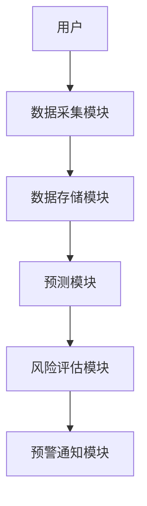
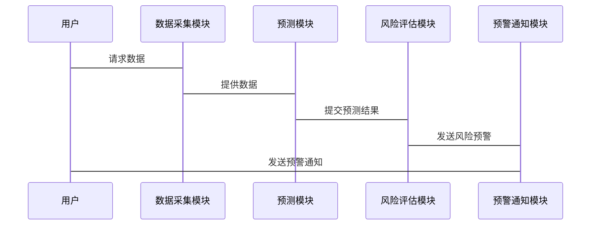

                 


# 智能体协作预测监管环境变化：提前应对政策风险

> **关键词**：智能体协作、监管环境变化、政策风险、预测模型、多智能体系统、时间序列分析、机器学习

> **摘要**：  
本文探讨了智能体协作在预测监管环境变化中的应用，旨在提前识别和应对政策风险。通过分析智能体协作的核心原理、预测模型的构建、系统架构的设计以及实际案例的实现，本文为读者提供了一套完整的解决方案，帮助企业在复杂的监管环境中保持竞争优势。

---

## 第一章：背景与问题概述

### 1.1 问题背景与描述

#### 1.1.1 智能体协作的背景
智能体（Agent）是指具有感知环境、自主决策和协作能力的实体。智能体协作是指多个智能体通过共享信息、协同决策来完成复杂任务的过程。随着人工智能技术的发展，智能体协作在各个领域的应用日益广泛。

#### 1.1.2 监管环境变化的背景
监管环境变化指的是政策法规、市场规则等外部因素的变化对企业运营的影响。这些变化可能带来政策风险，影响企业的合规性和业务发展。

#### 1.1.3 提前应对政策风险的重要性
提前预测监管环境变化可以帮助企业及时调整战略，规避潜在风险，确保业务的稳定性和可持续性。

### 1.2 问题解决与目标设定

#### 1.2.1 问题解决的基本思路
通过构建智能体协作系统，利用历史数据和机器学习模型，预测未来监管环境的变化趋势，为企业提供风险预警和应对策略。

#### 1.2.2 目标设定
- 建立智能体协作模型，实时监控监管环境变化。
- 构建预测模型，准确预测政策法规的变化。
- 提供风险预警和应对策略。

#### 1.2.3 解决方案的边界与外延
解决方案的边界包括数据收集、模型构建和结果应用；外延则涉及政策解读、企业合规性评估等。

---

## 第二章：核心概念与联系

### 2.1 智能体协作的核心原理

#### 2.1.1 多智能体系统的基本原理
多智能体系统由多个智能体组成，每个智能体具有独立性、自主性和协作性。智能体之间通过通信和协作完成共同目标。

#### 2.1.2 智能体协作的机制与模型
- 通信机制：智能体之间通过共享信息进行协作。
- 协作机制：通过协商和协调完成任务。
- 分布式决策机制：每个智能体根据自身信息做出决策。

#### 2.1.3 智能体协作的实现方法
- 基于规则的协作：根据预设规则进行协作。
- 基于学习的协作：利用机器学习模型动态调整协作策略。

### 2.2 监管环境变化的预测模型

#### 2.2.1 监管环境变化的特征分析
监管环境变化通常具有周期性、突发性和累积性。通过分析这些特征，可以建立预测模型。

#### 2.2.2 监管环境变化的预测方法
- 时间序列分析：基于历史数据预测未来趋势。
- 机器学习：利用分类和回归模型进行预测。
- 深度学习：通过神经网络捕捉复杂模式。

#### 2.2.3 监管环境变化的预测模型构建
- 数据预处理：清洗和标准化数据。
- 模型训练：选择合适算法进行训练。
- 模型评估：通过交叉验证评估模型性能。

### 2.3 智能体协作与监管环境变化的关联

#### 2.3.1 智能体协作在监管环境变化中的作用
智能体协作可以实时监控政策变化，快速响应监管环境的变化。

#### 2.3.2 监管环境变化对智能体协作的影响
监管变化可能影响智能体的协作方式和决策策略。

#### 2.3.3 智能体协作与监管环境变化的协同关系
通过智能体协作，企业能够更好地适应监管环境的变化，降低政策风险。

---

## 第三章：算法原理与实现

### 3.1 预测监管环境变化的算法原理

#### 3.1.1 时间序列分析的基本原理
时间序列分析通过分析数据的时序特性，预测未来趋势。常用方法包括ARIMA、GARCH等。

#### 3.1.2 机器学习在监管环境预测中的应用
- 支持向量机（SVM）：用于分类和回归。
- 随机森林：用于特征提取和预测。

#### 3.1.3 深度学习模型在监管环境预测中的应用
- LSTM网络：擅长处理时间序列数据。
- Transformer：用于捕捉长距离依赖关系。

### 3.2 智能体协作算法的实现

#### 3.2.1 多智能体协作算法的基本实现
- 分布式协作：智能体独立决策，通过通信协作。
- 中央协调器：通过中央智能体协调各智能体的协作。

#### 3.2.2 基于强化学习的智能体协作算法
- 多智能体强化学习（MA RL）：通过博弈论和纳什均衡优化协作策略。

#### 3.2.3 智能体协作算法的优化与改进
- 联合学习：智能体共享知识，提升整体性能。
- 迁移学习：利用已知领域知识，快速适应新环境。

### 3.3 算法实现的数学模型

#### 3.3.1 时间序列预测模型
- ARIMA模型：适用于线性时序数据。
- SARIMA模型：适用于有季节性变化的数据。

#### 3.3.2 机器学习模型的数学表达
- 线性回归：$y = \beta_0 + \beta_1x + \epsilon$
- 支持向量机：最大化间隔分类。

#### 3.3.3 深度学习模型的数学基础
- LSTM单元：$f_t = \sigma(W_f \cdot [h_{t-1}, x_t])$
- 注意力机制：$a_i = \text{softmax}(QK^T)$

---

## 第四章：数学模型与公式推导

### 4.1 监管环境变化预测的数学模型

#### 4.1.1 时间序列预测模型
- ARIMA模型公式：$\phi(\lambda^{-1}B)X_t = \theta(\lambda^{-1}B)Z_t$
- SARIMA模型公式：$\Phi(\lambda^{-1}B) \cdot \Phi_s(B)X_t = \Theta(\lambda^{-1}B) \cdot \Theta_s(B)Z_t$

#### 4.1.2 机器学习模型的数学表达
- 线性回归：$\hat{y} = \beta_0 + \beta_1x$
- 支持向量机：$\text{minimize} \frac{1}{2}||\beta||^2 + C\sum_{i=1}^n \xi_i$

#### 4.1.3 深度学习模型的数学基础
- LSTM单元：$f_t = \sigma(W_fh_{t-1} + U_fx_t + b_f)$
- 注意力机制：$a_i = \frac{\exp(s_i)}{\sum_{j=1}^n \exp(s_j)}$

### 4.2 智能体协作的数学模型

#### 4.2.1 多智能体协作的基本数学模型
- 协作收益：$R = \sum_{i=1}^n r_i$
- 协作策略：$\pi_i = \text{argmax}_{a_i} \sum_{j=1}^n Q(a_i, a_j)$

#### 4.2.2 基于强化学习的数学模型
- 状态空间：$S = \{s_t\}$
- 动作空间：$A = \{a_t\}$
- 奖励函数：$R(s_t, a_t) = r_t$

---

## 第五章：系统分析与架构设计

### 5.1 系统功能设计

#### 5.1.1 数据采集模块
- 数据来源：政策法规数据库、市场数据等。
- 数据预处理：清洗、标准化。

#### 5.1.2 预测模块
- 时间序列预测：使用ARIMA、LSTM等模型。
- 智能体协作：多智能体协同预测。

#### 5.1.3 风险预警模块
- 风险评估：根据预测结果评估风险等级。
- 预警通知：通过邮件、短信等方式通知相关人员。

### 5.2 系统架构设计

#### 5.2.1 系统架构图


#### 5.2.2 接口设计
- 数据接口：RESTful API，支持GET、POST请求。
- 预测接口：提供预测结果查询功能。

#### 5.2.3 交互流程


---

## 第六章：项目实战与代码实现

### 6.1 环境安装

#### 6.1.1 Python环境
- 安装Python 3.8以上版本。
- 安装必要的库：numpy、pandas、scikit-learn、keras、tensorflow。

#### 6.1.2 数据集准备
- 数据来源：公开政策数据库、市场数据等。
- 数据格式：CSV格式，包含时间戳和政策指标。

### 6.2 核心代码实现

#### 6.2.1 数据预处理
```python
import pandas as pd
import numpy as np

# 读取数据
data = pd.read_csv('policy_data.csv')

# 数据清洗
data.dropna(inplace=True)
data['date'] = pd.to_datetime(data['date'])
data.set_index('date', inplace=True)

# 标准化处理
from sklearn.preprocessing import StandardScaler
scaler = StandardScaler()
data_scaled = scaler.fit_transform(data)
```

#### 6.2.2 时间序列预测
```python
from sklearn.metrics import mean_absolute_error
from keras.models import Sequential
from keras.layers import LSTM, Dense

# 模型构建
model = Sequential()
model.add(LSTM(50, input_shape=(timesteps, features)))
model.add(Dense(1))
model.compile(loss='mean_squared_error', optimizer='adam')

# 训练模型
history = model.fit(X_train, y_train, epochs=50, batch_size=32, validation_split=0.2)

# 预测
y_pred = model.predict(X_test)
```

#### 6.2.3 智能体协作实现
```python
from multiagent.core import World, Agent, System
from multiagent.scenario import Scenario

# 定义智能体
class PolicyAgent(Agent):
    def __init__(self):
        super().__init__()
        self.model = LSTMModel()

    def receive(self, message):
        self.model.update(message)

# 定义系统
class PolicySystem(System):
    def __init__(self):
        super().__init__()
        self.world = World()
        self.world.add_agent('agent1', PolicyAgent())
```

---

## 第七章：最佳实践与总结

### 7.1 最佳实践 tips

#### 7.1.1 数据质量
确保数据的完整性和准确性，数据清洗是关键。

#### 7.1.2 模型选择
根据数据特点选择合适的模型，避免过度拟合。

#### 7.1.3 系统优化
通过并行计算和分布式架构优化系统性能。

### 7.2 项目小结

#### 7.2.1 核心成果
- 构建了智能体协作系统，实现了监管环境变化的预测。
- 提供了风险预警和应对策略。

#### 7.2.2 经验总结
- 数据预处理的重要性不容忽视。
- 模型选择和调优直接影响预测效果。
- 系统架构设计需要考虑扩展性和可维护性。

### 7.3 注意事项

#### 7.3.1 数据隐私
确保数据处理符合相关法律法规，保护数据隐私。

#### 7.3.2 模型解释性
复杂的模型可能缺乏解释性，需选择合适的模型以满足业务需求。

#### 7.3.3 系统稳定性
确保系统的稳定运行，避免因单点故障导致服务中断。

### 7.4 拓展阅读

#### 7.4.1 推荐书籍
- 《深入理解深度学习》
- 《多智能体系统的理论与应用》

#### 7.4.2 推荐博客
- Towards Data Science
- Medium上的AI专栏

---

## 作者信息

**作者**：AI天才研究院/AI Genius Institute & 禅与计算机程序设计艺术 /Zen And The Art of Computer Programming

---

通过本文的详细讲解，读者可以系统地了解智能体协作预测监管环境变化的方法，并能够实际应用这些技术来应对政策风险。

