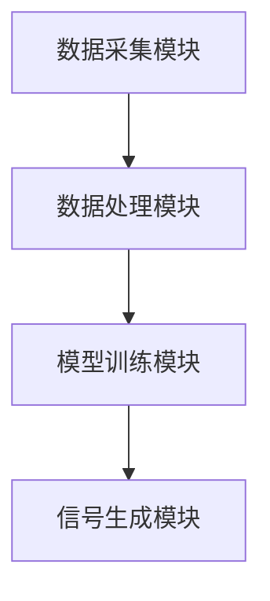
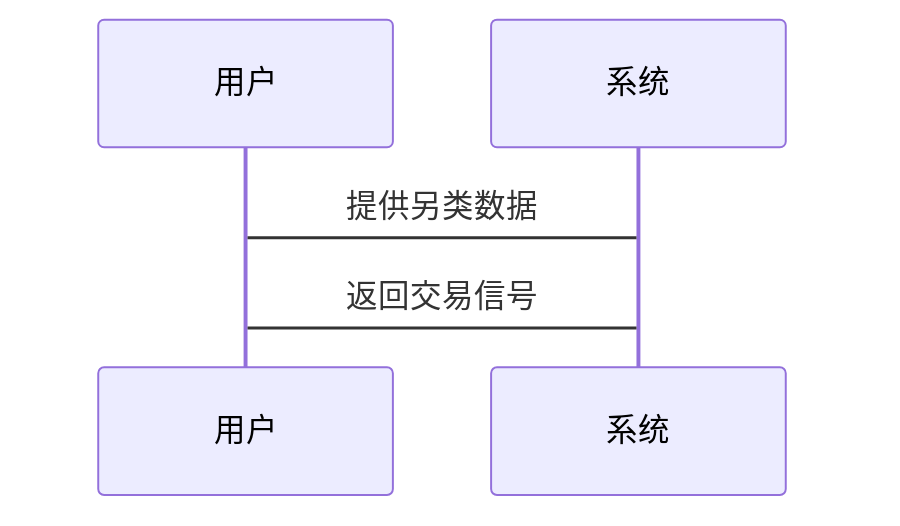

                 


# 智能体系统提升价值投资的另类数据信号提取能力

## 关键词：智能体系统，价值投资，另类数据，信号提取，机器学习，深度学习，数据分析

## 摘要：  
本文探讨了智能体系统在价值投资中的应用，特别是通过另类数据信号的提取能力来提升投资决策的准确性和效率。文章从背景介绍、核心概念、算法原理、系统架构、项目实战到最佳实践，全面解析了智能体系统如何利用非传统数据源，如社交媒体情绪、卫星图像和物联网数据，来增强投资分析。通过详细的技术分析和实际案例，本文展示了如何构建一个高效智能的系统，帮助投资者在复杂市场环境中捕捉潜在机会。

---

## 正文

### 第1章 智能体系统与价值投资的背景介绍

#### 1.1 智能体系统的基本概念  
智能体系统是一种能够感知环境、自主决策并采取行动的智能系统。它结合了人工智能、机器学习和大数据分析技术，能够从海量数据中提取有价值的信息，并根据目标优化策略进行自主决策。  

##### 1.1.1 智能体的定义与特点  
- **定义**：智能体是一个能够感知环境、处理信息并采取行动的实体，具备自主性、反应性、目标导向和学习能力。  
- **特点**：  
  - **自主性**：无需外部干预，能够自主完成任务。  
  - **反应性**：能够实时感知环境变化并做出响应。  
  - **目标导向**：所有行动都围绕特定目标展开。  
  - **学习能力**：通过数据和经验不断优化自身的决策能力。  

##### 1.1.2 智能体系统的核心要素  
智能体系统由感知层、决策层和执行层组成：  
- **感知层**：负责从环境中获取数据，如传感器数据、文本数据等。  
- **决策层**：通过算法对数据进行分析，生成决策指令。  
- **执行层**：根据决策指令采取行动，如发出买卖指令或触发预警。  

#### 1.2 价值投资的基本原理  
价值投资是一种投资策略，强调以低于资产内在价值的价格购买优质资产。其核心在于识别市场中的低估机会，通过基本面分析来判断资产的长期价值。  

##### 1.2.1 价值投资的定义与特点  
- **定义**：价值投资是一种长期投资策略，注重资产的内在价值而非短期价格波动。  
- **特点**：  
  - **长期性**：关注资产的长期价值而非短期收益。  
  - **基本面分析**：通过财务报表、行业地位等分析资产的价值。  
  - **逆向思维**：在市场恐慌时寻找低估机会，在市场狂热时保持冷静。  

##### 1.2.2 价值投资的核心要素  
- **内在价值**：资产的实际价值，而非市场交易价格。  
- **安全边际**：买入价格与内在价值的差距，提供安全空间。  
- **竞争优势**：企业具备的独特优势，如成本优势、品牌优势等。  

#### 1.3 另类数据信号的基本概念  
另类数据是指传统金融数据之外的非结构化数据，如社交媒体情绪、卫星图像、物联网数据等。这些数据能够提供传统数据无法捕捉的市场信息，帮助投资者发现潜在机会。  

##### 1.3.1 另类数据的定义与分类  
- **定义**：另类数据是指非传统金融数据，通常为非结构化数据，能够提供额外的市场洞察。  
- **分类**：  
  - **文本数据**：如新闻、社交媒体、公司财报等。  
  - **图像数据**：如卫星图像、产品图片等。  
  - **语音数据**：如电话会议录音、市场评论等。  
  - **行为数据**：如用户点击流、交易记录等。  

##### 1.3.2 另类数据在价值投资中的作用  
- **优势**：  
  - 提供市场情绪的实时反馈。  
  - 发现传统数据无法捕捉的市场信号。  
  - 帮助投资者识别潜在风险和机会。  
- **挑战**：  
  - 数据量大、异质性强，处理难度高。  
  - 数据质量参差不齐，需要精细的数据清洗和处理。  

#### 1.4 本章小结  
本章介绍了智能体系统和价值投资的基本概念，并重点阐述了另类数据在价值投资中的重要性。智能体系统通过处理另类数据，能够为投资者提供更全面的市场洞察，帮助其做出更明智的投资决策。

---

### 第2章 智能体系统的核心概念与原理  

#### 2.1 智能体系统的核心概念  

##### 2.1.1 智能体系统的组成与功能  
智能体系统由感知层、决策层和执行层组成，各层功能如下：  
- **感知层**：通过传感器或数据接口获取环境数据。  
- **决策层**：利用机器学习算法对数据进行分析，生成决策指令。  
- **执行层**：根据决策指令采取行动，如发出交易信号或触发预警。  

##### 2.1.2 智能体系统的核心算法  
智能体系统的核心算法包括：  
1. **数据预处理**：清洗、标准化和特征提取。  
2. **特征提取**：通过NLP、计算机视觉等技术提取有用特征。  
3. **模型训练**：使用机器学习或深度学习算法训练模型。  
4. **信号生成**：根据模型预测结果生成交易信号。  

##### 2.1.3 智能体系统与传统投资的区别  
- **传统投资**：依赖人工分析，主要依靠财务报表和市场趋势。  
- **智能体系统**：利用另类数据，结合机器学习算法，自动化分析和决策。  

#### 2.2 另类数据的特征与分类  

##### 2.2.1 另类数据的特征分析  
- **非结构化**：数据形式多样，如文本、图像、语音等。  
- **实时性**：能够提供市场的实时动态。  
- **丰富性**：覆盖传统数据无法触及的领域，如社交媒体情绪、卫星图像等。  

##### 2.2.2 另类数据的分类方法  
- **文本数据**：新闻、社交媒体、公司财报。  
- **图像数据**：卫星图像、产品图片。  
- **语音数据**：电话会议录音、市场评论。  
- **行为数据**：用户点击流、交易记录。  

##### 2.2.3 另类数据的采集与处理  
- **数据采集**：通过API接口或爬虫获取数据。  
- **数据清洗**：去除噪声数据，确保数据质量。  
- **数据增强**：通过技术手段增强数据的可用性。  

#### 2.3 智能体系统与另类数据的关系  

##### 2.3.1 智能体系统如何利用另类数据  
- **数据融合**：将传统数据与另类数据结合，提升分析精度。  
- **实时监控**：通过另类数据实时监控市场动态。  
- **预测模型**：利用另类数据构建预测模型，提前发现市场机会。  

##### 2.3.2 另类数据对智能体系统的影响  
- **提升决策效率**：通过另类数据快速捕捉市场信号。  
- **增强决策准确性**：结合多源数据，降低决策偏差。  
- **降低投资风险**：通过实时监控和预警机制，及时规避风险。  

#### 2.4 本章小结  
本章详细阐述了智能体系统的核心概念和另类数据的特征，分析了两者之间的关系和相互作用。智能体系统通过处理另类数据，能够为投资者提供更全面的市场洞察，帮助其做出更明智的投资决策。

---

### 第3章 智能体系统的算法实现  

#### 3.1 数据预处理与特征提取  

##### 3.1.1 数据清洗与标准化  
- **数据清洗**：去除重复数据、缺失值和异常值。  
- **标准化**：将数据标准化到统一范围，便于模型训练。  

##### 3.1.2 数据的特征提取  
- **文本特征提取**：使用TF-IDF或Word2Vec提取文本特征。  
- **图像特征提取**：使用CNN提取图像特征。  
- **语音特征提取**：使用MFCC提取语音特征。  

##### 3.1.3 数据的降维技术  
- **主成分分析（PCA）**：通过PCA降低数据维度，减少计算复杂度。  
- **t-SNE**：用于数据可视化，帮助理解数据分布。  

#### 3.2 智能体系统的算法实现  

##### 3.2.1 机器学习算法的应用  
- **线性回归**：用于预测资产价格。  
- **支持向量机（SVM）**：用于分类任务，如多空信号分类。  
- **随机森林**：用于特征重要性分析和预测。  

##### 3.2.2 深度学习算法的应用  
- **卷积神经网络（CNN）**：用于图像数据处理。  
- **循环神经网络（RNN）**：用于时间序列数据处理。  
- **长短期记忆网络（LSTM）**：用于捕捉时间序列中的长期依赖关系。  

##### 3.2.3 算法的优化与调参  
- **超参数优化**：使用网格搜索或随机搜索优化模型参数。  
- **模型评估**：通过交叉验证评估模型性能。  
- **模型融合**：将多个模型的预测结果进行融合，提升预测精度。  

#### 3.3 数学公式与算法原理  

##### 3.3.1 线性回归公式  
$$ y = \beta_0 + \beta_1x + \epsilon $$  
其中，$y$ 是目标变量，$x$ 是自变量，$\beta_0$ 和 $\beta_1$ 是回归系数，$\epsilon$ 是误差项。  

##### 3.3.2 LSTM网络结构  
LSTM由输入门、遗忘门和输出门组成，公式如下：  
- **输入门**：$$ i = \sigma(W_i x + U_i h) $$  
- **遗忘门**：$$ f = \sigma(W_f x + U_f h) $$  
- **细胞状态**：$$ c = f \odot c_{prev} + i \odot tanh(W_c x + U_c h) $$  
- **输出门**：$$ o = \sigma(W_o x + U_o h) $$  
- **隐藏状态**：$$ h = o \odot tanh(c) $$  

#### 3.4 本章小结  
本章详细讲解了智能体系统的算法实现，包括数据预处理、特征提取和模型训练。通过机器学习和深度学习算法，智能体系统能够从另类数据中提取有价值的信息，帮助投资者做出更精准的投资决策。

---

### 第4章 智能体系统的系统架构与设计  

#### 4.1 系统架构设计  

##### 4.1.1 系统功能设计  
- **数据采集模块**：负责采集另类数据，如社交媒体情绪、卫星图像等。  
- **数据处理模块**：对数据进行清洗、特征提取和降维处理。  
- **模型训练模块**：使用机器学习或深度学习算法训练预测模型。  
- **信号生成模块**：根据模型预测结果生成交易信号。  

##### 4.1.2 系统架构图  
以下是系统的整体架构图：  


#### 4.2 系统接口设计  

##### 4.2.1 数据接口  
- **输入接口**：接收另类数据，如社交媒体情绪、卫星图像等。  
- **输出接口**：输出交易信号，如买入、卖出或持有。  

##### 4.2.2 模型接口  
- **输入接口**：接收预处理后的数据，如特征向量。  
- **输出接口**：输出预测结果，如资产价格预测或市场情绪预测。  

#### 4.3 系统交互流程  

##### 4.3.1 系统交互流程图  
以下是系统的交互流程图：  


#### 4.4 本章小结  
本章详细设计了智能体系统的系统架构与接口，展示了系统的整体流程和模块划分。通过合理的架构设计，智能体系统能够高效地处理另类数据，生成有价值的交易信号。

---

### 第5章 智能体系统的项目实战  

#### 5.1 项目背景介绍  
本项目旨在通过智能体系统从社交媒体情绪数据中提取交易信号，帮助投资者做出更明智的投资决策。  

#### 5.2 项目实现  

##### 5.2.1 环境安装  
- **Python版本**：Python 3.8及以上。  
- **依赖库安装**：  
  ```bash
  pip install numpy pandas scikit-learn tensorflow matplotlib
  ```

##### 5.2.2 核心代码实现  
以下是项目的实现代码：  
```python
import numpy as np
import pandas as pd
from sklearn.model_selection import train_test_split
from sklearn.preprocessing import StandardScaler
from sklearn.linear_model import LinearRegression
from tensorflow.keras.models import Sequential
from tensorflow.keras.layers import Dense, LSTM

# 数据加载与预处理
data = pd.read_csv('social_mood.csv')
X = data.drop('target', axis=1).values
y = data['target'].values

# 数据分割
X_train, X_test, y_train, y_test = train_test_split(X, y, test_size=0.2)

# 标准化处理
scaler = StandardScaler()
X_train = scaler.fit_transform(X_train)
X_test = scaler.transform(X_test)

# 线性回归模型训练
model_linear = LinearRegression()
model_linear.fit(X_train, y_train)

# LSTM模型训练
model_lstm = Sequential()
model_lstm.add(LSTM(64, input_shape=(X_train.shape[1], 1)))
model_lstm.add(Dense(1))
model_lstm.compile(loss='mean_squared_error', optimizer='adam')
model_lstm.fit(X_train.reshape(X_train.shape[0], X_train.shape[1], 1), y_train, epochs=10, batch_size=32)

# 模型预测
y_pred_linear = model_linear.predict(X_test)
y_pred_lstm = model_lstm.predict(X_test.reshape(X_test.shape[0], X_test.shape[1], 1))
```

##### 5.2.3 代码解读与分析  
- **数据加载与预处理**：读取数据并进行标准化处理。  
- **数据分割**：将数据分为训练集和测试集。  
- **线性回归模型**：用于预测资产价格。  
- **LSTM模型**：用于捕捉时间序列中的长期依赖关系。  

##### 5.2.4 实际案例分析  
假设我们有一个社交媒体情绪数据集，包含每日的市场情绪指数和次日的资产价格变化。通过模型训练，我们可以预测出资产价格的变化趋势，并生成相应的交易信号。  

#### 5.3 项目小结  
本章通过一个实际项目展示了智能体系统的实现过程，从数据加载、预处理到模型训练和预测，详细讲解了系统的实际应用。通过项目实战，读者可以更好地理解智能体系统的核心技术。

---

### 第6章 最佳实践与注意事项  

#### 6.1 最佳实践  
- **数据质量**：确保数据的准确性和完整性。  
- **模型选择**：根据具体任务选择合适的算法。  
- **实时性**：确保系统能够实时处理数据并生成信号。  
- **风险控制**：设置止损和止盈机制，控制投资风险。  

#### 6.2 小结  
智能体系统通过处理另类数据，能够为投资者提供更全面的市场洞察，帮助其做出更明智的投资决策。  

#### 6.3 注意事项  
- **数据隐私**：注意保护数据隐私，遵守相关法律法规。  
- **模型鲁棒性**：确保模型具有良好的鲁棒性和泛化能力。  
- **系统稳定性**：确保系统的稳定运行，避免因技术问题导致投资损失。  

---

### 作者信息  

作者：AI天才研究院/AI Genius Institute & 禅与计算机程序设计艺术 /Zen And The Art of Computer Programming  

---

**注意**：以上内容为示例性内容，具体内容可根据实际需求进行调整和补充。

