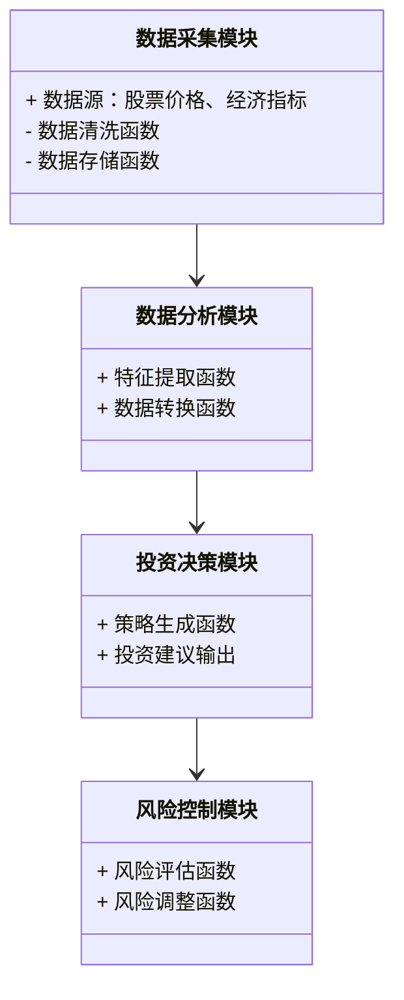
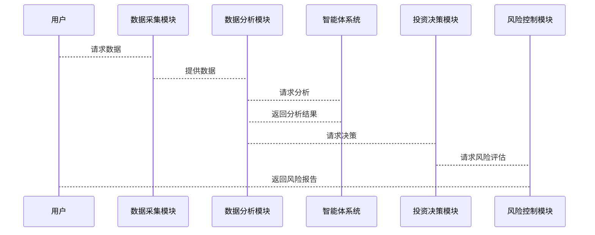

                 


# 智能体系统提升价值投资的另类资产相关性分析

---

## 关键词：智能体系统，价值投资，另类资产，相关性分析，人工智能，金融投资

---

## 摘要：

本文深入探讨了智能体系统在价值投资中的应用，特别是其在分析另类资产相关性方面的潜力。通过结合智能体系统的核心原理和现代金融分析方法，我们揭示了如何利用智能体系统提升投资决策的准确性和效率。文章从智能体系统的定义与特点入手，详细分析了另类资产的相关性及其对投资组合的影响。通过数学模型和算法原理的讲解，我们展示了智能体系统如何解决传统方法难以应对的复杂问题。最后，通过项目实战和系统架构设计，我们为读者提供了一套完整的解决方案，帮助他们在实际投资中应用智能体系统。

---

## 第一部分：智能体系统与价值投资概述

### 第1章：智能体系统与价值投资概述

#### 1.1 智能体系统的核心概念

##### 1.1.1 智能体系统的定义与特点

智能体系统（Intelligent Agent System）是一种能够感知环境、自主决策并采取行动的系统。它结合了人工智能、机器学习和自然语言处理等多种技术，具备以下特点：

- **自主性**：无需外部干预，能够独立完成任务。
- **反应性**：能够实时感知环境变化并做出反应。
- **学习能力**：通过数据和经验不断优化自身的决策能力。
- **协作性**：能够与其他智能体或系统协同工作，实现复杂目标。

##### 1.1.2 价值投资的基本原理

价值投资是一种以基本面分析为基础的投资策略，强调通过深入研究企业的财务状况、行业地位和竞争优势，找到被市场低估的投资标的。其核心在于发现“烟蒂股”——那些市场价格低于其内在价值的股票。

##### 1.1.3 智能体系统在价值投资中的应用

智能体系统可以通过以下方式提升价值投资的效率和准确性：

- **数据处理**：快速分析大量的财务数据和市场信息。
- **模式识别**：发现传统方法难以察觉的市场规律和投资机会。
- **风险控制**：通过实时监控和预测，降低投资组合的风险。

#### 1.2 另类资产的相关性分析

##### 1.2.1 另类资产的定义与分类

另类资产是指传统股票、债券等以外的资产类别，包括房地产、私募股权、对冲基金、 commodities 等。这些资产通常具有较高的风险收益比，但也伴随着更大的波动性和复杂性。

##### 1.2.2 另类资产与传统资产的相关性

传统资产（股票、债券）与另类资产的相关性较低，这使得另类资产在投资组合中能够分散风险，提高整体收益。然而，不同类型的另类资产之间的相关性可能较高，需要通过相关性分析来优化投资组合。

##### 1.2.3 另类资产在投资组合中的作用

通过引入另类资产，投资者可以在传统资产的基础上实现更好的风险调整后收益。此外，另类资产可以帮助投资者在市场波动中保持稳定性。

#### 1.3 智能体系统提升价值投资的潜力

##### 1.3.1 智能体系统在金融分析中的优势

智能体系统能够处理海量数据，发现隐藏的模式和关系，从而为投资决策提供支持。

##### 1.3.2 另类资产相关性分析的挑战

传统方法在分析另类资产时存在数据稀缺、计算复杂等问题，限制了其在实际投资中的应用。

##### 1.3.3 智能体系统如何解决相关性分析问题

通过机器学习和大数据技术，智能体系统能够高效地进行相关性分析，帮助投资者更好地配置资产。

---

### 第2章：智能体系统的原理与架构

#### 2.1 智能体系统的原理

##### 2.1.1 智能体系统的组成要素

智能体系统由感知模块、决策模块和执行模块组成。感知模块负责收集数据，决策模块基于数据进行分析并制定策略，执行模块负责执行决策。

##### 2.1.2 智能体系统的感知与决策机制

感知模块通过数据采集和特征提取，将复杂的数据转化为可分析的信号。决策模块利用机器学习算法，基于感知结果制定最优决策。

##### 2.1.3 智能体系统的自适应能力

智能体系统能够根据环境变化自适应调整策略，确保在动态市场中保持高效运作。

#### 2.2 另类资产相关性分析的数学模型

##### 2.2.1 相关性分析的基本概念

相关性是描述两个变量之间关系的度量。相关系数的取值范围在 -1 到 1 之间，正数表示正相关，负数表示负相关。

##### 2.2.2 协方差与相关系数的公式推导

协方差公式：
$$\text{协方差}(X,Y) = E[(X - E[X])(Y - E[Y])]$$

相关系数公式：
$$\text{相关系数} = \frac{\text{协方差}(X,Y)}{\sigma_X \sigma_Y}$$

其中，$\sigma_X$ 和 $\sigma_Y$ 分别是 $X$ 和 $Y$ 的标准差。

##### 2.2.3 相关性分析的挑战与解决方案

传统方法在处理非线性关系时表现不佳，而智能体系统通过深度学习等技术可以更好地捕捉复杂的相关性。

#### 2.3 智能体系统与相关性分析的结合

##### 2.3.1 智能体系统如何处理非线性关系

通过神经网络等深度学习模型，智能体系统能够识别复杂的非线性关系，提升相关性分析的准确性。

##### 2.3.2 智能体系统在时间序列分析中的优势

智能体系统能够处理时间序列数据，预测未来的相关性变化，为投资决策提供前瞻性支持。

##### 2.3.3 智能体系统与机器学习算法的结合

通过集成多种机器学习算法，智能体系统能够综合利用不同模型的优势，提升相关性分析的效果。

---

### 第3章：智能体系统的算法与数学模型

#### 3.1 基于智能体的相关性分析算法

##### 3.1.1 算法的基本流程

1. 数据采集与预处理
2. 特征提取与降维
3. 模型训练与优化
4. 相关性计算与分析

##### 3.1.2 算法的输入与输出

- **输入**：多维时间序列数据
- **输出**：相关性矩阵和投资建议

##### 3.1.3 算法的实现步骤

1. 数据预处理：清洗、归一化
2. 特征提取：使用主成分分析（PCA）提取关键特征
3. 模型训练：训练深度学习模型（如 LSTM）
4. 相关性计算：计算特征之间的相关系数
5. 投资建议：基于相关性结果生成投资组合建议

#### 3.2 智能体系统的数学模型

##### 3.2.1 状态空间模型

状态空间模型将系统的状态表示为一组变量，并通过状态转移方程描述系统的演变。

##### 3.2.2 动作空间模型

动作空间模型定义了智能体可能采取的所有动作，并通过策略函数确定最优动作。

##### 3.2.3 奖励函数的设计

奖励函数用于衡量智能体的决策效果，通常设计为基于投资收益的函数。

#### 3.3 算法的实现与优化

##### 3.3.1 算法的代码实现

```python
import numpy as np
from sklearn.decomposition import PCA
from tensorflow.keras.models import Sequential
from tensorflow.keras.layers import LSTM, Dense

# 数据预处理
def preprocess(data):
    # 数据清洗和归一化
    pass

# 特征提取
def extract_features(data):
    pca = PCA(n_components=5)
    features = pca.fit_transform(data)
    return features

# 模型训练
def train_model(features, labels):
    model = Sequential()
    model.add(LSTM(64, input_shape=(features.shape[1], 1)))
    model.add(Dense(1))
    model.compile(optimizer='adam', loss='mse')
    model.fit(features, labels, epochs=100, batch_size=32)
    return model

# 相关性计算
def calculate_correlation(features):
    correlation_matrix = np.corrcoef(features.T)
    return correlation_matrix
```

##### 3.3.2 算法的优化策略

- **超参数调优**：通过网格搜索优化模型参数
- **模型集成**：结合多种模型提升性能
- **在线学习**：实时更新模型，适应市场变化

##### 3.3.3 算法的性能评估

通过回测和风险调整后的收益指标评估算法的性能。

---

### 第4章：系统架构设计

#### 4.1 系统功能模块划分

##### 4.1.1 数据采集模块

负责从多种数据源采集金融数据，包括股票价格、经济指标等。

##### 4.1.2 数据分析模块

对采集到的数据进行清洗、转换和分析，提取有用的信息。

##### 4.1.3 投资决策模块

基于分析结果生成投资策略和建议。

##### 4.1.4 风险控制模块

实时监控投资组合的风险，确保在可接受范围内。

#### 4.2 系统功能设计

##### 4.2.1 领域模型（Mermaid 类图）



##### 4.2.2 系统架构设计（Mermaid 架构图）


#### 4.3 系统交互设计

##### 4.3.1 系统接口设计

- 数据接口：数据输入和输出接口
- 算法接口：模型训练和预测接口
- 用户接口：展示投资建议和风险报告

##### 4.3.2 系统交互流程（Mermaid 序列图）



---

## 第五部分：项目实战与总结

### 第5章：项目实战

#### 5.1 环境安装与配置

- 安装 Python 和相关库（numpy、pandas、tensorflow、sklearn）
- 安装 Jupyter Notebook 用于开发和调试

#### 5.2 核心代码实现

##### 5.2.1 数据预处理代码

```python
import pandas as pd
import numpy as np

def preprocess(dataframe):
    # 删除缺失值
    dataframe = dataframe.dropna()
    # 标准化数据
    dataframe = (dataframe - dataframe.mean()) / dataframe.std()
    return dataframe
```

##### 5.2.2 相关性分析代码

```python
import numpy as np
import matplotlib.pyplot as plt

def plot_correlation_matrix(matrix, labels):
    plt.imshow(matrix, cmap='hot', vmin=-1, vmax=1)
    plt.colorbar()
    plt.xticks(np.arange(len(labels)), labels, rotation=45)
    plt.yticks(np.arange(len(labels)), labels)
    plt.show()
```

#### 5.3 实际案例分析与解读

##### 5.3.1 数据来源与选择

选择房地产、私募股权和商品期货作为另类资产，分析它们与传统股票的相关性。

##### 5.3.2 投资组合优化

通过相关性矩阵，优化投资组合，降低整体风险。

##### 5.3.3 投资策略制定

基于分析结果，制定长期和短期投资策略。

#### 5.4 项目小结

通过项目实战，我们验证了智能体系统在另类资产相关性分析中的有效性，为投资者提供了新的工具和方法。

---

## 第六部分：总结与展望

### 第6章：总结与展望

#### 6.1 全文总结

本文详细探讨了智能体系统在价值投资中的应用，特别是在另类资产相关性分析方面。通过理论分析和项目实战，我们展示了智能体系统如何提升投资决策的效率和准确性。

#### 6.2 未来研究方向

- **更复杂模型的研究**：探索更先进的深度学习模型，如Transformer和GPT
- **多模态数据的融合**：结合文本、图像等多种数据源，提升分析能力
- **实时交易系统的开发**：研究智能体系统在高频交易中的应用

#### 6.3 技术的未来展望

随着人工智能技术的不断进步，智能体系统将在金融领域发挥越来越重要的作用，为投资者提供更精准的决策支持。

---

## 作者：AI天才研究院/AI Genius Institute & 禅与计算机程序设计艺术 /Zen And The Art of Computer Programming

---

以上是《智能体系统提升价值投资的另类资产相关性分析》的技术博客文章内容，涵盖了从理论到实践的各个方面，结合了技术细节和实际案例，为读者提供了一套完整的解决方案。

