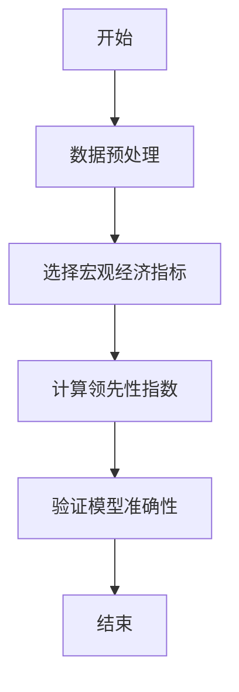
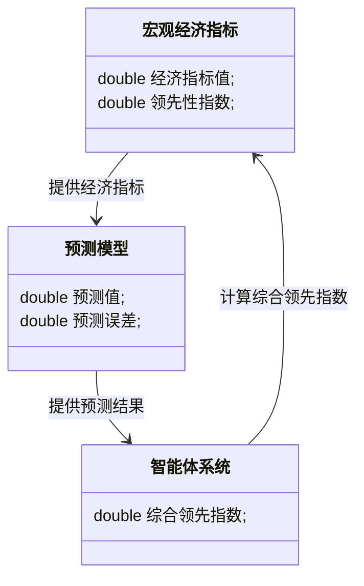
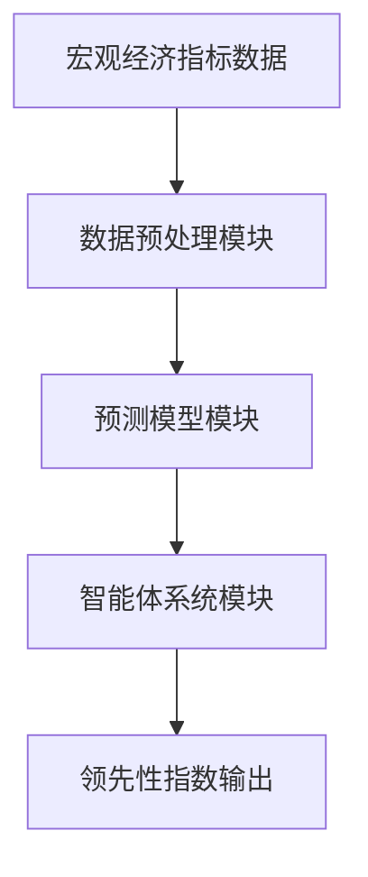

                 


```markdown
# 智能体系统提升价值投资的宏观经济指标领先性分析

## 关键词
- 智能体系统、价值投资、宏观经济指标、领先性分析、算法原理、系统架构、项目实战

## 摘要
本文探讨智能体系统如何通过分析宏观经济指标的领先性来提升价值投资的决策效率和准确性。通过详细分析宏观经济指标的分类、领先性分析的理论基础、智能体系统的算法原理以及系统架构设计，本文旨在展示智能体系统在价值投资中的潜在应用和优势。文章还通过实际案例分析，展示了如何利用智能体系统进行宏观经济指标的领先性分析，并提供了相应的实现方案和最佳实践建议。

## 第3章: 智能体系统的算法原理

## 3.1 智能体系统的算法概述
### 3.1.1 常见智能体算法介绍
### 3.1.2 算法选择的依据
### 3.1.3 算法的优缺点分析

## 3.2 基于领先性分析的智能体算法
### 3.2.1 算法的基本原理
### 3.2.2 算法的数学模型
$$
\text{领先性分析的数学模型可以表示为：} \\
L(t) = \alpha \cdot M(t) + \beta \cdot P(t)
$$
其中，\( L(t) \) 表示领先性指数，\( M(t) \) 表示宏观经济指标，\( P(t) \) 表示预测误差，\( \alpha \) 和 \( \beta \) 是权重系数。

### 3.2.3 算法的实现步骤


## 3.3 算法实现的代码示例
```python
import numpy as np
import pandas as pd

def calculate_leading_indicator(economic_indicator, prediction_error, alpha=0.5, beta=0.5):
    leading_indicator = alpha * economic_indicator + beta * prediction_error
    return leading_indicator

# 示例数据
economic_indicator = np.array([0.1, 0.2, 0.3, 0.4, 0.5])
prediction_error = np.array([0.05, 0.03, 0.02, 0.04, 0.06])

# 计算领先性指数
leading_indicator = calculate_leading_indicator(economic_indicator, prediction_error)

print("领先性指数：", leading_indicator)
```

## 3.4 算法的优化与改进
### 3.4.1 算法优化的方法
### 3.4.2 算法的改进策略
### 3.4.3 优化后的算法效果对比

## 3.5 本章小结
```

```markdown
# 第4章: 智能体系统的系统架构设计

## 4.1 系统功能设计
### 4.1.1 系统目标
### 4.1.2 系统功能模块划分
### 4.1.3 系统功能流程图

## 4.2 系统架构设计
### 4.2.1 领域模型设计


### 4.2.2 系统架构图


## 4.3 系统接口设计
### 4.3.1 系统输入接口
### 4.3.2 系统输出接口
### 4.3.3 接口交互流程图

## 4.4 系统交互设计
### 4.4.1 用户与系统的交互流程
### 4.4.2 系统内部组件的交互流程
### 4.4.3 交互流程的优化建议

## 4.5 本章小结
```

```markdown
# 第5章: 项目实战——基于智能体系统的领先性分析实现

## 5.1 环境安装与配置
### 5.1.1 开发工具的选择
### 5.1.2 依赖库的安装
### 5.1.3 环境配置示例

## 5.2 核心代码实现
### 5.2.1 数据预处理代码
### 5.2.2 预测模型实现
### 5.2.3 智能体系统核心代码
### 5.2.4 代码实现的注意事项

## 5.3 案例分析与结果解读
### 5.3.1 数据来源与选择
### 5.3.2 数据分析过程
### 5.3.3 实验结果与解读
### 5.3.4 结果可视化展示

## 5.4 项目总结与优化建议
### 5.4.1 项目实现总结
### 5.4.2 系统优化建议
### 5.4.3 未来改进方向

## 5.5 本章小结
```

```markdown
# 第6章: 最佳实践与总结

## 6.1 最佳实践 tips
### 6.1.1 数据处理的注意事项
### 6.1.2 算法选择的建议
### 6.1.3 系统设计的优化技巧
### 6.1.4 项目实施的注意事项

## 6.2 小结与展望
### 6.2.1 本文的核心内容总结
### 6.2.2 智能体系统在价值投资中的未来展望
### 6.2.3 对读者的建议与启发

## 6.3 注意事项
### 6.3.1 系统使用中的常见问题
### 6.3.2 系统维护的注意事项
### 6.3.3 用户支持与服务

## 6.4 拓展阅读
### 6.4.1 相关领域的推荐书籍
### 6.4.2 推荐的学术论文
### 6.4.3 其他推荐资源

## 6.5 本章小结
```

## 作者：AI天才研究院 & 禅与计算机程序设计艺术
```

