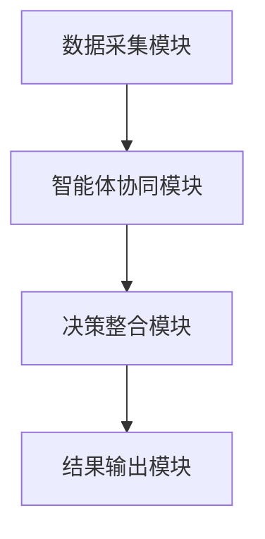

                 

# 智能体群体决策在投资时机选择中的应用：优化入场点

> 关键词：智能体群体决策，投资时机选择，优化入场点，多智能体系统，群体决策算法，投资策略

> 摘要：本文探讨了智能体群体决策在投资时机选择中的应用，重点分析了如何通过群体决策优化投资入场点。文章从背景介绍、算法原理、系统设计到项目实战，详细阐述了智能体群体决策在投资领域的应用，并通过实际案例展示了其优越性和可行性。

---

## 第1章: 智能体群体决策的背景与概念

### 1.1 问题背景与挑战

#### 1.1.1 投资时机选择的重要性
投资时机的选择是投资决策中最为关键的环节之一。正确的入场时机能够最大化投资收益，而错误的时机选择则可能导致重大损失。传统的投资决策方法往往依赖于单一专家的判断或单一算法的分析，难以充分捕捉市场的多维信息和复杂变化。

#### 1.1.2 现有方法的局限性
- **单一决策主体的局限性**：传统投资决策通常依赖于单个专家或单一算法的判断，容易忽视多方面信息的综合分析。
- **信息处理的局限性**：市场数据复杂且多变，单一决策主体难以全面捕捉和处理所有相关信息。
- **决策鲁棒性的不足**：单一决策主体在面对市场突发事件或极端情况时，往往表现出较低的适应性和鲁棒性。

#### 1.1.3 智能体群体决策的优势
智能体群体决策通过多个智能体的协同工作，能够从多个角度、多层次对市场信息进行分析和判断，从而提高决策的全面性和准确性。群体决策能够有效避免单一决策主体的局限性，显著提升决策的鲁棒性和适应性。

### 1.2 智能体群体决策的定义与特点

#### 1.2.1 智能体的基本概念
智能体（Agent）是指能够在环境中感知、理解和执行任务的实体。智能体可以是软件程序、算法模型，也可以是物理实体。在投资决策领域，智能体通常表现为能够分析市场数据、做出判断并执行交易的算法模型。

#### 1.2.2 群体决策的核心特征
群体决策是指多个智能体协同工作，共同完成决策任务的过程。其核心特征包括：
- **分布式性**：决策过程分布在多个智能体之间，避免了单一决策主体的局限性。
- **协同性**：智能体之间通过通信和协作，共同完成决策任务。
- **自适应性**：群体决策能够根据环境变化动态调整决策策略。

#### 1.2.3 智能体群体决策与传统决策的区别
与传统决策相比，智能体群体决策具有以下显著区别：
- **决策主体的多样性**：群体决策依赖于多个智能体的协同，而传统决策通常依赖于单一主体。
- **信息处理的全面性**：群体决策能够整合更多的信息源，提高决策的准确性。
- **决策过程的动态性**：群体决策能够根据实时信息动态调整决策策略。

### 1.3 智能体群体决策的应用领域

#### 1.3.1 投资领域的应用
在投资领域，智能体群体决策可以应用于投资时机选择、资产配置优化、风险控制等多个方面。通过多个智能体的协同工作，投资者能够更全面地分析市场信息，做出更为科学的投资决策。

#### 1.3.2 其他领域的借鉴意义
虽然本文主要关注投资领域，但智能体群体决策的概念和方法具有广泛的适用性。例如，在社交网络分析、资源分配优化、交通流量控制等领域，群体决策都具有重要的应用价值。

#### 1.3.3 智能体群体决策的边界与外延
智能体群体决策的应用范围具有一定的边界。在投资领域，其应用边界主要集中在投资决策的优化和风险控制方面。其外延则包括与其他决策方法的结合应用，例如与机器学习、大数据分析等技术的融合。

---

## 第2章: 多智能体系统基础

### 2.1 多智能体系统的定义与分类

#### 2.1.1 多智能体系统的定义
多智能体系统（Multi-Agent System, MAS）是指由多个智能体组成的系统，这些智能体通过协同工作完成特定任务。在投资领域，多智能体系统可以表现为多个算法模型协同工作，共同分析市场数据、制定投资策略。

#### 2.1.2 多智能体系统的分类
多智能体系统可以根据智能体的类型、任务类型、通信方式等多个维度进行分类。在投资领域，常见的多智能体系统包括：
- **基于规则的智能体**：根据预设规则进行市场分析和交易决策。
- **基于机器学习的智能体**：利用机器学习算法进行市场预测和投资决策。
- **混合型智能体**：结合规则和机器学习的智能体。

#### 2.1.3 多智能体系统的应用场景
多智能体系统在投资领域的应用场景广泛，包括股票交易、外汇交易、 commodities trading 等多个方面。通过多智能体系统的协同工作，投资者能够更全面地分析市场信息，制定更为科学的投资策略。

### 2.2 智能体之间的通信与协作

#### 2.2.1 智能体通信机制
智能体之间的通信是多智能体系统的核心机制之一。通信机制包括信息传递、消息协商等多个方面。在投资领域，智能体之间的通信可以用于共享市场信息、协同制定交易策略。

#### 2.2.2 智能体协作模型
智能体协作模型描述了多个智能体如何协同完成特定任务。常见的协作模型包括基于任务分解的协作模型、基于角色分工的协作模型等。在投资领域，智能体协作模型可以用于资产配置优化、风险控制等任务。

#### 2.2.3 智能体之间的冲突与协调
智能体之间的冲突是多智能体系统中常见的问题。例如，不同的智能体可能基于不同的信息源得出不同的结论，导致决策冲突。如何协调智能体之间的冲突，是多智能体系统设计中的重要问题。

### 2.3 多智能体系统的博弈论基础

#### 2.3.1 博弈论的基本概念
博弈论是研究理性主体之间策略互动的数学理论。在多智能体系统中，博弈论可以用于分析智能体之间的策略互动和决策优化。

#### 2.3.2 博弈论在多智能体系统中的应用
博弈论在多智能体系统中的应用广泛，包括市场预测、交易策略优化、风险控制等多个方面。通过博弈论分析，可以更好地理解智能体之间的互动关系，优化决策策略。

#### 2.3.3 博弈论与群体决策的关系
博弈论与群体决策密切相关。群体决策可以看作是多个智能体在博弈过程中的策略选择和优化。博弈论为群体决策提供了理论基础和分析工具。

---

## 第3章: 群体决策算法原理

### 3.1 群体决策算法的基本概念

#### 3.1.1 群体决策算法的定义
群体决策算法是指用于描述多个智能体如何协同完成决策任务的算法。群体决策算法的核心在于如何将多个智能体的决策结果整合为一个最终的决策。

#### 3.1.2 群体决策算法的核心要素
群体决策算法的核心要素包括：
- **智能体的决策规则**：智能体如何基于自身信息做出决策。
- **智能体之间的通信机制**：智能体如何共享信息和协同决策。
- **决策整合机制**：如何将多个智能体的决策结果整合为一个最终的决策。

#### 3.1.3 群体决策算法的分类
群体决策算法可以根据不同的分类标准进行分类。常见的分类方式包括基于决策规则的分类、基于通信机制的分类、基于决策整合机制的分类等。

### 3.2 基于共识的群体决策算法

#### 3.2.1 共识算法的基本原理
共识算法是指通过多个智能体的协商，达成一致的决策结果。共识算法的核心在于如何在分布式系统中达成一致。

#### 3.2.2 共识算法的实现步骤
共识算法的实现步骤通常包括：
1. **信息收集**：智能体收集相关信息。
2. **信息协商**：智能体之间通过通信协商，共享信息。
3. **决策整合**：将多个智能体的决策结果整合为一个最终的决策。

#### 3.2.3 共识算法的优缺点
共识算法的优点在于能够通过协商达成一致的决策，具有较高的可靠性和一致性。其缺点在于通信成本较高，且在面对复杂问题时可能会出现协商僵局。

### 3.3 基于投票的群体决策算法

#### 3.3.1 投票算法的基本原理
投票算法是指通过投票的方式，选择多数智能体支持的决策方案。投票算法简单易行，适用于决策方案较为明确的情况。

#### 3.3.2 投票算法的实现步骤
1. **信息收集**：智能体收集相关信息。
2. **投票协商**：智能体之间进行投票，选择多数支持的决策方案。
3. **结果整合**：将投票结果整合为最终的决策方案。

#### 3.3.3 投票算法的优缺点
投票算法的优点在于实现简单，适用于决策方案较为明确的情况。其缺点在于在面对复杂问题时，可能会出现投票僵局，且难以充分考虑不同智能体的决策权重。

### 3.4 基于协商的群体决策算法

#### 3.4.1 协商算法的基本原理
协商算法是指通过智能体之间的协商和谈判，达成一致的决策方案。协商算法的核心在于如何通过智能体之间的互动，逐步缩小决策范围，最终达成一致。

#### 3.4.2 协商算法的实现步骤
1. **信息收集**：智能体收集相关信息。
2. **协商谈判**：智能体之间通过协商谈判，逐步缩小决策范围。
3. **决策整合**：将协商结果整合为最终的决策方案。

#### 3.4.3 协商算法的优缺点
协商算法的优点在于能够通过智能体之间的互动，充分考虑不同智能体的决策偏好，最终达成较为合理的决策方案。其缺点在于协商过程可能较为复杂，且在面对复杂问题时，可能会出现协商僵局。

### 3.5 群体决策算法的数学模型

#### 3.5.1 基于共识的数学模型
基于共识的数学模型通常采用一致性协议，例如Paxos算法、Raft算法等。这些算法通过多个智能体的协商，确保最终决策的一致性。

#### 3.5.2 基于投票的数学模型
基于投票的数学模型通常采用多数投票制。例如，如果有N个智能体，每个智能体投票选择一个决策方案，最终选择得票最多的方案。

#### 3.5.3 基于协商的数学模型
基于协商的数学模型通常采用分布式协商协议，例如分布式共识算法。这些算法通过智能体之间的协商，逐步缩小决策范围，最终达成一致。

---

## 第4章: 智能体群体决策在投资时机选择中的应用

### 4.1 投资时机选择的数学模型

#### 4.1.1 投资时机选择的核心要素
投资时机选择的核心要素包括市场趋势、市场波动性、市场参与者行为等多个方面。智能体群体决策可以通过分析这些要素，优化投资入场点。

#### 4.1.2 投资时机选择的数学模型
投资时机选择的数学模型可以通过多种方式构建。例如，可以利用时间序列分析模型，分析历史市场数据，预测未来市场走势。

### 4.2 智能体群体决策的应用场景

#### 4.2.1 市场趋势分析
智能体群体决策可以用于市场趋势分析。通过多个智能体的协同工作，能够更全面地分析市场趋势，提高市场预测的准确性。

#### 4.2.2 资产配置优化
智能体群体决策可以用于资产配置优化。通过多个智能体的协同工作，能够根据市场变化动态调整资产配置策略。

#### 4.2.3 风险控制
智能体群体决策可以用于风险控制。通过多个智能体的协同工作，能够更全面地识别和评估市场风险，制定更为有效的风险控制策略。

### 4.3 智能体群体决策的优势

#### 4.3.1 提高决策的全面性
智能体群体决策通过多个智能体的协同工作，能够从多个角度、多层次对市场信息进行分析和判断，从而提高决策的全面性。

#### 4.3.2 提高决策的准确性
智能体群体决策能够整合更多的信息源，通过多个智能体的协同工作，提高市场预测的准确性。

#### 4.3.3 提高决策的鲁棒性
智能体群体决策具有较高的鲁棒性，能够在面对市场突发事件或极端情况时，动态调整决策策略，确保决策的稳定性。

---

## 第5章: 智能体群体决策在投资时机选择中的系统设计

### 5.1 系统架构设计

#### 5.1.1 系统功能模块
智能体群体决策系统的主要功能模块包括数据采集模块、智能体协同模块、决策整合模块、结果输出模块等。

#### 5.1.2 系统架构图

#### 5.1.3 模块之间的交互
- **数据采集模块**：负责采集市场数据，包括股票价格、市场指数、交易量等。
- **智能体协同模块**：负责智能体之间的通信和协作，整合多个智能体的决策结果。
- **决策整合模块**：负责将多个智能体的决策结果整合为一个最终的决策方案。
- **结果输出模块**：负责将最终的决策方案输出，供投资者参考。

### 5.2 智能体之间的通信机制

#### 5.2.1 通信协议的设计
智能体之间的通信需要设计合适的通信协议，确保信息的准确传递和处理。

#### 5.2.2 通信机制的实现
智能体之间的通信机制可以通过多种方式实现，例如使用消息队列、RPC（远程过程调用）等。

### 5.3 智能体协同的算法实现

#### 5.3.1 协同算法的选择
在智能体协同中，可以选择基于共识的算法、基于投票的算法或基于协商的算法，根据具体需求选择合适的算法。

#### 5.3.2 协同算法的实现步骤
以基于共识的算法为例，协同算法的实现步骤包括：
1. **信息收集**：智能体收集相关信息。
2. **信息协商**：智能体之间通过通信协商，共享信息。
3. **决策整合**：将多个智能体的决策结果整合为一个最终的决策。

### 5.4 系统的数学模型

#### 5.4.1 系统的数学描述
系统可以通过数学模型描述智能体之间的协同关系和决策过程。例如，可以利用图论模型描述智能体之间的关系，利用概率论模型描述市场预测的不确定性。

#### 5.4.2 数学模型的应用
数学模型可以用于系统的设计和优化。例如，可以通过优化算法，提高智能体协同的效率和准确性。

---

## 第6章: 智能体群体决策在投资时机选择中的项目实战

### 6.1 项目背景与目标

#### 6.1.1 项目背景
本项目旨在通过智能体群体决策技术，优化投资时机选择，提高投资收益。

#### 6.1.2 项目目标
项目目标包括：
- 构建智能体群体决策系统。
- 实现投资时机选择的优化。
- 验证系统的有效性和可行性。

### 6.2 项目实施步骤

#### 6.2.1 数据采集
数据采集是项目实施的第一步。需要采集相关市场数据，包括股票价格、市场指数、交易量等。

#### 6.2.2 智能体设计
设计智能体的决策规则和协同机制，确保智能体能够协同工作，共同完成投资决策。

#### 6.2.3 系统实现
实现智能体群体决策系统，包括数据采集模块、智能体协同模块、决策整合模块、结果输出模块等。

#### 6.2.4 系统测试
对系统进行测试，验证系统的功能和性能，确保系统的稳定性和可靠性。

#### 6.2.5 系统优化
根据测试结果，优化系统的性能和决策算法，提高投资收益。

### 6.3 项目成果与分析

#### 6.3.1 项目成果
项目成果包括智能体群体决策系统的构建和实现，投资时机选择的优化，以及系统的测试和优化。

#### 6.3.2 成果分析
通过对系统的测试和优化，可以验证智能体群体决策技术在投资时机选择中的有效性，提高投资收益。

---

## 第7章: 智能体群体决策在投资时机选择中的总结与展望

### 7.1 本章总结

#### 7.1.1 智能体群体决策的优势
智能体群体决策通过多个智能体的协同工作，能够提高投资决策的全面性、准确性和鲁棒性。

#### 7.1.2 项目成果的总结
通过本项目，成功构建了智能体群体决策系统，实现了投资时机选择的优化，提高了投资收益。

### 7.2 未来展望

#### 7.2.1 技术的进一步发展
智能体群体决策技术在投资领域的应用前景广阔。未来可以通过引入更先进的算法和工具，进一步提高系统的性能和决策的准确性。

#### 7.2.2 应用领域的拓展
智能体群体决策技术不仅可以应用于投资领域，还可以拓展到其他领域，例如社交网络分析、资源分配优化等。

#### 7.2.3 智能体群体决策的挑战
智能体群体决策技术在应用中仍面临一些挑战，例如智能体之间的通信成本、决策的复杂性等。未来需要进一步研究和解决这些问题。

---

## 作者信息

作者：AI天才研究院/AI Genius Institute & 禅与计算机程序设计艺术 /Zen And The Art of Computer Programming

