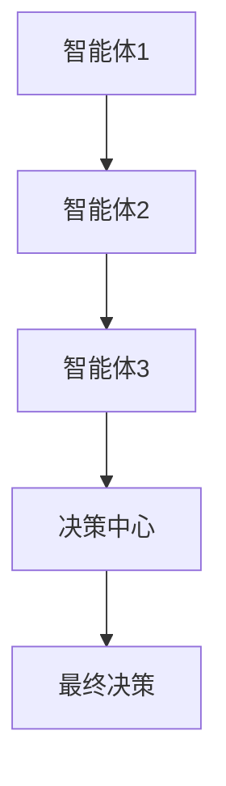
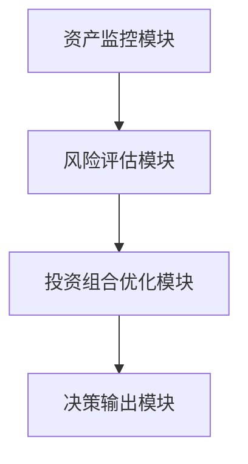
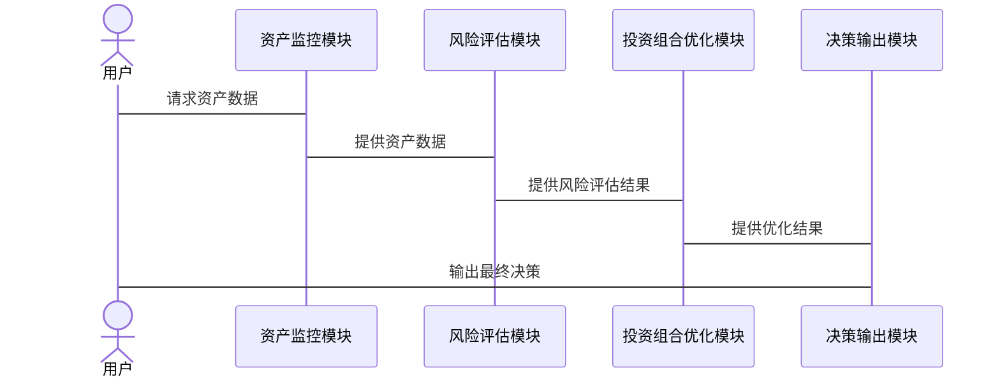

                 


# 智能体群体决策在投资组合风险控制中的应用

> 关键词：智能体，群体决策，投资组合，风险控制，分布式系统，一致性算法，数学模型

> 摘要：本文探讨了智能体群体决策在投资组合风险控制中的应用，通过分析智能体的核心概念、算法原理、系统架构以及实际案例，展示了如何利用智能体群体决策来优化投资组合的风险控制过程。

---

## 第一章: 智能体群体决策的背景与概念

### 1.1 问题背景与问题描述

#### 1.1.1 投资组合风险控制的挑战
投资组合风险控制是金融领域中的重要问题。传统的投资组合管理方法依赖于单点决策，难以应对复杂多变的市场环境。通过引入智能体群体决策，可以更好地捕捉市场信息，优化风险控制策略。

#### 1.1.2 智能体群体决策的提出
智能体（Agent）是指能够感知环境并采取行动以实现目标的实体。群体决策是指多个智能体协同工作，共同做出决策的过程。通过智能体群体决策，可以实现分布式计算和信息共享，提高决策的准确性和鲁棒性。

#### 1.1.3 问题解决思路与目标
智能体群体决策的核心思想是通过多个智能体的协同工作，实现对投资组合风险的全面监控和优化。目标是通过智能体的分布式计算和信息共享，降低投资组合的整体风险。

#### 1.1.4 问题的边界与外延
智能体群体决策的应用范围包括投资组合管理、风险管理、资产配置等。其边界在于智能体的数量、信息共享的范围以及决策的实时性要求。

### 1.2 智能体群体决策的核心概念与联系

#### 1.2.1 智能体的定义与特征
智能体是指能够感知环境、采取行动并实现目标的实体。其特征包括自主性、反应性、目标导向和协作性。

#### 1.2.2 群体决策的机制与流程
群体决策的机制包括信息共享、决策协商和结果整合。其流程包括信息收集、信息处理、决策制定和结果输出。

#### 1.2.3 智能体之间的协同关系
智能体之间的协同关系可以通过任务分配、信息共享和决策协商来实现。协同关系的强弱取决于智能体的目标一致性、信息共享程度和决策规则的复杂性。

#### 1.2.4 核心要素与组成结构
智能体群体决策的核心要素包括智能体、信息共享机制、决策规则和结果整合机制。其组成结构包括智能体层、信息共享层和决策层。

---

## 第二章: 智能体群体决策的算法原理

### 2.1 算法原理概述

#### 2.1.1 群体决策算法的分类
群体决策算法可以分为一致性算法、分布式计算算法和协商算法。一致性算法通过智能体之间的信息同步实现一致决策，分布式计算算法通过局部计算实现全局决策，协商算法通过智能体之间的协商达成一致决策。

#### 2.1.2 一致性算法的基本原理
一致性算法通过智能体之间的信息同步实现一致决策。其基本原理包括状态同步、信息传播和决策整合。一致性算法的关键在于如何在分布式系统中实现信息的高效同步和决策的准确整合。

#### 2.1.3 分布式计算与同步机制
分布式计算通过智能体之间的协作实现全局决策。同步机制包括周期性同步、事件驱动同步和混合同步。分布式计算的关键在于如何在异构环境中实现高效的信息共享和计算同步。

### 2.2 算法流程图与代码实现

#### 2.2.1 算法流程图（mermaid）


#### 2.2.2 Python代码示例
```python
# 简单一致性算法示例
agents = [agent1, agent2, agent3]
for agent in agents:
    agent.state = update_state(agent.state)
    agent.state = synchronize_state(agent.state, agents)
    agent.decision = make_decision(agent.state)

# 决策整合
final_decision = integrate_decisions([agent.decision for agent in agents])
```

### 2.3 数学模型与公式

#### 2.3.1 一致性算法的数学模型
一致性算法的数学模型可以表示为：
$$
\text{最终决策} = \argmax_{\text{决策}} \sum_{i=1}^{n} \text{智能体}_i(\text{决策})
$$

其中，$n$ 是智能体的数量，$\text{智能体}_i(\text{决策})$ 是智能体 $i$ 对决策的支持度。

#### 2.3.2 分布式计算的数学模型
分布式计算的数学模型可以表示为：
$$
\text{最终结果} = \sum_{i=1}^{n} \text{智能体}_i(\text{输入})
$$

其中，$\text{智能体}_i(\text{输入})$ 是智能体 $i$ 对输入的计算结果。

---

## 第三章: 智能体群体决策的系统分析与架构设计

### 3.1 问题场景介绍

#### 3.1.1 投资组合风险控制的场景描述
投资组合风险控制需要对多个资产的风险进行实时监控和优化。智能体群体决策可以用于资产配置、风险评估和投资组合优化。

#### 3.1.2 系统功能需求
系统需要实现资产监控、风险评估、投资组合优化和决策输出功能。系统需要支持多个智能体的协作和信息共享。

### 3.2 项目介绍

#### 3.2.1 系统功能设计
系统功能设计包括资产监控模块、风险评估模块、投资组合优化模块和决策输出模块。每个模块需要通过智能体之间的协作实现。

#### 3.2.2 系统架构设计（mermaid）


#### 3.2.3 系统接口设计
系统接口设计包括资产监控接口、风险评估接口、投资组合优化接口和决策输出接口。每个接口需要定义输入和输出格式。

#### 3.2.4 系统交互设计（mermaid）


---

## 第四章: 智能体群体决策的项目实战

### 4.1 项目环境与工具安装

#### 4.1.1 环境要求
需要安装Python 3.8及以上版本，安装必要的库如numpy、pandas、scikit-learn和networkx。

#### 4.1.2 工具安装
通过pip安装必要的库：
```bash
pip install numpy pandas scikit-learn networkx
```

### 4.2 系统核心代码实现

#### 4.2.1 智能体类的定义
```python
class Agent:
    def __init__(self, id):
        self.id = id
        self.state = None
        self.decision = None

    def update_state(self, state):
        self.state = state

    def make_decision(self):
        if self.state > 0.5:
            return '买入'
        else:
            return '卖出'
```

#### 4.2.2 群体决策算法的实现
```python
class GroupDecision:
    def __init__(self, agents):
        self.agents = agents

    def synchronize_states(self):
        states = [agent.state for agent in self.agents]
        avg_state = sum(states) / len(states)
        for agent in self.agents:
            agent.update_state(avg_state)

    def make_group_decision(self):
        decisions = [agent.make_decision() for agent in self.agents]
        buy_count = decisions.count('买入')
        sell_count = decisions.count('卖出')
        if buy_count > sell_count:
            return '买入'
        else:
            return '卖出'
```

#### 4.2.3 系统功能的实现
```python
# 初始化智能体
agents = [Agent(i) for i in range(1, 4)]
group_decision = GroupDecision(agents)

# 同步状态
group_decision.synchronize_states()

# 制定决策
final_decision = group_decision.make_group_decision()

print(f"最终决策：{final_decision}")
```

### 4.3 代码解读与分析

#### 4.3.1 智能体类的解读
智能体类定义了智能体的基本属性和方法，包括状态更新和决策制定。每个智能体都有唯一的ID，状态表示智能体的当前状态，决策是智能体根据状态做出的决策。

#### 4.3.2 群体决策算法的解读
群体决策算法通过智能体之间的状态同步和决策协商，实现最终的群体决策。同步状态是通过计算所有智能体的状态平均值来实现的，决策制定是通过比较“买入”和“卖出”的数量来决定的。

#### 4.3.3 系统功能的实现
系统功能通过智能体类和群体决策算法的结合实现。初始化智能体后，通过同步状态和制定决策，最终输出群体决策的结果。

### 4.4 实际案例分析与解读

#### 4.4.1 案例场景描述
假设我们有三个智能体，初始状态分别为0.6、0.5和0.4。通过同步状态后，平均状态为0.5。最终决策为“买入”。

#### 4.4.2 案例分析与解读
同步状态后，智能体的状态变为0.5，因此所有智能体都做出“买入”决策。最终决策为“买入”。

### 4.5 项目小结

#### 4.5.1 项目实现的关键点
关键点包括智能体的状态同步、决策协商和最终决策的制定。

#### 4.5.2 项目实现的意义
通过智能体群体决策，可以实现投资组合风险控制的分布式计算和信息共享，提高决策的准确性和鲁棒性。

---

## 第五章: 智能体群体决策的最佳实践

### 5.1 最佳实践 tips

#### 5.1.1 系统设计的注意事项
在系统设计中，需要注意智能体的数量、信息共享的范围和决策的实时性要求。

#### 5.1.2 系统实现的注意事项
在系统实现中，需要注意智能体之间的通信效率、状态同步的准确性以及决策的及时性。

### 5.2 小结

#### 5.2.1 本文总结
本文通过智能体群体决策的方法，展示了如何优化投资组合的风险控制过程。通过系统的分析和实际案例的分析，证明了智能体群体决策的有效性和可行性。

#### 5.2.2 后续工作展望
后续工作可以进一步研究智能体群体决策的优化算法，探索更高效的分布式计算方法，以及研究智能体群体决策在其他领域的应用。

### 5.3 注意事项

#### 5.3.1 系统运行的注意事项
在系统运行中，需要注意智能体之间的通信延迟、状态同步的误差以及决策的误差。

#### 5.3.2 系统维护的注意事项
在系统维护中，需要注意智能体的健康状态、信息共享的准确性和决策的实时性。

### 5.4 拓展阅读

#### 5.4.1 推荐书籍
1. 《分布式系统：概念与设计》
2. 《智能体与多智能体系统》
3. 《投资组合管理与风险控制》

#### 5.4.2 推荐文章
1. 分布式计算与一致性算法
2. 智能体群体决策在金融领域的应用
3. 投资组合风险控制的最新研究

---

## 作者信息

作者：AI天才研究院/AI Genius Institute & 禅与计算机程序设计艺术 /Zen And The Art of Computer Programming

---

通过以上目录大纲和文章内容的详细介绍，我们可以看到智能体群体决策在投资组合风险控制中的应用是一个复杂而有趣的话题。通过系统的分析和实际案例的分析，我们可以更好地理解智能体群体决策的核心概念和算法原理，并将其应用于实际的投资组合风险控制中。

