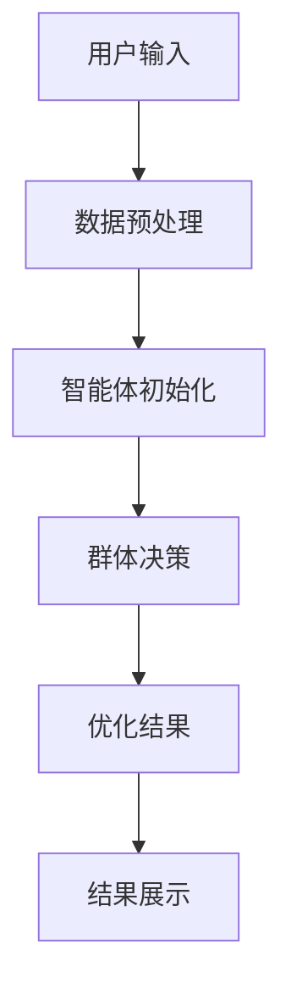
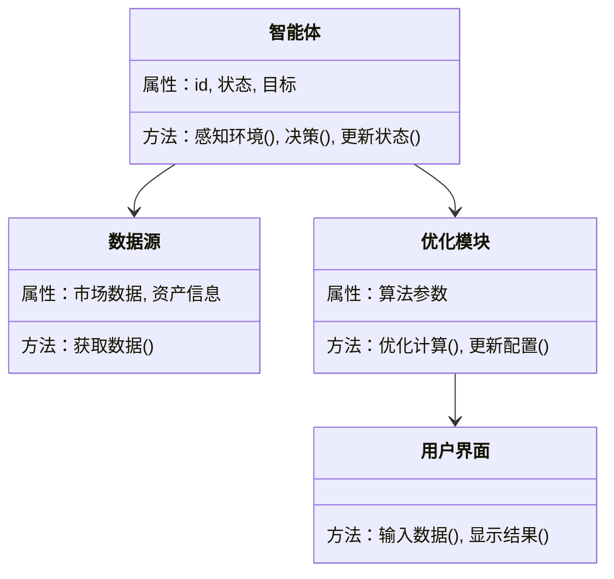

                 


# 智能体群体决策在风险管理中的应用：构建稳健投资组合

## 关键词
智能体群体决策、风险管理、投资组合优化、稳健投资组合、群体智能算法、风险分散、资产配置

## 摘要
本文探讨了智能体群体决策在风险管理中的应用，特别是如何通过构建稳健的投资组合来降低风险。文章从智能体的基本概念出发，逐步分析了群体决策在投资组合优化中的优势，并详细讲解了基于智能体群体决策的风险管理模型的设计与实现。通过实际案例分析，展示了如何利用智能体群体决策算法构建稳健的投资组合。最后，提出了在实际应用中的注意事项和最佳实践，帮助读者更好地理解和应用智能体群体决策技术。

---

## 第一部分: 智能体群体决策与风险管理基础

### 第1章: 智能体群体决策概述

#### 1.1 智能体的基本概念

##### 1.1.1 智能体的定义与特征
智能体（Agent）是指能够感知环境、自主决策并采取行动的实体。智能体的核心特征包括：
- **自主性**：能够自主决策，无需外部干预。
- **反应性**：能够根据环境变化调整行为。
- **目标导向**：具备明确的目标，行动为导向。
- **学习能力**：能够通过经验优化决策策略。

##### 1.1.2 智能体的分类与应用场景
智能体可以分为**反应式智能体**和**目标导向智能体**。反应式智能体主要根据当前环境信息做出决策，而目标导向智能体则基于长期目标进行规划。智能体在风险管理中的应用场景包括：
- **金融市场的风险预测**：通过智能体分析市场数据，预测风险。
- **投资组合优化**：利用智能体进行资产配置和风险分散。

##### 1.1.3 智能体在风险管理中的潜在价值
智能体能够在复杂、动态的环境中快速做出决策，这使得它们在风险管理中具有重要价值。通过智能体的群体决策，可以实现更高效的风险评估和应对策略。

---

#### 1.2 群体决策的基本原理

##### 1.2.1 群体决策的定义与特点
群体决策是指多个个体（智能体）共同参与决策过程，通过协作达成一致或最优决策。群体决策的特点包括：
- **分布式决策**：决策过程分布在多个个体之间。
- **多样性**：个体之间的差异性有助于提高决策的鲁棒性。
- **协作性**：个体通过协作共同完成决策任务。

##### 1.2.2 群体决策与个体决策的差异
- **个体决策**：基于单个个体的信息和偏好进行决策。
- **群体决策**：多个个体共同参与决策，结合个体的偏好和信息。

##### 1.2.3 群体决策在复杂系统中的优势
群体决策能够通过个体的多样性提高决策的鲁棒性和适应性，尤其在复杂、动态的环境中表现优异。例如，在金融市场中，群体决策可以通过多个智能体的协作实现更优的投资组合优化。

---

#### 1.3 风险管理的基本概念

##### 1.3.1 风险的定义与分类
风险是指在特定条件下，某一事件发生可能带来的损失或收益的不确定性。风险可以分为：
- **市场风险**：由于市场波动引起的资产价格变动风险。
- **信用风险**：由于债务人违约引起的损失风险。
- **操作风险**：由于操作失误或系统故障引起的损失风险。

##### 1.3.2 风险管理的目标与方法
风险管理的目标是通过识别、评估和应对风险，降低潜在损失并抓住机会。常用的风险管理方法包括：
- **风险分散**：通过投资多样化降低风险。
- **风险对冲**：通过衍生工具对冲风险。
- **风险转移**：通过保险等方式将风险转移给第三方。

##### 1.3.3 风险管理在投资组合中的重要性
投资组合是多种资产的集合，其目标是在风险可控的前提下实现最大收益。通过有效的风险管理，可以优化投资组合的收益-风险比，提高投资回报。

---

### 第2章: 智能体群体决策与投资组合优化

#### 2.1 投资组合优化的基本原理

##### 2.1.1 投资组合优化的定义与目标
投资组合优化是指通过选择最优的资产组合，最大化收益或在给定收益下最小化风险。其目标是找到满足投资者风险偏好和收益目标的最优资产配置。

##### 2.1.2 投资组合优化的数学模型
投资组合优化的数学模型通常包括目标函数和约束条件。常见的目标函数有：
- **均值-方差模型**：以资产的期望收益和方差为目标。
- **风险中性模型**：以风险中性原则为目标。

##### 2.1.3 投资组合优化的关键因素
投资组合优化的关键因素包括资产的收益、风险、相关性以及投资者的风险偏好。

---

#### 2.2 智能体群体决策在投资组合优化中的应用

##### 2.2.1 智能体群体决策在资产配置中的作用
智能体群体决策可以通过多个智能体协作，优化资产配置。每个智能体负责分析不同的资产类别，并根据市场信息调整配置比例。

##### 2.2.2 智能体群体决策在风险分散中的应用
通过智能体群体决策，可以在不同资产之间分散风险，降低投资组合的整体风险水平。

##### 2.2.3 智能体群体决策在市场预测中的优势
智能体群体决策能够通过多个智能体的协作，提高市场预测的准确性和鲁棒性，从而优化投资组合的收益。

---

## 第二部分: 智能体群体决策在风险管理中的应用

### 第3章: 智能体群体决策模型的设计与实现

#### 3.1 智能体群体决策模型的构建

##### 3.1.1 模型的设计目标
智能体群体决策模型的设计目标是通过多个智能体的协作，实现投资组合的优化和风险管理。

##### 3.1.2 模型的输入与输出
- **输入**：市场数据、资产信息、投资者风险偏好。
- **输出**：优化的资产配置方案、风险评估报告。

##### 3.1.3 模型的实现步骤
1. **智能体初始化**：定义每个智能体的目标和决策规则。
2. **环境感知**：智能体感知市场数据和风险信息。
3. **群体决策**：智能体协作，共同优化资产配置。
4. **结果输出**：输出优化的资产配置方案和风险评估报告。

---

#### 3.2 智能体群体决策模型的算法

##### 3.2.1 群体决策算法的选择
在投资组合优化中，常用群体智能算法包括遗传算法（Genetic Algorithm）、粒子群优化算法（Particle Swarm Optimization）等。

##### 3.2.2 群体决策算法的实现步骤
1. **初始化**：设置算法参数，如种群大小、迭代次数。
2. **适应度评估**：评估每个个体的适应度。
3. **选择与交叉**：根据适应度选择个体，并进行交叉和变异操作。
4. **更新种群**：更新种群，继续迭代，直到达到终止条件。

##### 3.2.3 算法实现的数学模型
以遗传算法为例，其数学模型包括：
- **适应度函数**：衡量个体的优劣。
- **选择操作**：选择适应度高的个体进行繁殖。
- **交叉操作**：将两个个体的基因进行交叉，生成新的个体。
- **变异操作**：随机改变个体的基因，增加多样性。

---

### 第4章: 智能体群体决策系统的架构设计

#### 4.1 系统功能设计

##### 4.1.1 系统功能模块
- **数据输入模块**：输入市场数据和资产信息。
- **风险评估模块**：评估资产的风险水平。
- **优化计算模块**：利用智能体群体决策算法优化投资组合。
- **结果展示模块**：输出优化的资产配置方案和风险评估报告。

##### 4.1.2 系统功能流程图


#### 4.2 系统架构设计

##### 4.2.1 系统架构图


---

## 第三部分: 基于智能体群体决策的风险管理模型

### 第5章: 项目实战

#### 5.1 环境安装与工具准备

##### 5.1.1 环境安装
安装Python和相关库，如numpy、pandas、matplotlib等。

##### 5.1.2 工具准备
准备数据集，包括历史市场数据和资产信息。

#### 5.2 系统核心实现

##### 5.2.1 核心代码实现
```python
import numpy as np
import pandas as pd
from sklearn.metrics import mean_squared_error

def fitness(individual, market_data):
    # 计算投资组合的收益
    returns = np.sum(individual * market_data['return'] / np.sum(individual))
    # 计算投资组合的风险
    risk = np.std(np.dot(individual, market_data['return']))
    # 计算适应度
    return -returns + risk * 0.5

def main():
    # 初始化种群
    population = np.random.random((10, len(market_data.columns)))
    # 迭代优化
    for _ in range(100):
        # 计算适应度
        fitness_values = [fitness(individual, market_data) for individual in population]
        # 选择
        selected = population[np.argsort(fitness_values)]
        # 交叉
        offspring = selected[:5]
        for i in range(5, 10):
            parent1 = offspring[i - 5]
            parent2 = offspring[i - 5 + 1]
            child = np.where(np.random.rand(len(parent1)) > 0.5, parent1, parent2)
            offspring[i] = child
        population = offspring
    # 输出最优解
    best = population[0]
    print("最优解：", best)
    print("最优收益：", np.sum(best * market_data['return'] / np.sum(best)))

if __name__ == '__main__':
    market_data = pd.read_csv('market_data.csv')
    main()
```

##### 5.2.2 代码解读与分析
上述代码实现了一个基于遗传算法的智能体群体决策模型，用于优化投资组合。代码包括数据读取、适应度计算、选择、交叉和变异等步骤。

---

### 第6章: 最佳实践与总结

#### 6.1 小结
本文详细介绍了智能体群体决策在风险管理中的应用，特别是在投资组合优化方面。通过群体智能算法，可以实现更优的资产配置和风险分散。

#### 6.2 注意事项
- **数据质量**：确保输入数据的准确性和完整性。
- **模型调优**：根据实际情况调整算法参数和模型结构。
- **风险管理**：在实际应用中，需要结合其他风险管理方法，构建多层次的风险防控体系。

#### 6.3 拓展阅读
- 《群体智能：算法与应用》
- 《投资组合管理：理论与实践》
- 《风险管理：方法与技术》

---

## 结语

智能体群体决策在风险管理中的应用为投资组合优化提供了新的思路和方法。通过群体智能算法，可以实现更高效、更稳健的投资组合优化。未来，随着人工智能技术的不断发展，智能体群体决策将在风险管理中发挥更大的作用。

---

## 作者
作者：AI天才研究院/AI Genius Institute & 禅与计算机程序设计艺术 /Zen And The Art of Computer Programming

