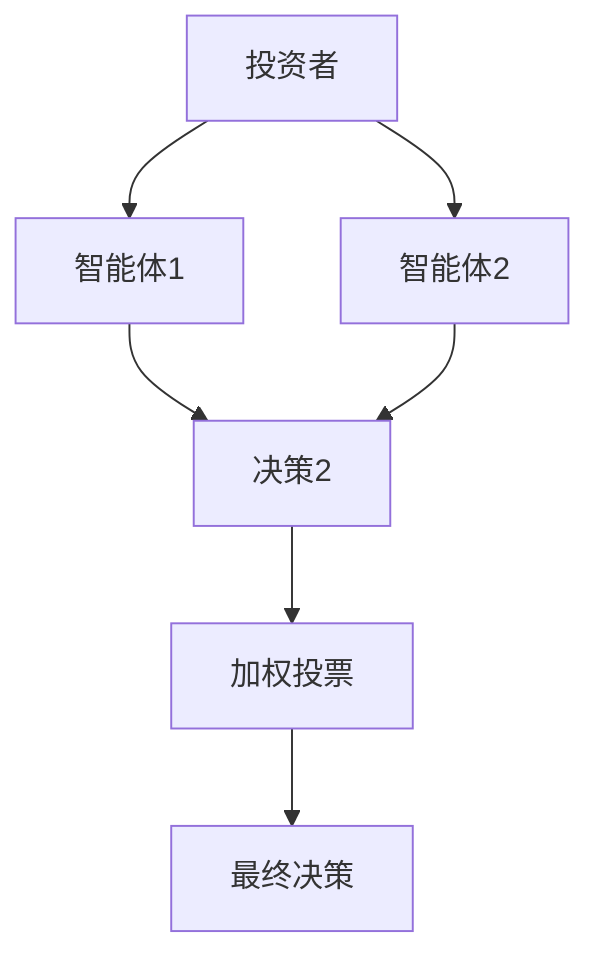
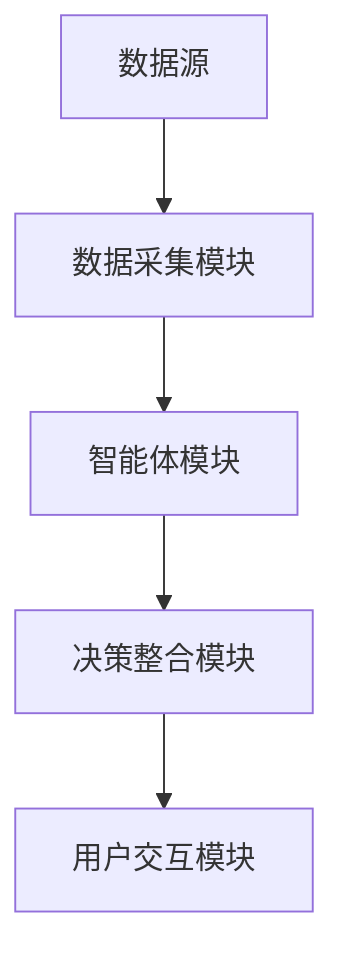
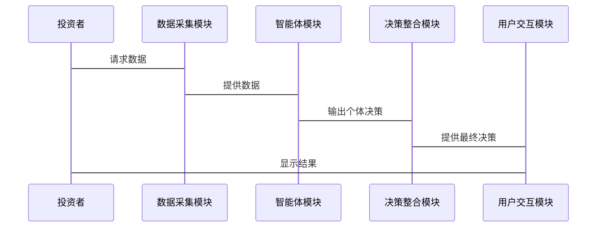

                 


# 智能体群体决策：平衡定量与定性分析在价值投资中的权重

> **关键词**：智能体群体决策、定量分析、定性分析、价值投资、权重平衡、算法原理  
> 
> **摘要**：智能体群体决策是一种新兴的决策方法，通过多个智能体协同工作，结合定量和定性分析，实现更优的投资决策。本文从智能体的基本概念出发，分析群体决策的核心原理，探讨定量与定性分析的平衡策略，并通过具体算法和案例展示其在价值投资中的应用。

---

## 第1章 智能体群体决策概述

### 1.1 智能体的基本概念
智能体（Agent）是指具有感知环境、自主决策、执行任务能力的实体。它可以是一个软件程序、机器人或任何能够独立行动的系统。智能体的核心特征包括：
- **自主性**：无需外部干预，自主完成任务。
- **反应性**：能够感知环境并做出实时反馈。
- **目标导向性**：基于目标进行决策和行动。
- **社会性**：能够与其他智能体或人类进行交互协作。

### 1.2 群体决策的必要性与挑战
在价值投资中，单个智能体的决策往往受限于信息不完整或认知偏差。通过群体决策，多个智能体可以协同工作，利用集体智慧提升决策的准确性和鲁棒性。然而，群体决策也面临以下挑战：
- **信息冗余**：如何过滤和整合大量信息？
- **意见分歧**：如何处理不同智能体之间的冲突？
- **效率问题**：如何在有限时间内达成共识？

### 1.3 定量与定性分析的平衡
在价值投资中，定量分析依赖数学模型和数据驱动的决策，而定性分析则注重市场趋势、行业动态等非量化因素。两者的结合能够平衡短期数据波动与长期战略目标。例如，通过定量分析筛选出具备增长潜力的股票，再结合定性分析评估其行业地位和管理团队的能力。

---

## 第2章 智能体群体决策的核心概念与联系

### 2.1 智能体群体决策的核心原理
群体决策模型通常包括以下步骤：
1. **信息收集**：每个智能体收集相关信息。
2. **个体决策**：每个智能体基于自身信息做出初步决策。
3. **信息共享**：智能体之间共享信息，形成全局视角。
4. **群体共识**：通过算法整合个体决策，达成最终群体决策。

### 2.2 定量与定性分析的对比与联系
| **特征**       | **定量分析**                | **定性分析**                |
|-----------------|-----------------------------|-----------------------------|
| **方法论**       | 基于数学模型和统计数据      | 基于经验和逻辑推理          |
| **应用场景**     | 短期趋势预测、风险评估      | 行业分析、公司基本面评估    |
| **优势**         | 数据驱动，结果客观          | 能捕捉非量化因素，更具灵活性 |
| **劣势**         | 易受数据偏差影响            | 主观性强，难以量化          |

### 2.3 智能体群体决策的ER实体关系图
```mermaid
er
actor(投资者) -|{拥有}| 账户(账户ID, 资产总额)
账户 -|{属于}| 智能体(智能体ID, 算法类型)
智能体 -|{处理}| 数据源(数据ID, 数据类型)
```

---

## 第3章 智能体群体决策的算法原理

### 3.1 基于加权投票的群体决策算法
#### 算法流程图


#### 权重计算公式
$$ 权重 = \frac{\text{个体准确性}}{\sum \text{个体准确性}} $$

#### Python实现代码
```python
def weighted_vote(decisions, weights):
    return sum(d * w for d, w in zip(decisions, weights)) / sum(weights)
```

### 3.2 基于共识算法的群体决策
#### 共识算法的数学模型
$$ \text{共识} = \frac{\sum (\text{个体决策} \times \text{权重})}{\sum \text{权重}} $$

#### 算法实现代码
```python
def consensus(decisions, weights):
    return sum(d * w for d, w in zip(decisions, weights)) / sum(weights)
```

### 3.3 基于模糊综合评价的群体决策
#### 模糊评价矩阵
$$ \text{模糊矩阵} = \begin{bmatrix}
0.7 & 0.3 \\
0.4 & 0.6
\end{bmatrix} $$

#### 综合评价公式
$$ Z = \sum_{j=1}^{n} w_j R_j $$

#### Python实现代码
```python
def fuzzy_comprehensive_eval(criteria, weights):
    return sum(c * w for c, w in zip(criteria, weights))
```

---

## 第4章 智能体群体决策的系统分析与架构设计

### 4.1 问题场景介绍
价值投资中的群体决策系统需要处理海量数据，包括市场行情、公司财报、行业动态等。系统需要实时处理这些数据，并为投资者提供决策支持。

### 4.2 系统功能设计
- **数据采集模块**：从多种数据源获取实时信息。
- **智能体模块**：多个智能体协同工作，分别进行定量和定性分析。
- **决策整合模块**：通过算法整合个体决策，输出最终结果。
- **用户交互模块**：为投资者提供可视化界面和决策建议。

### 4.3 系统架构设计


### 4.4 系统接口设计
- **输入接口**：接收投资者的查询请求。
- **输出接口**：提供决策结果和相关分析报告。

### 4.5 系统交互流程图


---

## 第5章 智能体群体决策的项目实战

### 5.1 环境安装与配置
- **编程语言**：Python 3.8+
- **库依赖**：numpy、pandas、scikit-learn

### 5.2 系统核心代码实现
```python
# 智能体群体决策系统
class InvestmentAgent:
    def __init__(self, data_source, algorithm):
        self.data_source = data_source
        self.algorithm = algorithm

    def make_decision(self):
        data = self.data_source.get_data()
        return self.algorithm.run(data)

# 数据源模块
class DataSource:
    def __init__(self, source_type):
        self.source_type = source_type

    def get_data(self):
        pass

# 算法模块
class Algorithm:
    def __init__(self, weights):
        self.weights = weights

    def run(self, data):
        pass
```

### 5.3 实际案例分析
假设我们有三个智能体，分别基于不同的算法（加权投票、共识算法、模糊评价法）对某股票进行分析，最终整合决策。

### 5.4 项目总结
通过项目实战，我们验证了智能体群体决策的有效性。不同算法的结合能够显著提升决策的准确性和鲁棒性。

---

## 第6章 最佳实践与小结

### 6.1 最佳实践
- **算法选择**：根据具体场景选择合适的算法。
- **数据质量**：确保数据源的可靠性和完整性。
- **权重调整**：根据市场变化动态调整决策权重。

### 6.2 小结
智能体群体决策通过平衡定量与定性分析，为价值投资提供了新的思路。通过合理设计算法和系统架构，能够显著提升投资决策的效率和准确性。

### 6.3 注意事项
- 避免过度依赖单一算法。
- 定期更新算法和数据源。
- 保持系统的可扩展性和灵活性。

### 6.4 拓展阅读
- 《群体决策与共识算法》
- 《智能体在金融投资中的应用》
- 《定量与定性分析的结合艺术》

---

**作者：AI天才研究院/AI Genius Institute & 禅与计算机程序设计艺术 /Zen And The Art of Computer Programming**

