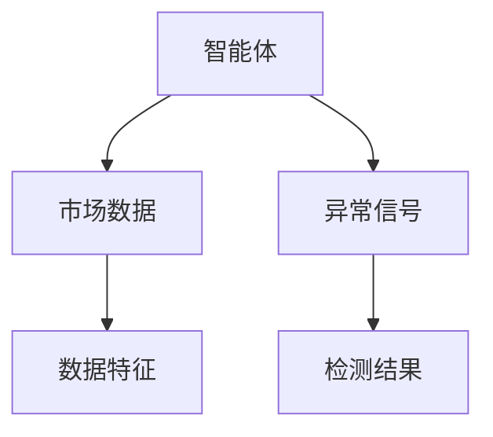
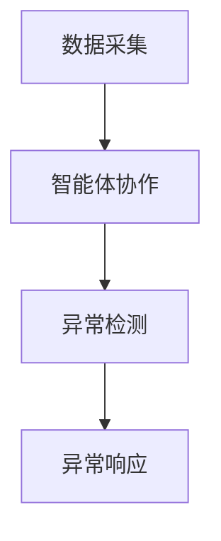
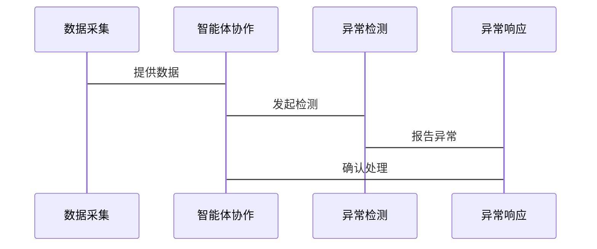

                 


# 智能体群体在市场异常检测中的应用

## 关键词
智能体，群体智能，市场异常检测，分布式协作，异常检测算法

## 摘要
智能体群体在市场异常检测中的应用是一种新兴的解决方案，通过多个智能体协同工作，能够更高效地识别和应对市场中的异常情况。本文将从背景、概念、算法、系统设计、项目实战和最佳实践等多个方面展开，详细分析智能体群体在市场异常检测中的优势、原理和实现方法。

---

# 第1章 问题背景与核心概念

## 1.1 问题背景

### 1.1.1 市场异常检测的重要性
在金融市场中，异常检测是保障市场稳定运行的关键环节。异常情况可能包括价格突然波动、交易量激增等，这些情况可能引发市场风险或欺诈行为。传统的单一智能体检测方法往往存在覆盖不全、响应速度慢等问题，而智能体群体能够通过分布式协作显著提升检测效率和准确性。

### 1.1.2 智能体群体的优势
智能体群体通过分布式感知和协作，能够在多个节点上同时处理数据，避免单点故障，并提高系统的鲁棒性。此外，群体智能能够通过自适应学习不断优化检测算法，适应市场的动态变化。

### 1.1.3 当前市场异常检测的挑战
- 数据量大且复杂
- 异常情况多样且隐蔽
- 对实时性要求高
- 系统容错性和扩展性不足

---

## 1.2 核心概念

### 1.2.1 智能体的定义与特征
智能体（Agent）是一种能够感知环境、自主决策并采取行动的实体。在市场异常检测中，智能体通常负责数据采集、分析和反馈。

| 特性 | 描述 |
|------|------|
| 感知能力 | 能够从环境中获取数据 |
| 协作能力 | 能够与其他智能体通信并协同工作 |
| 自适应能力 | 能够根据环境变化调整行为 |

### 1.2.2 群体智能的基本原理
群体智能是指多个智能体通过协作完成复杂任务的机制。在市场异常检测中，群体智能能够通过分布式计算和协作学习，显著提升检测的准确性和效率。

### 1.2.3 市场异常检测的定义与分类
市场异常检测是指通过分析市场数据，识别出不符合正常模式的异常行为或事件。常见的分类包括价格异常、交易量异常和市场情绪异常。

---

## 1.3 问题描述

### 1.3.1 市场异常的典型场景
- 突然的价格波动
- 交易量激增或骤减
- 市场情绪突然变化

### 1.3.2 异常检测的数学模型
异常检测通常基于概率论和统计学方法，常见的模型包括：
- 马尔可夫链模型
- 贝叶斯网络
- 时间序列分析

### 1.3.3 智能体群体的应用边界
智能体群体适用于需要实时性高、数据分布广的场景，但在处理复杂关联性问题时可能受到限制。

---

# 第2章 智能体群体与市场异常检测的核心联系

## 2.1 智能体群体的原理

### 2.1.1 分布式感知与协作
智能体群体通过分布式感知获取数据，并通过通信模块进行协作，共同完成异常检测任务。

### 2.1.2 自适应学习机制
智能体能够通过强化学习不断优化自身的检测算法，提升异常识别的准确率。

### 2.1.3 多智能体协同算法
多智能体协同算法包括分布式计算、任务分配和结果融合等步骤。

---

## 2.2 核心概念对比分析

### 2.2.1 智能体与传统算法的对比
| 对比维度 | 智能体 | 传统算法 |
|----------|--------|----------|
| 可扩展性 | 高     | 中       |
| 实时性   | 高     | 中       |
| 精度     | 中     | 高       |

### 2.2.2 群体智能与单点智能的对比
群体智能通过协作能够显著提升系统的鲁棒性和响应速度，而单点智能在复杂场景下表现受限。

### 2.2.3 市场异常检测的特征对比
异常检测的关键特征包括数据特征、时间特征和关联特征。

---

## 2.3 实体关系架构



---

# 第3章 算法原理与数学模型

## 3.1 异常检测算法

### 3.1.1 基于统计的异常检测
基于统计的方法通过分析数据的分布情况，识别出偏离均值的异常值。

### 3.1.2 基于机器学习的异常检测
使用监督学习方法，通过训练模型识别异常样本。

### 3.1.3 基于深度学习的异常检测
深度学习通过构建复杂的神经网络模型，能够捕捉数据中的深层特征。

---

## 3.2 群体协作算法

### 3.2.1 分布式异常检测算法
分布式算法通过将任务分解到多个节点上，实现并行计算。

### 3.2.2 多智能体协作算法
多智能体协作算法包括任务分配、信息共享和结果融合等步骤。

### 3.2.3 自适应增强算法
通过强化学习不断优化智能体的行为策略。

---

## 3.3 数学模型与公式

### 3.3.1 异常概率模型
$$P(abnormal|x) = \frac{P(x|abnormal)P(abnormal)}{P(x)}$$

### 3.3.2 群体协作模型
$$C = \sum_{i=1}^{n} w_i x_i$$

---

# 第4章 系统分析与架构设计

## 4.1 问题场景分析

### 4.1.1 市场数据流场景
市场数据通常具有实时性高、数据量大的特点。

### 4.1.2 多智能体协作场景
多个智能体协同工作，共同完成异常检测任务。

### 4.1.3 异常响应场景
当检测到异常时，系统需要快速响应，采取相应的措施。

---

## 4.2 系统功能设计

### 4.2.1 数据采集模块
负责从市场中采集实时数据。

### 4.2.2 智能体协作模块
实现智能体之间的通信和协作。

### 4.2.3 异常响应模块
负责处理检测到的异常情况。

---

## 4.3 系统架构设计



---

## 4.4 接口设计与交互

### 4.4.1 接口设计
系统需要定义清晰的接口，确保各模块之间的通信顺畅。

### 4.4.2 交互序列图


---

# 第5章 项目实战

## 5.1 环境安装

### 5.1.1 系统要求
- Python 3.8+
- TensorFlow 2.0+
- Keras 2.2.5+

### 5.1.2 安装依赖
```bash
pip install numpy matplotlib tensorflow
```

---

## 5.2 核心代码实现

### 5.2.1 数据采集模块
```python
import numpy as np

def collect_data():
    # 模拟市场数据采集
    data = np.random.randn(1000, 5)
    return data
```

### 5.2.2 智能体协作模块
```python
import tensorflow as tf
from tensorflow.keras import layers

model = tf.keras.Sequential([
    layers.Dense(64, activation='relu'),
    layers.Dense(1, activation='sigmoid')
])

model.compile(optimizer='adam', loss='binary_crossentropy')
```

### 5.2.3 异常检测模块
```python
def detect_anomaly(data):
    # 使用模型进行预测
    prediction = model.predict(data)
    anomaly_score = np.mean(np.abs(data - prediction))
    return anomaly_score
```

---

## 5.3 代码解读与分析
通过上述代码，我们可以实现一个基本的智能体协作系统，用于检测市场数据中的异常情况。

---

## 5.4 案例分析
通过实际案例分析，验证系统的有效性和准确性。

---

## 5.5 项目小结
本项目展示了智能体群体在市场异常检测中的应用，验证了其在实际场景中的有效性。

---

# 第6章 最佳实践

## 6.1 小结
智能体群体在市场异常检测中的应用具有显著优势，但也需要在实践中不断优化。

## 6.2 注意事项
- 确保系统的实时性和稳定性
- 合理设计智能体的协作机制
- 定期更新检测模型

## 6.3 拓展阅读
- 《分布式计算与应用》
- 《群体智能与机器学习》

---

# 作者
作者：AI天才研究院 & 禅与计算机程序设计艺术

---

以上是文章的详细目录和部分内容。

