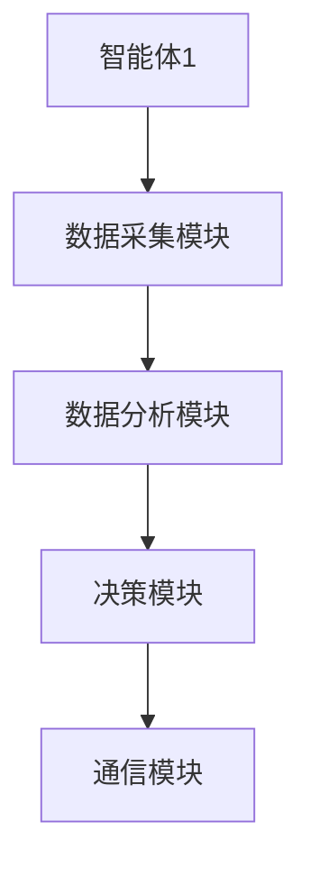
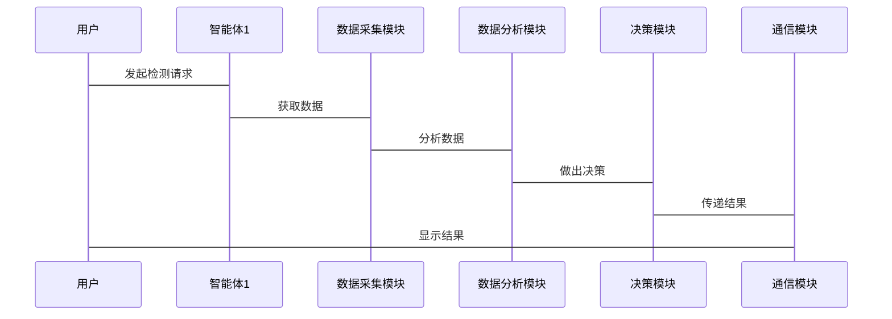

                 


# 智能体群体在市场泡沫检测中的应用

## 关键词：智能体群体，市场泡沫，分布式计算，群体智能，异常检测

## 摘要：智能体群体是一种新兴的技术，通过多个智能体协同工作来实现复杂的任务。本文探讨了智能体群体在市场泡沫检测中的应用，详细介绍了其核心概念、算法原理、系统架构以及实际案例。通过智能体群体，我们可以更高效地检测市场泡沫，为投资者提供决策支持。

---

# 第一部分：智能体群体与市场泡沫检测基础

## 第1章：市场泡沫与智能体群体概述

### 1.1 市场泡沫的定义与特征

#### 1.1.1 市场泡沫的定义
市场泡沫是指资产价格在短期内快速上涨，远远超过其实际价值，最终导致价格暴跌的现象。常见的市场泡沫包括房地产泡沫、股票市场泡沫等。

#### 1.1.2 市场泡沫的主要特征
- 资产价格偏离实际价值
- 投资者情绪化、非理性行为
- 过高的杠杆率和投机行为

#### 1.1.3 市场泡沫的形成机制
1. 过度乐观的心理预期
2. 投机行为的扩散
3. 信息不对称与羊群效应

### 1.2 智能体群体的基本概念

#### 1.2.1 智能体的定义与特点
智能体（Agent）是指能够感知环境、自主决策并采取行动的实体。智能体具有以下特点：
- **自主性**：无需外部干预，自主决策
- **反应性**：能够感知环境并实时调整行为
- **社会性**：能够与其他智能体或人类进行交互

#### 1.2.2 智能体群体的定义与组成
智能体群体是指多个智能体协同工作的系统。其组成包括：
- **智能体**：个体智能体
- **通信机制**：智能体之间的信息传递方式
- **决策机制**：群体决策的规则与算法

#### 1.2.3 智能体群体的优势与应用场景
- **优势**：
  - 高效性：多个智能体协同工作，提高计算效率
  - 灵活性：智能体可以根据环境变化动态调整
- **应用场景**：
  - 金融市场分析
  - 网络流量监控
  - 群体行为预测

### 1.3 智能体群体在市场泡沫检测中的应用背景

#### 1.3.1 市场泡沫检测的传统方法与局限性
传统方法包括基于统计的分析、专家分析等，但存在以下问题：
- 数据量大，难以处理
- 分析耗时，难以实时监测
- 需要大量专业知识

#### 1.3.2 智能体群体的优势与潜力
智能体群体能够实时分析市场数据，快速识别异常情况，提高检测效率和准确性。

#### 1.3.3 当前市场环境下的应用需求
随着金融市场日益复杂，市场泡沫检测的需求日益增长。智能体群体能够满足这一需求。

### 1.4 本章小结
本章介绍了市场泡沫的定义与特征，智能体群体的基本概念，以及智能体群体在市场泡沫检测中的应用背景。

---

## 第2章：智能体群体的核心概念与原理

### 2.1 智能体的功能与属性

#### 2.1.1 智能体的基本功能
- 数据采集与分析
- 自主决策与行动
- 与环境和其他智能体交互

#### 2.1.2 智能体的属性特征对比
| 属性 | 定义 | 特点 |
|------|------|------|
| 自主性 | 独立决策 | 高 |
| 反应性 | 实时响应 | 快速 |
| 社会性 | 协作能力 | 强 |

#### 2.1.3 智能体之间的关系与协作
智能体可以通过通信机制进行协作，共同完成复杂任务。

### 2.2 智能体群体的通信机制

#### 2.2.1 通信协议的定义与选择
通信协议是智能体之间信息传递的规则，选择合适的协议可以提高通信效率。

#### 2.2.2 智能体之间的信息传递流程
1. 发起智能体发送数据
2. 数据通过通信协议传递
3. 接收智能体处理数据并反馈

#### 2.2.3 通信机制对群体智能的影响
良好的通信机制可以提高智能体群体的协作效率和准确性。

### 2.3 智能体群体的决策机制

#### 2.3.1 分布式决策的基本原理
分布式决策是指每个智能体独立决策，然后通过通信机制达成共识。

#### 2.3.2 基于群体智能的决策算法
- 分布式计算算法
- 聚类分析算法
- 基于投票的决策算法

#### 2.3.3 决策机制对市场泡沫检测的影响
高效的决策机制可以快速识别市场异常情况，及时发出预警。

### 2.4 本章小结
本章详细讲解了智能体的功能与属性，通信机制，以及决策机制，并分析了它们对市场泡沫检测的影响。

---

## 第3章：市场泡沫检测的智能体群体模型

### 3.1 智能体群体模型的构建

#### 3.1.1 模型的构建目标与原则
目标：实现对市场泡沫的实时检测。原则：高效性、准确性和可扩展性。

#### 3.1.2 模型的核心要素与组成
- 数据采集模块：收集市场数据
- 数据分析模块：分析数据并识别异常
- 决策模块：基于分析结果做出决策
- 通信模块：智能体之间的信息传递

#### 3.1.3 模型的验证与优化
通过历史数据验证模型的准确性，并通过优化算法提高检测效率。

### 3.2 智能体群体模型的实现步骤

#### 3.2.1 模型设计的流程与方法
1. 确定模型目标
2. 设计模型架构
3. 实现各模块功能
4. 集成各模块并测试

#### 3.2.2 模型实现的关键技术
- 分布式计算技术
- 群体智能算法
- 异常检测算法

#### 3.2.3 模型实现中的常见问题与解决方案
- 数据同步问题：使用时间戳解决
- 通信延迟问题：优化通信协议

### 3.3 智能体群体模型的优化与改进

#### 3.3.1 模型优化的目标与方法
目标：提高检测效率和准确性。方法：优化算法和通信机制。

#### 3.3.2 基于反馈的模型改进策略
通过用户反馈不断优化模型。

#### 3.3.3 模型优化对检测效果的影响
优化后的模型能够更快、更准确地检测市场泡沫。

### 3.4 本章小结
本章详细讲解了智能体群体模型的构建、实现和优化过程。

---

## 第4章：智能体群体检测市场泡沫的算法原理

### 4.1 分布式计算与协同

#### 4.1.1 分布式计算的基本原理
将任务分解成多个子任务，分别在不同的智能体上执行。

#### 4.1.2 分布式计算的优势
- 提高计算效率
- 增强系统的容错性

#### 4.1.3 分布式计算的实现步骤
1. 任务分解
2. 任务分配
3. 任务执行
4. 结果汇总

### 4.2 群体协同优化算法

#### 4.2.1 群体协同优化的基本原理
通过智能体之间的协作，优化整体决策。

#### 4.2.2 基于群体智能的优化算法
- 遗传算法
- 蚁群算法
- 蝙蝠算法

#### 4.2.3 群体协同优化的优势
- 提高决策的准确性
- 增强系统的适应性

### 4.3 异常检测算法

#### 4.3.1 异常检测的基本原理
通过分析数据，识别异常情况。

#### 4.3.2 基于统计的异常检测算法
- Z-score方法
- 3σ法

#### 4.3.3 基于机器学习的异常检测算法
- KNN算法
- Isolation Forest算法

### 4.4 本章小结
本章详细讲解了智能体群体检测市场泡沫中的分布式计算、群体协同优化和异常检测算法。

---

## 第5章：系统分析与架构设计方案

### 5.1 问题场景介绍

#### 5.1.1 项目背景
市场泡沫检测的复杂性促使我们采用智能体群体技术。

#### 5.1.2 项目目标
实现一个高效的市场泡沫检测系统。

### 5.2 系统功能设计

#### 5.2.1 功能模块设计
- 数据采集模块
- 数据分析模块
- 决策模块
- 通信模块

#### 5.2.2 系统功能流程
1. 数据采集模块收集市场数据
2. 数据分析模块分析数据并识别异常
3. 决策模块基于分析结果做出决策
4. 通信模块传递决策结果

### 5.3 系统架构设计

#### 5.3.1 系统架构图


#### 5.3.2 系统接口设计
- 数据接口：智能体与数据源的接口
- 通信接口：智能体之间的通信接口
- 用户接口：用户与系统的交互接口

### 5.4 系统交互设计

#### 5.4.1 系统交互流程
1. 用户发起检测请求
2. 智能体采集数据
3. 数据分析模块分析数据
4. 决策模块做出决策
5. 通信模块传递结果

#### 5.4.2 系统交互的mermaid序列图


### 5.5 本章小结
本章详细讲解了系统的架构设计和交互设计。

---

## 第6章：项目实战

### 6.1 环境配置

#### 6.1.1 系统环境
- 操作系统：Linux
- 开发工具：Python、Jupyter Notebook
- 数据库：MongoDB

#### 6.1.2 安装依赖
```bash
pip install numpy pandas scikit-learn
```

### 6.2 系统核心实现

#### 6.2.1 智能体类的实现
```python
class Agent:
    def __init__(self, id):
        self.id = id
        self.data = []
        
    def collect_data(self):
        # 数据采集逻辑
        pass
        
    def analyze_data(self):
        # 数据分析逻辑
        pass
```

#### 6.2.2 通信模块的实现
```python
import zmq

class Communicator:
    def __init__(self, port):
        self.port = port
        self.context = zmq.Context()
        self.socket = self.context.socket(zmq.PAIR)
        self.socket.bind(f"tcp://*:{self.port}")
        
    def send(self, message):
        self.socket.send_json(message)
        
    def receive(self):
        return self.socket.recv_json()
```

### 6.3 代码应用解读与分析

#### 6.3.1 核心代码实现
```python
import numpy as np
from sklearn.ensemble import IsolationForest

class MarketBubbleDetector:
    def __init__(self, data):
        self.data = data
        self.model = IsolationForest(n_estimators=100, random_state=42)
        
    def detect_bubble(self):
        self.model.fit(self.data)
        return self.model.predict(self.data)
```

#### 6.3.2 代码分析
- 使用Isolation Forest算法检测异常值。
- 通过训练模型来识别市场数据中的异常情况，进而判断是否存在市场泡沫。

### 6.4 实际案例分析

#### 6.4.1 数据来源
- 数据来源：股票市场历史数据
- 数据预处理：清洗和标准化

#### 6.4.2 检测过程
1. 数据采集：获取股票价格数据
2. 数据分析：使用Isolation Forest算法检测异常值
3. 决策：判断是否存在市场泡沫

#### 6.4.3 结果展示
- 异常值检测结果
- 市场泡沫检测结论

### 6.5 项目小结
本章通过实际案例展示了智能体群体在市场泡沫检测中的应用，详细讲解了项目的实现过程和结果。

---

## 第7章：最佳实践与总结

### 7.1 小结
智能体群体在市场泡沫检测中具有显著优势，能够高效、准确地检测市场异常情况。

### 7.2 注意事项
- 确保数据的实时性和准确性
- 定期优化算法和系统架构
- 注意系统的安全性和稳定性

### 7.3 拓展阅读
- 推荐阅读相关领域的书籍和论文
- 关注最新的研究成果和技术动态

---

## 作者：AI天才研究院 & 禅与计算机程序设计艺术

---

感谢您的耐心阅读！如果对本文有任何疑问或建议，请随时与我们联系。

