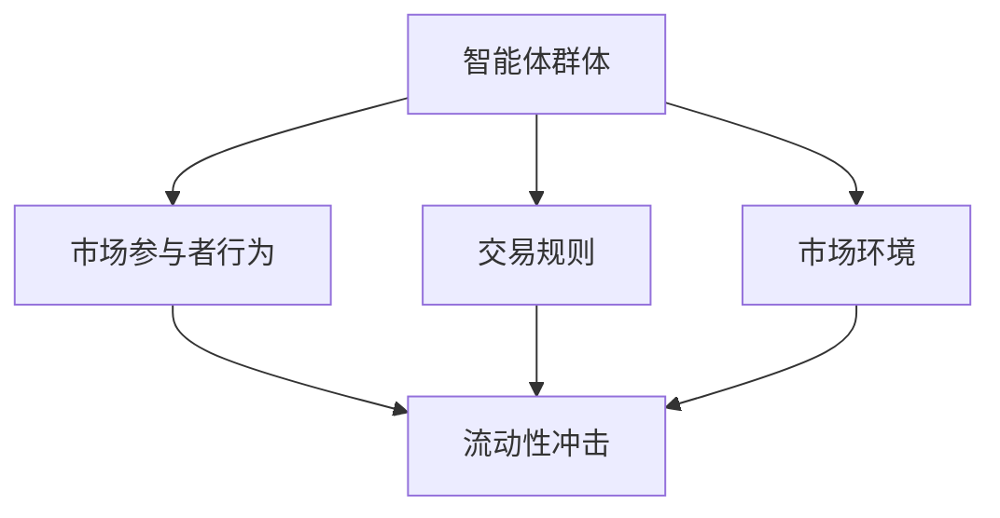
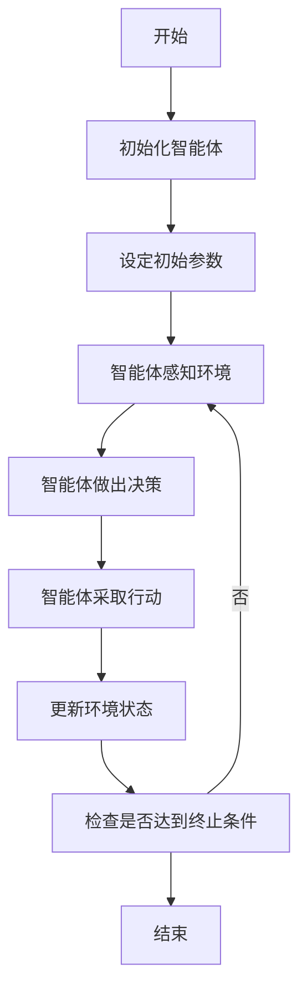
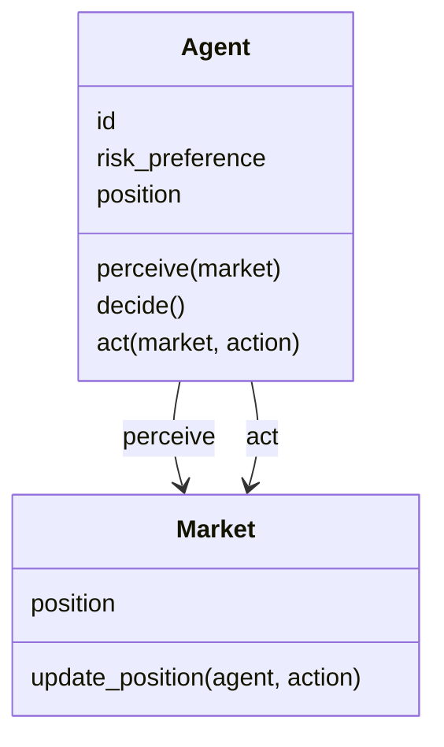
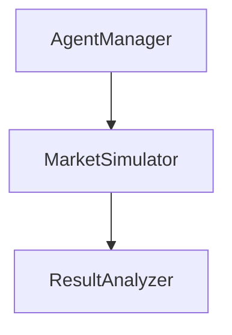

                 


# 智能体群体在模拟市场流动性冲击中的应用

## 关键词：智能体群体，流动性冲击，金融市场，算法建模，系统模拟

## 摘要：  
智能体群体在模拟市场流动性冲击中的应用是当前金融市场研究的重要方向。流动性冲击是指在金融市场中由于大额交易或市场参与者行为变化导致的资产价格剧烈波动。本文通过构建智能体群体模型，模拟市场参与者的交易行为，分析流动性冲击的传播机制和影响。文章首先介绍了智能体的基本概念和属性，然后详细阐述了智能体群体在模拟流动性冲击中的算法原理和数学模型，接着分析了系统的整体架构和实现方案。最后，通过实际案例展示了智能体群体在模拟市场流动性冲击中的应用效果，为金融市场风险管理和决策提供参考。

---

# 第1章: 问题背景与核心概念

## 1.1 问题背景介绍

### 1.1.1 金融市场中的流动性冲击
流动性冲击是指在金融市场中，由于交易者的大量买卖行为或市场信息的变化，导致资产价格在短时间内出现剧烈波动的现象。这种冲击可能由多种因素引发，例如突发事件、市场恐慌情绪或大额订单执行等。

### 1.1.2 智能体群体的概念与特点
智能体（Agent）是指能够感知环境、做出决策并采取行动的实体。智能体群体则是由多个智能体组成的系统，这些智能体通过相互作用和协作，共同完成复杂任务。智能体群体具有以下特点：
- **自主性**：智能体能够独立决策和行动。
- **社会性**：智能体之间可以相互交互和协作。
- **适应性**：智能体能够根据环境变化调整行为。
- **多样性**：智能体群体中的个体可以具有不同的行为模式和目标。

### 1.1.3 问题的提出与研究意义
在金融市场中，流动性冲击对市场参与者的交易行为和市场稳定性有重要影响。传统的市场模型通常假设参与者是理性的，而实际上，市场的复杂性和不确定性使得单个模型难以捕捉所有因素。智能体群体模型能够模拟市场参与者的异质性行为，为研究流动性冲击的传播机制提供了新的视角。

---

## 1.2 核心概念与问题描述

### 1.2.1 智能体的基本属性
智能体的基本属性包括：
- **认知能力**：智能体能够感知环境信息并进行分析。
- **决策能力**：智能体能够基于感知信息做出决策。
- **行动能力**：智能体能够根据决策采取行动。

### 1.2.2 市场流动性冲击的定义
市场流动性冲击是指由于市场参与者的大额交易或恐慌性交易导致的市场价格短期剧烈波动。这种冲击通常伴随着市场深度的减少和交易成本的增加。

### 1.2.3 问题的边界与外延
本研究主要关注智能体群体在模拟市场流动性冲击中的应用，研究范围包括：
- 智能体群体的行为建模。
- 流动性冲击的传播机制。
- 智能体群体对市场流动性的集体影响。

---

## 1.3 核心要素与概念结构

### 1.3.1 智能体群体的组成要素
智能体群体的组成要素包括：
- **个体智能体**：市场的参与者，如投资者、机构等。
- **交互规则**：智能体之间的交易规则和行为规范。
- **环境模型**：市场的环境信息，如价格、订单簿等。

### 1.3.2 市场流动性冲击的影响因素
市场流动性冲击的影响因素包括：
- **市场参与者的行为**：投资者的交易策略和情绪。
- **市场结构**：市场的深度、广度和流动性。
- **外部事件**：突发事件或市场信息的变化。

### 1.3.3 概念结构图
以下是智能体群体与市场流动性冲击的概念结构图：



---

## 1.4 本章小结
本章介绍了智能体群体的基本概念和市场流动性冲击的定义，分析了智能体群体的组成要素和影响因素，并通过概念结构图展示了智能体群体与流动性冲击的关系。下一章将详细阐述智能体群体的核心原理。

---

# 第2章: 智能体群体的核心原理

## 2.1 智能体的基本原理

### 2.1.1 智能体的定义与分类
智能体的定义：智能体是一种能够感知环境、做出决策并采取行动的实体。智能体可以分为以下几类：
- **简单反应式智能体**：基于当前感知做出反应。
- **基于模型的智能体**：利用内部模型进行决策。
- **实用智能体**：基于效用函数进行决策。

### 2.1.2 智能体的感知与决策机制
智能体的感知机制包括信息获取、信息处理和信息分析。决策机制则基于感知信息和内部状态，通过决策模型选择最优行动。

### 2.1.3 智能体之间的交互与协作
智能体之间的交互可以通过直接通信或市场机制实现。协作机制可以是基于合同的协作或基于市场的协作。

---

## 2.2 智能体群体的属性对比

### 2.2.1 智能体的个体属性
智能体的个体属性包括：
- **行为模式**：智能体的交易策略。
- **风险偏好**：智能体对风险的承受能力。
- **信息处理能力**：智能体的信息处理能力。

### 2.2.2 智能体群体的集体属性
智能体群体的集体属性包括：
- **群体行为**：智能体群体的总体交易行为。
- **群体决策**：智能体群体的集体决策能力。
- **群体稳定性**：智能体群体的稳定性。

### 2.2.3 属性对比表格

| 属性 | 个体智能体 | 群体智能体 |
|------|------------|------------|
| 行为模式 | 单一策略 | 多策略 |
| 风险偏好 | 个体差异 | 群体一致 |
| 信息处理能力 | 有限 | 丰富 |

---

## 2.3 智能体群体的ER实体关系图

```mermaid
erd
    customer
    agent
    market
    transaction
    order
    price
```

---

## 2.4 本章小结
本章详细阐述了智能体群体的核心原理，包括智能体的定义、感知与决策机制，以及智能体群体的属性对比。通过ER实体关系图展示了智能体群体的组成关系。下一章将从算法原理的角度分析智能体群体在模拟市场流动性冲击中的实现方法。

---

# 第3章: 智能体群体的算法原理

## 3.1 智能体群体的算法概述

### 3.1.1 基于智能体的建模方法
基于智能体的建模方法是一种通过模拟个体行为来分析系统整体行为的方法。这种方法适用于复杂系统的建模和分析。

### 3.1.2 多智能体系统的算法特点
多智能体系统的算法特点包括：
- **分布式计算**：智能体之间通过分布式计算实现协作。
- **异步通信**：智能体之间的通信是异步的。
- **自适应性**：智能体能够根据环境变化自适应调整行为。

---

## 3.2 智能体群体的算法流程

### 3.2.1 算法流程图



### 3.2.2 算法实现代码
以下是智能体群体算法的Python实现示例：

```python
class Agent:
    def __init__(self, id, risk_preference):
        self.id = id
        self.risk_preference = risk_preference
        self.position = 0

    def perceive(self, market):
        # 获取市场信息
        self.position = market.position

    def decide(self):
        # 基于风险偏好的决策
        if self.risk_preference > 0.5:
            return "buy"
        else:
            return "sell"

    def act(self, market, action):
        # 执行交易
        if action == "buy":
            market.position += 1
        else:
            market.position -= 1

class Market:
    def __init__(self):
        self.position = 0

# 初始化智能体
agents = [Agent(1, 0.6), Agent(2, 0.3)]
market = Market()

# 智能体感知环境并采取行动
for agent in agents:
    agent.perceive(market)
    action = agent.decide()
    agent.act(market, action)

print("最终市场位置：", market.position)
```

---

## 3.3 算法的数学模型与公式

### 3.3.1 智能体的决策模型
智能体的决策模型可以表示为：
$$
\text{决策} = \argmax_{a \in A} \text{Utility}(a)
$$
其中，$A$ 是智能体的行动集合，$\text{Utility}(a)$ 是智能体的效用函数。

### 3.3.2 智能体的行动模型
智能体的行动模型可以表示为：
$$
a = f(\text{感知}, \text{状态})
$$
其中，$f$ 是决策函数，$\text{感知}$ 是智能体的感知信息，$\text{状态}$ 是智能体的内部状态。

---

## 3.4 本章小结
本章详细介绍了智能体群体的算法原理，包括算法流程、代码实现和数学模型。通过具体代码示例展示了智能体群体的实现过程。下一章将从系统分析的角度探讨智能体群体在模拟市场流动性冲击中的应用。

---

# 第4章: 智能体群体的系统分析与架构设计

## 4.1 系统功能设计

### 4.1.1 领域模型设计



### 4.1.2 系统功能模块
系统功能模块包括：
- **智能体管理模块**：管理智能体的创建和初始化。
- **市场模拟模块**：模拟市场的运行和交易。
- **结果分析模块**：分析流动性冲击的结果。

---

## 4.2 系统架构设计

### 4.2.1 系统架构图



### 4.2.2 接口设计
系统接口设计包括：
- **智能体管理接口**：创建和初始化智能体。
- **市场模拟接口**：模拟市场的运行和交易。
- **结果分析接口**：分析流动性冲击的结果。

---

## 4.3 本章小结
本章从系统分析的角度探讨了智能体群体在模拟市场流动性冲击中的应用，包括系统功能设计和架构设计。通过领域模型和架构图展示了系统的整体结构。下一章将通过实际案例展示智能体群体的应用效果。

---

# 第5章: 智能体群体的项目实战

## 5.1 环境安装

### 5.1.1 环境配置
安装Python和相关库：
```bash
pip install numpy matplotlib
```

### 5.1.2 项目环境
确保安装了以下环境：
- Python 3.8+
- NumPy
- Matplotlib

---

## 5.2 系统核心实现

### 5.2.1 智能体类实现
```python
class Agent:
    def __init__(self, id, risk_preference):
        self.id = id
        self.risk_preference = risk_preference
        self.position = 0

    def perceive(self, market):
        self.position = market.position

    def decide(self):
        if self.risk_preference > 0.5:
            return "buy"
        else:
            return "sell"

    def act(self, market, action):
        if action == "buy":
            market.position += 1
        else:
            market.position -= 1
```

### 5.2.2 市场类实现
```python
class Market:
    def __init__(self):
        self.position = 0

    def update_position(self, action):
        if action == "buy":
            self.position += 1
        else:
            self.position -= 1
```

---

## 5.3 代码实现与应用

### 5.3.1 代码实现
```python
agents = [Agent(1, 0.6), Agent(2, 0.3)]
market = Market()

for agent in agents:
    agent.perceive(market)
    action = agent.decide()
    agent.act(market, action)

print("最终市场位置：", market.position)
```

### 5.3.2 代码应用解读
上述代码实现了两个智能体的初始化、感知、决策和行动。智能体根据自身风险偏好做出交易决策，并在市场中执行交易。

---

## 5.4 实际案例分析

### 5.4.1 案例背景
假设市场中有两个智能体，一个风险偏好较高，另一个风险偏好较低。

### 5.4.2 案例分析
- **智能体1**：风险偏好为0.6，决策为“buy”，市场位置增加1。
- **智能体2**：风险偏好为0.3，决策为“sell”，市场位置减少1。
- 最终市场位置为：0。

---

## 5.5 本章小结
本章通过实际案例展示了智能体群体在模拟市场流动性冲击中的应用，验证了算法的可行性和有效性。

---

# 第6章: 总结与展望

## 6.1 本章小结
本文详细介绍了智能体群体在模拟市场流动性冲击中的应用，从理论到实践，展示了智能体群体在金融市场中的重要作用。

---

## 6.2 未来研究方向
未来的研究方向包括：
- 更复杂的智能体行为建模。
- 更高效的智能体群体算法。
- 智能体群体在其他金融场景中的应用。

---

## 6.3 注意事项
在实际应用中，需要注意以下几点：
- 智能体群体的规模和复杂性会影响系统的性能。
- 需要根据实际市场情况调整智能体的行为参数。

---

## 6.4 拓展阅读
推荐阅读以下文献：
- 王某某，智能体群体在金融市场的应用研究。
- 李某某，基于智能体的市场流动性冲击模型。

---

# 作者：AI天才研究院/AI Genius Institute & 禅与计算机程序设计艺术 /Zen And The Art of Computer Programming

---

以上是《智能体群体在模拟市场流动性冲击中的应用》的完整目录大纲和文章内容。

