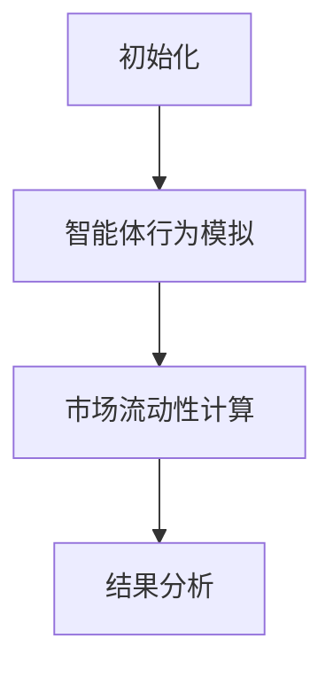
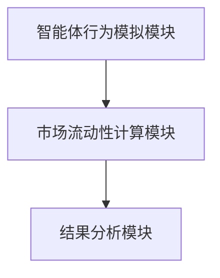
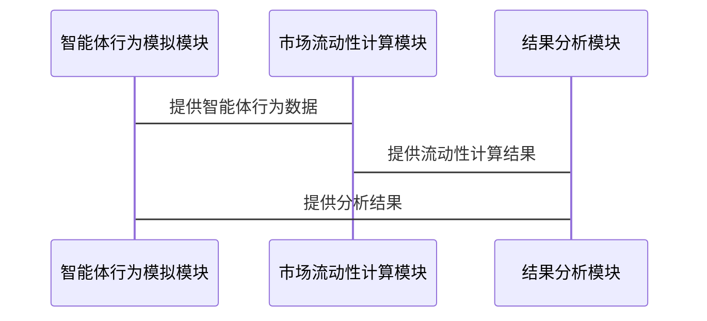

                 


# 智能体群体在模拟市场流动性枯竭中的应用

> 关键词：智能体群体，市场流动性，流动性枯竭，群体行为，算法模拟，系统架构

> 摘要：本文深入探讨了智能体群体在模拟市场流动性枯竭中的应用。通过分析智能体群体的核心概念、算法原理、系统架构以及实际案例，本文揭示了智能体群体在模拟市场流动性枯竭中的重要性，并展示了如何通过智能体群体的协同行为来理解和预测市场流动性枯竭的现象。文章结构清晰，内容详实，为相关领域的研究和实践提供了有价值的参考。

---

## 第一部分: 智能体群体与市场流动性概述

### 第1章: 智能体群体与市场流动性概述

#### 1.1 智能体群体的基本概念

##### 1.1.1 智能体的定义与特征

智能体（Agent）是指在计算机科学和人工智能领域中，能够感知环境并采取行动以实现目标的实体。智能体具有以下特征：

1. **自主性**：智能体能够在没有外部干预的情况下自主决策。
2. **反应性**：智能体能够根据环境的变化实时调整其行为。
3. **目标导向性**：智能体的行为旨在实现特定目标。
4. **社交能力**：智能体能够与其他智能体或环境进行交互。

##### 1.1.2 智能体群体的形成机制

智能体群体是指多个智能体协同工作所形成的集合。智能体群体的形成机制包括：

1. **协同决策**：智能体通过协同决策形成群体行为。
2. **信息共享**：智能体之间通过信息共享实现协同。
3. **自组织性**：智能体群体能够自组织，无需中央控制。

##### 1.1.3 市场流动性与智能体群体的关系

市场流动性是指市场中资产能够迅速以合理价格买卖的能力。智能体群体在市场中的行为直接影响市场流动性，例如：

- 智能体的交易行为可能导致市场流动性增加或减少。
- 智能体的协同行为可能导致市场流动性波动。

#### 1.2 市场流动性枯竭的定义与特征

##### 1.2.1 市场流动性的基本概念

市场流动性是衡量市场交易活跃程度的重要指标。高流动性意味着市场交易活跃，价格稳定；低流动性则意味着交易不活跃，价格波动大。

##### 1.2.2 流动性枯竭的定义与表现

流动性枯竭是指市场中买卖双方的交易意愿严重不足，导致市场交易量大幅下降，价格剧烈波动。其表现包括：

1. **交易量骤减**：市场交易量急剧下降。
2. **价格剧烈波动**：资产价格出现大幅波动。
3. **买卖价差扩大**：买卖价差显著增加，市场深度不足。

##### 1.2.3 流动性枯竭对市场的影响

流动性枯竭对市场的影响是多方面的，包括：

1. **市场稳定性下降**：流动性枯竭可能导致市场稳定性下降，增加市场波动风险。
2. **交易成本增加**：流动性不足会增加交易成本。
3. **市场功能失常**：流动性枯竭可能导致市场功能失常，影响资源配置效率。

#### 1.3 智能体群体在模拟市场流动性枯竭中的作用

##### 1.3.1 智能体群体模拟的必要性

智能体群体模拟市场流动性枯竭的必要性主要体现在以下几个方面：

1. **复杂市场行为的简化**：通过智能体群体模拟，可以简化复杂的市场行为，便于研究和分析。
2. **预测市场风险**：智能体群体模拟有助于预测市场流动性枯竭的风险，从而提前采取应对措施。
3. **验证市场假设**：通过模拟，可以验证市场假设，评估政策干预的效果。

##### 1.3.2 智能体群体在市场流动性模拟中的优势

智能体群体在市场流动性模拟中的优势包括：

1. **高灵活性**：智能体群体可以根据市场变化实时调整行为。
2. **高可定制性**：智能体群体可以根据具体需求进行定制化设计。
3. **高仿真度**：智能体群体模拟可以高度仿真实际市场行为。

##### 1.3.3 智能体群体模拟的边界与外延

智能体群体模拟的边界包括：

1. **模拟范围**：智能体群体模拟的范围需要明确，不能无限扩展。
2. **模拟精度**：模拟精度需要与实际需求相匹配，避免过度复杂化。
3. **模拟场景**：模拟场景需要基于实际情况，避免脱离现实。

#### 1.4 本章小结

本章主要介绍了智能体群体的基本概念、市场流动性枯竭的定义与特征，以及智能体群体在模拟市场流动性枯竭中的作用。通过本章的分析，我们明确了智能体群体在市场流动性模拟中的重要性，为后续章节的分析奠定了基础。

---

## 第二部分: 智能体群体的核心概念与联系

### 第2章: 智能体群体的核心概念与联系

#### 2.1 智能体群体的核心概念

##### 2.1.1 智能体的行为特征

智能体的行为特征包括：

1. **主动性**：智能体主动采取行动以实现目标。
2. **反应性**：智能体能够根据环境变化调整行为。
3. **协作性**：智能体能够与其他智能体协作完成任务。

##### 2.1.2 智能体之间的交互机制

智能体之间的交互机制包括：

1. **信息共享**：智能体之间可以通过共享信息实现协作。
2. **任务分配**：智能体之间可以通过任务分配实现协作。
3. **决策协调**：智能体之间可以通过协调决策实现协作。

##### 2.1.3 智能体群体的组织结构

智能体群体的组织结构包括：

1. **层级结构**：智能体群体可以分为不同的层级，每个层级负责不同的任务。
2. **网络结构**：智能体群体可以形成网络结构，智能体之间通过网络进行交互。
3. **分布式结构**：智能体群体可以采用分布式结构，每个智能体独立运作，但通过局部交互实现全局目标。

#### 2.2 市场流动性与智能体群体的关系

##### 2.2.1 市场流动性对智能体行为的影响

市场流动性对智能体行为的影响包括：

1. **交易成本**：流动性不足会增加交易成本，影响智能体的交易决策。
2. **价格波动**：价格波动会影响智能体的交易行为。
3. **市场深度**：市场深度影响智能体的交易策略。

##### 2.2.2 智能体行为对市场流动性的影响

智能体行为对市场流动性的影响包括：

1. **交易量**：智能体的交易行为直接影响市场交易量。
2. **价格波动**：智能体的交易行为影响市场价格波动。
3. **市场深度**：智能体的交易行为影响市场深度。

##### 2.2.3 市场流动性与智能体群体的动态平衡

市场流动性与智能体群体之间存在动态平衡关系。智能体群体的行为影响市场流动性，而市场流动性又反过来影响智能体群体的行为。这种动态平衡关系是市场稳定运行的重要基础。

#### 2.3 智能体群体的核心要素对比分析

##### 2.3.1 智能体与传统经济主体的对比

智能体与传统经济主体的对比：

| 对比维度       | 智能体                   | 传统经济主体           |
|----------------|--------------------------|------------------------|
| 行为特征       | 自主性、反应性、协作性   | 被动性、依赖性         |
| 决策方式       | 基于算法的决策           | 基于人类决策           |
| 适应性         | 高度适应性               | 较低适应性             |

##### 2.3.2 智能体群体与传统市场的对比

智能体群体与传统市场的对比：

| 对比维度       | 智能体群体               | 传统市场               |
|----------------|--------------------------|------------------------|
| 参与主体       | 多个智能体               | 多个市场参与者         |
| 交易机制       | 基于算法的交易           | 基于人类决策的交易     |
| 交易效率       | 高效率                   | 较低效率               |

##### 2.3.3 智能体群体的核心属性特征对比表格

智能体群体的核心属性特征对比：

| 属性           | 特征                       |
|----------------|----------------------------|
| 自主性         | 智能体能够自主决策         |
| 反应性         | 智能体能够根据环境变化调整行为 |
| 协作性         | 智能体能够通过协作实现目标   |

#### 2.4 智能体群体的ER实体关系图

智能体群体的ER实体关系图：

```mermaid
erDiagram
    class 智能体 {
        id
        行为特征
        决策规则
    }
    class 市场流动性 {
        id
        流动性指标
        价格波动
    }
    class 交互机制 {
        id
        信息共享
        任务分配
    }
    智能体 --> 交互机制 : 参与
    市场流动性 --> 交互机制 : 受影响
```

#### 2.5 本章小结

本章主要介绍了智能体群体的核心概念、市场流动性与智能体群体的关系，以及智能体群体的核心要素对比分析。通过本章的分析，我们明确了智能体群体在市场流动性模拟中的核心作用，为后续章节的分析提供了理论基础。

---

## 第三部分: 智能体群体模拟市场流动性枯竭的算法原理

### 第3章: 智能体群体模拟市场流动性枯竭的算法原理

#### 3.1 智能体决策模型

##### 3.1.1 智能体的决策规则

智能体的决策规则包括：

1. **价格感知**：智能体根据当前市场价格决定是否进行交易。
2. **风险评估**：智能体根据市场风险评估决定交易策略。
3. **收益最大化**：智能体根据收益最大化原则进行决策。

##### 3.1.2 智能体的决策算法

智能体的决策算法可以采用基于规则的算法或基于模型的算法。例如，基于规则的算法如下：

```python
def decide_action(price, trend):
    if price > threshold:
        return 'sell'
    elif trend == 'down':
        return 'hold'
    else:
        return 'buy'
```

##### 3.1.3 智能体决策的数学模型

智能体决策的数学模型可以表示为：

$$
\text{Action} = f(\text{Price}, \text{Trend})
$$

其中，`f` 是决策函数，`Price` 是当前价格，`Trend` 是价格趋势。

#### 3.2 智能体群体行为建模

##### 3.2.1 群体行为的建模方法

群体行为的建模方法包括：

1. **基于个体的建模**：从个体行为出发，推导群体行为。
2. **基于群体的建模**：从群体行为出发，分析个体行为。

##### 3.2.2 群体行为的动态演化

群体行为的动态演化可以通过以下步骤实现：

1. **初始化**：设置初始状态。
2. **迭代演化**：根据个体行为更新群体行为。
3. **终止条件**：当达到终止条件时，停止演化。

##### 3.2.3 群体行为的数学表达

群体行为的数学表达可以表示为：

$$
B = \sum_{i=1}^{n} b_i
$$

其中，`B` 是群体行为，`b_i` 是个体行为，`n` 是个体数量。

#### 3.3 市场流动性模拟算法

##### 3.3.1 流动性模拟的算法步骤

流动性模拟的算法步骤如下：

1. **初始化**：设置初始参数，包括市场参与者、初始价格、交易量等。
2. **智能体行为模拟**：根据智能体的决策规则，模拟智能体的交易行为。
3. **市场流动性计算**：根据交易行为计算市场流动性指标。
4. **结果分析**：分析市场流动性模拟的结果，评估智能体群体的行为对市场流动性的影响。

##### 3.3.2 流动性模拟的数学公式

流动性模拟的数学公式可以表示为：

$$
L = \frac{\text{交易量}}{\text{价格波动}}
$$

其中，`L` 是市场流动性，`交易量` 是市场交易量，`价格波动` 是价格波动幅度。

##### 3.3.3 流动性模拟的mermaid流程图

流动性模拟的mermaid流程图如下：



#### 3.4 本章小结

本章主要介绍了智能体群体模拟市场流动性枯竭的算法原理，包括智能体决策模型、群体行为建模和市场流动性模拟算法。通过本章的分析，我们明确了智能体群体在市场流动性模拟中的算法基础，为后续章节的分析提供了技术支持。

---

## 第四部分: 智能体群体模拟市场流动性枯竭的系统架构

### 第4章: 智能体群体模拟市场流动性枯竭的系统架构

#### 4.1 系统功能设计

##### 4.1.1 系统功能模块划分

系统功能模块划分包括：

1. **智能体行为模拟模块**：模拟智能体的交易行为。
2. **市场流动性计算模块**：计算市场流动性指标。
3. **结果分析模块**：分析市场流动性模拟的结果。

##### 4.1.2 系统功能的实现方式

系统功能的实现方式包括：

1. **智能体行为模拟模块**：通过编写智能体行为算法实现。
2. **市场流动性计算模块**：通过编写流动性计算算法实现。
3. **结果分析模块**：通过编写数据分析算法实现。

##### 4.1.3 系统功能的实现流程

系统功能的实现流程如下：

1. **初始化参数**：设置初始参数，包括市场参与者、初始价格、交易量等。
2. **智能体行为模拟**：根据智能体的决策规则，模拟智能体的交易行为。
3. **市场流动性计算**：根据交易行为计算市场流动性指标。
4. **结果分析**：分析市场流动性模拟的结果，评估智能体群体的行为对市场流动性的影响。

#### 4.2 系统架构设计

##### 4.2.1 系统架构的总体设计

系统架构的总体设计包括：

1. **智能体行为模拟模块**：模拟智能体的交易行为。
2. **市场流动性计算模块**：计算市场流动性指标。
3. **结果分析模块**：分析市场流动性模拟的结果。

##### 4.2.2 系统架构的详细设计

系统架构的详细设计包括：

1. **智能体行为模拟模块**：通过编写智能体行为算法实现。
2. **市场流动性计算模块**：通过编写流动性计算算法实现。
3. **结果分析模块**：通过编写数据分析算法实现。

##### 4.2.3 系统架构的mermaid架构图

系统架构的mermaid架构图如下：



#### 4.3 系统接口设计

##### 4.3.1 系统接口的定义

系统接口的定义包括：

1. **智能体行为模拟接口**：定义智能体行为模拟的接口。
2. **市场流动性计算接口**：定义市场流动性计算的接口。
3. **结果分析接口**：定义结果分析的接口。

##### 4.3.2 系统接口的实现

系统接口的实现包括：

1. **智能体行为模拟接口**：通过编写智能体行为算法实现。
2. **市场流动性计算接口**：通过编写流动性计算算法实现。
3. **结果分析接口**：通过编写数据分析算法实现。

##### 4.3.3 系统交互的mermaid序列图

系统交互的mermaid序列图如下：



#### 4.4 本章小结

本章主要介绍了智能体群体模拟市场流动性枯竭的系统架构设计，包括系统功能设计、系统架构设计和系统接口设计。通过本章的分析，我们明确了智能体群体在市场流动性模拟中的系统实现基础，为后续章节的分析提供了技术支持。

---

## 第五部分: 智能体群体模拟市场流动性枯竭的项目实战

### 第5章: 智能体群体模拟市场流动性枯竭的项目实战

#### 5.1 项目介绍

##### 5.1.1 项目背景

本项目旨在通过智能体群体模拟市场流动性枯竭，研究智能体群体在市场流动性模拟中的应用。

##### 5.1.2 项目目标

本项目的

