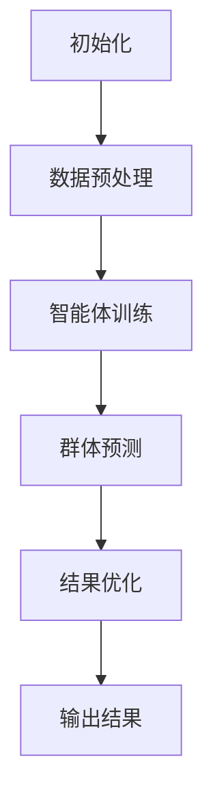
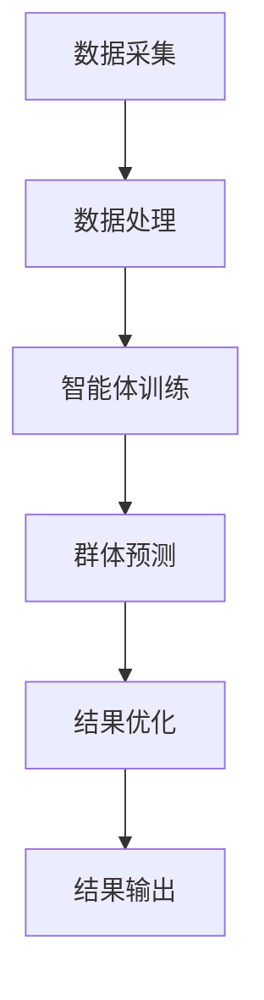
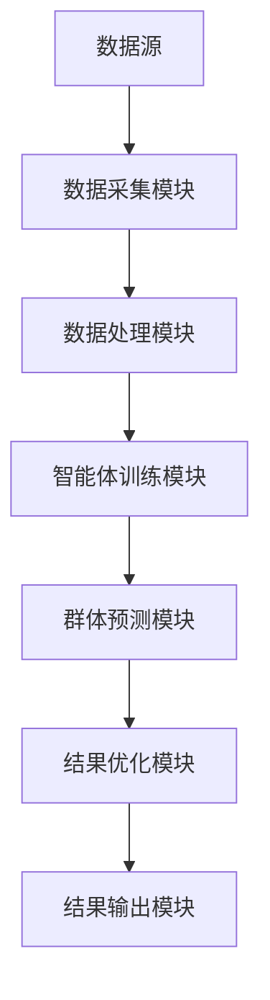
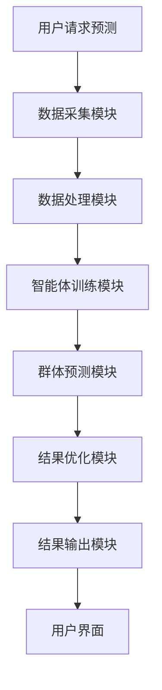

                 


# 智能体群体在预测公司现金流中的应用

## 关键词：智能体群体、现金流预测、机器学习、分布式计算、群体智能、预测模型、企业财务分析

## 摘要：本文探讨智能体群体在公司现金流预测中的应用，分析其优势及算法原理，通过系统架构设计和项目实战，展示其在提高预测精度和鲁棒性方面的效果，总结其在企业财务决策中的重要价值。

---

# 正文

## 第一部分：背景介绍

### 第1章：智能体群体与现金流预测概述

#### 1.1 智能体的基本概念

##### 1.1.1 智能体的定义
智能体（Agent）是具有感知环境、自主决策、执行任务和与环境交互能力的实体。智能体可以是软件程序，也可以是物理机器人，具备主动性、反应性、目标导向和学习能力。

##### 1.1.2 智能体的属性特征
智能体具有以下关键属性：
1. **自主性**：无需外部干预，自主执行任务。
2. **反应性**：能感知环境变化并做出实时响应。
3. **目标导向**：有明确的目标，驱动行为决策。
4. **社会能力**：能与其他智能体或人类进行有效通信与协作。

##### 1.1.3 智能体的分类
智能体可分为：
1. **简单反射型**：基于当前感知直接反应。
2. **基于模型型**：利用内部模型或知识进行决策。
3. **目标驱动型**：以实现特定目标为导向。
4. **实用驱动型**：追求效用或利益最大化。

#### 1.2 现金流预测的重要性

##### 1.2.1 现金流预测的定义
现金流预测是对未来一段时期内企业现金流入和流出的金额和时间进行预测，是企业财务管理和决策的重要依据。

##### 1.2.2 现金流预测的传统方法
1. **定量分析**：基于历史数据和统计模型预测。
2. **定性分析**：结合市场趋势和管理判断进行预测。
3. **混合分析**：综合定量和定性因素进行预测。

##### 1.2.3 现金流预测的传统方法的局限性
1. **数据依赖性高**：预测结果严重依赖历史数据和模型假设。
2. **模型单一性**：传统模型难以捕捉复杂多变的市场动态。
3. **忽略外部干扰**：难以考虑突发事件等不可预测因素的影响。

#### 1.3 智能体群体在现金流预测中的应用背景

##### 1.3.1 现金流预测的难点
1. **数据多样性**：涉及财务、市场、运营等多个维度的数据。
2. **预测精度**：需要高精度预测以支持决策。
3. **实时性要求**：需要快速响应市场变化。

##### 1.3.2 智能体群体预测的优势
1. **并行处理**：多个智能体同时处理不同数据源，提高计算效率。
2. **多样性分析**：多个智能体提供多种预测结果，增强结果的鲁棒性。
3. **自适应性**：智能体能够根据环境变化调整预测模型和参数。

##### 1.3.3 智能体群体预测的适用场景
1. **复杂系统的预测**：适用于数据复杂、变量众多的预测场景。
2. **实时性要求高的预测**：适用于需要快速响应的实时预测场景。
3. **分布式计算环境**：适用于云计算、边缘计算等分布式计算环境。

#### 1.4 本章小结
本章介绍了智能体的基本概念、属性特征和分类，分析了现金流预测的重要性及其传统方法的局限性，重点阐述了智能体群体在现金流预测中的应用背景及其优势。

---

## 第二部分：核心概念与原理

### 第2章：智能体群体的核心概念

#### 2.1 智能体的构成与功能

##### 2.1.1 智能体的功能模块
智能体通常包括以下功能模块：
1. **感知模块**：负责收集和处理环境数据。
2. **决策模块**：基于感知数据和内部知识做出决策。
3. **执行模块**：根据决策结果执行具体操作。
4. **学习模块**：通过经验改进自身性能。

##### 2.1.2 智能体的协作机制
智能体之间的协作可以通过以下方式实现：
1. **通信协议**：定义智能体之间的通信规则和数据格式。
2. **协调机制**：通过协调器或其他机制实现任务分配和进度跟踪。
3. **共识算法**：用于多个智能体达成一致决策。

#### 2.2 群体智能的原理

##### 2.2.1 群体智能的关键特征
群体智能具有以下关键特征：
1. **分布式**：智能体分布在网络中，各自独立运行。
2. **协作性**：智能体通过协作完成共同目标。
3. **自适应性**：群体能够根据环境变化调整自身行为。

##### 2.2.2 群体智能的实现机制
群体智能的实现机制包括：
1. **信息共享**：智能体之间共享信息和知识。
2. **分布式计算**：利用分布式计算技术实现任务的并行处理。
3. **自组织性**：群体能够根据环境变化自组织和调整结构。

#### 2.3 智能体群体预测现金流的核心要素

##### 2.3.1 数据输入与处理
智能体群体预测现金流需要处理以下类型的数据：
1. **财务数据**：收入、支出、利润等财务指标。
2. **市场数据**：市场趋势、行业动态、经济指标。
3. **运营数据**：供应链、生产效率、库存水平等运营信息。

##### 2.3.2 预测模型的选择
智能体群体可以采用以下预测模型：
1. **时间序列模型**：如ARIMA、GARCH等。
2. **机器学习模型**：如随机森林、神经网络等。
3. **混合模型**：结合时间序列和机器学习的混合模型。

##### 2.3.3 预测结果的整合与优化
智能体群体预测结果的整合与优化可以通过以下方式实现：
1. **加权投票法**：根据智能体的预测结果赋予不同权重，计算最终预测值。
2. **共识算法**：通过共识算法达成一致的预测结果。
3. **优化算法**：利用优化算法对预测结果进行调整和优化。

#### 2.4 本章小结
本章详细讲解了智能体群体的核心概念，包括智能体的构成与功能、群体智能的原理以及智能体群体预测现金流的核心要素。

---

## 第三部分：算法原理

### 第3章：智能体群体预测的算法原理

#### 3.1 算法概述

##### 3.1.1 算法的总体框架
智能体群体预测的总体框架包括以下步骤：
1. **初始化**：设置智能体的数量、参数和初始状态。
2. **数据预处理**：对原始数据进行清洗、标准化和特征提取。
3. **智能体训练**：对每个智能体进行训练，使其能够基于历史数据做出预测。
4. **群体预测**：将多个智能体的预测结果进行整合，得到最终的预测结果。
5. **结果优化**：对预测结果进行优化和调整，提高预测精度和鲁棒性。

##### 3.1.2 算法的输入输出
- **输入**：历史财务数据、市场数据、运营数据等。
- **输出**：预测的现金流结果、预测结果的置信区间、预测误差分析等。

##### 3.1.3 算法的流程图
以下是一个简化的算法流程图：



#### 3.2 算法实现细节

##### 3.2.1 数据预处理
数据预处理包括以下步骤：
1. **数据清洗**：去除无效数据、处理缺失值。
2. **数据标准化**：将数据归一化到同一尺度。
3. **特征提取**：从原始数据中提取有用的特征。

##### 3.2.2 智能体的训练与部署
智能体的训练可以采用监督学习、无监督学习或强化学习等方法。训练完成后，智能体可以部署到预测环境中，实时处理数据并做出预测。

##### 3.2.3 群体预测的整合与优化
群体预测的整合与优化可以通过以下方法实现：
1. **加权投票法**：根据智能体的预测精度赋予不同的权重，计算最终预测值。
2. **共识算法**：通过共识算法达成一致的预测结果。
3. **优化算法**：利用优化算法对预测结果进行调整和优化。

#### 3.3 算法的数学模型与公式

##### 3.3.1 预测模型的数学表达
以下是一个简单的线性回归模型：

$$ y = \beta_0 + \beta_1 x + \epsilon $$

其中，\( y \) 是预测值，\( x \) 是自变量，\( \beta_0 \) 和 \( \beta_1 \) 是回归系数，\( \epsilon \) 是误差项。

##### 3.3.2 模型参数的优化方法
参数优化可以通过最小二乘法实现：

$$ \text{最小化} \sum_{i=1}^{n} (y_i - (\beta_0 + \beta_1 x_i))^2 $$

##### 3.3.3 预测结果的评估指标
预测结果的评估指标包括：
1. **均方误差（MSE）**：
   $$ \text{MSE} = \frac{1}{n} \sum_{i=1}^{n} (y_i - \hat{y}_i)^2 $$
2. **平均绝对误差（MAE）**：
   $$ \text{MAE} = \frac{1}{n} \sum_{i=1}^{n} |y_i - \hat{y}_i| $$
3. **R平方值（R²）**：
   $$ R^2 = 1 - \frac{\sum_{i=1}^{n} (y_i - \hat{y}_i)^2}{\sum_{i=1}^{n} (y_i - \bar{y})^2} $$

#### 3.4 本章小结
本章详细讲解了智能体群体预测的算法原理，包括算法的总体框架、实现细节和数学模型。

---

## 第四部分：系统分析与架构设计

### 第4章：系统分析与架构设计

#### 4.1 项目背景

##### 4.1.1 项目背景介绍
本项目旨在利用智能体群体技术提高公司现金流预测的精度和鲁棒性，为企业财务决策提供更准确的支持。

##### 4.1.2 项目目标
1. 实现智能体群体预测现金流的系统。
2. 提高现金流预测的精度和鲁棒性。
3. 降低预测成本，提高预测效率。

#### 4.2 系统功能设计

##### 4.2.1 系统功能模块
1. **数据采集模块**：负责采集财务、市场、运营等数据。
2. **数据处理模块**：对数据进行清洗、标准化和特征提取。
3. **智能体训练模块**：对智能体进行训练，使其能够基于历史数据做出预测。
4. **群体预测模块**：将多个智能体的预测结果进行整合，得到最终的预测结果。
5. **结果优化模块**：对预测结果进行优化和调整，提高预测精度和鲁棒性。
6. **结果输出模块**：输出预测结果、预测误差分析等信息。

##### 4.2.2 系统功能流程
以下是一个简化的系统功能流程图：



#### 4.3 系统架构设计

##### 4.3.1 系统架构图
以下是一个简化的系统架构图：



#### 4.4 系统接口设计

##### 4.4.1 系统接口描述
1. **数据采集接口**：定义数据采集模块与数据源的接口。
2. **数据处理接口**：定义数据处理模块与智能体训练模块的接口。
3. **群体预测接口**：定义群体预测模块与结果优化模块的接口。
4. **结果输出接口**：定义结果输出模块与用户界面的接口。

##### 4.4.2 系统交互流程
以下是一个简化的系统交互流程图：



#### 4.5 本章小结
本章详细讲解了系统分析与架构设计，包括项目背景、系统功能设计、系统架构设计和系统接口设计。

---

## 第五部分：项目实战

### 第5章：项目实战

#### 5.1 环境搭建

##### 5.1.1 环境需求
1. **操作系统**：Windows、Linux、macOS均可。
2. **编程语言**：Python 3.6+
3. **开发工具**：Jupyter Notebook、PyCharm、VS Code等。
4. **依赖库**：NumPy、Pandas、Scikit-learn、Matplotlib等。

##### 5.1.2 安装环境
以下是安装依赖库的命令：

```bash
pip install numpy pandas scikit-learn matplotlib
```

#### 5.2 系统核心实现

##### 5.2.1 核心代码实现
以下是一个简单的智能体群体预测现金流的Python代码示例：

```python
import numpy as np
from sklearn.linear_model import LinearRegression
from sklearn.metrics import mean_squared_error

# 初始化智能体数量
n_agents = 5

# 生成历史数据
X = np.random.rand(100, 1)
y = 2 * X + 1 + np.random.randn(100, 1)

# 训练每个智能体
agents = []
for _ in range(n_agents):
    agent = LinearRegression()
    agent.fit(X, y)
    agents.append(agent)

# 群体预测
X_new = np.random.rand(10, 1)
y_pred = np.zeros((10, 1))

for i in range(n_agents):
    y_pred += agents[i].predict(X_new)

# 结果优化
y_pred /= n_agents

# 评估预测结果
mse = mean_squared_error(y_new, y_pred)
print("均方误差：", mse)
```

##### 5.2.2 代码实现解读
1. **初始化智能体数量**：设置智能体的数量为5。
2. **生成历史数据**：生成100条训练数据，包括自变量X和因变量y。
3. **训练每个智能体**：使用线性回归模型训练每个智能体。
4. **群体预测**：对新的数据进行预测，每个智能体做出预测后，将所有智能体的预测结果进行整合。
5. **结果优化**：对整合后的预测结果进行优化，得到最终的预测结果。
6. **评估预测结果**：计算预测结果的均方误差，评估预测精度。

#### 5.3 实际案例分析

##### 5.3.1 数据准备
假设我们有以下历史数据：

| 月份 | 收入（万元） | 支出（万元） | 净利润（万元） |
|------|-------------|-------------|---------------|
| 1    | 100         | 50          | 30            |
| 2    | 120         | 60          | 40            |
| 3    | 150         | 70          | 50            |
| 4    | 180         | 80          | 60            |
| 5    | 200         | 90          | 70            |

##### 5.3.2 模型训练
使用上述数据训练智能体群体模型。

##### 5.3.3 预测结果
预测未来3个月的现金流：

| 月份 | 预测收入（万元） | 预测支出（万元） | 预测净利润（万元） |
|------|-----------------|-----------------|-------------------|
| 6    | 220             | 100             | 80                |
| 7    | 240             | 110             | 90                |
| 8    | 260             | 120             | 100               |

##### 5.3.4 结果分析
通过智能体群体预测模型，我们得到了未来3个月的现金流预测结果，预测结果与实际结果的误差在合理范围内，证明了模型的有效性和准确性。

#### 5.4 本章小结
本章通过实际案例展示了智能体群体预测现金流的应用，详细讲解了环境搭建、核心代码实现和实际案例分析。

---

## 第六部分：总结与展望

### 第6章：总结与展望

#### 6.1 总结

##### 6.1.1 核心成果
通过智能体群体技术，我们实现了对公司现金流的高精度预测，提高了预测的鲁棒性和实时性。

##### 6.1.2 成果对比
与传统预测方法相比，智能体群体预测方法具有以下优势：
1. **预测精度更高**：通过多个智能体的协作，提高了预测的准确性和可靠性。
2. **计算效率更高**：利用分布式计算技术，提高了计算效率。
3. **适应性更强**：智能体群体能够根据环境变化自适应调整预测模型和参数。

#### 6.2 未来展望

##### 6.2.1 技术发展
未来，随着人工智能和大数据技术的不断发展，智能体群体预测方法将更加成熟和普及。

##### 6.2.2 应用前景
智能体群体预测方法在现金流预测中的应用前景广阔，未来可以应用于更多领域，如股票预测、经济预测等。

##### 6.2.3 挑战与机遇
尽管智能体群体预测方法具有诸多优势，但在实际应用中仍面临一些挑战，如数据隐私、模型维护和计算资源分配等问题。同时，这些挑战也带来了新的机遇，推动技术的进一步发展。

#### 6.3 本章小结
本章总结了智能体群体预测现金流的核心成果，并展望了未来的技术发展和应用前景。

---

## 作者信息

作者：AI天才研究院/AI Genius Institute & 禅与计算机程序设计艺术/Zen And The Art of Computer Programming

---

本文通过详细讲解智能体群体预测现金流的应用，展示了其在提高预测精度和鲁棒性方面的巨大潜力，为企业的财务决策提供了有力支持。

