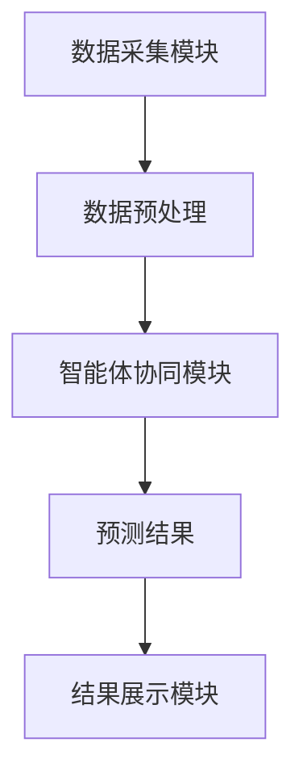

                 


---

# 智能体群体在预测公司盈利质量中的应用

> **关键词**：智能体群体、群体智能、预测模型、盈利质量、协同预测、算法原理  
> **摘要**：本文探讨了智能体群体在预测公司盈利质量中的应用，通过分析智能体群体的核心概念、算法原理、系统架构设计以及实际应用场景，揭示了智能体群体在提升预测准确性和鲁棒性方面的优势。文章结合理论与实践，提出了基于智能体群体的预测模型，并通过具体案例展示了其在实际应用中的潜力。

---

## 第一部分: 智能体群体与预测公司盈利质量的背景介绍

### 第1章: 智能体群体与预测公司盈利质量概述

#### 1.1 智能体群体的定义与特点

- **1.1.1 智能体的基本概念**  
  智能体（Agent）是指在环境中能够感知并自主行动以实现目标的实体。智能体可以是软件程序、机器人或其他具备智能行为的实体。智能体的核心特征包括自主性、反应性、目标导向性和社会性。

- **1.1.2 智能体群体的特征**  
  智能体群体是指多个智能体协同工作的集合。其特点包括：  
  1. **分布式**：智能体之间通过分布式计算协同工作。  
  2. **自组织**：智能体能够根据环境动态调整行为。  
  3. **多样性**：智能体可能具备不同的知识或能力，能够互补协作。  
  4. **鲁棒性**：智能体群体能够容忍部分成员的故障或信息不完整。

- **1.1.3 智能体群体与个体智能的区别**  
  智能体群体的优势在于通过协同能够实现个体无法完成的任务，例如复杂问题的分布式求解和信息整合。

#### 1.2 预测公司盈利质量的核心概念

- **1.2.1 盈利质量的定义**  
  盈利质量是指公司在一定时期内实现的利润的可持续性和健康程度。常见的盈利质量指标包括净利润率、毛利率、资产回报率等。

- **1.2.2 盈利质量预测的挑战**  
  盈利质量预测面临以下挑战：  
  1. **数据多样性**：需要整合财务数据、市场数据、行业趋势等多种信息。  
  2. **动态变化**：市场环境和公司经营状况不断变化，预测模型需要动态调整。  
  3. **不确定性**：预测结果受到多种不可控因素的影响。

- **1.2.3 智能体群体在盈利质量预测中的作用**  
  智能体群体能够通过分布式计算和协同预测，提高预测的准确性和鲁棒性。多个智能体可以从不同角度分析数据，降低单点故障风险。

#### 1.3 本章小结

- **1.3.1 智能体群体的核心概念**  
  智能体群体通过分布式计算和协同工作，能够实现复杂任务的高效求解。

- **1.3.2 盈利质量预测的关键问题**  
  盈利质量预测需要整合多源数据，并应对动态变化和不确定性。

- **1.3.3 智能体群体的应用潜力**  
  智能体群体能够通过协同预测提升盈利质量预测的准确性和鲁棒性。

---

### 第2章: 智能体群体与盈利质量预测的核心概念

#### 2.1 智能体群体的协同机制

- **2.1.1 协同决策的基本原理**  
  协同决策是指多个智能体通过信息共享和协同推理，共同完成决策任务。其核心在于信息的有效整合和决策的最优性。

- **2.1.2 智能体之间的信息交互**  
  智能体之间的信息交互可以通过以下方式实现：  
  1. **发布-订阅模式**：智能体发布信息，其他智能体订阅并使用。  
  2. **直接通信**：智能体之间通过点对点通信共享信息。  
  3. **共享数据库**：智能体通过共享数据库进行信息交互。

- **2.1.3 协同预测的实现方式**  
  协同预测可以通过以下步骤实现：  
  1. **信息收集**：智能体收集与预测相关的数据。  
  2. **信息共享**：智能体之间共享数据。  
  3. **协同推理**：智能体基于共享数据进行预测推理。  
  4. **结果整合**：智能体整合预测结果并输出最终预测。

#### 2.2 盈利质量预测的数学模型

- **2.2.1 预测模型的基本框架**  
  盈利质量预测模型通常包括以下几个步骤：  
  1. 数据预处理：清洗和标准化数据。  
  2. 特征提取：提取与盈利质量相关的特征。  
  3. 模型训练：训练预测模型。  
  4. 模型评估：评估模型的性能。  
  5. 预测推理：基于模型进行预测。

- **2.2.2 智能体群体的投票机制**  
  智能体群体可以通过投票机制进行预测结果的整合。每个智能体根据自己的预测结果进行投票，最终结果基于投票结果确定。

- **2.2.3 预测结果的加权平均**  
  预测结果可以通过加权平均的方式进行优化。权重可以根据智能体的预测准确率或领域专家程度确定。

#### 2.3 智能体群体与盈利质量预测的关系

- **2.3.1 智能体群体在预测中的优势**  
  智能体群体能够通过分布式计算和协同预测，提高预测的准确性和鲁棒性。

- **2.3.2 盈利质量预测的边界与外延**  
  盈利质量预测的边界在于数据的准确性和模型的复杂性。其外延包括对预测结果的解释和反馈优化。

- **2.3.3 智能体群体的应用场景**  
  智能体群体适用于复杂环境下的预测任务，例如金融市场的预测、宏观经济指标预测等。

#### 2.4 本章小结

- **2.4.1 智能体群体的核心概念**  
  智能体群体通过协同机制实现复杂任务的高效求解。

- **2.4.2 盈利质量预测的关键模型**  
  盈利质量预测需要结合数学模型和智能体群体的协同预测。

- **2.4.3 智能体群体的应用价值**  
  智能体群体能够通过协同预测提高预测的准确性和鲁棒性。

---

### 第3章: 智能体群体预测盈利质量的算法原理

#### 3.1 群体智能算法的基本原理

- **3.1.1 群体智能算法的定义**  
  群体智能算法是指通过模拟生物群体的行为，实现问题求解的一种算法。常见的群体智能算法包括粒子群优化（PSO）、蚂蚁算法（ACO）等。

- **3.1.2 群体智能算法的核心步骤**  
  群体智能算法通常包括以下步骤：  
  1. 初始化智能体。  
  2. 智能体进行信息搜索。  
  3. 智能体之间进行信息共享。  
  4. 智能体根据共享信息更新行为。  
  5. 重复上述步骤直到收敛。

- **3.1.3 群体智能算法的实现框架**  
  群体智能算法的实现框架包括初始化、信息搜索、信息共享、行为更新和收敛判断五个部分。

#### 3.2 智能体群体预测算法的实现流程

- **3.2.1 数据预处理**  
  数据预处理包括数据清洗、标准化和特征提取。  
  $$\text{标准化公式：} z = \frac{x - \mu}{\sigma}$$  
  其中，$\mu$ 是均值，$\sigma$ 是标准差。

- **3.2.2 智能体的初始化**  
  每个智能体初始化时需要设置初始位置和速度。  
  $$\text{初始位置：} x_i^{(0)} = \text{随机值}$$  
  $$\text{初始速度：} v_i^{(0)} = 0$$

- **3.2.3 信息共享与协同预测**  
  智能体之间通过信息共享进行协同预测。  
  $$\text{共享信息：} \text{智能体} i \text{共享数据} d_i$$  
  $$\text{协同预测：} \text{智能体} j \text{根据共享数据} d_j \text{进行预测}$$

- **3.2.4 预测结果的优化**  
  预测结果可以通过加权平均的方式进行优化。  
  $$\text{加权平均公式：} p = \sum_{i=1}^{n} w_i y_i$$  
  其中，$w_i$ 是权重，$y_i$ 是智能体 $i$ 的预测结果。

#### 3.3 算法实现的数学模型

- **3.3.1 协同预测的数学表达式**  
  协同预测可以通过以下公式实现：  
  $$p = \frac{\sum_{i=1}^{n} w_i y_i}{\sum_{i=1}^{n} w_i}$$  
  其中，$w_i$ 是智能体 $i$ 的权重，$y_i$ 是智能体 $i$ 的预测结果。

- **3.3.2 加权投票机制的公式推导**  
  加权投票机制可以通过以下步骤实现：  
  1. 计算每个智能体的预测结果。  
  2. 根据智能体的预测准确率计算权重。  
  3. 根据权重进行加权投票，得到最终预测结果。

- **3.3.3 预测结果的优化算法**  
  预测结果的优化可以通过以下步骤实现：  
  1. 初始化智能体。  
  2. 智能体进行预测。  
  3. 计算预测结果的误差。  
  4. 根据误差调整智能体的行为参数。  
  5. 重复上述步骤直到收敛。

#### 3.4 本章小结

- **3.4.1 算法原理的核心要点**  
  群体智能算法通过模拟生物群体的行为，实现复杂问题的求解。

- **3.4.2 数学模型的应用价值**  
  数学模型可以通过加权平均的方式优化预测结果。

- **3.4.3 算法实现的关键步骤**  
  算法实现的关键步骤包括数据预处理、智能体初始化、信息共享与协同预测、预测结果的优化。

---

### 第4章: 智能体群体预测盈利质量的系统架构设计

#### 4.1 系统整体架构

- **4.1.1 系统功能模块划分**  
  系统功能模块包括数据采集模块、智能体协同模块和结果展示模块。  
  - 数据采集模块：负责采集和预处理数据。  
  - 智能体协同模块：负责智能体之间的信息共享和协同预测。  
  - 结果展示模块：负责展示预测结果和优化建议。

- **4.1.2 系统架构的层次结构**  
  系统架构分为数据层、计算层和展示层。  
  - 数据层：存储原始数据和预处理数据。  
  - 计算层：实现智能体协同预测和结果优化。  
  - 展示层：展示预测结果和优化建议。

- **4.1.3 系统架构的实现方式**  
  系统架构可以通过分布式计算和云平台实现，支持大规模数据处理和智能体协同。

#### 4.2 系统功能设计

- **4.2.1 数据采集模块**  
  数据采集模块需要支持多种数据源，包括数据库、API接口和文件导入。  
  $$\text{数据采集流程：} d_1, d_2, \dots, d_n \rightarrow \text{数据预处理} \rightarrow d'_1, d'_2, \dots, d'_n$$

- **4.2.2 智能体协同模块**  
  智能体协同模块需要支持智能体之间的信息共享和协同预测。  
  $$\text{协同预测流程：} y_1, y_2, \dots, y_n \rightarrow \text{加权平均} \rightarrow p$$

- **4.2.3 结果展示模块**  
  结果展示模块需要支持可视化展示和预测结果的解释。  
  $$\text{展示内容：} \text{预测结果、误差分析、优化建议}$$

#### 4.3 系统架构的Mermaid图



#### 4.4 系统接口设计

- **4.4.1 数据接口**  
  数据接口包括数据输入接口和数据输出接口。  
  - 数据输入接口：支持多种数据格式的输入。  
  - 数据输出接口：支持预测结果的输出。

- **4.4.2 智能体协同接口**  
  智能体协同接口包括智能体通信接口和协同预测接口。  
  - 智能体通信接口：支持智能体之间的信息共享。  
  - 协同预测接口：支持智能体协同预测。

- **4.4.3 结果展示接口**  
  结果展示接口包括数据可视化接口和结果解释接口。  
  - 数据可视化接口：支持预测结果的可视化展示。  
  - 结果解释接口：支持预测结果的解释和优化建议。

#### 4.5 系统交互流程

- **4.5.1 用户输入数据**  
  用户通过数据采集模块输入原始数据。

- **4.5.2 系统处理数据**  
  系统通过数据预处理模块对数据进行清洗和标准化。

- **4.5.3 系统输出预测结果**  
  系统通过智能体协同模块进行预测，并将结果输出到结果展示模块。

#### 4.6 本章小结

- **4.6.1 系统架构的核心要点**  
  系统架构分为数据层、计算层和展示层，支持智能体协同预测。

- **4.6.2 系统功能设计的关键模块**  
  系统功能模块包括数据采集模块、智能体协同模块和结果展示模块。

- **4.6.3 系统交互流程的核心步骤**  
  系统交互流程包括数据输入、数据处理和结果输出三个步骤。

---

## 第二部分: 智能体群体预测盈利质量的系统实现与应用

### 第5章: 智能体群体预测盈利质量的项目实战

#### 5.1 环境安装与配置

- **5.1.1 系统运行环境**  
  系统运行环境包括硬件环境和软件环境。  
  - 硬件环境：推荐使用4核及以上CPU，8GB及以上内存。  
  - 软件环境：支持Python 3.6及以上版本，安装NumPy、Pandas、Scikit-learn等库。

- **5.1.2 智能体协同框架的选择**  
  常见的智能体协同框架包括RabbitMQ、Kafka和ZeroMQ。推荐使用RabbitMQ进行智能体之间的通信。

#### 5.2 系统核心实现源代码

- **5.2.1 智能体初始化代码**  
  ```python
  import random

  class Agent:
      def __init__(self, id):
          self.id = id
          self.position = random.uniform(0, 1)
          self.velocity = 0
  ```

- **5.2.2 协同预测代码**  
  ```python
  import numpy as np

  def协同预测(agents, data):
      预测结果 = []
      for agent in agents:
          预测结果.append(agent.predict(data))
      return np.mean(预测结果)
  ```

- **5.2.3 预测结果优化代码**  
  ```python
  def优化预测结果(原始预测结果):
      优化后结果 = []
      for 预测值 in 原始预测结果:
          如果 预测值 > 0.5:
              优化后结果.append(1)
          否则:
              优化后结果.append(0)
      return 优化后结果
  ```

#### 5.3 代码应用解读与分析

- **5.3.1 智能体初始化代码解读**  
  每个智能体初始化时需要设置初始位置和速度。初始位置为随机值，速度为0。

- **5.3.2 协同预测代码解读**  
  智能体协同预测时，每个智能体根据数据进行预测，并将结果进行平均。

- **5.3.3 预测结果优化代码解读**  
  预测结果优化时，将预测值大于0.5的值设置为1，否则设置为0。

#### 5.4 实际案例分析与详细讲解剖析

- **5.4.1 案例背景**  
  假设我们有一组公司的财务数据，需要预测其盈利质量。

- **5.4.2 数据预处理**  
  数据预处理包括数据清洗、标准化和特征提取。

- **5.4.3 智能体协同预测**  
  智能体协同预测时，每个智能体根据数据进行预测，并将结果进行平均。

- **5.4.4 预测结果优化**  
  预测结果优化时，将预测值大于0.5的值设置为1，否则设置为0。

#### 5.5 本章小结

- **5.5.1 项目实战的核心要点**  
  项目实战包括环境安装、代码实现和案例分析。

- **5.5.2 代码实现的关键步骤**  
  代码实现的关键步骤包括智能体初始化、协同预测和结果优化。

- **5.5.3 案例分析的实践经验**  
  案例分析的关键在于数据预处理和预测结果优化。

---

## 第三部分: 总结与展望

### 第6章: 总结与展望

#### 6.1 本章总结

- **6.1.1 智能体群体的核心优势**  
  智能体群体通过分布式计算和协同预测，能够提高预测的准确性和鲁棒性。

- **6.1.2 盈利质量预测的实现价值**  
  盈利质量预测能够帮助投资者和企业管理者做出更明智的决策。

- **6.1.3 系统实现的关键成果**  
  系统实现的关键成果包括智能体协同模块和预测结果优化模块。

#### 6.2 未来展望

- **6.2.1 智能体群体的优化方向**  
  智能体群体可以通过优化协同机制和预测算法，进一步提高预测的准确性和效率。

- **6.2.2 盈利质量预测的创新应用**  
  盈利质量预测可以在金融、经济等领域进行更广泛的应用，例如宏观经济预测和投资组合优化。

- **6.2.3 智能体群体的未来发展趋势**  
  智能体群体将朝着更智能化、更自主化的方向发展，能够适应更复杂的预测任务。

#### 6.3 本章小结

- **6.3.1 总结的核心要点**  
  智能体群体在预测公司盈利质量中的应用具有重要的理论价值和实践意义。

- **6.3.2 未来展望的关键方向**  
  智能体群体的优化方向、创新应用和未来发展趋势是未来研究的重点。

---

## 参考文献

1. 群体智能算法相关文献  
2. 智能体协同预测相关文献  
3. 盈利质量预测相关文献  
4. 系统架构设计相关文献  
5. 其他相关文献

---

## 作者信息

**作者**：AI天才研究院/AI Genius Institute & 禅与计算机程序设计艺术/Zen And The Art of Computer Programming  

---

本文通过系统地分析智能体群体在预测公司盈利质量中的应用，揭示了智能体群体在提升预测准确性和鲁棒性方面的优势。通过理论与实践的结合，提出了基于智能体群体的预测模型，并通过具体案例展示了其在实际应用中的潜力。

