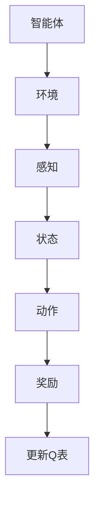
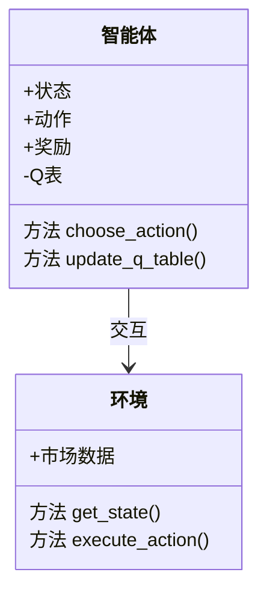
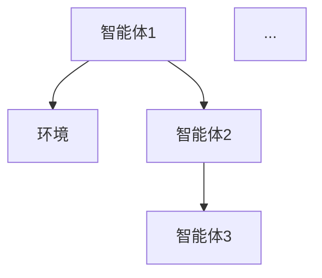
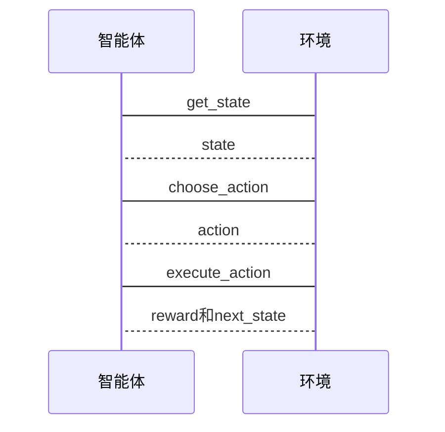

                 


# 智能体群体如何模拟并预测市场周期

> 关键词：智能体，市场周期，预测模型，群体智能，时间序列分析，强化学习

> 摘要：智能体群体模拟市场周期是一种新兴的预测方法，通过多个智能体的协同工作，能够捕捉市场的复杂动态。本文将逐步分析智能体的基本原理、市场周期的特征、以及如何利用智能体群体进行预测，同时结合实际案例和数学模型，深入探讨这一领域的技术细节。

---

## 第一章: 智能体群体与市场周期模拟预测的背景介绍

### 1.1 智能体的基本概念

#### 1.1.1 智能体的定义与分类
智能体（Agent）是指在环境中能够感知并自主行动以实现目标的实体。智能体可以分为以下几类：
- **简单反射型智能体**：基于当前感知做出反应，无内部状态。
- **基于模型的反射型智能体**：维护环境模型，能够基于模型做出决策。
- **目标驱动型智能体**：根据目标选择行动，可能涉及多步推理。
- **效用驱动型智能体**：通过最大化效用函数来决策。

#### 1.1.2 智能体的核心特征
智能体的核心特征包括：
- **自主性**：无需外部干预即可运行。
- **反应性**：能够感知环境并实时调整行为。
- **目标导向性**：基于目标做出决策。
- **学习能力**：通过经验改进性能。

#### 1.1.3 智能体与传统算法的区别
传统算法（如线性回归、神经网络）依赖于预定义的规则或结构，而智能体能够动态适应环境并做出复杂决策。

### 1.2 市场周期的基本概念

#### 1.2.1 市场周期的定义与分类
市场周期是指市场在经济发展过程中经历的波动阶段，通常分为：
- **牛市**：市场上涨，投资者信心高。
- **熊市**：市场下跌，投资者信心低。
- **震荡市**：市场波动剧烈，无明显趋势。

#### 1.2.2 市场周期的核心特征
市场周期的核心特征包括：
- **波动性**：市场价格的波动。
- **周期性**：市场的涨跌呈现周期性。
- **复杂性**：受多种因素影响，如经济指标、政策变化等。

#### 1.2.3 市场周期与经济波动的关系
市场周期是经济波动的表现形式，经济波动由多种因素驱动，包括政策、企业盈利、消费者行为等。

### 1.3 智能体群体模拟市场周期的背景与意义

#### 1.3.1 传统市场预测方法的局限性
传统方法（如ARIMA模型）难以捕捉市场的复杂动态，尤其在非线性情况下表现不佳。

#### 1.3.2 智能体群体模拟的优势
智能体群体能够模拟市场参与者的复杂行为，捕捉市场波动的非线性特征。

#### 1.3.3 智能体群体模拟的现实意义
智能体群体模拟能够帮助投资者更好地理解市场动态，制定更有效的投资策略。

---

## 第二章: 智能体群体的核心概念与联系

### 2.1 智能体的基本原理

#### 2.1.1 智能体的感知机制
智能体通过传感器或数据源感知环境，例如股票价格、市场新闻等。

#### 2.1.2 智能体的决策机制
智能体基于感知信息和内部模型做出决策，可能采用强化学习算法。

#### 2.1.3 智能体的行动机制
智能体根据决策执行行动，例如买入或卖出股票。

### 2.2 智能体群体的组织与协作

#### 2.2.1 智能体群体的组织形式
智能体可以形成网络结构，每个智能体负责特定的任务。

#### 2.2.2 智能体群体的协作机制
智能体通过通信协议共享信息，协同完成复杂任务。

#### 2.2.3 智能体群体的通信协议
智能体之间通过消息传递机制进行通信，例如使用特定的协议格式。

### 2.3 智能体群体与市场周期的关系

#### 2.3.1 智能体群体模拟市场周期的原理
智能体模拟市场参与者的行为，通过群体互动生成市场动态。

#### 2.3.2 智能体群体与市场周期的相互作用
智能体的决策影响市场趋势，而市场趋势又反过来影响智能体的行为。

#### 2.3.3 智能体群体模拟市场周期的数学模型
智能体的行为可以用以下模型表示：
$$
Q(s, a) = Q(s, a) + \alpha \left[r + \max Q(s', a') - Q(s, a)\right]
$$
其中，$Q(s, a)$表示智能体在状态$s$下采取行动$a$的期望收益，$\alpha$是学习率，$r$是即时奖励，$s'$是下一个状态。

---

## 第三章: 智能体群体模拟市场周期的算法原理

### 3.1 强化学习算法

#### 3.1.1 强化学习的基本原理
智能体通过与环境互动，学习最优策略以最大化累计奖励。

#### 3.1.2 Q-learning算法的流程图


#### 3.1.3 强化学习算法的Python实现
```python
import numpy as np

class QLearning:
    def __init__(self, state_space, action_space, learning_rate=0.1, gamma=0.9):
        self.state_space = state_space
        self.action_space = action_space
        self.learning_rate = learning_rate
        self.gamma = gamma
        self.q_table = np.zeros((state_space, action_space))
    
    def choose_action(self, state, epsilon=0.1):
        if np.random.random() < epsilon:
            return np.random.randint(self.action_space)
        else:
            return np.argmax(self.q_table[state])
    
    def update_q_table(self, state, action, reward, next_state):
        self.q_table[state][action] += self.learning_rate * (reward + self.gamma * np.max(self.q_table[next_state]) - self.q_table[state][action])
```

---

## 第四章: 智能体群体模拟市场周期的系统分析与架构设计

### 4.1 系统功能设计

#### 4.1.1 领域模型


#### 4.1.2 系统架构


### 4.2 系统接口设计

#### 4.2.1 接口定义
智能体与环境之间的接口定义：
- `get_state()`: 获取当前状态。
- `execute_action(action)`: 执行动作，返回奖励和下一个状态。

### 4.3 系统交互流程图



---

## 第五章: 智能体群体模拟市场周期的项目实战

### 5.1 环境安装

#### 5.1.1 安装Python和相关库
```bash
pip install numpy matplotlib
```

### 5.2 核心代码实现

#### 5.2.1 智能体类
```python
import numpy as np
import matplotlib.pyplot as plt

class MarketAgent:
    def __init__(self, learning_rate=0.1, gamma=0.9):
        self.lr = learning_rate
        self.gamma = gamma
        self.q_table = {}
    
    def get_state(self, market_data):
        # 简单的市场状态表示，例如最近10天的平均价格
        return tuple(market_data[-10:])
    
    def choose_action(self, state, epsilon=0.1):
        if np.random.random() < epsilon:
            return np.random.randint(3)  # 0: 卖出，1: 持有，2: 买入
        if state in self.q_table:
            return np.argmax(self.q_table[state])
        else:
            self.q_table[state] = [0, 0, 0]
            return 0  # 默认卖出
    
    def update_q_table(self, state, action, reward, next_state):
        if state not in self.q_table:
            self.q_table[state] = [0, 0, 0]
        current_q = self.q_table[state][action]
        self.q_table[state][action] = current_q + self.lr * (reward + self.gamma * max(self.q_table.get(next_state, [0,0,0])) - current_q)
```

### 5.3 实际案例分析

#### 5.3.1 数据准备
```python
import pandas as pd
data = pd.read_csv('market_data.csv')
market_agent = MarketAgent()
```

#### 5.3.2 模拟过程
```python
for i in range(len(data)):
    state = market_agent.get_state(data.iloc[:i])
    action = market_agent.choose_action(state)
    next_state = market_agent.get_state(data.iloc[:i+1])
    reward = calculate_reward(action, data.iloc[i], data.iloc[i+1])
    market_agent.update_q_table(state, action, reward, next_state)
```

### 5.4 项目小结
通过上述步骤，智能体能够逐步学习市场周期的特征，并预测未来的市场趋势。

---

## 第六章: 智能体群体模拟市场周期的最佳实践

### 6.1 小结
智能体群体模拟市场周期是一种有效的预测方法，能够捕捉市场的复杂动态。

### 6.2 注意事项
- **数据质量**：确保市场数据的准确性和完整性。
- **模型调优**：根据实际效果调整学习率和折扣因子。
- **风险管理**：智能体的决策需结合实际投资策略。

### 6.3 拓展阅读
建议阅读相关书籍和论文，深入了解强化学习和群体智能的最新进展。

---

## 附录

### 附录A: 术语表
- **智能体（Agent）**：能够感知环境并自主行动的实体。
- **市场周期**：市场在经济发展过程中经历的波动阶段。

### 附录B: 参考文献
1. Russell, S. J., & Norvig, P. (2010). *Artificial Intelligence: A Modern Approach*.
2. Sutton, R. S., & Barto, A. G. (2018). *Reinforcement Learning: An Introduction*.

---

作者：AI天才研究院 & 禅与计算机程序设计艺术

