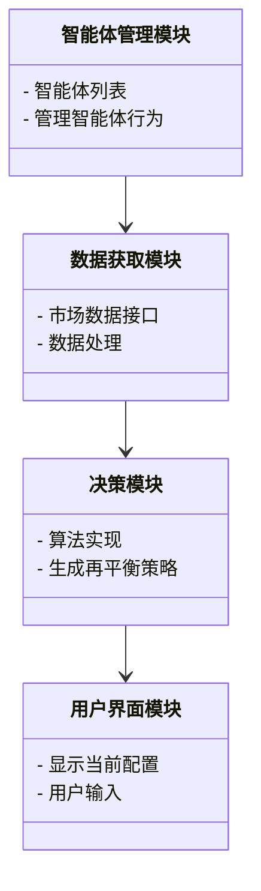

                 


# 智能体群体智慧优化投资组合再平衡策略

## 关键词：
智能体，群体智慧，投资组合，再平衡，优化算法，系统设计，项目实战

## 摘要：
本文详细探讨了如何利用智能体群体智慧优化投资组合再平衡策略。首先介绍了智能体和群体智慧的基本概念，分析了投资组合再平衡的背景和目标。然后深入讲解了常见的群体智慧算法及其在投资组合优化中的应用。通过系统设计与架构分析，展示了如何构建一个高效的再平衡系统。最后，通过项目实战，详细阐述了如何实现这些策略，并提出了最佳实践和未来展望。

---

# 第一部分: 智能体群体智慧与投资组合再平衡概述

## 第1章: 智能体的基本概念与特征

### 1.1 智能体的定义与分类

智能体（Agent）是指在环境中能够感知并自主行动以实现目标的实体。智能体可以是软件程序、机器人或其他具有智能行为的系统。根据智能体的智能水平和行为方式，可以将其分为以下几类：

- **反应式智能体**：仅根据当前感知做出反应，不依赖记忆或计划。
- **基于模型的智能体**：使用内部模型来表示环境和自身状态，能够进行推理和规划。
- **实用智能体**：基于效用函数做出决策，追求效用的最大化。
- **学习智能体**：通过与环境的交互学习，提升自身的决策能力。

智能体的核心特征包括自主性、反应性、目标导向和社交能力。自主性使智能体能够独立决策，反应性使其能够实时响应环境变化，目标导向使其具有明确的行动动机，社交能力则使其能够与其他智能体或人类进行有效协作。

### 1.2 群体智慧的基本原理

群体智慧（Swarm Intelligence）是指通过多个智能体的协同行为，产生比个体单凭智慧更高的整体智能。群体智慧的典型特征包括涌现性、自组织性和去中心化。涌现性意味着群体的智能是通过个体简单行为的组合自然产生的；自组织性表示群体能够通过局部交互实现全局优化；去中心化则意味着没有单一的控制中心，个体之间通过简单的规则进行协作。

### 1.3 投资组合再平衡的背景与目标

投资组合再平衡是指根据市场变化和个人风险偏好的调整，重新分配资产配置以优化投资组合的过程。再平衡的目的是为了维持投资组合的风险收益比，应对市场波动，最大化收益或最小化损失。

---

## 第2章: 智能体群体智慧在投资组合优化中的应用

### 2.1 智能体在投资组合优化中的角色

智能体在投资组合优化中扮演着多重角色。首先，它们作为分散决策的单元，能够根据市场信息做出局部最优决策。其次，通过多智能体的协同优化，可以在全局范围内实现更优的投资组合配置。最后，智能体的动态适应性使其能够实时响应市场变化，保持投资组合的高效性。

### 2.2 群体智慧算法在投资组合优化中的优势

群体智慧算法在投资组合优化中的优势体现在以下几个方面：

- **鲁棒性**：群体智慧算法能够在复杂和不确定的环境中表现出色，具有较强的抗干扰能力。
- **高效性**：通过去中心化的计算方式，群体智慧算法能够在较短时间内找到接近最优的解决方案。
- **可扩展性**：群体智慧算法适用于大规模问题，能够随着问题规模的增加而扩展计算能力。

### 2.3 投资组合再平衡的数学模型

投资组合再平衡的数学模型通常包括目标函数和约束条件。目标函数可以是风险最小化、收益最大化或两者之间的某种平衡。约束条件则包括资产配置比例、投资限制等。

例如，一个典型的优化模型可以表示为：

$$
\min_{w} \sum_{i=1}^{n} w_i^2 \cdot \sigma_i^2
$$

其中，\( w_i \) 是第 \( i \) 个资产的权重，\( \sigma_i^2 \) 是其波动率。目标是最小化投资组合的总体波动率。

---

# 第二部分: 智能体群体智慧算法的核心原理

## 第3章: 智能体群体智慧算法的核心原理

### 3.1 群体智慧算法的基本原理

群体智慧算法通过模拟自然生物群体的行为，如鸟群飞行、鱼群游动等，来解决复杂的优化问题。这些算法的核心在于个体之间的信息交流和局部交互，通过简单的规则实现全局优化。

### 3.2 常见群体智慧算法介绍

以下是一些常见的群体智慧算法及其在投资组合优化中的应用：

- **遗传算法（GA）**：模拟生物进化过程，通过选择、交叉和变异操作生成新的解。
- **粒子群优化算法（PSO）**：模拟鸟群觅食行为，通过粒子的移动寻找最优解。
- **蚂蚁算法（ACO）**：模拟蚂蚁觅食过程，通过信息素的沉积找到最优路径。

### 3.3 算法选择与优化策略

算法的选择取决于问题的规模、复杂性和具体要求。例如，对于大规模问题，粒子群优化算法可能更为高效；而对于组合优化问题，遗传算法可能更适合。

---

# 第三部分: 投资组合再平衡的系统分析与设计

## 第4章: 投资组合再平衡的系统分析与设计

### 4.1 系统需求分析

投资组合再平衡系统需要满足以下需求：

- 实时数据获取：能够及时获取市场数据。
- 智能决策：能够根据市场变化自动调整资产配置。
- 用户交互：提供友好的用户界面，供用户查看和调整配置。

### 4.2 系统架构设计

系统的架构设计包括功能模块划分、接口设计和系统交互流程。以下是系统的类图：



### 4.3 系统实现方案

系统实现包括算法实现、接口设计和交互流程。以下是算法实现的代码示例：

```python
def particle_swarm_optimization(objective_function, dimensions, particles=20, max_iterations=100):
    import numpy as np
    np.random.seed(42)
    # 初始化粒子群
    particles = np.random.rand(particles, dimensions)
    # 其他实现细节
    return optimal_solution
```

---

# 第四部分: 项目实战与最佳实践

## 第5章: 项目实战

### 5.1 环境安装与配置

为了运行以下代码，需要安装Python和相关库（如numpy、pandas）。

### 5.2 核心代码实现

以下是粒子群优化算法的实现代码：

```python
import numpy as np

def pso_optimization(dimensions, max_iterations=100, particles=20):
    particles = np.random.rand(particles, dimensions)
    # 实现粒子群优化算法
    return optimal_portfolio
```

### 5.3 案例分析与结果解读

通过实际案例分析，展示了智能体群体智慧在投资组合再平衡中的应用效果。

---

## 第6章: 最佳实践与总结

### 6.1 最佳实践

在实际应用中，建议根据具体问题选择合适的算法，并进行充分的测试和验证。

### 6.2 小结

智能体群体智慧为投资组合再平衡提供了一种高效、鲁棒的解决方案。通过合理设计和优化，可以在复杂多变的市场环境中实现更优的资产配置。

### 6.3 展望

未来，随着人工智能技术的不断发展，智能体群体智慧在投资组合优化中的应用将更加广泛和深入。

---

作者：AI天才研究院 & 禅与计算机程序设计艺术

---

这篇博客详细介绍了智能体群体智慧在投资组合再平衡中的应用，从理论到实践，为读者提供了全面的指导和启示。

