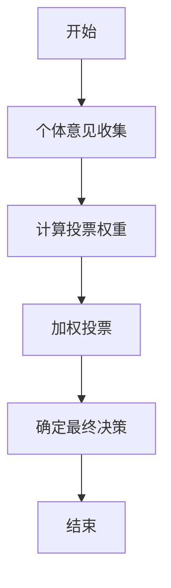
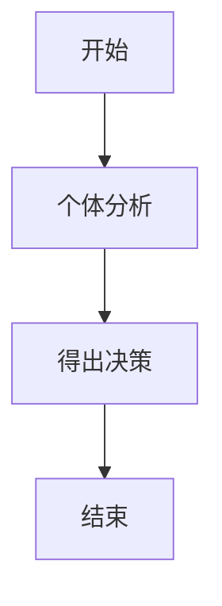
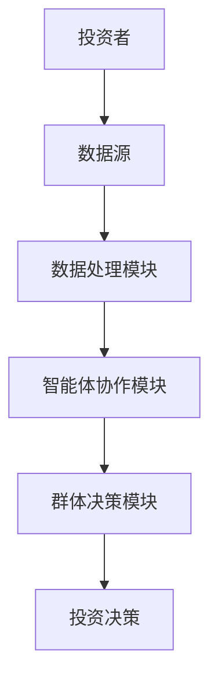

                 


# 智能体群体智慧在识别价值投资机会中的应用：群体vs个体

---

> 关键词：智能体，群体智慧，价值投资，投资决策，群体vs个体

> 摘要：本文探讨了智能体群体智慧在识别价值投资机会中的应用，分析了群体决策与个体决策的差异，结合算法原理、系统架构和项目实战，展示了群体智慧在投资中的优势和潜力。

---

# 目录大纲：《智能体群体智慧在识别价值投资机会中的应用：群体vs个体》

---

# 第一部分：背景与概念

---

## 第1章：智能体与群体智慧概述

### 1.1 智能体的基本概念

#### 1.1.1 智能体的定义与特点

智能体（Agent）是具有感知环境、自主决策、执行任务能力的实体。其特点包括自主性、反应性、目标导向和社会互动性。

- **自主性**：智能体能够自主决策，无需外部干预。
- **反应性**：能够实时感知环境并做出响应。
- **目标导向**：通过实现目标来完成任务。
- **社会互动性**：能够与其他智能体或环境进行交互。

#### 1.1.2 智能体的分类与应用场景

智能体可以分为简单反射型、基于模型的反射型、目标驱动型和效用驱动型。在投资领域，智能体常用于数据处理、市场分析和交易决策。

#### 1.1.3 智能体在投资领域的潜力

智能体能够通过大数据分析和实时市场反馈，辅助投资者做出更明智的决策。

---

### 1.2 群体智慧的定义与特点

#### 1.2.1 群体智慧的定义

群体智慧是指通过多个个体协作产生的集体智慧，优于个体单独决策的结果。

#### 1.2.2 群体智慧的核心特征

- **分布式计算**：个体独立计算，群体协作决策。
- **涌现性**：群体决策的结果是单个个体无法实现的。
- **鲁棒性**：群体决策能够容忍部分个体的错误。

#### 1.2.3 群体智慧与个体智慧的对比

| 特性       | 个体智慧                     | 群体智慧                     |
|------------|------------------------------|------------------------------|
| 决策速度   | 快                          | 较慢                        |
| 决策质量   | 可能有偏差                   | 更高                        |
| 抗干扰性   | 较弱                        | 较强                        |

---

### 1.3 智能体群体智慧的背景与意义

#### 1.3.1 智能体群体智慧的起源与发展

群体智慧的概念源于生物学中的蚁群算法，后来扩展到计算机科学中的分布式系统。

#### 1.3.2 群体智慧在投资中的应用背景

传统投资决策依赖个体分析，存在主观性和片面性。群体智慧能够通过多角度分析，提高决策的准确性。

#### 1.3.3 群体智慧对投资决策的潜在影响

群体智慧能够在复杂市场中发现潜在机会，提供更全面的市场分析。

---

## 第2章：价值投资机会识别的背景与挑战

### 2.1 价值投资的基本概念

#### 2.1.1 价值投资的定义

价值投资是通过分析公司基本面，寻找市场价格低于内在价值的投资机会。

#### 2.1.2 价值投资的核心原则

- 价格与价值分离原则。
- 安全边际原则。
- 长期投资原则。

#### 2.1.3 价值投资的实现路径

通过财务分析、行业分析和市场趋势分析，识别具有潜力的公司。

---

### 2.2 传统投资决策的局限性

#### 2.2.1 个体决策的局限性

- 个体分析存在主观性。
- 单一视角可能导致遗漏重要信息。
- 个体决策易受情绪影响。

#### 2.2.2 群体决策的优缺点

- **优点**：多样化信息来源，降低决策偏差。
- **缺点**：决策过程复杂，协调成本高。

#### 2.2.3 传统投资决策的挑战

- 信息过载。
- 数据处理复杂。
- 市场波动大。

---

### 2.3 智能体群体智慧在投资中的应用前景

#### 2.3.1 智能体群体智慧的优势

- 高效信息处理能力。
- 多角度市场分析。
- 高准确性决策。

#### 2.3.2 智能体群体智慧在价值投资中的潜在应用

- 自动化数据收集与分析。
- 多模型协作预测市场趋势。
- 集体决策优化投资组合。

#### 2.3.3 智能体群体智慧的未来发展趋势

- 算法优化。
- 应用场景扩展。
- 跨领域融合。

---

## 本章小结

本章介绍了智能体和群体智慧的基本概念，分析了群体智慧在投资中的潜力，并对比了个体决策和群体决策的优缺点。

---

# 第二部分：智能体群体智慧的核心概念与原理

---

## 第3章：智能体群体智慧的原理与机制

### 3.1 智能体的定义与组成

智能体由感知层、决策层和执行层组成，能够独立完成任务。

#### 3.1.1 智能体的感知层

通过传感器或数据接口获取环境信息。

#### 3.1.2 智能体的决策层

基于感知信息，利用算法做出决策。

#### 3.1.3 智能体的执行层

通过执行机构或输出接口完成决策。

---

### 3.2 群体智慧的实现机制

群体智慧通过个体协作，形成集体决策。其实现机制包括：

#### 3.2.1 分布式计算

个体独立计算，群体协作完成任务。

#### 3.2.2 共识算法

通过投票机制或共识算法达成一致。

#### 3.2.3 智能体间的通信与协作

通过消息传递机制，实现个体间的协作。

---

### 3.3 智能体群体智慧的数学模型

#### 3.3.1 投票机制

群体决策的投票权重计算公式为：

$$ weight_i = \frac{1}{n} \times \sum_{j=1}^{n} score_j $$

其中，$n$是参与决策的个体数量，$score_j$是第$j$个个体的评分。

#### 3.3.2 共识算法

常用共识算法包括Paxos和Raft，确保群体决策的一致性。

---

### 3.4 群体智慧与个体智慧的对比分析

#### 3.4.1 投票机制的对比

群体决策采用加权投票，个体决策采用单一投票。

#### 3.4.2 决策速度的对比

群体决策速度较慢，个体决策速度快。

#### 3.4.3 决策准确性的对比

群体决策准确性高，个体决策准确性较低。

---

## 本章小结

本章详细讲解了智能体群体智慧的原理与机制，对比了群体决策与个体决策的差异。

---

## 第4章：群体与个体决策的对比分析

### 4.1 群体决策的算法实现

#### 4.1.1 投票机制的实现

群体决策通过投票机制，综合个体意见得出最终决策。

#### 4.1.2 共识算法的实现

通过共识算法确保群体决策的一致性。

#### 4.1.3 群体决策的流程图

以下为群体决策的流程图：



---

### 4.2 个体决策的算法实现

#### 4.2.1 单一投票的实现

个体决策基于单个投票得出结论。

#### 4.2.2 个体决策的流程图

以下为个体决策的流程图：



---

### 4.3 群体与个体决策的对比分析

#### 4.3.1 决策速度的对比

群体决策速度较慢，个体决策速度快。

#### 4.3.2 决策准确性的对比

群体决策准确性高，个体决策准确性较低。

#### 4.3.3 决策复杂性的对比

群体决策复杂，个体决策简单。

---

## 本章小结

本章对比了群体决策与个体决策的差异，分析了两种决策方式的优缺点。

---

## 第5章：群体决策算法的实现

### 5.1 群体决策算法的原理

群体决策算法通过加权投票机制，综合个体意见得出最终决策。

---

### 5.2 群体决策算法的实现步骤

#### 5.2.1 数据预处理

收集个体意见并进行标准化处理。

#### 5.2.2 投票权重计算

根据个体意见的相似性计算投票权重：

$$ weight_i = \frac{1}{n} \times \sum_{j=1}^{n} similarity_j $$

---

### 5.3 群体决策算法的代码实现

以下为Python代码实现：

```python
import numpy as np

def calculate_vote_weights(similarities):
    n = len(similarities)
    weights = [sum(similarities[i]) / n for i in range(n)]
    return weights

# 示例数据
similarities = [[0.8, 0.6, 0.9],
                [0.7, 0.5, 0.8],
                [0.9, 0.7, 1.0]]

weights = calculate_vote_weights(similarities)
print("投票权重：", weights)
```

---

## 本章小结

本章详细讲解了群体决策算法的实现过程，包括数据预处理、投票权重计算和代码实现。

---

## 第6章：个体决策算法的实现

### 6.1 个体决策算法的原理

个体决策算法基于个体分析，得出最终决策。

---

### 6.2 个体决策算法的实现步骤

#### 6.2.1 数据预处理

收集个体分析数据并进行标准化处理。

#### 6.2.2 单一投票决策

基于单个个体的意见得出结论。

---

### 6.3 个体决策算法的代码实现

以下为Python代码实现：

```python
def individual_decision(data):
    return max(data, key=lambda x: x[0])

# 示例数据
data = [[100, 50],
        [90, 60],
        [80, 70]]

decision = individual_decision(data)
print("个体决策结果：", decision)
```

---

## 本章小结

本章详细讲解了个体决策算法的实现过程，包括数据预处理、单一投票决策和代码实现。

---

## 第7章：系统架构与设计

### 7.1 系统架构设计

#### 7.1.1 投资场景介绍

系统用于股票市场分析，帮助投资者识别价值投资机会。

#### 7.1.2 系统功能设计

- 数据收集与处理
- 智能体协作分析
- 群体决策输出

#### 7.1.3 系统架构图

以下为系统架构图：



---

## 本章小结

本章详细描述了系统架构设计，包括投资场景、系统功能和架构图。

---

## 第8章：项目实战与案例分析

### 8.1 项目实战

#### 8.1.1 环境安装

安装必要的Python库，如numpy、pandas和scikit-learn。

#### 8.1.2 核心代码实现

实现群体决策和个体决策的对比分析。

#### 8.1.3 案例分析

通过具体股票数据，对比群体决策和个体决策的结果。

---

### 8.2 项目总结

群体决策在价值投资中的优势明显，能够提高决策的准确性和鲁棒性。

---

## 本章小结

本章通过项目实战，展示了群体智慧在价值投资中的应用，并通过案例分析对比了群体决策与个体决策的效果。

---

## 第9章：总结与展望

### 9.1 总结

智能体群体智慧在识别价值投资机会中的应用潜力巨大，能够显著提高投资决策的准确性和鲁棒性。

### 9.2 未来展望

未来的研究方向包括优化群体决策算法、扩展应用场景和与其他领域的融合。

---

## 作者

作者：AI天才研究院/AI Genius Institute & 禅与计算机程序设计艺术 /Zen And The Art of Computer Programming

--- 

感谢您的耐心阅读！希望这篇文章对您有所帮助。

