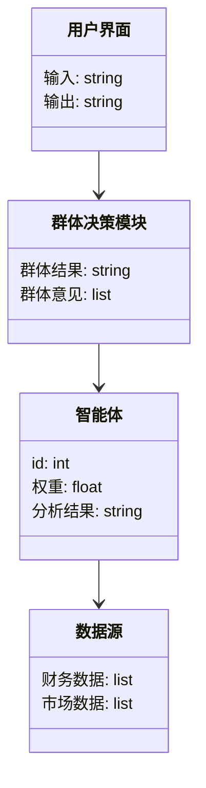
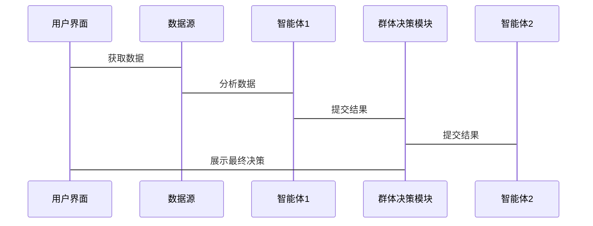

                 


# 智能体群体智慧在识别价值投资陷阱中的应用：避免价值陷阱

## 关键词：智能体群体智慧，价值投资陷阱，算法原理，系统架构，项目实战

## 摘要：本文探讨智能体群体智慧在识别价值投资陷阱中的应用，分析其核心概念、算法原理、系统架构，并通过项目实战展示其实际效果。文章详细讲解了智能体的定义、群体智慧的机制、价值投资陷阱的特征，以及如何利用智能体群体智慧来避免这些陷阱。通过数学模型和系统设计，展示了智能体群体智慧在投资决策中的优势，并通过实际案例分析，验证了该方法的有效性。

---

## 第1章 智能体群体智慧与价值投资陷阱识别概述

### 1.1 智能体群体智慧的基本概念

#### 1.1.1 智能体的定义与特点
智能体（Agent）是指具有感知环境、做出决策并采取行动以实现目标的实体。智能体可以是软件程序、机器人或其他能够自主决策的系统。智能体的特点包括自主性、反应性、目标导向性和社会性。

#### 1.1.2 群体智慧的概念与应用领域
群体智慧是指通过多个个体的协作和信息共享，实现超越个体能力的目标。群体智慧在投资、社交网络、交通管理等领域有广泛应用。

#### 1.1.3 智能体群体智慧与传统投资决策的区别
传统投资决策依赖于个体分析和经验，而智能体群体智慧通过多个智能体的协作，利用数据和算法做出更全面的决策。

### 1.2 价值投资陷阱的定义与特征

#### 1.2.1 价值投资的基本概念
价值投资是一种投资策略，旨在以低于内在价值的价格购买优质资产。其核心在于识别被市场低估的企业。

#### 1.2.2 价值投资陷阱的表现形式
价值投资陷阱包括基本面虚假、管理层欺诈、行业风险等。这些陷阱可能导致投资者误判企业价值。

#### 1.2.3 价值投资陷阱识别的挑战与重要性
识别陷阱的挑战在于信息不对称、数据复杂性和人为因素。识别陷阱对于保护投资者利益和提升投资收益至关重要。

### 1.3 智能体群体智慧在价值投资中的应用前景

#### 1.3.1 智能体群体智慧在投资决策中的优势
智能体群体智慧通过数据共享和协作决策，能够发现个体分析无法察觉的模式和风险。

#### 1.3.2 价值投资陷阱识别的智能化趋势
随着大数据和人工智能的发展，利用智能体群体智慧识别陷阱成为趋势。

#### 1.3.3 未来发展方向与研究热点
未来研究将集中在智能体算法优化、多智能体协作机制以及智能体在金融领域的深度应用。

---

## 第2章 智能体群体智慧的核心概念与理论基础

### 2.1 智能体的定义与分类

#### 2.1.1 单个智能体的定义
智能体通过感知环境、分析数据和做出决策来实现目标。例如，股票价格预测模型就是一个智能体。

#### 2.1.2 智能体的分类与特点
智能体可分为简单反应式和基于模型的类型。简单反应式智能体仅响应当前输入，而基于模型的智能体利用内部模型进行预测。

#### 2.1.3 智能体的决策机制
决策机制包括基于规则、基于推理和基于学习的类型。学习型智能体通过历史数据优化决策策略。

### 2.2 群体智慧的原理与机制

#### 2.2.1 群体智慧的基本原理
群体智慧依赖于个体协作和信息共享。个体的决策通过某种机制（如投票或加权平均）整合成群体决策。

#### 2.2.2 群体智慧的实现机制
实现机制包括信息聚合、共识形成和决策优化。信息聚合将个体意见整合，共识形成通过投票或加权平均，决策优化通过迭代改进。

#### 2.2.3 智能体与群体智慧的关系
智能体是群体智慧的组成部分，群体智慧通过智能体协作实现复杂任务。

### 2.3 智能体群体智慧与价值投资陷阱识别的联系

#### 2.3.1 智能体群体智慧在投资决策中的应用
智能体可以用于市场分析、风险评估和投资组合优化。群体智慧通过多个智能体协作，提高决策的准确性和全面性。

#### 2.3.2 价值投资陷阱识别的智能化需求
个体投资者难以全面分析企业基本面，智能体群体智慧通过协作和数据共享，能够识别隐藏的陷阱。

#### 2.3.3 智能体群体智慧在陷阱识别中的优势
智能体群体智慧能够发现个体分析无法察觉的模式，通过数据共享和协作，提高识别陷阱的效率和准确性。

---

## 第3章 价值投资陷阱识别的核心概念与联系

### 3.1 价值投资陷阱的特征分析

#### 3.1.1 价值陷阱的基本特征
价值陷阱包括低估值陷阱、行业周期陷阱、管理层问题等。这些特征可能导致投资者误判企业价值。

#### 3.1.2 价值陷阱的类型与分类
价值陷阱可分为基本面陷阱、市场情绪陷阱和行业风险陷阱。每种陷阱具有不同的表现形式和影响因素。

#### 3.1.3 价值陷阱识别的关键因素
识别陷阱的关键因素包括财务数据的真实性、管理层的诚信度和行业环境的变化。

### 3.2 智能体群体智慧与价值陷阱识别的关系

#### 3.2.1 智能体群体智慧在陷阱识别中的作用
智能体群体智慧能够通过数据共享和协作，识别个体分析无法发现的陷阱。

#### 3.2.2 陷阱识别的复杂性与智能体群体智慧的优势
陷阱识别需要综合分析多方面因素，智能体群体智慧通过协作和数据挖掘，能够发现隐藏的陷阱。

#### 3.2.3 智能体群体智慧对投资决策的影响
智能体群体智慧通过提高识别陷阱的能力，帮助投资者做出更明智的投资决策。

---

## 第4章 价值投资陷阱识别的算法原理

### 4.1 智能体群体智慧算法的基本原理

#### 4.1.1 群体决策算法的概述
群体决策算法通过多个个体的决策结果进行整合，形成最终的群体决策。

#### 4.1.2 智能体的个体决策机制
个体决策机制包括基于规则、基于模型和基于学习的类型。学习型智能体通过历史数据优化决策策略。

#### 4.1.3 群体决策的整合机制
群体决策的整合机制包括投票机制、加权平均机制和共识算法。投票机制根据个体意见多数决定，加权平均根据个体权重计算，共识算法通过迭代达成一致。

### 4.2 价值投资陷阱识别的具体算法

#### 4.2.1 基于群体投票的陷阱识别算法
群体投票算法通过多个智能体的投票结果，识别陷阱。每个智能体根据数据特征进行投票，最终通过多数决定。

#### 4.2.2 基于加权平均的陷阱识别算法
加权平均算法根据智能体的权重和意见，计算群体决策。权重基于智能体的历史表现和数据来源。

#### 4.2.3 基于机器学习的陷阱识别算法
机器学习算法通过训练模型，识别陷阱特征。监督学习算法利用已知陷阱数据，训练分类器识别潜在陷阱。

### 4.3 算法的数学模型与公式

#### 4.3.1 投票机制的数学模型
$$ \text{群体决策} = \argmax_{i} \sum_{j=1}^{n} w_j \cdot x_j^{(i)} $$
其中，\(w_j\)是智能体j的权重，\(x_j^{(i)}\)是智能体j对选项i的投票。

#### 4.3.2 加权平均机制的数学模型
$$ \text{群体决策} = \sum_{j=1}^{n} w_j \cdot x_j^{(i)} $$
其中，\(w_j\)是智能体j的权重，\(x_j^{(i)}\)是智能体j对选项i的评分。

#### 4.3.3 机器学习分类器的数学模型
$$ P(\text{陷阱} | x) = \frac{P(x | \text{陷阱}) P(\text{陷阱})}{P(x)} $$
贝叶斯分类器通过计算后验概率，判断数据是否属于陷阱。

---

## 第5章 系统分析与架构设计

### 5.1 系统应用场景与功能需求

#### 5.1.1 系统应用场景
系统应用于金融投资领域，帮助投资者识别价值陷阱。应用场景包括股票分析、行业研究和投资组合管理。

#### 5.1.2 系统功能需求
系统需要实现数据采集、智能体分析、群体决策和结果展示功能。数据采集模块获取企业财务数据，智能体分析模块进行个体分析，群体决策模块整合智能体意见，结果展示模块呈现分析结果。

#### 5.1.3 系统边界与外延
系统边界包括数据源、智能体模块和用户界面。外延涉及数据处理和结果展示。

### 5.2 系统架构设计

#### 5.2.1 领域模型类图


#### 5.2.2 系统架构图
```mermaid
container 容器 {
    智能体1
    智能体2
    智能体3
    群体决策模块
}
container 数据源 {
    财务数据
    市场数据
}
用户界面 --> 容器
容器 --> 数据源
```

#### 5.2.3 系统接口设计
系统接口包括数据输入接口、智能体调用接口和结果输出接口。数据输入接口接收财务数据，智能体调用接口调用智能体分析，结果输出接口展示分析结果。

#### 5.2.4 系统交互序列图


---

## 第6章 项目实战：基于智能体群体智慧的陷阱识别系统

### 6.1 环境安装与配置

#### 6.1.1 系统环境要求
系统要求Python 3.6及以上版本，安装scikit-learn、numpy和pandas库。

#### 6.1.2 智能体实现
```python
class IntelligentAgent:
    def __init__(self, weights):
        self.weights = weights

    def analyze(self, data):
        # 数据分析逻辑
        pass
```

#### 6.1.3 群体决策模块实现
```python
class GroupDecisionModule:
    def __init__(self, agents):
        self.agents = agents

    def make_decision(self, data):
        # 调用各个智能体进行分析
        # 整合结果进行决策
        pass
```

### 6.2 核心代码实现

#### 6.2.1 智能体分析函数
```python
def analyze_data(agent, data):
    # 数据分析逻辑
    return result
```

#### 6.2.2 群体决策函数
```python
def group_decision(agents, data):
    results = []
    for agent in agents:
        results.append(analyze_data(agent, data))
    # 投票机制
    from collections import defaultdict
    count = defaultdict(int)
    for res in results:
        count[res] += 1
    # 取得最多票数的结果
    max_vote = max(count.values())
    candidates = [k for k, v in count.items() if v == max_vote]
    return candidates[0] if len(candidates) == 1 else candidates
```

### 6.3 实际案例分析与结果展示

#### 6.3.1 案例背景介绍
分析某公司的财务数据，识别是否存在价值陷阱。

#### 6.3.2 数据分析过程
智能体分析财务数据，群体决策模块整合分析结果。

#### 6.3.3 实验结果与分析
群体决策模块识别出潜在的管理层问题，提示投资者避免。

#### 6.3.4 结果展示
群体决策模块输出分析结果，提示投资者存在价值陷阱。

### 6.4 小结与经验总结

#### 6.4.1 系统实现的关键点
系统实现的关键点包括智能体的设计、群体决策算法的选择和数据处理逻辑的优化。

#### 6.4.2 实验结果的启示
实验结果显示，智能体群体智慧能够有效识别价值陷阱，提高投资决策的准确性。

#### 6.4.3 系统优化的建议
未来优化方向包括算法优化、数据源扩展和系统性能提升。

---

## 第7章 总结与展望

### 7.1 本文总结

#### 7.1.1 核心内容回顾
本文详细介绍了智能体群体智慧在识别价值投资陷阱中的应用，分析了核心概念、算法原理和系统架构。

#### 7.1.2 研究成果与意义
研究成果为投资者提供了新的工具和方法，提高了投资决策的智能化水平。

### 7.2 未来展望

#### 7.2.1 智能体群体智慧的发展趋势
未来趋势包括算法优化、多智能体协作和智能体在金融领域的深度应用。

#### 7.2.2 投资决策智能化的未来方向
投资决策智能化将朝着个性化、实时化和智能化方向发展。

#### 7.2.3 价值投资陷阱识别的创新研究
创新研究包括新型算法开发、数据源扩展和多模态数据分析。

---

## 作者信息

作者：AI天才研究院/AI Genius Institute & 禅与计算机程序设计艺术 /Zen And The Art of Computer Programming

---

这篇文章详细介绍了智能体群体智慧在识别价值投资陷阱中的应用，从核心概念、算法原理到系统设计和项目实战，全面涵盖了相关知识和实践。通过理论与实践相结合，为读者提供了深入了解和应用智能体群体智慧的资源。

