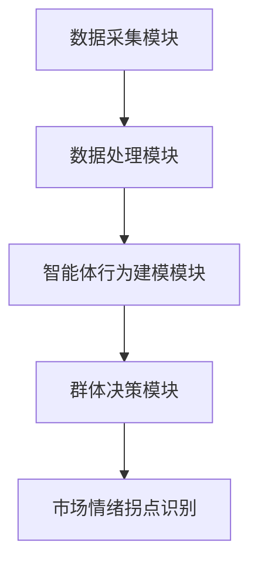
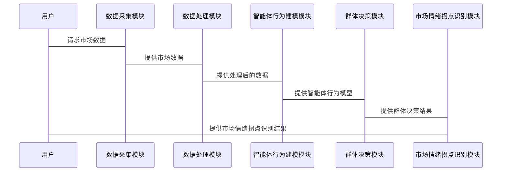

                 


# 智能体群体智慧在识别市场情绪拐点中的应用

## 关键词：智能体，群体智慧，市场情绪，拐点识别，金融分析，机器学习

## 摘要：  
智能体群体智慧是一种通过多个智能体协同工作来模拟人类群体决策过程的新兴技术。本文探讨了智能体群体智慧在识别市场情绪拐点中的应用，从理论基础、算法原理、系统架构到实际案例，全面分析了其在金融领域的潜力与挑战。通过结合自然语言处理、机器学习和博弈论等技术，智能体群体智慧能够有效捕捉市场情绪的变化，为投资者提供更精准的决策支持。

---

## 正文

### 第一部分: 背景介绍

#### 1.1 智能体群体智慧的定义与特征

智能体（Agent）是指能够感知环境、做出决策并采取行动的实体。智能体可以是软件程序、机器人或其他具备自主决策能力的系统。群体智慧（Swarm Intelligence）则是指通过多个智能体的协同工作，实现超越个体智能的集体智能。智能体群体智慧结合了个体智能与群体协同的优势，能够在复杂环境中完成复杂的任务。

智能体群体智慧的特征包括：
- **分布式**：智能体之间没有中心化的控制节点，每个智能体独立决策。
- **自适应**：智能体能够根据环境变化动态调整行为。
- **协同性**：通过个体间的互动，实现群体目标的优化。

#### 1.2 市场情绪拐点的定义与重要性

市场情绪拐点是指市场整体情绪从一个阶段转向另一个阶段的关键点。例如，从乐观转向悲观，或从平静转向恐慌。识别市场情绪拐点对投资者来说至关重要，因为情绪变化往往预示着市场趋势的变化。

市场情绪拐点的重要性体现在：
- **提前预警**：帮助投资者在市场趋势变化前做出应对。
- **提高决策效率**：通过分析群体情绪，投资者可以更快做出决策。
- **降低风险**：提前识别潜在风险，减少损失。

#### 1.3 智能体群体智慧在金融领域的应用背景

传统的金融市场分析主要依赖于历史数据分析和统计模型，但这种方法在面对市场情绪变化时显得力不从心。智能体群体智慧通过模拟人类群体的决策过程，能够更准确地捕捉市场情绪的变化。

智能体群体智慧在金融领域的应用背景包括：
- **数据多样性**：金融市场涉及大量文本、语音、图像等多种形式的数据。
- **实时性要求高**：金融市场变化迅速，需要实时分析和决策。
- **复杂性高**：金融市场受多种因素影响，传统模型难以捕捉所有变量。

---

### 第二部分: 智能体群体智慧的核心概念

#### 2.1 智能体的行为模型

智能体的行为模型是智能体群体智慧的核心。常见的智能体行为模型包括：

1. **基于规则的模型**：智能体根据预设规则做出决策。
2. **基于强化学习的模型**：智能体通过与环境互动，学习最优决策策略。
3. **基于博弈论的模型**：智能体通过博弈论模型模拟市场参与者的决策过程。

#### 2.2 群体智慧的实现机制

群体智慧的实现机制包括以下几个步骤：

1. **个体决策**：每个智能体根据自身信息做出决策。
2. **信息共享**：智能体之间共享信息，形成群体共识。
3. **群体决策**：基于个体决策和信息共享，群体形成最终决策。

#### 2.3 智能体群体智慧与市场情绪的关系

市场情绪是群体智慧的重要输入。智能体通过分析市场情绪的变化，调整自身行为策略。市场情绪的变化反过来也会影响智能体的决策过程。

---

### 第三部分: 智能体群体智慧的算法原理

#### 3.1 基于文本挖掘的市场情绪分析

文本挖掘是分析市场情绪的重要工具。通过分析新闻、社交媒体等文本数据，可以提取市场情绪。

1. **情感分析**：使用自然语言处理技术，对文本进行情感分类（正面、中性、负面）。
2. **情感强度分析**：对情感分类结果进行量化，计算市场情绪的强度。

#### 3.2 基于智能体的群体决策模型

群体决策模型是智能体群体智慧的核心。常见的群体决策模型包括：

1. **共识模型**：通过投票等方法，形成群体共识。
2. **加和模型**：将个体决策结果加总，形成群体决策。
3. **基于博弈论的模型**：通过模拟市场参与者的博弈过程，形成群体决策。

#### 3.3 市场情绪拐点的识别算法

市场情绪拐点的识别算法需要结合智能体群体智慧和时间序列分析技术。

1. **异常检测**：通过统计方法，检测市场情绪的异常变化。
2. **聚类分析**：将市场情绪变化分为不同的类别，识别拐点。
3. **马尔可夫链模型**：通过状态转移概率，预测市场情绪的变化。

---

### 第四部分: 智能体群体智慧的系统架构设计

#### 4.1 系统功能模块设计

智能体群体智慧系统主要包括以下几个功能模块：

1. **数据采集模块**：采集市场数据（如新闻、社交媒体数据）。
2. **数据处理模块**：对数据进行清洗和特征提取。
3. **智能体行为建模模块**：构建智能体行为模型。
4. **群体决策模块**：通过群体决策模型，识别市场情绪拐点。

#### 4.2 系统架构图

以下是系统架构图：



#### 4.3 接口设计

系统接口设计包括以下几个部分：

1. **数据接口**：与数据源（如新闻网站）对接，获取市场数据。
2. **用户接口**：提供给用户查看市场情绪拐点的界面。
3. **算法接口**：与其他算法模块对接，提供市场情绪分析结果。

#### 4.4 交互流程图

以下是交互流程图：



---

### 第五部分: 项目实战

#### 5.1 环境配置

以下是项目实战的环境配置：

```bash
# 安装必要的库
pip install numpy
pip install pandas
pip install nltk
pip install scikit-learn
pip install matplotlib
```

#### 5.2 核心代码实现

以下是核心代码实现：

```python
import numpy as np
import pandas as pd
from sklearn.feature_extraction.text import TfidfVectorizer
from sklearn.naive_bayes import MultinomialNB
from sklearn.pipeline import make_pipeline

# 数据加载
data = pd.read_csv('market_data.csv')

# 文本向量化
vectorizer = TfidfVectorizer()
X = vectorizer.fit_transform(data['text'])

# 情感分类模型训练
model = make_pipeline(vectorizer, MultinomialNB())
model.fit(X, data['label'])

# 智能体行为建模
# 假设每个智能体是一个分类器，进行投票
# 群体决策模块
from sklearn.ensemble import VotingClassifier

# 初始化多个分类器
classifiers = [
    ('NB', MultinomialNB()),
    ('RF', RandomForestClassifier())
]

voting_clf = VotingClassifier(estimators=classifiers)
voting_clf.fit(X, data['label'])

# 预测市场情绪拐点
# 假设我们已经训练好一个时间序列模型
# 这里只是一个示例
from statsmodels.tsa.arima_model import ARIMA

# 训练时间序列模型
model_arima = ARIMA(data['sentiment'], order=(1, 1, 1))
model_arima_fit = model_arima.fit()

# 预测未来市场情绪
forecast = model_arima_fit.forecast(steps=10)
```

#### 5.3 代码解读与分析

1. **数据加载**：从CSV文件中加载市场数据。
2. **文本向量化**：使用TF-IDF方法将文本数据转换为向量。
3. **情感分类模型训练**：使用Naive Bayes算法训练情感分类模型。
4. **智能体行为建模**：使用投票分类器（Voting Classifier）构建群体决策模型。
5. **市场情绪拐点预测**：使用ARIMA模型预测未来市场情绪。

#### 5.4 实际案例分析

假设我们有一个包含新闻标题和标签（1表示正面，0表示负面）的数据集。通过上述代码，我们可以训练一个情感分类模型，并使用群体决策模型进行市场情绪拐点识别。

---

### 第六部分: 总结与展望

#### 6.1 研究总结

本文详细探讨了智能体群体智慧在识别市场情绪拐点中的应用，从理论基础、算法原理到系统架构设计，再到实际案例分析，全面分析了其在金融领域的潜力与挑战。

#### 6.2 研究不足

本文的研究仍存在一些不足之处：
- 数据质量对结果影响较大。
- 群体决策模型的鲁棒性需要进一步提升。
- 算法的实时性需要进一步优化。

#### 6.3 未来展望

未来的研究方向包括：
- 提高算法的实时性和准确性。
- 探索更多智能体群体智慧的应用场景。
- 结合区块链技术，提升系统的安全性和去中心化能力。

---

## 作者：AI天才研究院/AI Genius Institute & 禅与计算机程序设计艺术 /Zen And The Art of Computer Programming

