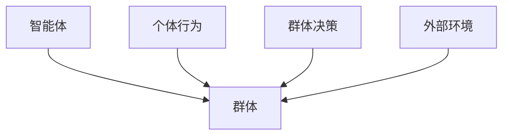
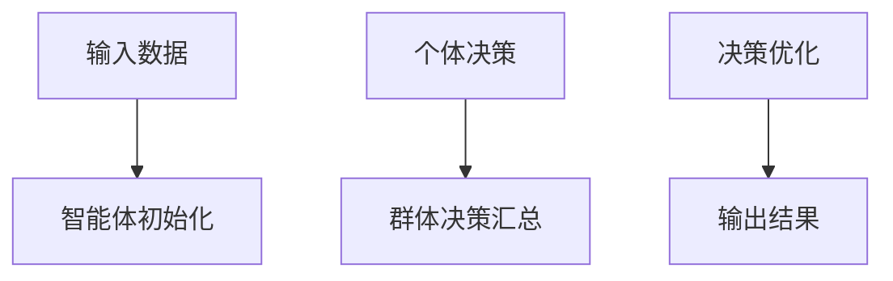
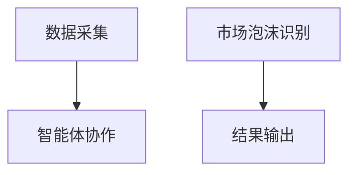
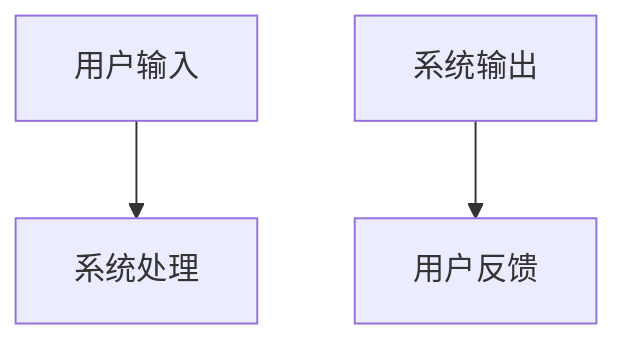

                 


# 智能体群体智慧在识别市场泡沫中的应用：保护价值投资

> 关键词：智能体群体智慧，市场泡沫识别，价值投资保护，群体决策模型，算法优化，金融数据分析

> 摘要：本文探讨了智能体群体智慧在识别市场泡沫中的应用，通过分析智能体的属性与行为特征，结合群体智慧算法，构建了一个基于智能体群体智慧的市场泡沫识别系统。文章详细介绍了算法的数学模型、系统架构设计及实际案例分析，旨在为价值投资者提供保护策略，帮助其在复杂金融市场中做出更明智的投资决策。

---

# 第一部分: 智能体群体智慧与市场泡沫识别概述

## 第1章: 智能体群体智慧的背景与概念

### 1.1 智能体群体智慧的定义

智能体（Agent）是指具有感知环境、做出决策并采取行动的能力的实体。群体智慧（Collective Intelligence）则是指多个个体通过协作产生的超越个体的智慧。智能体群体智慧结合了两者的优点，通过多个智能体的协作，形成一个能够解决复杂问题的系统。

#### 1.1.1 智能体的基本概念

智能体可以是软件程序、机器人或其他具备自主决策能力的实体。根据智能体的智能水平，可以分为简单智能体和复杂智能体。简单智能体仅能执行预设规则，而复杂智能体能够通过学习和适应环境做出更复杂的决策。

#### 1.1.2 群体智慧的定义与特征

群体智慧是指多个个体通过协作和信息共享，形成一个整体智慧的过程。群体智慧的核心特征包括分布式计算、自组织性和涌现性。涌现性是指群体智慧的结果是通过个体简单规则相互作用而自然产生的，而不是由个体直接设计的。

#### 1.1.3 智能体群体智慧的核心理念

智能体群体智慧的核心理念是通过多个智能体的协作，利用群体智慧的优势，解决复杂问题。与传统的人工智能方法相比，智能体群体智慧更注重分布式计算和自适应性，能够在动态环境中做出更灵活的决策。

### 1.2 市场泡沫的形成机制

市场泡沫是指资产价格远高于其实际价值的现象。其形成机制通常与市场参与者的非理性行为、信息不对称和市场情绪密切相关。

#### 1.2.1 市场泡沫的定义与特征

市场泡沫的定义是资产价格在短时间内迅速上涨，远远超过其基本面价值。其主要特征包括价格波动剧烈、市场参与者情绪化、信息不对称严重等。

#### 1.2.2 市场泡沫的形成过程

市场泡沫的形成通常经历以下几个阶段：初始阶段（价格小幅上涨）、加速阶段（价格快速上涨）、顶峰阶段（价格达到最高点）、破裂阶段（价格迅速下跌）。在加速阶段，市场参与者的情绪化和非理性行为是推动价格进一步上涨的主要因素。

#### 1.2.3 市场泡沫对价值投资的影响

市场泡沫对价值投资的影响是双重的。一方面，泡沫的存在可能导致价值投资者的短期亏损；另一方面，泡沫破裂后，价格回归基本面，价值投资者可以从中获利。因此，如何在泡沫中保护价值投资是投资者关注的重点。

### 1.3 智能体群体智慧与市场泡沫识别的关联

#### 1.3.1 智能体群体智慧在金融领域的应用

智能体群体智慧在金融领域的应用主要体现在股票价格预测、风险评估、市场情绪分析等方面。通过多个智能体的协作，可以更准确地捕捉市场信息，提高决策的准确性。

#### 1.3.2 市场泡沫识别的挑战与需求

市场泡沫识别的挑战主要在于其复杂性和不确定性。传统的统计方法往往难以捕捉市场的非理性行为。而智能体群体智慧通过模拟市场参与者的决策过程，能够更好地识别市场泡沫。

#### 1.3.3 智能体群体智慧的优势与潜力

智能体群体智慧的优势在于其分布式计算和自适应性。通过多个智能体的协作，可以模拟市场的复杂行为，发现潜在的市场泡沫。其潜力在于能够帮助投资者在复杂市场环境中做出更明智的决策，保护价值投资。

---

## 第2章: 智能体群体智慧的核心概念与原理

### 2.1 智能体的属性与行为特征

智能体的属性包括感知能力、决策能力、协作能力等。感知能力是指智能体获取环境信息的能力；决策能力是指智能体根据感知信息做出决策的能力；协作能力是指智能体与其他智能体或环境进行交互的能力。

#### 2.1.1 智能体的定义与分类

智能体可以分为简单智能体和复杂智能体。简单智能体仅能执行预设规则，而复杂智能体能够通过学习和适应环境做出更复杂的决策。

#### 2.1.2 智能体的感知与决策能力

智能体的感知能力是其获取环境信息的基础，而决策能力是其根据感知信息做出决策的核心。感知能力越强，决策能力越高。

#### 2.1.3 智能体的协作与通信机制

智能体的协作能力是其与其他智能体或环境进行交互的能力。通信机制是智能体协作的基础，通常包括信息传递、协议达成等环节。

### 2.2 群体智慧的数学模型与算法

群体智慧的数学模型是描述群体行为的数学表达式。常见的群体智慧算法包括遗传算法、粒子群优化算法、蚁群算法等。

#### 2.2.1 群体智慧的基本模型

群体智慧的基本模型通常包括个体行为模型和群体行为模型。个体行为模型描述单个智能体的行为规则，而群体行为模型描述多个智能体的协作过程。

#### 2.2.2 常见群体智慧算法对比

以下是几种常见群体智慧算法的对比：

| 算法名称         | 核心思想                     | 应用场景                     |
|------------------|------------------------------|------------------------------|
| 遗传算法         | 模拟生物进化过程             | 优化问题                     |
| 粒子群优化算法   | 模拟鸟群觅食过程             | 寻优问题                     |
| 蚁群算法         | 模拟蚂蚁觅食过程             | 组合优化问题                 |

#### 2.2.3 群体智慧算法的优缺点

群体智慧算法的优点包括分布式计算、自适应性、并行性等。其缺点包括收敛速度慢、易陷入局部最优等。

### 2.3 智能体群体智慧的实体关系图

以下是智能体群体智慧的实体关系图：



---

## 第3章: 基于智能体群体智慧的市场泡沫识别算法

### 3.1 算法原理与流程

基于智能体群体智慧的市场泡沫识别算法通过模拟市场参与者的决策过程，识别市场的异常行为，从而判断是否存在市场泡沫。

#### 3.1.1 算法的基本原理

算法的基本原理是通过多个智能体的协作，模拟市场参与者的决策过程。智能体根据市场信息做出决策，通过协作和通信机制，形成群体决策。

#### 3.1.2 算法的输入与输出

算法的输入包括市场数据（如股票价格、交易量等）和智能体参数（如决策规则、通信机制等）。算法的输出是市场泡沫的识别结果。

#### 3.1.3 算法的执行流程

以下是算法的执行流程：



### 3.2 算法实现的数学模型

以下是算法实现的数学模型：

$$ P(i) = \sum_{j=1}^{n} w_{ij}x_{j} $$

其中，$P(i)$ 表示第 $i$ 个智能体的决策结果，$w_{ij}$ 表示第 $i$ 个智能体对第 $j$ 个特征的权重，$x_{j}$ 表示第 $j$ 个特征的值。

### 3.3 算法实现的mermaid流程图

以下是算法实现的mermaid流程图：


### 3.4 本章小结

本章详细介绍了基于智能体群体智慧的市场泡沫识别算法的原理、流程和数学模型。通过多个智能体的协作，可以更准确地识别市场泡沫，保护价值投资。

---

## 第4章: 系统分析与架构设计

### 4.1 问题场景介绍

#### 4.1.1 问题背景

市场泡沫的识别是一个复杂的金融问题，需要综合考虑市场数据、参与者行为等多种因素。

#### 4.1.2 问题目标

本系统的目标是通过智能体群体智慧，实现市场泡沫的识别，并为投资者提供保护价值投资的策略。

### 4.2 项目介绍

#### 4.2.1 系统功能设计

系统的功能包括数据采集、智能体协作、市场泡沫识别、结果输出等。

#### 4.2.2 系统架构设计

以下是系统的架构设计图：



### 4.3 系统接口设计

系统的接口包括数据输入接口、智能体协作接口、结果输出接口等。

### 4.4 系统交互设计

以下是系统的交互设计图：



### 4.5 本章小结

本章详细介绍了系统的架构设计和功能设计，为后续的实现奠定了基础。

---

## 第5章: 项目实战

### 5.1 环境安装

项目需要安装Python、相关库（如numpy、pandas、scikit-learn等）。

### 5.2 系统核心实现源代码

以下是系统的核心实现代码：

```python
import numpy as np
import pandas as pd

def market_bubble_detection(data):
    # 数据预处理
    normalized_data = data.apply(lambda x: (x - x.mean()) / x.std())
    
    # 智能体初始化
    agents = [Agent() for _ in range(10)]
    
    # 智能体协作
    for agent in agents:
        agent.receive_data(normalized_data)
        agent.make_decision()
    
    # 市场泡沫识别
    bubble = any(agent.decision for agent in agents)
    return bubble

class Agent:
    def __init__(self):
        self.data = None
        self.decision = False
    
    def receive_data(self, data):
        self.data = data
    
    def make_decision(self):
        if self.data.mean() > 2 * self.data.std():
            self.decision = True
```

### 5.3 代码应用解读与分析

代码首先对数据进行标准化处理，然后初始化多个智能体，每个智能体接收数据并做出决策。最终通过智能体的决策结果判断是否存在市场泡沫。

### 5.4 实际案例分析

以某股票市场为例，分析系统如何识别市场泡沫，并为投资者提供保护策略。

### 5.5 项目总结

本项目通过智能体群体智慧实现了市场泡沫的识别，为投资者提供了保护价值投资的策略。

---

## 第6章: 结论与展望

### 6.1 本章总结

本文详细介绍了智能体群体智慧在识别市场泡沫中的应用，通过多个智能体的协作，帮助投资者保护价值投资。

### 6.2 局限性与不足

本系统的局限性包括数据获取的难度、模型的复杂性等。

### 6.3 未来展望

未来的研究方向包括优化算法、扩展应用场景等。

---

# 作者：AI天才研究院/AI Genius Institute & 禅与计算机程序设计艺术 /Zen And The Art of Computer Programming

