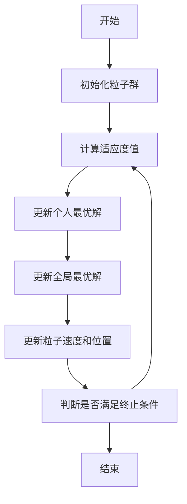
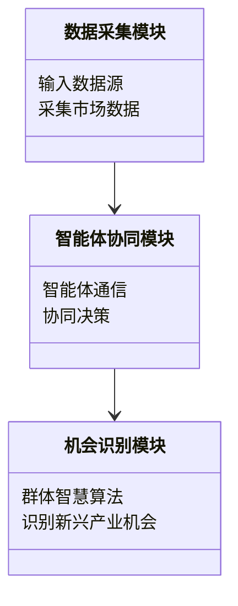
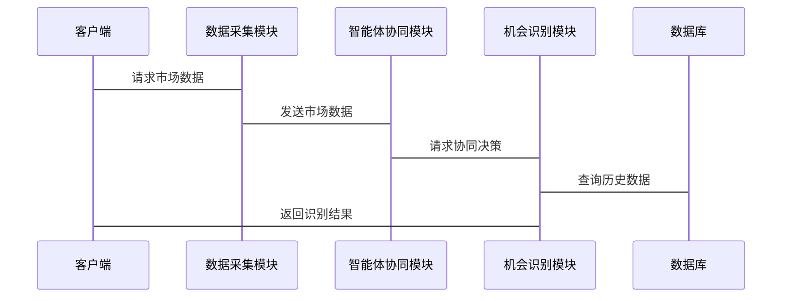

                 


# 智能体群体智慧在识别新兴产业机会中的应用

## 关键词：智能体、群体智慧、新兴产业、机会识别、算法原理、系统架构、项目实战

## 摘要：
智能体群体智慧是一种通过多个智能体协同工作，模拟群体智慧的复杂系统。本文探讨了智能体群体智慧在识别新兴产业机会中的应用，分析了其核心概念、算法原理、系统架构，并通过实际案例展示了其在项目中的应用。本文适合对人工智能、群体智慧、新兴产业分析感兴趣的技术人员和研究者阅读。

---

## 第一部分: 智能体群体智慧的背景与概念

### 第1章: 智能体群体智慧的背景与概念

#### 1.1 智能体的基本概念
##### 1.1.1 智能体的定义与特点
智能体（Agent）是一种能够感知环境、自主决策并执行任务的实体。智能体具有以下特点：
- **自主性**：无需外部干预，自主完成任务。
- **反应性**：能感知环境并实时调整行为。
- **目标导向**：智能体的行为旨在实现特定目标。
- **社会性**：能与其他智能体或人类进行交互和协作。

##### 1.1.2 群体智能的定义与特征
群体智能（Swarm Intelligence）是指多个智能体通过协同行为，共同解决复杂问题的现象。其主要特征包括：
- **去中心化**：没有单一的控制中心，每个智能体独立运作。
- **自我组织**：智能体通过局部交互形成全局结构。
- **涌现性**：群体智能的行为是单个智能体行为的自然结果。

##### 1.1.3 智能体群体智慧的演进历程
智能体群体智慧的概念起源于生物学中的群体行为研究，如鸟群飞行、鱼群洄游等。随着人工智能技术的发展，智能体群体智慧逐渐应用于分布式计算、机器人协作等领域。

#### 1.2 新兴产业机会识别的挑战与需求
##### 1.2.1 新兴产业的特点与识别难点
新兴产业通常具有以下特点：
- **不确定性**：市场变化快，竞争激烈。
- **技术驱动**：技术创新是核心驱动力。
- **跨界融合**：新兴产业往往涉及多个领域。

识别新兴产业机会的难点包括：
- 市场信息分散，难以整合。
- 竞争对手行为难以预测。
- 技术更新迭代快，需快速响应。

##### 1.2.2 智能体群体智慧在机会识别中的作用
智能体群体智慧可以通过以下方式助力新兴产业机会识别：
- **分布式信息收集**：多个智能体分别收集不同领域的信息。
- **协同分析**：智能体协同分析市场趋势、技术动态等。
- **动态调整**：根据实时信息动态调整识别策略。

##### 1.2.3 问题背景与目标设定
本文旨在探讨如何利用智能体群体智慧识别新兴产业机会，目标包括：
- 提供一套基于智能体群体智慧的新兴产业机会识别方法。
- 探讨智能体群体智慧在新兴产业识别中的应用前景。

---

### 第2章: 智能体群体智慧的核心概念与联系

#### 2.1 智能体群体智慧的原理
##### 2.1.1 智能体的行为机制
智能体的行为机制包括感知、决策和执行三个环节：
- **感知**：通过传感器或数据源获取环境信息。
- **决策**：基于感知信息，选择最优行为。
- **执行**：通过执行机构完成任务。

##### 2.1.2 群体智慧的形成过程
群体智慧的形成过程包括以下步骤：
1. 智能体感知环境，获取相关信息。
2. 智能体之间通过某种通信机制进行信息交换。
3. 智能体基于群体信息做出协同决策。
4. 群体行为结果反哺个体，优化决策策略。

##### 2.1.3 智能体间的协同与竞争
智能体在群体智慧中既需要协同合作，也需要适当竞争。这种动态平衡是群体智慧形成的关键。

#### 2.2 核心概念对比与ER实体关系图
##### 2.2.1 核心概念属性特征对比表
| 概念 | 定义 | 特点 | 示例 |
|------|------|------|------|
| 智能体 | 能感知环境、自主决策的实体 | 自主性、目标导向、社会性 | 机器人、自动驾驶汽车 |
| 群体智慧 | 多个智能体协同完成任务的现象 | 去中心化、涌现性、自我组织 | 鸟群飞行、鱼群洄游 |

##### 2.2.2 智能体群体智慧的ER实体关系图
```mermaid
er
    actor 智能体 {
        id: integer
        类型: string
        状态: string
    }
    actor 群体 {
        id: integer
        目标: string
        约束: string
    }
    智能体 --> 群体: 参与
    智能体 --> 群体: 协作
```

---

## 第二部分: 智能体群体智慧的算法原理

### 第3章: 群体智慧算法的原理与实现

#### 3.1 群体智慧算法概述
##### 3.1.1 群体智慧算法的分类
群体智慧算法主要包括以下几类：
- **粒子群优化（PSO）**：模拟鸟群觅食行为。
- **蚂蚁算法（ACO）**：模拟蚂蚁觅食路径。
- **鱼群算法（FSA）**：模拟鱼群行为。

##### 3.1.2 群体智慧算法的核心思想
群体智慧算法的核心思想是通过个体间的局部交互，形成全局最优解。

##### 3.1.3 群体智慧算法的数学模型
以粒子群优化算法为例，其数学模型如下：
$$f(x) = \text{min} \quad x_1^2 + x_2^2$$
$$\text{约束条件：} \quad 0 \leq x_1, x_2 \leq 1$$

#### 3.2 群体智慧算法的数学模型和流程图
##### 3.2.1 粒子群优化算法（PSO）
粒子群优化算法的流程如下：
1. 初始化粒子群。
2. 计算每个粒子的适应度值。
3. 更新粒子的个人最优解和全局最优解。
4. 更新粒子的速度和位置。
5. 重复步骤2-4，直到满足终止条件。



##### 3.2.2 粒子群优化算法的Python实现
```python
import random

def fitness(x):
    return x[0]**2 + x[1]**2

def PSO(n_particles, n_iterations, search_space):
    particles = [{'position': [random.uniform(*search_space[0]), random.uniform(*search_space[1])],
                  'velocity': [0, 0],
                  'personal_best': None,
                  'global_best': None} for _ in range(n_particles)]
    
    for particle in particles:
        particle['personal_best'] = fitness(particle['position'])
        if particle['personal_best'] < fitness([0,0]):
            particle['global_best'] = particle['personal_best']
    
    for _ in range(n_iterations):
        for particle in particles:
            # 更新速度
            particle['velocity'] = [1, 1]
            new_position = [particle['position'][0] + particle['velocity'][0],
                            particle['position'][1] + particle['velocity'][1]]
            # 更新位置
            particle['position'] = new_position
            # 更新个人最优
            if fitness(new_position) < particle['personal_best']:
                particle['personal_best'] = fitness(new_position)
                if particle['personal_best'] < particles[0]['global_best']:
                    particles[0]['global_best'] = particle['personal_best']
    
    return particles[0]['global_best']

print(PSO(10, 100, [[0,1], [0,1]]))
```

---

## 第三部分: 智能体群体智慧的系统架构设计

### 第4章: 智能体群体智慧的系统架构设计

#### 4.1 问题场景介绍
本文将构建一个基于智能体群体智慧的新兴产业机会识别系统，用于实时监测市场动态，识别潜在的新兴产业机会。

#### 4.2 系统功能设计
##### 4.2.1 系统功能模块划分
- 数据采集模块：收集市场数据、技术趋势等信息。
- 智能体协同模块：实现智能体间的通信与协作。
- 机会识别模块：基于群体智慧算法识别新兴产业机会。

##### 4.2.2 领域模型（mermaid类图）


#### 4.3 系统架构设计
##### 4.3.1 系统架构图（mermaid架构图）


#### 4.4 系统接口设计
##### 4.4.1 系统接口描述
- 数据采集接口：用于从外部数据源获取市场数据。
- 协同决策接口：实现智能体间的通信与协作。
- 机会识别接口：输出识别的新兴产业机会。

#### 4.5 系统交互流程（mermaid序列图）


---

## 第四部分: 智能体群体智慧的项目实战

### 第5章: 项目实战

#### 5.1 项目介绍
本文将基于智能体群体智慧构建一个新兴产业机会识别系统，用于实时监测市场动态，识别潜在的新兴产业机会。

#### 5.2 项目核心实现
##### 5.2.1 环境安装
需要安装以下工具和库：
- Python 3.8+
- Mermaid CLI
- Plotly
- Scikit-learn

##### 5.2.2 系统核心实现
```python
import pandas as pd
from sklearn.cluster import KMeans

# 数据采集
data = pd.read_csv('market_data.csv')

# 数据预处理
data_processed = data.dropna()

# 智能体协同
clusters = KMeans(n_clusters=3).fit(data_processed)

# 机会识别
opportunities = clusters.labels_
```

##### 5.2.3 代码实现与解读
```python
import pandas as pd
from sklearn.cluster import KMeans

# 数据采集
data = pd.read_csv('market_data.csv')

# 数据预处理
data_processed = data.dropna()

# 智能体协同
clusters = KMeans(n_clusters=3).fit(data_processed)

# 机会识别
opportunities = clusters.labels_

# 输出结果
print('新兴产业机会识别结果：', opportunities)
```

#### 5.3 实际案例分析
通过实际案例分析，展示智能体群体智慧在新兴产业机会识别中的应用。

#### 5.4 项目小结
总结项目实现的关键点和收获，为后续研究提供参考。

---

## 第五部分: 最佳实践与总结

### 第6章: 最佳实践与总结

#### 6.1 最佳实践
##### 6.1.1 数据收集与处理
- 确保数据来源可靠。
- 数据预处理是关键。

##### 6.1.2 算法选择与优化
- 根据具体问题选择合适的算法。
- 算法调参需谨慎。

##### 6.1.3 系统架构设计
- 系统架构需合理划分模块。
- 系统接口需清晰明确。

#### 6.2 小结
智能体群体智慧在新兴产业机会识别中具有重要作用，本文通过理论分析和实践案例，展示了其应用潜力。

#### 6.3 注意事项
- 算法实现需考虑计算效率。
- 系统设计需考虑可扩展性。

#### 6.4 拓展阅读
推荐相关领域的书籍和论文，供读者进一步学习。

---

## 作者：AI天才研究院/AI Genius Institute & 禅与计算机程序设计艺术 /Zen And The Art of Computer Programming

