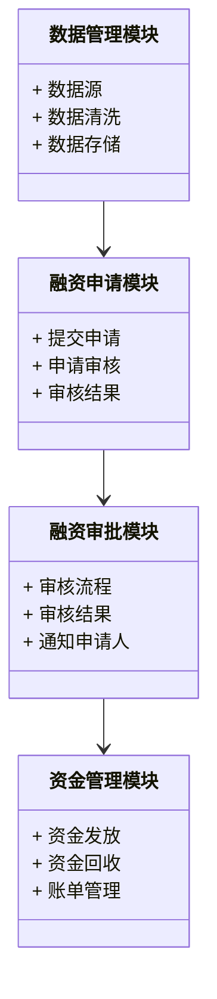

                 


# 智能供应链金融平台设计

> 关键词：智能供应链，供应链金融，区块链，大数据，人工智能

> 摘要：本文详细探讨了智能供应链金融平台的设计与实现，通过整合人工智能、大数据和区块链等先进技术，解决了传统供应链金融中的痛点问题。文章从背景、核心概念、算法原理、系统架构到项目实战，全面解析智能供应链金融平台的设计思路和实现细节，为读者提供深入的技术见解。

---

# 第一部分: 智能供应链金融平台背景与核心概念

## 第1章: 智能供应链金融平台概述

### 1.1 供应链金融的基本概念
供应链金融是指通过整合供应链上的资金流、物流和信息流，为供应链上的企业（如供应商、制造商、分销商和零售商）提供融资服务的模式。传统的供应链金融模式通常依赖于核心企业的信用支持，存在融资效率低、成本高、透明度不足等问题。

#### 1.1.1 供应链金融的定义与特点
供应链金融是一种通过优化资金流来提升供应链整体效率的融资模式。其特点包括：
- **融资链条长**：覆盖供应链上的多个环节。
- **依赖核心企业**：传统模式中，供应商通常依赖核心企业的信用支持。
- **融资成本高**：传统模式中，中小企业的融资成本较高，且审批流程繁琐。

#### 1.1.2 供应链金融的核心参与方
供应链金融的主要参与方包括：
- **核心企业**：供应链中的主导企业，通常为下游的大客户。
- **供应商**：为供应链提供原材料或零部件的企业。
- **金融机构**：包括银行、保理公司等，提供融资服务。
- **客户**：供应链的最终消费者或企业。

#### 1.1.3 供应链金融的传统模式与挑战
传统供应链金融模式的核心是通过核心企业的信用支持，为上游供应商提供融资服务。然而，这种模式存在以下挑战：
- **信息不对称**：金融机构难以全面了解供应链上的企业信用状况。
- **融资效率低**：审批流程繁琐，融资周期长。
- **透明度不足**：缺乏统一的信息平台，导致各方信息不共享。

### 1.2 智能供应链金融的提出
智能供应链金融是通过引入人工智能、大数据和区块链等技术，优化传统供应链金融模式的不足。

#### 1.2.1 传统供应链金融的痛点
- **信息孤岛**：供应链上的企业之间信息不透明，导致融资效率低下。
- **信用评估难**：金融机构难以准确评估中小企业的信用状况。
- **融资渠道有限**：中小企业难以获得足够的融资支持。

#### 1.2.2 智能化技术如何解决供应链金融问题
- **人工智能**：通过机器学习算法，实现对供应链上企业的信用评估和风险预测。
- **大数据**：利用海量数据，分析企业的经营状况，提高融资决策的准确性。
- **区块链**：通过区块链技术，确保供应链上的数据不可篡改，提升信任度。

#### 1.2.3 智能供应链金融的定义与目标
智能供应链金融是指通过智能化技术，优化供应链上的资金流、物流和信息流，实现高效、透明和低成本的融资服务。其目标是：
- 提高融资效率，降低融资成本。
- 增强供应链的透明度和信任度。
- 优化资源配置，提升供应链整体效率。

### 1.3 智能供应链金融平台的核心价值
智能供应链金融平台通过整合智能化技术，为供应链上的企业提供了以下核心价值：
- **高效融资**：通过智能算法，快速评估企业的信用状况，缩短融资周期。
- **降低融资成本**：通过大数据分析，优化融资方案，降低企业的融资成本。
- **提高透明度**：通过区块链技术，确保数据的真实性和不可篡改性，提升信任度。

---

## 第2章: 智能供应链金融的核心概念与联系

### 2.1 供应链金融平台的组成要素
智能供应链金融平台由以下几个关键部分组成：
- **供应链参与方**：包括核心企业、供应商、金融机构和客户。
- **数据流**：包括企业的经营数据、交易数据和融资数据。
- **业务流程**：包括融资申请、审核、放款和还款管理。

#### 2.1.1 供应链参与方的实体关系
通过ER图可以清晰展示供应链金融平台中的实体关系。

```mermaid
er
    actor 供应链金融平台
    actor 企业
    actor 金融机构
    actor 供应商
    actor 客户
    entity 供应链数据
    entity 融资需求
    entity 融资方案
    entity 合同
    entity 支付
    relation 参与方关系
    relation 数据流关系
```

---

## 第3章: 智能供应链金融的核心算法原理

### 3.1 支持向量机（SVM）在供应链金融中的应用
支持向量机（SVM）是一种常用的机器学习算法，广泛应用于信用评估和风险预测。

#### 3.1.1 SVM算法简介
支持向量机是一种监督学习算法，主要用于分类和回归问题。其核心思想是通过构建一个超平面，将数据点分为两类。

#### 3.1.2 SVM算法在信用评估中的应用
在供应链金融中，SVM算法可以用于评估企业的信用状况。通过对企业历史数据的分析，构建一个分类模型，预测企业的信用风险。

#### 3.1.3 SVM算法的实现步骤
1. 数据预处理：收集并清洗数据，提取特征。
2. 模型训练：使用训练数据训练SVM模型。
3. 模型评估：通过测试数据评估模型的准确性。
4. 模型优化：调整参数，提高模型性能。

#### 3.1.4 SVM算法的优缺点
- **优点**：分类能力强，适合小样本数据。
- **缺点**：对高维数据处理能力较弱。

#### 3.1.5 SVM算法的Python实现
以下是一个简单的SVM算法实现示例：

```python
from sklearn import svm
import numpy as np

# 创建训练数据
X = np.array([[0, 0], [1, 1], [2, 2], [3, 3]])
y = [0, 1, 0, 1]

# 创建SVM模型并训练
model = svm.SVC()
model.fit(X, y)

# 预测新数据
print(model.predict([[2.5, 2.5]]))  # 输出：1
```

---

### 3.2 基于区块链的智能合约实现
区块链技术在供应链金融中的应用主要体现在智能合约的实现上。

#### 3.2.1 区块链技术的基本原理
区块链是一种分布式账本技术，通过去中心化的方式记录数据，确保数据的安全性和不可篡改性。

#### 3.2.2 智能合约的工作流程
智能合约是一种基于区块链的自动执行程序，用于实现合同条款的自动履行。

#### 3.2.3 智能合约的实现代码
以下是一个简单的智能合约实现示例：

```solidity
// SPDX-License-Identifier: MIT
pragma solidity ^0.8.0;

contract SupplyChainFinance {
    address payable public supplier;
    address payable public buyer;

    constructor(address payable _supplier, address payable _buyer) {
        supplier = _supplier;
        buyer = _buyer;
    }

    function fundTransfer() public payable {
        require(msg.sender == supplier, "Only supplier can initiate transfer");
        require(msg.value == 100 ether, "Amount must be 100 ether");

        buyer.transfer(msg.value);
    }
}
```

---

## 第4章: 智能供应链金融平台的系统分析与架构设计

### 4.1 系统功能设计
智能供应链金融平台的核心功能模块包括：
- **数据管理模块**：收集和处理供应链上的数据。
- **融资申请模块**：企业提交融资申请。
- **融资审批模块**：金融机构审核融资申请。
- **资金管理模块**：管理融资资金的发放和回收。

#### 4.1.1 数据管理模块的类图


### 4.2 系统架构设计
智能供应链金融平台的系统架构设计需要考虑高可用性和可扩展性。

#### 4.2.1 系统架构图


---

## 第5章: 项目实战

### 5.1 环境安装
要运行智能供应链金融平台，需要安装以下环境：
- **Python**：3.6+
- **TensorFlow**：2.0+
- **Solidity**：0.8+

### 5.2 核心代码实现
以下是一个简单的智能合约实现示例：

```python
from web3 import Web3, HTTPProvider
from web3.contract import Contract

# 初始化Web3实例
web3 = Web3(HTTPProvider('http://localhost:8545'))

# 加载智能合约ABI
abi = '[...]'

# 实例化合约
contract = Contract(web3, '0x...', abi)

# 调用智能合约方法
print(contract.functions.getBalance().call())
```

### 5.3 案例分析
通过一个具体的案例分析，展示智能供应链金融平台的实际应用效果。

---

## 第6章: 总结与展望

### 6.1 总结
智能供应链金融平台通过整合人工智能、大数据和区块链等技术，解决了传统供应链金融中的痛点问题，提高了融资效率和透明度。

### 6.2 展望
未来，随着技术的不断发展，智能供应链金融平台将更加智能化和自动化，为企业提供更高效、更低成本的融资服务。

---

# 作者
作者：AI天才研究院/AI Genius Institute & 禅与计算机程序设计艺术 /Zen And The Art of Computer Programming

