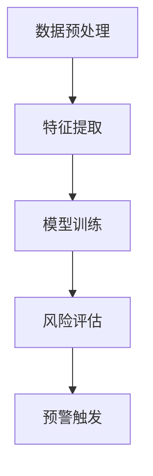
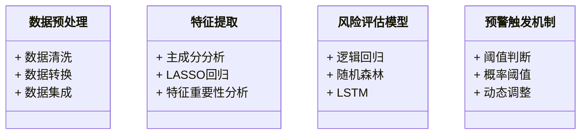
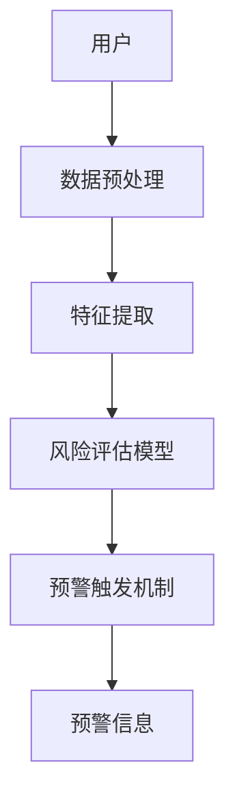
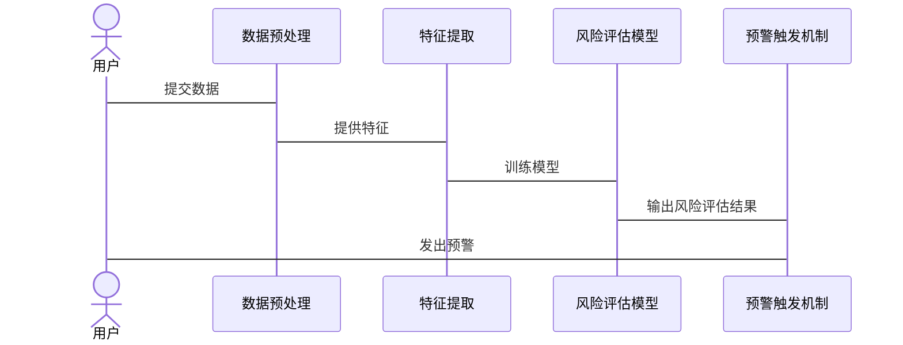

                 


# 智能供应链金融风险预警系统

## 关键词
智能供应链金融, 风险预警系统, 机器学习, 大数据分析, 金融风险管理

## 摘要
本文将详细探讨智能供应链金融风险预警系统的构建与应用。从供应链金融的基本概念出发，分析智能供应链金融的风险预警系统的核心概念与联系，详细介绍其算法原理，包括数据预处理、特征提取、模型训练及风险评估等关键步骤。随后，通过系统架构设计，展示如何实现一个高效、可靠的智能供应链金融风险预警系统。最后，通过具体项目实战，验证系统的可行性和有效性，总结经验与教训，并提出改进建议。

---

## 第二部分: 智能供应链金融风险预警系统的核心概念与联系

### 第4章: 核心概念原理

#### 4.1 数据来源与处理
智能供应链金融风险预警系统的数据来源主要包括供应链上的企业交易数据、市场数据、财务数据以及外部新闻数据等。这些数据需要经过清洗、整合和特征提取等处理，以便后续的风险评估模型能够有效利用。

#### 4.2 风险评估模型
风险评估模型是智能供应链金融风险预警系统的核心部分，常用的模型包括逻辑回归、随机森林、支持向量机（SVM）以及深度学习模型（如LSTM）。模型的选择取决于数据的特性和风险评估的精度要求。

#### 4.3 预警触发机制
预警触发机制负责根据风险评估模型的输出结果，判断是否需要触发预警。通常采用阈值判断、概率阈值以及动态调整等方法，确保预警的及时性和准确性。

### 4.4 核心概念属性特征对比表格
| 概念       | 属性特征                 |
|------------|--------------------------|
| 数据来源   | 多样性、实时性、准确性   |
| 风险评估模型 | 可解释性、可扩展性、鲁棒性 |
| 预警触发机制 | 及时性、准确性、可操作性 |

### 4.5 ER实体关系图架构
```mermaid
er
actor: 用户
actor: 供应链企业
actor: 金融机构
class: 供应链数据
class: 风险评估模型
class: 预警信息
```

---

## 第三部分: 智能供应链金融风险预警系统的算法原理

### 第5章: 算法流程图



### 5.1 数据预处理
数据预处理是智能供应链金融风险预警系统的第一步，主要包括数据清洗、数据转换和数据集成。例如，清洗数据中的缺失值和异常值，转换数据格式以适应模型需求，集成多源数据以提高模型的准确性。

### 5.2 特征提取
特征提取是通过选择或创建能够最好地预测目标变量的特征，以提高模型的性能。常用的方法包括主成分分析（PCA）、LASSO回归以及基于树模型的特征重要性分析。

### 5.3 模型训练
模型训练是通过训练数据集，利用机器学习算法训练风险评估模型。例如，使用逻辑回归模型进行二分类任务，或者使用随机森林模型进行非线性分类任务。

### 5.4 风险评估
风险评估是根据训练好的模型，对供应链企业的风险进行评估，并输出风险概率或风险等级。例如，使用逻辑回归模型输出风险概率P，P值越大，风险越高。

### 5.5 预警触发
预警触发是根据风险评估结果，判断是否需要触发预警。例如，设定一个阈值，当风险概率P超过阈值时，触发预警。

---

## 第四部分: 系统分析与架构设计方案

### 第6章: 问题场景介绍

#### 6.1 问题背景
供应链金融中的风险主要来源于供应链上的企业信用风险、操作风险以及市场风险。传统的方法往往依赖人工经验，难以及时准确地识别和预警风险。

#### 6.2 项目介绍
本项目旨在开发一个基于机器学习的智能供应链金融风险预警系统，通过实时监测供应链上的企业数据，快速识别潜在风险，并及时发出预警。

### 6.3 系统功能设计

#### 6.3.1 领域模型类图


#### 6.3.2 系统架构设计


#### 6.3.3 系统接口设计
系统接口设计主要包括数据接口、模型接口和预警接口。数据接口负责与数据源对接，模型接口负责与机器学习模型对接，预警接口负责向用户或系统发送预警信息。

#### 6.3.4 系统交互流程图


---

## 第五部分: 项目实战

### 第7章: 环境安装与系统实现

#### 7.1 环境安装
需要安装的环境包括Python、机器学习库（如scikit-learn、xgboost）、数据处理库（如pandas、numpy）以及可视化库（如Matplotlib、Seaborn）。此外，还需要安装Mermaid和LaTeX工具，以便生成图表和公式。

#### 7.2 核心代码实现

##### 7.2.1 数据预处理
```python
import pandas as pd
import numpy as np

# 数据清洗
def preprocess(data):
    # 处理缺失值
    data = data.dropna()
    # 处理异常值
    data = data[(data['amount'] > 0) & (data['date'].notna())]
    return data
```

##### 7.2.2 特征提取
```python
from sklearn.decomposition import PCA

def feature_extraction(data):
    # 使用主成分分析提取特征
    pca = PCA(n_components=10)
    features = pca.fit_transform(data)
    return features
```

##### 7.2.3 模型训练
```python
from sklearn.ensemble import RandomForestClassifier

def train_model(features, labels):
    # 训练随机森林模型
    model = RandomForestClassifier(n_estimators=100, max_depth=5, random_state=42)
    model.fit(features, labels)
    return model
```

##### 7.2.4 风险评估
```python
def risk_assessment(model, new_features):
    # 预测风险概率
    probabilities = model.predict_proba(new_features)[:, 1]
    return probabilities
```

##### 7.2.5 预警触发
```python
def trigger_warning(probabilities, threshold=0.5):
    # 判断是否触发预警
    warnings = probabilities > threshold
    return warnings
```

#### 7.3 案例分析与解读
通过实际案例分析，展示系统的运行过程和效果。例如，假设某供应链企业的风险概率为0.6，超过阈值0.5，系统将触发预警，并通知相关方采取措施。

#### 7.4 项目小结
通过项目实战，验证了智能供应链金融风险预警系统的可行性和有效性。同时，也发现了系统中存在的问题，例如模型的可解释性不足，数据实时性不足等。

---

## 第六部分: 最佳实践与总结

### 第8章: 最佳实践 tips

#### 8.1 系统设计 tips
在设计智能供应链金融风险预警系统时，需要注意系统的实时性、可扩展性和可维护性。同时，要确保数据的安全性和隐私性，防止数据泄露和滥用。

#### 8.2 项目实施 tips
在项目实施过程中，要注重数据的清洗和特征提取，确保数据的质量和特征的有效性。同时，要选择合适的算法和模型，进行充分的调参和验证，以提高系统的准确性和稳定性。

#### 8.3 系统维护 tips
在系统上线后，要定期监控系统的运行状态，及时发现和解决系统中的问题。同时，要定期更新模型和算法，以适应市场环境的变化和数据的变化。

### 8.4 小结
智能供应链金融风险预警系统的开发和应用，不仅提高了供应链金融的风险管理能力，还为企业的供应链管理提供了有力的工具和方法。

### 8.5 注意事项
在实际应用中，需要注意系统的可扩展性和可维护性，同时要确保数据的安全性和隐私性。此外，要定期更新模型和算法，以适应市场环境的变化和数据的变化。

### 8.6 拓展阅读
建议读者进一步学习相关领域的知识，例如供应链管理、金融风险管理、机器学习等，以提高自己的综合能力和技术水平。

---

## 作者：AI天才研究院/AI Genius Institute & 禅与计算机程序设计艺术 /Zen And The Art of Computer Programming

