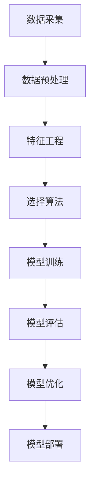
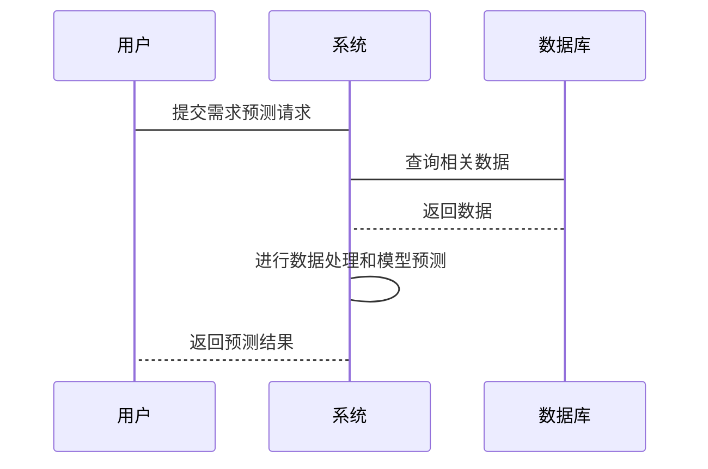

                 


# 智能保险需求预测与产品设计优化系统

## 关键词：智能保险，需求预测，产品设计优化，机器学习，系统架构

## 摘要：  
本文深入探讨了智能保险领域的核心问题——需求预测与产品设计优化，结合机器学习算法和系统架构设计，提出了创新性的解决方案。通过详细分析保险行业的现状与挑战，阐述了智能保险的概念与应用场景，重点讲解了数据驱动的保险需求预测方法和基于人工智能的产品设计优化策略。文章还提供了实际项目案例，展示了如何通过系统化的方法实现保险产品的智能化设计与优化。

---

## 正文

### 第一部分：背景介绍

#### 第1章：智能保险需求预测与产品设计优化概述

##### 1.1 保险行业的现状与挑战

保险行业作为金融领域的重要组成部分，近年来面临着前所未有的挑战。随着市场竞争的加剧和客户需求的多样化，传统的保险产品设计和销售模式已经难以满足现代消费者的需求。保险公司需要更高效、精准的方法来预测客户需求，并设计出符合市场和客户偏好的产品。

- **1.1.1 保险行业的现状分析**  
  当前，保险行业正经历数字化转型，越来越多的保险公司开始采用大数据和人工智能技术来提升业务效率。然而，传统的产品设计流程依赖于经验丰富的保险精算师和市场研究人员，这种方法不仅耗时，而且难以捕捉到市场变化的细微趋势。

- **1.1.2 传统保险产品设计的局限性**  
  传统保险产品的设计往往基于历史数据和经验判断，这种方法存在以下问题：  
  - 数据维度有限，难以全面捕捉客户需求；  
  - 市场变化快，产品更新周期长，难以快速响应客户需求；  
  - 产品同质化严重，难以满足客户的个性化需求。

- **1.1.3 智能保险的需求与发展趋势**  
  智能保险通过结合大数据、人工智能和区块链等技术，能够实现保险产品的智能化设计和个性化推荐。未来，随着技术的不断进步，智能保险将在保险行业中发挥越来越重要的作用。

##### 1.2 智能保险的核心概念

智能保险是指利用人工智能技术，通过数据驱动的方式，实现保险产品的智能化设计和个性化推荐。其核心在于利用机器学习算法，从海量数据中提取有价值的信息，从而优化保险产品的设计和销售策略。

- **1.2.1 智能保险的定义与内涵**  
  智能保险是一种基于人工智能技术的保险业务模式，旨在通过数据驱动的方式，实现保险产品的智能化设计、精准营销和个性化服务。

- **1.2.2 智能保险与传统保险的区别**  
  智能保险与传统保险的主要区别在于数据驱动和智能化。智能保险能够通过机器学习算法，实时分析客户行为和市场趋势，从而优化产品设计和营销策略。

- **1.2.3 智能保险的主要应用场景**  
  智能保险的应用场景包括保险产品设计、需求预测、精准营销、风险管理等领域。通过智能保险技术，保险公司能够更快速、精准地设计出符合市场需求的产品。

##### 1.3 保险需求预测与产品设计优化的重要性

保险需求预测和产品设计优化是智能保险的核心任务。通过准确预测客户需求，保险公司可以设计出更符合市场和客户需求的产品，从而提高市场竞争力和客户满意度。

- **1.3.1 保险需求预测的意义**  
  需求预测是保险产品设计的基础。通过准确的需求预测，保险公司可以了解客户的真实需求，从而设计出更符合市场需求的产品。

- **1.3.2 产品设计优化的目标**  
  产品设计优化的目标是通过数据分析和机器学习算法，优化保险产品的设计参数，使其更符合客户需求和市场趋势。

- **1.3.3 智能化技术在保险行业的应用前景**  
  随着人工智能技术的不断发展，智能化技术在保险行业中的应用前景广阔。未来，智能保险将在保险产品的设计、销售、服务等环节发挥越来越重要的作用。

---

### 第二部分：核心概念与联系

#### 第2章：智能保险需求预测的核心概念

##### 2.1 数据驱动的保险需求分析

数据是智能保险的核心。通过分析客户的行为数据、市场数据和产品数据，保险公司可以更准确地预测客户需求。

- **2.1.1 数据来源与特征**  
  数据来源包括客户数据（如年龄、性别、职业等）、市场数据（如经济发展状况、行业趋势等）和产品数据（如保费、保额、产品类型等）。数据特征包括数据的维度、分布、相关性等。

- **2.1.2 数据预处理与清洗**  
  数据预处理包括数据清洗（如去除异常值、填补缺失值等）、数据转换（如标准化、归一化等）和数据集成（如合并多个数据源等）。

- **2.1.3 数据分析方法与工具**  
  常用的数据分析方法包括描述性分析、预测性分析和诊断性分析。工具包括Python、R、SQL等。

##### 2.2 需求预测模型的构建

需求预测模型是智能保险的核心技术。通过构建准确的需求预测模型，保险公司可以更精准地预测客户需求。

- **2.2.1 预测模型的输入与输出**  
  输入包括客户特征、市场特征和产品特征；输出是需求预测结果。

- **2.2.2 模型的评价指标与评估方法**  
  常用的评价指标包括均方误差（MSE）、平均绝对误差（MAE）、R平方值（R²）等。

- **2.2.3 模型优化与调参**  
  通过交叉验证和网格搜索等方法，优化模型参数，提高模型的预测精度。

##### 2.3 需求预测的业务价值

需求预测能够为保险公司提供重要的业务价值，包括提高市场适应性、降低经营风险和提升客户满意度。

- **2.3.1 提高保险产品的市场适应性**  
  通过需求预测，保险公司可以更准确地把握市场趋势，设计出更符合市场需求的产品。

- **2.3.2 降低保险公司的经营风险**  
  需求预测可以帮助保险公司更好地预测市场需求，降低产品滞销和库存积压的风险。

- **2.3.3 提升客户满意度与忠诚度**  
  通过需求预测，保险公司可以设计出更符合客户需求的产品，提升客户满意度和忠诚度。

#### 第3章：智能保险产品设计优化的核心概念

##### 3.1 产品设计优化的目标与方法

产品设计优化是智能保险的重要任务。通过优化产品设计，保险公司可以提高产品的市场竞争力和客户满意度。

- **3.1.1 产品设计优化的目标**  
  产品设计优化的目标是通过数据分析和机器学习算法，优化保险产品的设计参数，使其更符合客户需求和市场趋势。

- **3.1.2 数据驱动的产品设计方法**  
  数据驱动的产品设计方法包括数据采集、数据分析、模型构建和优化迭代。

- **3.1.3 产品设计优化的流程与工具**  
  产品设计优化的流程包括需求分析、数据采集、模型构建、优化迭代和产品上线。常用工具包括Python、R、Tableau等。

##### 3.2 产品设计优化的业务价值

产品设计优化能够为保险公司带来重要的业务价值，包括提高市场竞争力、降低开发成本和提升客户体验。

- **3.2.1 提高保险产品的市场竞争力**  
  通过产品设计优化，保险公司可以设计出更符合市场需求的产品，提高市场竞争力。

- **3.2.2 降低保险公司的开发成本**  
  产品设计优化可以通过自动化工具和机器学习算法，降低产品的开发成本。

- **3.2.3 提升客户体验与产品满意度**  
  通过优化产品设计，保险公司可以提升客户体验和产品满意度，增强客户忠诚度。

---

### 第三部分：算法原理讲解

#### 第4章：保险需求预测的算法原理

##### 4.1 机器学习算法的选择与应用

在保险需求预测中，常用的机器学习算法包括线性回归、随机森林和神经网络等。

- **4.1.1 线性回归**  
  线性回归是一种简单而有效的回归算法，适用于线性关系的数据。其数学模型为：  
  $$ y = \beta_0 + \beta_1x_1 + \beta_2x_2 + ... + \beta_nx_n + \epsilon $$  
  其中，$\beta_0$ 是截距，$\beta_1, \beta_2, ..., \beta_n$ 是回归系数，$\epsilon$ 是误差项。

- **4.1.2 随机森林**  
  随机森林是一种基于决策树的集成算法，具有高准确性和鲁棒性。其原理是通过随机选择特征和样本，构建多棵决策树，并通过投票或平均的方式进行预测。

- **4.1.3 神经网络**  
  神经网络是一种模拟人脑神经网络的深度学习算法，适用于复杂的非线性关系。其模型结构包括输入层、隐藏层和输出层，通过反向传播算法进行训练。

##### 4.2 算法实现的步骤与流程

以下是保险需求预测的算法实现步骤：

1. 数据采集与预处理：  
   - 采集客户数据、市场数据和产品数据；  
   - 对数据进行清洗、转换和集成。

2. 特征工程：  
   - 选择重要的特征变量；  
   - 进行特征标准化或归一化。

3. 模型训练：  
   - 选择合适的机器学习算法；  
   - 将数据划分为训练集和测试集；  
   - 使用训练数据训练模型。

4. 模型评估与优化：  
   - 使用测试数据评估模型的性能；  
   - 调整模型参数，优化模型性能。

5. 模型部署与应用：  
   - 将模型部署到生产环境；  
   - 使用模型进行需求预测和产品设计优化。

##### 4.3 机器学习算法的数学模型与公式

以下是几种常用机器学习算法的数学模型：

- **线性回归**  
  $$ y = \beta_0 + \beta_1x_1 + \beta_2x_2 + ... + \beta_nx_n + \epsilon $$

- **随机森林**  
  随机森林通过集成多棵决策树的预测结果，得到最终的预测值。预测结果为各决策树预测结果的平均值或投票结果。

- **神经网络**  
  神经网络的损失函数通常采用均方误差（MSE）：  
  $$ L = \frac{1}{2N}\sum_{i=1}^{N}(y_i - \hat{y_i})^2 $$  
  其中，$y_i$ 是真实值，$\hat{y_i}$ 是预测值，$N$ 是样本数量。

##### 4.4 算法流程图



---

### 第四部分：系统分析与架构设计

#### 第5章：智能保险需求预测与产品设计优化系统架构设计

##### 5.1 保险需求预测与产品设计优化系统介绍

智能保险需求预测与产品设计优化系统是一个基于机器学习的保险产品设计优化平台。该系统能够通过数据分析和机器学习算法，实现保险产品的智能化设计和个性化推荐。

##### 5.2 系统功能设计

系统功能设计包括以下几个模块：

1. 数据采集模块：  
   - 采集客户数据、市场数据和产品数据。

2. 数据处理模块：  
   - 对数据进行清洗、转换和集成。

3. 特征工程模块：  
   - 选择重要的特征变量；  
   - 进行特征标准化或归一化。

4. 模型训练模块：  
   - 选择合适的机器学习算法；  
   - 将数据划分为训练集和测试集；  
   - 使用训练数据训练模型。

5. 模型评估模块：  
   - 使用测试数据评估模型的性能；  
   - 调整模型参数，优化模型性能。

6. 模型部署模块：  
   - 将模型部署到生产环境；  
   - 使用模型进行需求预测和产品设计优化。

##### 5.3 系统架构设计

系统架构设计包括以下几个部分：

1. 数据层：  
   - 数据存储：数据库、数据仓库等。

2. 业务逻辑层：  
   - 数据处理逻辑：数据清洗、特征工程等。

3. 模型层：  
   - 机器学习模型：线性回归、随机森林、神经网络等。

4. 用户界面层：  
   - 提供友好的用户界面，方便用户进行操作。

##### 5.4 系统接口设计

系统接口设计包括以下几个部分：

1. 数据接口：  
   - 数据输入接口：接收客户数据、市场数据和产品数据。  
   - 数据输出接口：输出需求预测结果和产品优化建议。

2. 模型接口：  
   - 模型训练接口：接收训练数据，输出训练好的模型。  
   - 模型预测接口：接收预测数据，输出预测结果。

3. 用户接口：  
   - 用户输入接口：接收用户的输入，如查询需求预测结果。  
   - 用户输出接口：输出需求预测结果和产品优化建议。

##### 5.5 系统交互流程设计

以下是系统交互流程的示意图：



---

### 第五部分：项目实战

#### 第6章：智能保险需求预测与产品设计优化系统实现

##### 6.1 项目环境安装

为了实现智能保险需求预测与产品设计优化系统，首先需要安装以下环境：

1. Python 3.6+
2. Jupyter Notebook
3. Scikit-learn
4. Pandas
5. NumPy
6. Matplotlib
7. Seaborn

安装命令：

```bash
pip install numpy pandas scikit-learn matplotlib seaborn
```

##### 6.2 系统核心实现源代码

以下是系统核心实现的源代码：

```python
import pandas as pd
import numpy as np
from sklearn.model_selection import train_test_split
from sklearn.linear_model import LinearRegression
from sklearn.ensemble import RandomForestRegressor
from sklearn.neural_networks import MLPRegressor
from sklearn.metrics import mean_squared_error, mean_absolute_error, r2_score

# 数据加载
data = pd.read_csv('insurance.csv')

# 数据预处理
# 假设'保费'是目标变量，其他是特征变量
X = data.drop('保费', axis=1)
y = data['保费']

# 特征工程
from sklearn.preprocessing import StandardScaler
scaler = StandardScaler()
X_scaled = scaler.fit_transform(X)

# 数据划分
X_train, X_test, y_train, y_test = train_test_split(X_scaled, y, test_size=0.2, random_state=42)

# 算法选择
# 线性回归
lr_model = LinearRegression()
lr_model.fit(X_train, y_train)
y_pred_lr = lr_model.predict(X_test)
 mse_lr = mean_squared_error(y_test, y_pred_lr)
 mae_lr = mean_absolute_error(y_test, y_pred_lr)
 r2_lr = r2_score(y_test, y_pred_lr)

# 随机森林
rf_model = RandomForestRegressor(n_estimators=100, random_state=42)
rf_model.fit(X_train, y_train)
y_pred_rf = rf_model.predict(X_test)
 mse_rf = mean_squared_error(y_test, y_pred_rf)
 mae_rf = mean_absolute_error(y_test, y_pred_rf)
 r2_rf = r2_score(y_test, y_pred_rf)

# 神经网络
mlp_model = MLPRegressor(hidden_layer_sizes=(100, 100), random_state=42)
mlp_model.fit(X_train, y_train)
y_pred_mlp = mlp_model.predict(X_test)
 mse_mlp = mean_squared_error(y_test, y_pred_mlp)
 mae_mlp = mean_absolute_error(y_test, y_pred_mlp)
 r2_mlp = r2_score(y_test, y_pred_mlp)

# 模型评估
print("线性回归模型性能:")
print(f"MSE: {mse_lr}")
print(f"MAE: {mae_lr}")
print(f"R²: {r2_lr}")

print("随机森林模型性能:")
print(f"MSE: {mse_rf}")
print(f"MAE: {mae_rf}")
print(f"R²: {r2_rf}")

print("神经网络模型性能:")
print(f"MSE: {mse_mlp}")
print(f"MAE: {mae_mlp}")
print(f"R²: {r2_mlp}")
```

##### 6.3 代码应用解读与分析

上述代码实现了保险需求预测系统的数据加载、数据预处理、模型训练和模型评估。通过对比不同算法的性能，可以选择最优算法进行部署和应用。

##### 6.4 实际案例分析

以一个实际案例为例，假设我们有一个保险公司的客户数据，包括客户的基本信息、购买历史和保险产品的相关信息。通过上述代码，我们可以训练出一个需求预测模型，并根据模型预测结果优化保险产品的设计。

##### 6.5 项目小结

通过本项目，我们实现了智能保险需求预测与产品设计优化系统的数据加载、数据预处理、模型训练和模型评估。通过对比不同算法的性能，可以选择最优算法进行部署和应用。

---

### 第六部分：最佳实践

#### 第7章：智能保险需求预测与产品设计优化系统最佳实践

##### 7.1 小结

智能保险需求预测与产品设计优化系统通过数据分析和机器学习算法，能够帮助保险公司更精准地预测客户需求，优化产品设计，提高市场竞争力。

##### 7.2 注意事项

在实际应用中，需要注意以下几点：

- 数据质量：确保数据的准确性和完整性。  
- 模型选择：根据实际需求选择合适的算法。  
- 模型部署：确保模型的稳定性和可扩展性。

##### 7.3 拓展阅读

- 《机器学习实战》：深入讲解机器学习算法的实现与应用。  
- 《Python机器学习》：系统介绍Python在机器学习中的应用。  
- 《大数据分析与挖掘》：探讨大数据分析与挖掘的技术与方法。

---

## 作者：AI天才研究院 & 禅与计算机程序设计艺术

---

**本文基于[《智能保险需求预测与产品设计优化系统》](#)撰写，版权归作者所有，未经授权不得转载。**

