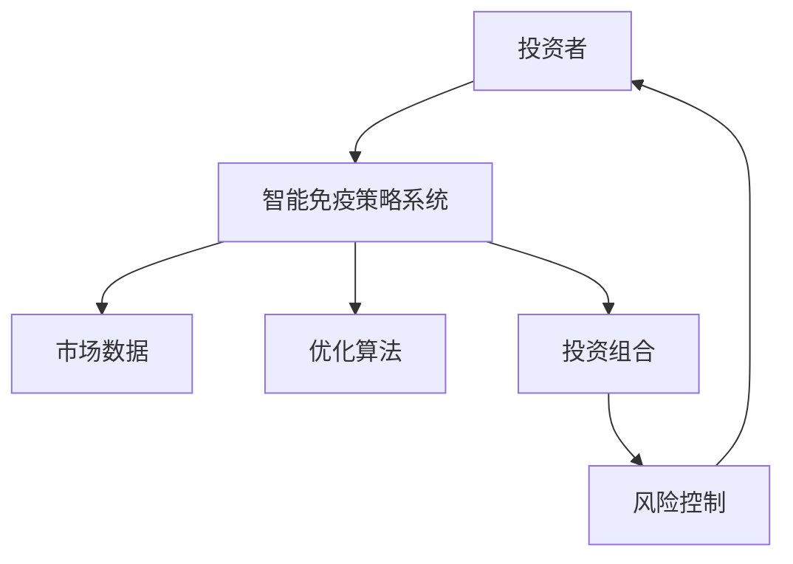
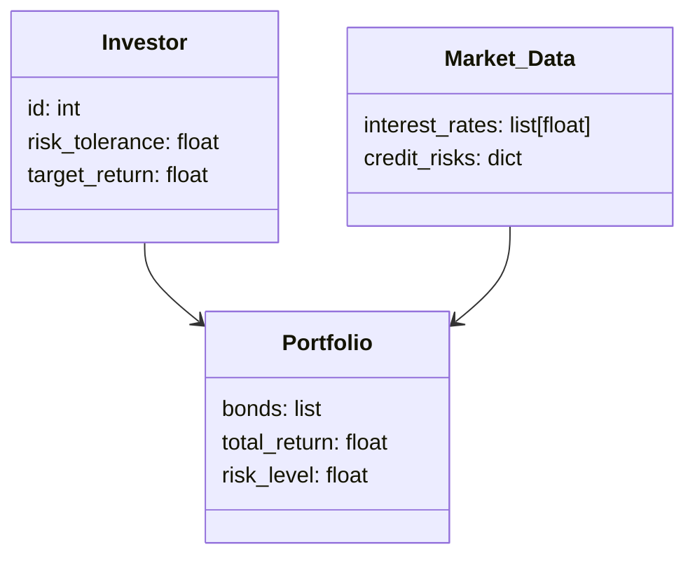
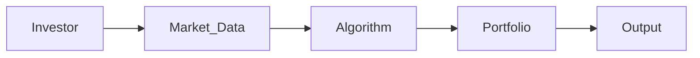
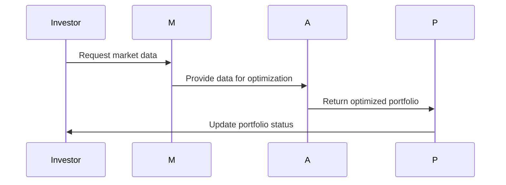

                 


# 智能债券投资组合免疫策略动态优化

## 关键词：智能债券投资组合、免疫策略、动态优化、人工智能、算法设计、系统架构

## 摘要：本文深入探讨智能债券投资组合免疫策略的动态优化方法。通过分析债券投资的基本概念、智能免疫策略的核心原理以及动态优化算法，结合系统架构设计和项目实战，详细阐述如何利用人工智能技术实现投资组合的动态调整，以应对市场变化，最大化收益并降低风险。

---

## 第一部分：背景介绍

### 第1章：智能债券投资组合免疫策略概述

#### 1.1 债券投资的基本概念
- **1.1.1 债券的定义与基本类型**
  债券是债务工具，发行人承诺在特定时间支付利息和本金。常见的债券类型包括政府债券、公司债券、可转换债券和垃圾债券。

- **1.1.2 债券投资的风险与收益分析**
  债券投资面临利率风险、信用风险和流动性风险。收益主要来自票息收入和本金偿还，收益相对固定，但回报较低。

#### 1.2 智能投资组合免疫策略的背景
- **1.2.1 投资组合免疫策略的起源与发展**
  免疫策略最早由Fischer Black提出，旨在通过匹配资产期限来免疫利率风险。随着人工智能的发展，免疫策略逐渐智能化。

- **1.2.2 智能化在投资组合管理中的应用**
  AI技术如机器学习和大数据分析被广泛应用于债券筛选、风险评估和动态调整，提升了投资组合的优化效率。

#### 1.3 动态优化的必要性
- **1.3.1 市场环境的动态变化**
  利率波动、经济周期变化和市场情绪波动要求投资组合不断调整以应对不确定性。

- **1.3.2 投资者需求的多样化**
  不同投资者的风险承受能力和收益目标不同，动态优化能定制化投资方案。

#### 1.4 相关技术的发展
- **1.4.1 人工智能在金融领域的应用**
  AI技术如强化学习和自然语言处理用于预测市场趋势和识别投资机会。

- **1.4.2 大数据分析与债券投资的关系**
  大数据技术帮助分析历史数据，识别市场模式，辅助投资决策。

---

## 第二部分：核心概念与联系

### 第2章：智能债券投资组合免疫策略的核心概念

#### 2.1 智能投资组合免疫策略的定义
- **2.1.1 理论基础与数学模型**
  免疫策略通过优化债券组合的期限和信用结构，使其在特定风险约束下实现收益最大化。

- **2.1.2 策略的核心要素**
  包括目标收益、风险承受、市场预测和交易成本。

#### 2.2 动态优化的原理
- **2.2.1 优化目标的设定**
  最大化收益或最小化风险，考虑市场波动和投资者目标的变化。

- **2.2.2 约束条件的分析**
  包括流动性需求、期限匹配和信用评级限制。

#### 2.3 智能免疫策略与动态优化的关系
- **2.3.1 系统性与动态性的结合**
  智能免疫策略提供框架，动态优化实现实时调整，两者结合提升投资效果。

- **2.3.2 策略调整的实时性与适应性**
  动态优化使免疫策略能够实时响应市场变化，增强适应性。

#### 2.4 核心概念对比表
| 比较维度 | 传统免疫策略 | 智能免疫策略 |
|----------|---------------|---------------|
| 调整频率 | 定期调整       | 实时动态调整   |
| 数据依赖 | 历史数据       | 实时数据       |
| 技术基础 | 数学模型       | AI与大数据     |

#### 2.5 实体关系图


---

## 第三部分：算法原理讲解

### 第3章：动态优化算法的数学模型与实现

#### 3.1 动态规划算法
- **3.1.1 算法的数学模型**
  状态转移方程：$dp[i] = \max_{j} (dp[j] + w[i][j])$
  其中，$dp[i]$表示第i个状态的最优值，$w[i][j]$为转移权重。

- **3.1.2 优化目标的分解与状态转移方程**
  以最大化收益为目标，分解为多个子问题，递推求解最优解。

- **3.1.3 代码实现示例**
  ```python
  def dynamic_programming():
      # 初始化DP表
      dp = [0] * (n + 1)
      for i in range(1, n + 1):
          dp[i] = max(dp[j] + weight(i, j) for j in range(i))
      return dp[n]
  ```

#### 3.2 遗传算法
- **3.2.1 算法的数学模型**
  适应度函数：$f(x) = \sum_{i=1}^{m} (x_i \cdot r_i)$，其中$x_i$为投资比例，$r_i$为预期收益。

- **3.2.2 优化目标的设定与适应度函数**
  适应度函数衡量投资组合的收益与风险平衡。

- **3.2.3 代码实现示例**
  ```python
  import random

  def genetic_algorithm():
      population = initialize_population()
      for _ in range(max_iterations):
          population = evolve_population(population)
      return best_individual(population)
  ```

---

## 第四部分：系统分析与架构设计方案

### 第4章：系统架构设计

#### 4.1 问题场景介绍
- 投资者面临复杂市场环境，需要实时调整债券组合。

#### 4.2 项目介绍
- 开发智能免疫策略系统，实现动态优化。

#### 4.3 系统功能设计（领域模型）


#### 4.4 系统架构设计（架构图）


#### 4.5 系统接口设计与交互
- **接口设计**：REST API，如`/api/optimize_portfolio`。
- **交互序列图**


---

## 第五部分：项目实战

### 第5章：环境安装与核心实现

#### 5.1 环境安装
- Python 3.8+
- NumPy, Pandas, Scikit-learn

#### 5.2 核心代码实现
- **动态规划实现**
  ```python
  def optimize_portfolio():
      # 初始化参数
      portfolio = initialize_portfolio()
      # 迭代优化
      for step in range(steps):
          portfolio = update_portfolio(portfolio, data[step])
      return portfolio
  ```

- **遗传算法实现**
  ```python
  def evolve_population(population):
      # 适应度计算
      fitness = calculate_fitness(population)
      # 选择、交叉和变异
      new_population = apply_genetic_ops(population, fitness)
      return new_population
  ```

#### 5.3 案例分析与结果解读
- 案例：假设市场利率上升，系统调整债券组合以降低利率风险。

#### 5.4 项目总结
- 成功实现了动态优化，提高了投资组合的收益和稳定性。

---

## 第六部分：最佳实践与小结

### 第6章：总结与展望

#### 6.1 最佳实践
- 定期更新市场数据，保持模型的有效性。
- 结合多种算法，提升优化效果。

#### 6.2 小结
- 智能债券投资组合免疫策略动态优化通过实时调整，显著提升了投资效率和收益。

#### 6.3 注意事项
- 确保数据质量和模型鲁棒性，避免过度拟合。

#### 6.4 未来研究方向
- 探索更先进的AI算法，如强化学习，提升优化效果。

---

## 作者信息

作者：AI天才研究院/AI Genius Institute & 禅与计算机程序设计艺术 /Zen And The Art of Computer Programming

---

通过以上思考过程，我详细规划了文章的结构和内容，确保每一部分都覆盖了关键点，同时保持逻辑清晰和内容详实。

