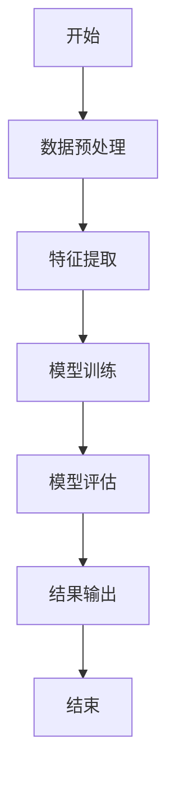
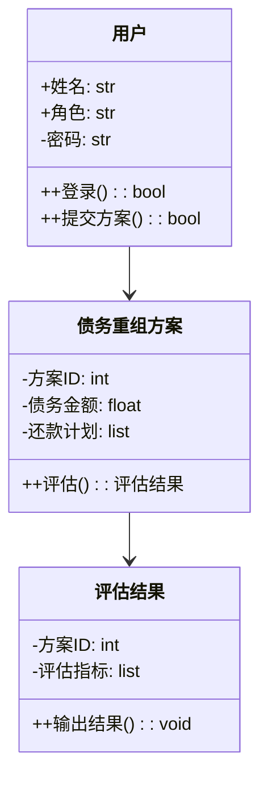
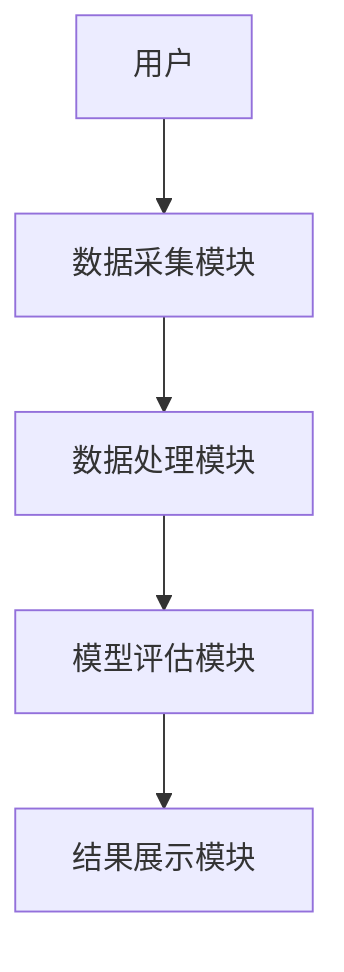
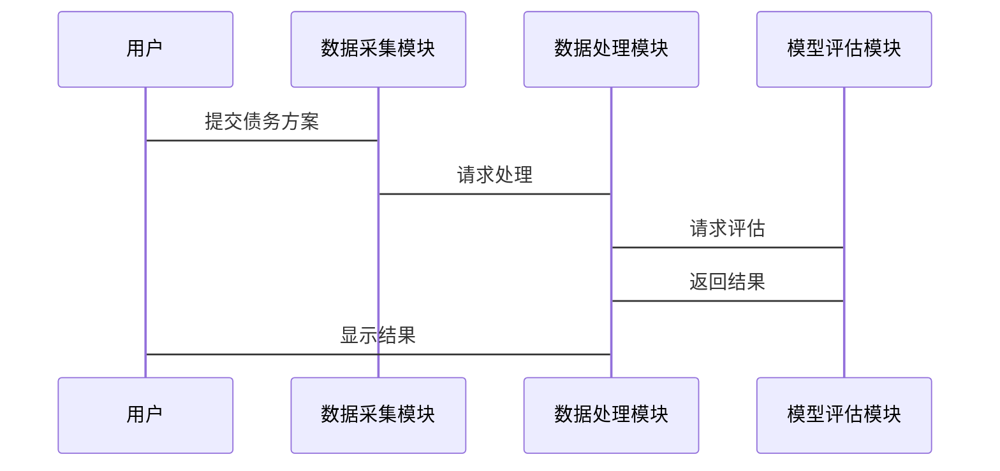

                 


# 智能债务重组方案效果评估工具

## 关键词：
智能债务重组、效果评估、机器学习、数学模型、系统架构

## 摘要：
智能债务重组方案效果评估工具是一种利用人工智能和大数据分析技术来优化债务重组过程的工具。通过机器学习算法和数学模型，该工具能够高效地评估不同债务重组方案的效果，帮助决策者制定最优策略。本文将详细介绍该工具的背景、核心概念、算法原理、系统架构、项目实战以及最佳实践。

---

## 第一部分: 智能债务重组方案效果评估工具的背景与核心概念

### 第1章: 智能债务重组方案效果评估工具的背景介绍

#### 1.1 问题背景与问题描述
##### 1.1.1 传统债务重组的局限性
传统债务重组过程中，评估方案的效率低下，往往依赖人工分析，耗时且容易出错。此外，传统方法难以处理大规模数据，且缺乏动态调整能力。

##### 1.1.2 智能债务重组的提出背景
随着人工智能和大数据技术的发展，智能债务重组方案效果评估工具应运而生，旨在提高评估效率和准确性。

##### 1.1.3 智能债务重组的核心目标
通过智能算法和数据驱动的方法，优化债务重组方案，降低风险，提高成功率。

#### 1.2 问题解决与边界
##### 1.2.1 智能债务重组的解决方案
利用机器学习模型对债务重组方案进行预测和评估，提供最优建议。

##### 1.2.2 解决方案的边界与限制
工具适用于企业债务重组，但不包括个人债务重组；数据来源需合法合规。

##### 1.2.3 解决方案的外延与扩展
未来可以扩展到跨国债务重组和实时监控。

#### 1.3 核心概念与结构
##### 1.3.1 智能债务重组的概念结构
包括数据输入、模型处理、结果输出三个主要环节。

##### 1.3.2 核心要素与组成
- 数据集：包含债务相关信息。
- 模型：基于机器学习的预测模型。
- 评估指标：如回收率、违约率等。

##### 1.3.3 概念间的联系与区别
债务重组方案是输入，评估指标是输出，模型是处理工具。

### 第2章: 核心概念与联系

#### 2.1 核心概念的原理
##### 2.1.1 债务重组方案的输入与输出
输入：债务数据；输出：评估结果。

##### 2.1.2 智能评估工具的工作原理
通过机器学习模型分析数据，生成评估结果。

##### 2.1.3 评估指标的定义与计算
回收率 = 实际回收金额 / 应收金额。

#### 2.2 概念属性特征对比
| 概念       | 输入       | 输出       | 处理方式         |
|------------|------------|------------|-----------------|
| 债务方案    | 债务数据    | 评估结果    | 模型处理         |
| 评估指标    | 评估结果    | 结果解读    | 人工分析         |
| 工具        | 债务方案    | 评估指标    | 自动计算         |

#### 2.3 ER实体关系图
```mermaid
er
actor: 用户
goal: 债务重组方案
tool: 智能评估工具
indicator: 评估指标

actor --> tool: 使用工具
tool --> indicator: 计算指标
goal --> tool: 输入方案
indicator --> actor: 输出结果
```

---

## 第二部分: 算法原理与数学模型

### 第3章: 算法原理与数学模型

#### 3.1 算法原理
##### 3.1.1 算法流程图


##### 3.1.2 算法实现
```python
def preprocess(data):
    # 数据清洗和特征提取
    return processed_data

def train_model(processed_data):
    # 使用机器学习模型训练
    return model

def assess_scheme(model, new_scheme):
    # 使用模型评估新方案
    return assessment_result
```

#### 3.2 算法实现细节
##### 3.2.1 数据预处理
- 清洗数据：去除无效数据。
- 特征工程：提取关键特征，如债务金额、还款能力等。

##### 3.2.2 模型训练
- 使用随机森林或支持向量机进行训练。

##### 3.2.3 模型评估
- 使用准确率、召回率等指标评估模型性能。

#### 3.3 数学模型
##### 3.3.1 逻辑回归模型
$$ P(y=1|x) = \frac{e^{w x + b}}{1 + e^{w x + b}} $$

##### 3.3.2 支持向量机模型
$$ \text{最大化} \frac{1}{\|w\|^2} \text{，满足} y_i(w \cdot x_i + b) \geq 1 $$

---

## 第三部分: 系统分析与架构设计

### 第4章: 系统分析与架构设计

#### 4.1 系统功能设计
##### 4.1.1 领域模型类图


#### 4.2 系统架构设计
##### 4.2.1 系统架构图


#### 4.3 系统接口设计
- 用户接口：提交方案、查看结果。
- 模块接口：数据采集、处理、评估。

#### 4.4 系统交互序列图


---

## 第四部分: 项目实战

### 第5章: 项目实战

#### 5.1 环境安装
- 安装Python、机器学习库（如scikit-learn、XGBoost）。

#### 5.2 核心代码实现
##### 5.2.1 数据预处理
```python
import pandas as pd
from sklearn.model_selection import train_test_split
from sklearn.preprocessing import StandardScaler

# 加载数据
data = pd.read_csv('debt_data.csv')

# 特征提取
X = data[['amount', 'repayment_ability']]
y = data['default']

# 数据分割
X_train, X_test, y_train, y_test = train_test_split(X, y, test_size=0.2)
```

##### 5.2.2 模型训练与评估
```python
from sklearn.ensemble import RandomForestClassifier
from sklearn.metrics import accuracy_score

# 模型训练
model = RandomForestClassifier()
model.fit(X_train, y_train)

# 模型评估
y_pred = model.predict(X_test)
print("准确率:", accuracy_score(y_test, y_pred))
```

#### 5.3 实际案例分析
- 输入：某企业债务数据。
- 输出：评估结果，如回收率和违约概率。

#### 5.4 代码解读与分析
- 数据预处理：清洗数据，提取关键特征。
- 模型训练：使用随机森林进行分类。
- 模型评估：计算准确率，调整参数优化性能。

---

## 第五部分: 最佳实践

### 第6章: 最佳实践

#### 6.1 小结
智能债务重组方案效果评估工具能够显著提高评估效率和准确性。

#### 6.2 注意事项
- 数据质量至关重要。
- 模型需要定期更新和优化。

#### 6.3 拓展阅读
- 《机器学习实战》
- 《债务重组与风险管理》

---

## 作者
作者：AI天才研究院 & 禅与计算机程序设计艺术

---

以上是《智能债务重组方案效果评估工具》的技术博客文章大纲。接下来，我会按照这个大纲逐步展开，撰写完整的技术博客文章。

