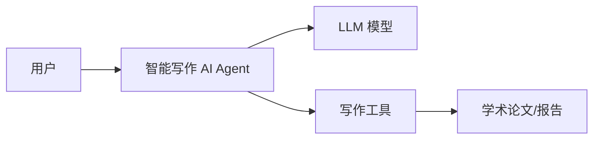
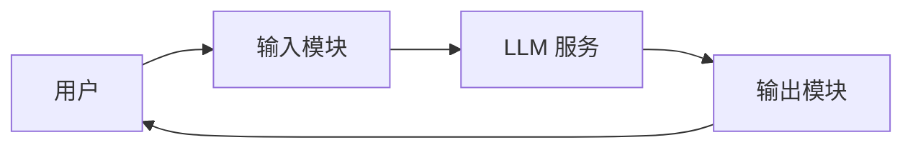

                 


# 智能写作 AI Agent：LLM 辅助学术论文与报告撰写

> 关键词：LLM, 智能写作, 学术论文, 报告撰写, 人工智能

> 摘要：本文探讨了大语言模型（LLM）在学术论文和报告撰写中的应用，详细分析了智能写作 AI Agent 的背景、算法原理、系统架构设计、项目实战及最佳实践，旨在为学术写作提供高效、智能的解决方案。

---

## 第一部分：智能写作 AI Agent 的背景与核心概念

### 第1章：智能写作 AI Agent 的背景介绍

#### 1.1 问题背景与问题描述

##### 1.1.1 学术论文与报告撰写的挑战
学术论文和报告的撰写是一个复杂且耗时的过程，通常涉及文献调研、研究方法设计、数据分析、结果呈现以及语言表达等多个环节。对于研究人员和学生来说，尤其是在时间紧迫的情况下，如何高效地完成高质量的写作任务是一个巨大的挑战。传统的方法依赖于手动写作和反复修改，效率低下且容易出错。

##### 1.1.2 LLM 在写作辅助中的作用
近年来，大语言模型（LLM）的发展为学术写作提供了新的可能性。LLM 能够通过自然语言处理技术，帮助用户生成文本、检查语法错误、提供建议，并根据上下文提供相关的参考文献。这种智能化的辅助工具能够显著提高写作效率，同时减少错误，使研究人员能够将更多精力投入到研究本身。

##### 1.1.3 智能写作 AI Agent 的目标与边界
智能写作 AI Agent 的目标是通过LLM 技术，为用户提供个性化的写作支持，包括内容生成、结构优化、语言润色等。其边界在于不替代用户的研究工作，而是作为辅助工具，帮助用户更好地完成写作任务。

#### 1.2 核心概念与联系

##### 1.2.1 LLM 的定义与核心要素
大语言模型（LLM）是一种基于深度学习的自然语言处理模型，通常基于Transformer架构，通过大量文本数据的训练，能够理解和生成人类语言。其核心要素包括：
- **模型架构**：Transformer 模型
- **训练数据**：大规模语料库
- **训练目标**：最小化预测误差
- **推理能力**：生成、翻译、问答等

##### 1.2.2 智能写作 AI Agent 的实体关系图
以下是智能写作 AI Agent 的实体关系图：


---

### 第2章：LLM 的算法原理与数学模型

#### 2.1 Transformer 模型的核心原理

##### 2.1.1 自注意力机制的数学表达
自注意力机制是Transformer模型的核心，其数学表达式如下：
$$
\text{Attention}(Q, K, V) = \text{softmax}\left(\frac{QK^T}{\sqrt{d_k}}\right)V
$$
其中：
- $Q$ 是查询（Query）
- $K$ 是键（Key）
- $V$ 是值（Value）
- $d_k$ 是键的维度

##### 2.1.2 前馈神经网络的结构
Transformer模型的前馈神经网络由两层全连接层组成，使用ReLU激活函数：
$$
f(x) = \text{ReLU}(Wx + b)
$$
其中，$W$ 是权重矩阵，$b$ 是偏置项。

#### 2.2 LLM 的训练与优化

##### 2.2.1 梯度下降优化算法
在训练LLM时，通常使用梯度下降优化算法，数学表达式如下：
$$
\theta_{t+1} = \theta_t - \eta \nabla L(\theta_t)
$$
其中：
- $\theta$ 是模型参数
- $\eta$ 是学习率
- $L$ 是损失函数

##### 2.2.2 多层感知机的层数与参数量
Transformer模型通常包含多个堆叠的编码器层和解码器层，每个层包含自注意力机制和前馈神经网络。模型的参数量取决于层数和每层的神经元数量。

---

### 第3章：智能写作 AI Agent 的系统架构设计

#### 3.1 系统功能模块划分

##### 3.1.1 用户输入模块
用户输入模块负责接收用户的输入，包括论文题目、关键词、研究背景等信息。

##### 3.1.2 内容生成模块
内容生成模块基于用户的输入，调用LLM生成相关的文本内容，包括引言、文献综述、研究方法、结果与讨论等部分。

##### 3.1.3 反馈优化模块
反馈优化模块根据用户的反馈对生成的内容进行优化，包括语言润色、结构调整等。

#### 3.2 系统架构图
以下是智能写作 AI Agent 的系统架构图：


---

### 第4章：系统接口与交互流程

#### 4.1 系统接口设计

##### 4.1.1 输入接口
输入接口包括文本输入、参数设置等。

##### 4.1.2 输出接口
输出接口包括生成的文本、错误提示等。

##### 4.1.3 反馈接口
反馈接口用于用户对生成内容的反馈，包括修改建议、评分等。

#### 4.2 交互流程图
以下是系统的交互流程图：


---

## 第二部分：项目实战与应用

### 第5章：项目实战

#### 5.1 环境安装
需要安装的环境包括Python、TensorFlow、Keras等。

#### 5.2 核心实现代码

##### 5.2.1 输入处理
```python
def process_input(user_input):
    # 处理用户输入
    pass
```

##### 5.2.2 LLM 推理
```python
def generate_text(model, input_text):
    # 调用LLM生成文本
    pass
```

##### 5.2.3 输出优化
```python
def optimize_output(output_text):
    # 对生成文本进行优化
    pass
```

#### 5.3 应用解读与分析
通过对生成文本的分析，可以发现LLM在学术写作中的优势和局限性。

#### 5.4 项目小结
本项目通过实际操作，验证了LLM在学术写作中的应用价值。

---

## 第三部分：最佳实践与总结

### 第6章：最佳实践

#### 6.1 实用技巧
- 合理使用LLM生成内容
- 定期检查和优化生成文本
- 结合其他工具进行多维度优化

#### 6.2 注意事项
- 注意生成内容的准确性
- 避免过度依赖生成内容
- 保护用户隐私和数据安全

#### 6.3 拓展阅读
推荐一些相关的书籍和论文，供读者进一步学习。

---

## 第四部分：总结

### 7.1 小结
本文详细探讨了LLM在学术论文和报告撰写中的应用，分析了其算法原理和系统架构设计，展示了实际项目中的实现和优化。

### 7.2 展望
未来，随着LLM技术的不断发展，智能写作 AI Agent 将在学术写作中发挥更大的作用。

---

## 作者

作者：AI天才研究院/AI Genius Institute & 禅与计算机程序设计艺术 /Zen And The Art of Computer Programming

---

通过以上思考和规划，我们可以系统地撰写一篇结构清晰、内容详实的技术博客文章。

