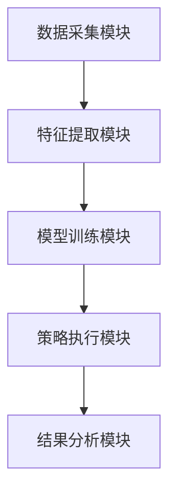

                 


# 智能加密货币交易策略

---

## 关键词：
智能加密货币、交易策略、机器学习、算法交易、区块链、风险管理

---

## 摘要：
本文深入探讨了智能加密货币交易策略的核心概念、算法原理、系统架构设计以及实际应用。通过结合机器学习和区块链技术，分析了加密货币市场的复杂性，并提出了基于智能合约的交易策略优化方法。文章从基础理论到实际案例，系统性地讲解了如何利用AI技术提升加密货币交易的效率和准确性，同时强调了风险管理的重要性。

---

# 第1章: 加密货币与智能交易概述

## 1.1 加密货币的基本概念

### 1.1.1 加密货币的定义与特点
加密货币是一种基于密码学的虚拟货币，通过区块链技术实现去中心化交易和价值转移。其主要特点包括：
- **去中心化**：不依赖任何中央机构，交易由区块链上的节点共同验证。
- **匿名性**：交易通过地址进行，不直接关联真实身份。
- **不可篡改**：区块链上的交易记录具有不可篡改的特性。
- **全球流通**：支持跨境支付，无地域限制。

### 1.1.2 比特币、以太坊等主流加密货币的技术特点
- **比特币（Bitcoin）**：采用UTXO（未花费的交易输出）模型，每区块容量有限，交易确认时间较长。
- **以太坊（Ethereum）**：支持智能合约，通过Gas机制收费，采用PoW（工作量证明）共识机制。
- **以太坊2.0**：引入PoS（权益证明）机制，优化了交易速度和能源消耗。

### 1.1.3 加密货币市场的基本运作机制
加密货币市场由交易所、交易者和矿工（或验证者）构成，交易通过订单匹配系统完成，价格由市场供需决定。

## 1.2 智能交易策略的定义与特点

### 1.2.1 智能交易策略的定义
智能交易策略是指基于算法和机器学习模型，自动分析市场数据并执行交易的策略。它依赖于智能合约和自动化交易系统，能够在毫秒级别完成决策和执行。

### 1.2.2 智能交易与传统交易的区别
- **自动化**：智能交易无需人工干预，而传统交易需要手动下单。
- **数据处理能力**：智能交易能够处理海量数据，传统交易依赖人工分析。
- **决策速度**：智能交易更快，能够在短时间内完成多次交易。

### 1.2.3 智能合约在加密货币交易中的作用
智能合约是运行在区块链上的自动执行程序，用于自动执行交易条件。例如，在DeFi中，智能合约可以自动执行期权的行权和结算。

## 1.3 加密货币交易的背景与现状

### 1.3.1 加密货币市场的兴起与发展趋势
加密货币市场的兴起源于对传统金融体系的不满和对去中心化技术的信任。其发展趋势包括：
- **DeFi（去中心化金融）**：通过智能合约重新构建传统金融体系。
- **NFT（非同质化代币）**：推动数字艺术品、游戏道具等新兴市场的兴起。

### 1.3.2 智能交易策略在加密货币中的应用现状
目前，智能交易策略在加密货币市场中的应用主要集中在高频交易、套利和自动化做市商（AMM）领域。

### 1.3.3 当前加密货币交易的主要挑战
- **市场波动性**：加密货币价格波动剧烈，增加了交易策略的风险。
- **监管不确定性**：不同国家对加密货币的监管政策不一，影响市场稳定性。
- **技术瓶颈**：现有技术难以完全支持高频、低延迟的交易需求。

## 1.4 本章小结
本章介绍了加密货币的基本概念、技术特点和市场机制，探讨了智能交易策略的定义和优势，并分析了当前市场的主要挑战。

---

# 第2章: 加密货币市场分析基础

## 2.1 加密货币市场的基本特性

### 2.1.1 市场的波动性与不确定性
加密货币市场波动剧烈，价格受市场情绪、新闻事件和技术因素影响较大。

### 2.1.2 市场参与者的多样性
参与者包括个人投资者、机构、交易所和矿池，市场结构复杂。

### 2.1.3 市场的24/7交易特性
加密货币市场全天候运行，没有传统股市的交易时间限制。

## 2.2 机器学习在金融市场的应用

### 2.2.1 机器学习在股票、外汇等传统金融市场的应用
- **股票市场**：通过因子分析和预测模型优化投资组合。
- **外汇市场**：利用时间序列模型预测汇率走势。

### 2.2.2 机器学习在加密货币市场中的潜力
- **市场预测**：通过LSTM模型预测价格走势。
- **情绪分析**：利用自然语言处理技术分析社交媒体情绪对价格的影响。

### 2.2.3 常见的机器学习模型在加密货币分析中的应用
- **线性回归**：用于价格趋势预测。
- **支持向量机（SVM）**：用于分类任务，如判断价格走势。
- **随机森林**：用于特征重要性分析和预测。

## 2.3 加密货币市场分析的核心要素

### 2.3.1 市场数据的获取与处理
- **数据源**：包括CoinMarketCap、Coinbase等交易所提供的API。
- **数据清洗**：处理缺失值和异常值。

### 2.3.2 技术指标与市场情绪分析
- **技术指标**：如RSI、MACD等。
- **市场情绪分析**：通过社交媒体和新闻网站提取情绪数据。

### 2.3.3 市场周期与趋势
- **周期分析**：识别市场的牛熊周期。
- **趋势分析**：通过移动平均线判断价格趋势。

## 2.4 本章小结
本章介绍了加密货币市场的基本特性，探讨了机器学习在市场分析中的应用，并详细讲解了市场分析的核心要素。

---

# 第3章: 智能交易策略的核心算法

## 3.1 传统交易算法的原理

### 3.1.1 移动平均线（MA）
- **简单移动平均线（SMA）**：计算过去N个周期的平均值。
- **指数移动平均线（EMA）**：赋予近期价格更高的权重。

### 3.1.2 相对强弱指数（RSI）
- 用于衡量资产的超买或超卖状态，通常用于判断买卖信号。

### 3.1.3 布林带（Bollinger Bands）
- 由三条线组成，用于衡量价格的波动范围。

## 3.2 机器学习算法在智能交易中的应用

### 3.2.1 时间序列预测模型
- **LSTM**：擅长处理时间序列数据，能够捕捉长期依赖关系。
- **ARIMA**：用于预测未来的趋势和季节性变化。

### 3.2.2 分类模型
- **随机森林**：用于分类任务，如判断价格走势为上涨或下跌。
- **XGBoost**：用于分类和回归任务，性能优异。

## 3.3 算法选择与优化

### 3.3.1 算法选择的依据
- **数据类型**：时间序列数据适合LSTM，分类任务适合随机森林。
- **计算资源**：复杂模型需要更高的计算能力。

### 3.3.2 超参数优化
- **网格搜索**：系统地遍历所有可能的超参数组合，找到最优配置。
- **随机搜索**：随机选择超参数组合，适用于参数空间较大的情况。

## 3.4 本章小结
本章介绍了传统交易算法和机器学习算法的原理，并探讨了算法选择与优化的方法。

---

# 第4章: 智能交易系统架构设计

## 4.1 系统功能模块设计

### 4.1.1 数据采集模块
- **功能**：实时获取加密货币的市场数据。
- **技术**：使用API接口获取K线数据、订单簿数据等。

### 4.1.2 特征提取模块
- **功能**：从原始数据中提取有用的特征，如技术指标、市场情绪等。
- **技术**：使用Pandas库进行数据处理，使用Numpy库进行特征计算。

### 4.1.3 模型训练模块
- **功能**：训练机器学习模型，用于预测价格走势。
- **技术**：使用Scikit-learn或Keras框架进行模型训练。

### 4.1.4 策略执行模块
- **功能**：根据模型预测结果执行交易。
- **技术**：通过API接口向交易所发送交易指令。

### 4.1.5 结果分析模块
- **功能**：分析交易结果，优化交易策略。
- **技术**：使用Matplotlib进行可视化分析。

## 4.2 系统架构图


## 4.3 系统交互流程

### 4.3.1 数据采集流程
1. 通过交易所API获取市场数据。
2. 数据存储在数据库中，供后续处理使用。

### 4.3.2 策略执行流程
1. 特征提取模块提取市场数据的特征。
2. 模型训练模块训练预测模型。
3. 策略执行模块根据模型预测结果执行交易。

## 4.4 本章小结
本章详细介绍了智能交易系统的架构设计，包括各功能模块的设计和系统交互流程。

---

# 第5章: 项目实战：智能加密货币交易系统实现

## 5.1 项目背景与目标

### 5.1.1 项目背景
- 目标是实现一个基于机器学习的智能加密货币交易系统。
- 系统能够自动分析市场数据并执行交易。

## 5.2 环境配置

### 5.2.1 安装Python环境
- 安装Anaconda Python发行版，版本建议为3.8以上。

### 5.2.2 安装必要的库
- `pandas`：数据处理。
- `numpy`：数值计算。
- `scikit-learn`：机器学习。
- `ccxt`：加密货币交易所API接口。

## 5.3 系统核心实现

### 5.3.1 数据采集模块实现
```python
import ccxt

def get_binance_data(symbol, timeframe='1h', limit=100):
    exchange = ccxt.binance()
    return exchange.fetch_ohlcvc(symbol, timeframe, limit)
```

### 5.3.2 特征提取模块实现
```python
import pandas as pd
import numpy as np

def extract_features(data):
    df = pd.DataFrame(data)
    df['SMA_20'] = df['close'].rolling(20).mean()
    df['RSI'] = ta.RSI(df['close'], window=14)
    return df
```

### 5.3.3 模型训练模块实现
```python
from sklearn.ensemble import RandomForestClassifier
from sklearn.metrics import accuracy_score

def train_model(X, y):
    model = RandomForestClassifier(n_estimators=100, max_depth=10, random_state=42)
    model.fit(X, y)
    return model

# 示例数据
X = df[['SMA_20', 'RSI']]
y = df['label']  # 假设'label'是目标变量
model = train_model(X, y)
print("Accuracy:", accuracy_score(y, model.predict(X)))
```

### 5.3.4 策略执行模块实现
```python
def execute_trade(symbol, quantity, side, exchange):
    params = {
        'symbol': symbol,
        'amount': quantity,
        'side': side,
        'type': 'market'
    }
    return exchange.create_order(**params)

# 示例执行
exchange = ccxt.binance()
symbol = 'BTC/USDT'
quantity = 0.01
side = 'buy'
execute_trade(symbol, quantity, side, exchange)
```

## 5.4 项目小结
本章通过具体实现一个智能加密货币交易系统，展示了如何利用Python和机器学习库构建一个完整的交易系统。从数据采集到模型训练，再到策略执行，详细讲解了每个模块的实现方法。

---

# 第6章: 风险管理与策略优化

## 6.1 风险管理的重要性

### 6.1.1 什么是风险管理
- 通过控制仓位和设置止损来降低交易风险。

### 6.1.2 止损与止盈策略
- **止损**：当亏损达到一定比例时，立即平仓。
- **止盈**：当盈利达到一定比例时，立即平仓。

## 6.2 算法优化策略

### 6.2.1 遗传算法
- 通过生成多个策略组合，筛选出最优策略。

### 6.2.2 网格交易
- 在设定的网格区间内反复买卖，逐步实现利润。

## 6.3 本章小结
本章讨论了风险管理的重要性，并介绍了几种常用的优化策略，帮助交易者在复杂的市场环境中降低风险、提高收益。

---

# 第7章: 法律与伦理考虑

## 7.1 加密货币交易的法律问题

### 7.1.1 合规性问题
- 不同国家对加密货币的监管政策不同，交易者需遵守当地法规。

### 7.1.2 税务问题
- 加密货币交易可能需要缴纳资本利得税或其他税费。

## 7.2 加密货币交易的伦理问题

### 7.2.1 洗钱与非法活动
- 加密货币的匿名性可能导致洗钱和非法交易。

### 7.2.2 环境影响
- 某些加密货币（如比特币）的高能耗挖矿过程对环境造成较大压力。

## 7.3 本章小结
本章探讨了加密货币交易中的法律与伦理问题，强调合规性和社会责任的重要性。

---

# 第8章: 未来展望与挑战

## 8.1 未来趋势

### 8.1.1 DeFi的未来发展
- 去中心化金融将继续推动加密货币市场的创新。

### 8.1.2 NFT与加密货币的结合
- NFT的兴起将推动数字艺术品、游戏道具等新兴市场的繁荣。

## 8.2 技术挑战

### 8.2.1 交易速度与延迟
- 需要进一步优化区块链技术，提高交易速度和降低延迟。

### 8.2.2 数据隐私与安全
- 如何保护交易数据的隐私和安全，是未来需要解决的问题。

## 8.3 本章小结
本章展望了加密货币交易的未来发展趋势，并提出了需要克服的技术挑战。

---

# 作者：AI天才研究院/AI Genius Institute & 禅与计算机程序设计艺术/Zen And The Art of Computer Programming

