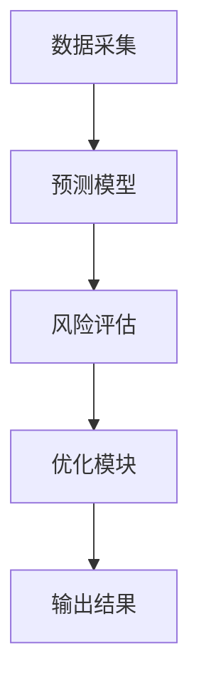
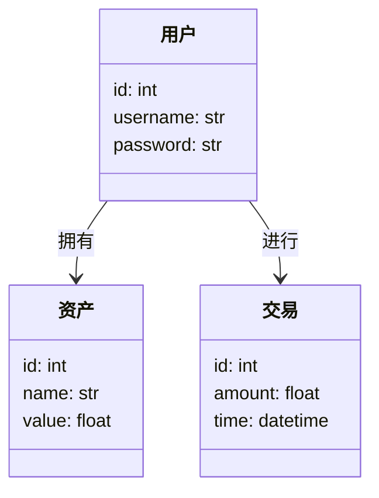

                 


```markdown
# 智能加密货币投资组合管理

## 关键词：智能加密货币，投资组合管理，风险管理，机器学习，区块链，Python

## 摘要：本文详细探讨智能加密货币投资组合管理的核心概念、算法原理、系统架构与实现，以及项目实战。通过现代投资组合理论、机器学习算法和区块链技术的结合，分析如何优化加密货币投资组合的风险与收益。文章从背景介绍到系统设计，再到最佳实践，全面解析智能加密货币投资组合管理的实现方法。

---

## 第1章: 智能加密货币投资组合管理的背景与概念

### 1.1 加密货币的起源与发展
1.1.1 加密货币的起源  
加密货币的概念起源于20世纪80年代的密码学研究，但真正的发展始于比特币的诞生。2008年，中本聪发表了比特币白皮书，提出了一种去中心化的电子现金系统。

1.1.2 加密货币的发展历程  
比特币的成功引发了无数其他加密货币的诞生，如以太坊、莱特币等。这些加密货币在技术创新、应用场景等方面不断探索，推动了区块链技术的发展。

1.1.3 加密货币市场的现状  
目前，加密货币市场市值已超过数万亿美元，交易活跃，参与者包括机构投资者和个人投资者。

### 1.2 投资组合管理的基本概念
1.2.1 投资组合管理的定义  
投资组合管理是通过优化资产配置，以实现收益最大化和风险最小化的过程。

1.2.2 投资组合管理的目标  
投资组合管理的目标是在给定风险水平下实现最大收益，或在给定收益下实现最小风险。

1.2.3 投资组合管理的重要性  
在金融市场中，投资组合管理是降低风险、提高收益的重要手段。

### 1.3 智能加密货币投资组合管理的定义
1.3.1 智能投资组合管理的定义  
智能投资组合管理是利用人工智能和大数据技术，动态优化投资组合的配置。

1.3.2 加密货币与传统投资组合管理的差异  
加密货币市场的高波动性和去中心化特点，使得其投资组合管理需要更复杂的技术支持。

1.3.3 智能加密货币投资组合管理的核心优势  
通过实时数据分析和智能算法，智能投资组合管理能够快速适应市场变化，优化资产配置。

### 1.4 本章小结  
本章介绍了加密货币的起源与发展，投资组合管理的基本概念，以及智能加密货币投资组合管理的定义和优势，为后续内容奠定了基础。

---

## 第2章: 加密货币市场的特点与风险管理

### 2.1 加密货币市场的特点
2.1.1 市场波动性  
加密货币市场价格波动剧烈，远高于传统金融市场。

2.1.2 市场参与者  
加密货币市场参与者包括个人投资者、机构投资者和矿工等。

2.1.3 市场监管  
目前，加密货币市场缺乏统一的全球监管框架，各国监管政策差异较大。

### 2.2 风险管理的重要性
2.2.1 风险的定义与分类  
风险是指投资组合可能遭受损失的可能性，通常分为系统性风险和非系统性风险。

2.2.2 风险管理的目标  
风险管理的目标是通过降低风险来提高投资组合的稳定性。

2.2.3 风险管理的策略  
常见的风险管理策略包括分散投资、对冲和保险等。

### 2.3 加密货币市场的风险管理模型
2.3.1 风险评估模型  
常用的风险评估模型包括VaR（Value at Risk）和CVaR（Conditional Value at Risk）。

2.3.2 风险对冲策略  
通过期货、期权等金融衍生品进行风险对冲。

2.3.3 风险监控机制  
实时监控市场波动和资产表现，及时调整投资组合。

### 2.4 本章小结  
本章分析了加密货币市场的特点，强调了风险管理的重要性，并介绍了几种常用的风险管理模型和策略。

---

## 第3章: 现代投资组合理论与优化算法

### 3.1 现代投资组合理论概述
3.1.1 现代投资组合理论的起源  
由哈里·马科维茨于1952年提出，是金融学的重要理论之一。

3.1.2 现代投资组合理论的核心思想  
通过分散投资降低风险，优化资产配置以实现最大收益。

3..1.3 现代投资组合理论的应用  
广泛应用于传统金融和加密货币市场。

### 3.2 均值-方差优化模型
3.2.1 模型定义  
均值-方差优化模型通过最小化投资组合的方差，实现收益最大化。

3.2.2 数学公式  
$$\text{目标函数：} \min_w \sigma^2(w) \quad \text{约束条件：} \sum_{i=1}^n w_i = 1, \quad w_i \geq 0$$

3.2.3 模型实现  
使用Python的`scipy.optimize`库进行优化计算。

### 3.3 Black-Litterman模型
3.3.1 模型定义  
Black-Litterman模型结合了市场预期和风险中性假设，用于资产配置。

3.3.2 模型优势  
能够处理市场参与者对资产的不同预期。

3.3.3 模型实现  
通过Python的`pandas`和`numpy`库进行计算。

### 3.4 本章小结  
本章介绍了现代投资组合理论的核心思想，详细讲解了均值-方差优化模型和Black-Litterman模型的数学公式及实现方法。

---

## 第4章: 智能加密货币投资组合管理系统架构与实现

### 4.1 系统架构设计
4.1.1 系统架构图  
使用Mermaid绘制系统架构图，展示数据采集、预测模型、风险评估和优化模块的交互关系。



4.1.2 实体关系图  
使用Mermaid绘制实体关系图，展示用户、资产、交易等核心实体的关系。



### 4.2 数据采集与处理
4.2.1 数据源  
从加密货币交易所API获取实时数据。

4.2.2 数据清洗  
处理缺失值和异常值。

4.2.3 数据预处理  
标准化和归一化处理。

### 4.3 预测模型构建
4.3.1 机器学习算法  
使用LSTM进行时间序列预测。

4.3.2 模型实现  
通过Keras框架构建LSTM网络。

4.3.3 模型训练  
使用历史数据进行模型训练和验证。

### 4.4 风险评估与优化
4.4.1 风险评估  
利用VaR模型评估投资组合的风险。

4.4.2 优化策略  
通过遗传算法优化资产配置。

4.4.3 优化实现  
使用Python的`numpy`和`scipy`库进行优化计算。

### 4.5 本章小结  
本章详细讲解了智能加密货币投资组合管理系统的架构设计与实现过程，从数据采集到模型构建，再到风险评估和优化，为后续的项目实战奠定了基础。

---

## 第5章: 项目实战与案例分析

### 5.1 项目背景与目标
5.1.1 项目背景  
本文将通过一个实际案例，展示如何构建一个智能加密货币投资组合管理系统。

5.1.2 项目目标  
实现一个能够实时监控和优化加密货币投资组合的系统。

### 5.2 环境搭建与工具安装
5.2.1 环境搭建  
安装Python、Jupyter Notebook、Anaconda等开发环境。

5.2.2 工具安装  
安装Pandas、NumPy、Matplotlib、Scikit-learn、Keras等库。

### 5.3 数据获取与预处理
5.3.1 数据获取  
从CoinMarketCap API获取比特币、以太坊等加密货币的价格数据。

5.3.2 数据清洗  
处理缺失值和异常值。

5.3.3 数据预处理  
标准化和归一化处理。

### 5.4 模型训练与优化
5.4.1 模型训练  
使用LSTM网络训练价格预测模型。

5.4.2 模型优化  
通过超参数调优提高模型性能。

5.4.3 模型验证  
使用测试数据验证模型的准确性。

### 5.5 系统实现与测试
5.5.1 系统实现  
编写Python代码实现数据采集、预测、风险评估和优化模块。

5.5.2 系统测试  
进行功能测试和性能测试，确保系统的稳定性和高效性。

### 5.6 本章小结  
本章通过一个实际案例，展示了智能加密货币投资组合管理系统的实现过程，从数据获取到模型训练，再到系统测试，为读者提供了宝贵的实战经验。

---

## 第6章: 最佳实践与总结

### 6.1 最佳实践
6.1.1 风险管理  
在实际应用中，始终将风险管理放在首位。

6.1.2 模型优化  
持续优化算法和模型，适应市场变化。

6.1.3 数据来源  
选择可靠的数据源，确保数据的准确性和及时性。

### 6.2 小结与展望
本章总结了全文的主要内容，强调了智能加密货币投资组合管理的重要性。未来，随着区块链技术和人工智能的进一步发展，智能投资组合管理将变得更加精准和高效。

### 6.3 注意事项与风险提示
6.3.1 技术风险  
加密货币市场的高波动性可能影响模型的准确性。

6.3.2 市场风险  
政策变化和市场波动可能对投资组合产生重大影响。

6.3.3 操作风险  
系统故障和数据错误可能影响投资决策。

### 6.4 本章小结  
本章提供了智能加密货币投资组合管理的最佳实践和总结，同时提醒读者注意相关风险。

---

## 作者信息

作者：AI天才研究院/AI Genius Institute & 禅与计算机程序设计艺术 /Zen And The Art of Computer Programming

---

通过本文，读者可以系统地了解智能加密货币投资组合管理的核心概念、算法原理、系统架构与实现，以及项目实战。文章从理论到实践，全面解析了如何利用现代投资组合理论和人工智能技术，优化加密货币投资组合的风险与收益。希望本文能为读者在智能加密货币投资领域提供有价值的参考和指导。
```

