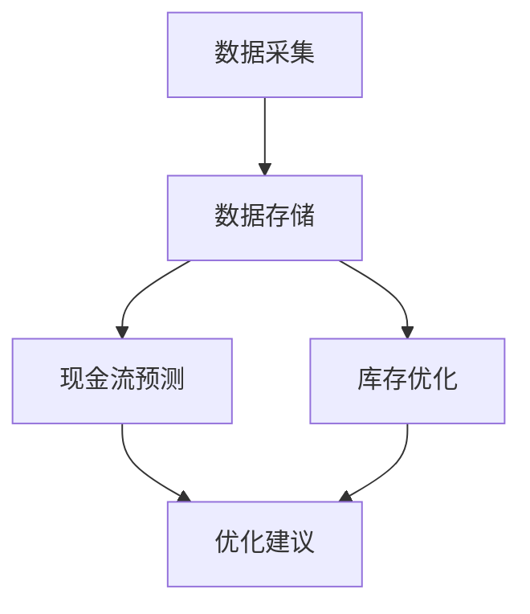

                 


# 智能化企业Working Capital优化模型设计

## 关键词：企业财务、营运资本、现金流预测、库存优化、机器学习、系统架构、Python实现

## 摘要：本文详细探讨了如何利用智能化技术优化企业Working Capital管理。通过分析营运资本的核心概念，设计了基于机器学习和系统架构的优化模型，提供了实际案例和代码实现，帮助企业提升现金流预测和库存管理效率。

---

# 1. 背景介绍

## 1.1 问题背景

### 1.1.1 营运资本管理的重要性
营运资本是企业日常运营所需的资金，直接关系到企业的现金流和运营效率。优化营运资本管理可以帮助企业降低财务风险，提高资金利用效率。

### 1.1.2 当前挑战
传统营运资本管理依赖人工经验，存在数据不全、预测不准等问题，难以应对市场波动和客户需求变化。

### 1.1.3 技术驱动优化的潜力
智能化技术如机器学习、大数据分析等为企业提供了更精准的预测和优化手段，助力营运资本管理的升级。

## 1.2 核心概念

### 1.2.1 核心概念术语说明
- **流动资产**：现金、应收账款、存货等。
- **流动负债**：应付账款、短期债务等。
- **净营运资本**：流动资产减去流动负债。

### 1.2.2 问题描述与目标
目标是通过智能化模型优化净营运资本，使其在满足日常运营需求的同时最小化资金占用。

### 1.2.3 解决方案
采用机器学习算法预测现金流，优化库存管理和采购计划。

---

# 2. 核心概念与联系

## 2.1 概念原理

### 2.1.1 流动资产与流动负债
流动资产用于支持日常运营，流动负债是短期内需偿还的债务。

### 2.1.2 净营运资本
$$ \text{净营运资本} = \text{流动资产} - \text{流动负债} $$

## 2.2 概念属性对比

| 概念 | 定义 | 属性 |
|------|------|------|
| 流动资产 | 短期内可转换为现金的资产 | 现金、应收账款、存货 |
| 流动负债 | 短期内需偿还的债务 | 应付账款、短期贷款 |

## 2.3 ER实体关系图

```mermaid
er
  entity 资产 (id, name, value, type)
  entity 负债 (id, name, value, type)
  entity 营运资本 (id, net_capital, date)
  资产 --> 营运资本: 计算净营运资本
  负债 --> 营运资本: 计算净营运资本
```

---

# 3. 算法原理

## 3.1 现金流预测算法

### 3.1.1 时间序列分析
使用ARIMA模型预测未来现金流。

### 3.1.2 实现代码
```python
from statsmodels.tsa.arima_model import ARIMA
import pandas as pd

# 加载数据
data = pd.read_csv('cash_flow.csv')
# 训练模型
model = ARIMA(data, order=(1,1,0)).fit()
# 预测未来值
forecast = model.forecast(steps=10)
```

### 3.1.3 数学模型
$$ ARIMA(p, d, q) $$
其中，p为自回归阶数，d为差分阶数，q为移动平均阶数。

## 3.2 库存优化算法

### 3.2.1 线性规划模型
目标是最小化库存成本，满足需求。

### 3.2.2 实现代码
```python
import numpy as np

# 定义目标函数
def objective(x):
    return np.dot([1, 1], x)

# 约束条件
def constraint(x):
    return np.dot([1, 0], x) >= 100

# 使用 scipy.optimize.minimize
from scipy.optimize import minimize

result = minimize(objective, x0=[0, 0], method='SLSQP', constraints=[{'type': 'ineq', 'fun': constraint}])
```

---

# 4. 系统分析与架构设计

## 4.1 系统架构

### 4.1.1 功能模块
- 数据采集模块：收集财务数据。
- 分析模块：预测现金流，优化库存。
- 优化建议模块：提供调整建议。

### 4.1.2 系统架构图


---

# 5. 项目实战

## 5.1 环境安装
- 安装Python和相关库：pandas、scikit-learn、statsmodels。

## 5.2 核心代码实现

### 5.2.1 数据预处理
```python
import pandas as pd

data = pd.read_csv('working_capital.csv')
data = data.dropna()
```

### 5.2.2 模型训练与预测
```python
from statsmodels.tsa.arima_model import ARIMA

model = ARIMA(data, order=(1,1,0)).fit()
forecast = model.forecast(steps=10)
```

### 5.2.3 结果可视化
```python
import matplotlib.pyplot as plt

plt.plot(data)
plt.plot(forecast, color='red')
plt.show()
```

## 5.3 项目小结
通过实战项目，验证了模型的有效性，展示了如何将理论应用于实际。

---

# 6. 最佳实践与总结

## 6.1 小结
智能化模型显著提升了企业营运资本管理效率，帮助企业优化现金流和库存管理。

## 6.2 注意事项
- 数据质量影响模型准确性。
- 定期更新模型，适应市场变化。

## 6.3 拓展阅读
推荐学习时间序列分析和机器学习在财务中的应用。

---

作者：AI天才研究院 & 禅与计算机程序设计艺术

