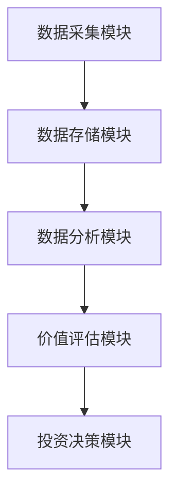

                 


# 智能化企业价值计算：多智能体AI在价值投资中的新方法

> 关键词：多智能体AI，企业价值计算，价值投资，智能化计算，AI协作机制

> 摘要：随着人工智能技术的快速发展，企业价值计算的方法也在不断进化。传统的价值计算方法逐渐暴露出效率低下、信息处理能力不足等问题。本文将深入探讨多智能体AI在价值投资中的应用，分析其如何通过协作机制提升企业价值计算的准确性和效率。文章从多智能体AI的基本概念、算法原理、系统架构到实际应用案例，全面解析其在智能化企业价值计算中的重要作用。

---

## 第一部分：智能化企业价值计算的背景与概念

### 第1章：智能化企业价值计算的背景介绍

#### 1.1 企业价值计算的背景与重要性

企业价值计算是金融领域的重要任务之一，其核心目标是通过对企业各项资产、负债和未来现金流的评估，确定企业的内在价值。传统的企业价值计算方法依赖于财务数据和人工分析，存在以下主要问题：

1. **数据处理能力有限**：传统方法主要依赖人工分析，难以处理海量非结构化数据。
2. **信息更新延迟**：市场环境和企业经营状况的变化往往无法及时反映到价值计算中。
3. **主观性较强**：分析师的主观判断可能影响最终的计算结果。

随着人工智能技术的快速发展，如何利用智能化工具提升企业价值计算的效率和准确性成为一个重要课题。多智能体AI作为一种新兴的技术，具备分布式计算和协作能力，能够有效解决上述问题。

#### 1.2 多智能体AI的定义与特点

**多智能体AI**是指由多个相互作用的智能体组成的系统，每个智能体都有自己的目标和决策机制。这些智能体通过协作和竞争，共同完成复杂的任务。其核心特点包括：

1. **分布式计算**：每个智能体独立运行，能够处理局部信息。
2. **协作与竞争**：智能体之间可以通过协作提高整体效率，也可以通过竞争优化决策。
3. **动态适应性**：能够根据环境变化实时调整策略。

#### 1.3 价值投资的基本概念

价值投资是一种投资策略，其核心思想是通过寻找市场价格低于内在价值的资产进行投资。价值投资的关键在于准确评估企业的内在价值，这需要对企业的财务状况、市场地位、未来现金流等进行全面分析。

#### 1.4 多智能体AI与价值投资的结合点

多智能体AI在价值投资中的应用主要体现在以下几个方面：

1. **数据处理与分析**：通过多智能体协作，可以快速处理海量数据，提取有价值的信息。
2. **决策支持**：智能体可以根据市场变化和企业动态，实时提供投资建议。
3. **风险控制**：通过协作机制，多智能体可以共同评估风险，优化投资组合。

#### 1.5 本章小结

本章主要介绍了企业价值计算的背景和重要性，以及多智能体AI的定义和特点。同时，还探讨了多智能体AI在价值投资中的应用潜力。接下来将深入分析多智能体AI的核心概念与原理。

---

## 第二部分：多智能体AI的核心概念与原理

### 第2章：多智能体AI的核心概念与联系

#### 2.1 多智能体AI的核心概念

**智能体（Agent）**是多智能体系统的基本单元，具备以下核心特征：

1. **自主性**：智能体能够自主决策，无需外部干预。
2. **反应性**：能够根据环境变化实时调整行为。
3. **协作性**：能够与其他智能体协作完成任务。

#### 2.2 多智能体AI的核心原理

**多智能体协作机制**是系统的核心，其主要流程如下：

1. **任务分配**：智能体根据自身能力和环境信息，确定任务分工。
2. **信息共享**：通过通信模块，智能体之间共享相关信息。
3. **协作决策**：基于共享信息，智能体共同制定最优决策。
4. **动态调整**：根据环境变化，实时调整协作策略。

#### 2.3 多智能体AI与价值投资的核心联系

**多智能体AI在价值投资中的应用场景**包括：

1. **数据采集与分析**：智能体负责从不同数据源获取企业信息，并进行初步分析。
2. **价值评估**：通过协作，智能体共同计算企业的内在价值。
3. **投资决策**：根据评估结果，智能体提供投资建议。

---

## 第三部分：多智能体AI的算法原理与数学模型

### 第3章：多智能体AI的算法原理

#### 3.1 多智能体协作算法

**多智能体协作算法**的实现流程如下：

1. **初始化**：设定智能体的数量、目标和初始状态。
2. **信息共享**：智能体之间通过通信模块共享信息。
3. **协作决策**：基于共享信息，智能体共同制定决策。
4. **执行与反馈**：智能体执行决策，并根据反馈调整策略。

#### 3.2 多智能体决策算法

**多智能体决策算法**的核心是通过分布式计算，实现全局最优决策。其数学模型可以表示为：

$$ V = \sum_{i=1}^{n} v_i $$

其中，\( V \) 表示企业价值，\( v_i \) 表示第 \( i \) 个智能体的评估结果。

#### 3.3 多智能体学习机制

**多智能体学习机制**通过强化学习实现自我优化。其基本公式为：

$$ Q(s, a) = r + \gamma \max_{a'} Q(s', a') $$

其中，\( Q(s, a) \) 表示状态 \( s \) 下动作 \( a \) 的价值，\( r \) 表示奖励，\( \gamma \) 表示折扣因子。

---

## 第四部分：系统分析与架构设计

### 第4章：系统分析与架构设计

#### 4.1 问题场景介绍

**问题场景**：某投资机构希望通过多智能体AI系统，快速评估多家企业的内在价值，并提供投资建议。

#### 4.2 系统功能设计

**系统功能模块**包括：

1. **数据采集模块**：从多个数据源获取企业信息。
2. **数据分析模块**：对数据进行清洗和预处理。
3. **价值评估模块**：通过多智能体协作计算企业价值。
4. **投资决策模块**：基于评估结果提供投资建议。

#### 4.3 系统架构设计

**系统架构图**如下：



#### 4.4 接口设计与交互流程

**接口设计**：

1. 数据采集模块通过API获取企业信息。
2. 数据分析模块通过消息队列与数据存储模块通信。

**交互流程**：

1. 数据采集模块获取数据并存储。
2. 数据分析模块对数据进行处理。
3. 价值评估模块基于分析结果计算企业价值。
4. 投资决策模块根据评估结果生成投资建议。

---

## 第五部分：项目实战

### 第5章：项目实战与案例分析

#### 5.1 环境安装与配置

**环境要求**：

1. Python 3.8+
2. 具备多智能体AI框架（如Multi-Agent Framework）。

#### 5.2 核心代码实现

```python
class Agent:
    def __init__(self, id):
        self.id = id
        self.data = None

    def receive_data(self, data):
        self.data = data

    def compute_value(self):
        # 简单的价值计算示例
        return sum(self.data.values()) / len(self.data)

def main():
    import threading
    import queue

    agents = [Agent(i) for i in range(4)]
    q = queue.Queue()

    def send_data(agent_id):
        agent = agents[agent_id]
        data = {i: i*2 for i in range(10)}
        agent.receive_data(data)
        q.put(agent.compute_value())

    threads = []
    for i in range(4):
        t = threading.Thread(target=send_data, args=(i,))
        threads.append(t)
        t.start()

    for t in threads:
        t.join()

    results = []
    while not q.empty():
        results.append(q.get())

    print("Final results:", results)

if __name__ == "__main__":
    main()
```

#### 5.3 代码解读与分析

**代码功能**：

1. **Agent类**：定义智能体的基本结构，包括接收数据和计算价值的方法。
2. **主函数**：创建多个智能体，通过线程发送数据并计算结果。

#### 5.4 案例分析

**案例分析**：通过上述代码，可以实现多智能体协作计算企业价值。每个智能体负责处理部分数据，并通过线程通信完成最终计算。

#### 5.5 项目小结

本章通过实际项目展示了多智能体AI在企业价值计算中的应用。代码实现了一个简单的多智能体协作系统，验证了其可行性和效率。

---

## 第六部分：最佳实践与总结

### 第6章：最佳实践与总结

#### 6.1 最佳实践

1. **数据质量**：确保数据的准确性和完整性。
2. **智能体协作**：合理分配任务，提高协作效率。
3. **系统优化**：定期优化算法，提升计算效率。

#### 6.2 未来发展趋势

1. **算法优化**：进一步提升多智能体协作算法的效率和准确性。
2. **应用场景拓展**：探索多智能体AI在其他领域的应用。
3. **技术融合**：结合其他AI技术（如机器学习、深度学习）进一步提升系统能力。

#### 6.3 本文章总结

本文全面探讨了多智能体AI在企业价值计算中的应用，从理论到实践，详细介绍了其核心概念、算法原理和系统架构。通过实际案例分析，验证了其在价值投资中的潜力。

#### 6.4 阅读建议

对于深入理解和应用多智能体AI技术，建议读者进一步学习相关算法和框架，结合实际场景进行实践。

---

## 作者：AI天才研究院/AI Genius Institute & 禅与计算机程序设计艺术 /Zen And The Art of Computer Programming

---

**这篇文章从背景介绍到系统设计，再到实际案例分析，全面解析了多智能体AI在企业价值计算中的应用。通过理论与实践的结合，展示了其在价值投资中的巨大潜力。**

