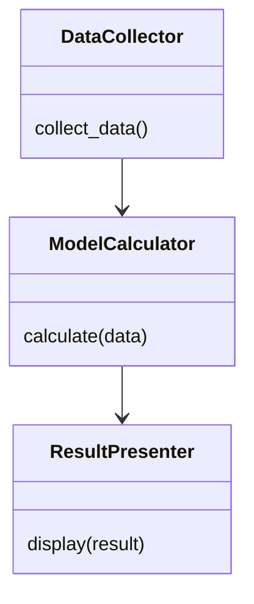
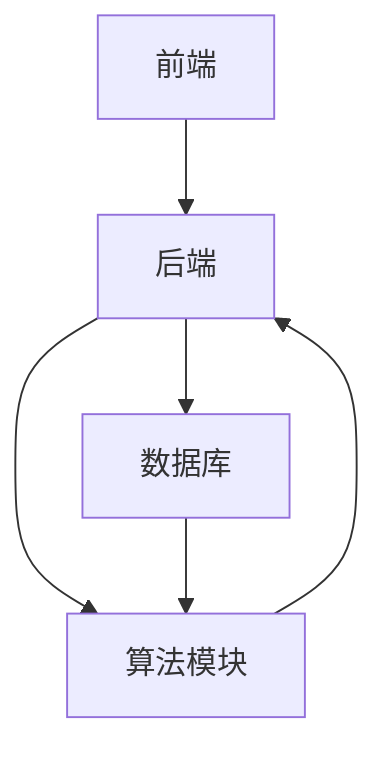
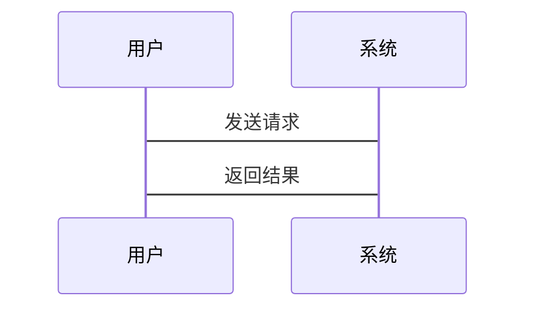

                 


# 智能化企业资本支出优化决策模型设计

## 关键词：资本支出优化、智能化决策模型、动态规划、机器学习、系统架构设计

## 摘要：  
随着企业规模的不断扩大和市场竞争的加剧，资本支出优化决策变得至关重要。本文通过分析资本支出优化的核心概念，结合动态规划和机器学习算法，设计了一种智能化的决策模型，并详细阐述了系统的架构设计与实现方案。通过实际案例分析，展示了该模型在企业资本支出优化中的应用效果，并提出了未来的发展方向。

---

# 第一部分：智能化企业资本支出优化决策模型背景与概念

## 第1章：资本支出优化决策的背景与问题

### 1.1 企业资本支出的基本概念

#### 1.1.1 资本支出的定义与分类  
资本支出（Capital Expenditure，简称CAPEX）是指企业在固定资产、无形资产、长期资产等方面的支出，通常用于扩大生产规模、提升生产能力或优化资产结构。资本支出可以分为以下几类：  
- **资本性支出**：直接用于购买或建设长期资产的支出。  
- **维护性支出**：用于维持现有资产正常运作的支出。  
- **研发支出**：用于产品或技术开发的支出。  

#### 1.1.2 资本支出在企业中的重要性  
资本支出是企业长期发展的核心驱动力之一。合理的资本支出可以提升企业竞争力、降低运营成本、优化资产配置，并为企业创造更大的价值。  

#### 1.1.3 资本支出决策的复杂性与挑战  
资本支出决策涉及多方面的因素，包括市场需求、资金成本、资产寿命、技术更新等。传统决策方法往往依赖经验判断，难以应对复杂多变的市场环境。  

### 1.2 智能化决策的必要性

#### 1.2.1 传统资本支出决策的局限性  
传统资本支出决策方法通常基于静态分析，难以考虑动态市场变化和多目标优化的需求。此外，传统方法对数据的依赖性较低，可能导致决策偏差。  

#### 1.2.2 数据驱动决策的优势  
通过引入大数据和人工智能技术，智能化决策能够充分利用企业内外部数据，构建动态优化模型，从而提高决策的科学性和准确性。  

#### 1.2.3 智能化决策的技术基础  
智能化决策依赖于先进的算法和工具，包括动态规划、机器学习、运筹学优化等技术。这些技术能够帮助企业在复杂环境中做出最优决策。

---

## 第2章：资本支出优化决策的核心概念

### 2.1 优化模型的基本结构

#### 2.1.1 模型的输入变量与输出变量  
- **输入变量**：市场需求、资金预算、资产寿命、技术参数等。  
- **输出变量**：最优资本支出方案、投资回报率（ROI）、净现值（NPV）等。  

#### 2.1.2 目标函数与约束条件  
目标函数通常为最大化投资回报率或最小化资本支出成本。约束条件包括资金预算限制、资产使用年限、市场需求波动等。  

#### 2.1.3 模型的边界与外延  
资本支出优化模型的边界包括企业的财务状况、市场环境和政策法规等外部因素。外延则包括模型的适用范围和扩展性。  

### 2.2 关键概念的属性特征对比

#### 2.2.1 比较分析表格  
以下是资本支出与运营支出的对比表：

| 特性            | 资本支出（CAPEX）          | 运营支出（OPEX）          |
|-----------------|---------------------------|---------------------------|
| 支出性质         | 一次性大额支出             | 持续性小额支出             |
| 资产寿命         | 较长                      | 较短                      |
| 投资回报周期     | 较长                      | 较短                      |
| 税务处理         | 可资本化                  | 可费用化                  |

#### 2.2.2 ER实体关系图  
以下是资本支出优化模型的ER图：

```mermaid
erDiagram
    division
    {
        id INTEGER
        name VARCHAR
        budget DECIMAL
    }
    project
    {
        id INTEGER
        name VARCHAR
        cost DECIMAL
    }
    investment
    {
        id INTEGER
        division_id INTEGER
        project_id INTEGER
        allocation DECIMAL
    }
    investment o-<> project
    investment o-<> division
```

---

# 第二部分：智能化决策模型的算法原理

## 第3章：优化模型的算法基础

### 3.1 动态规划算法

#### 3.1.1 算法原理  
动态规划是一种通过分解问题并利用子问题的最优解来构建整体最优解的算法。其核心思想是将问题分解为更小的子问题，并存储子问题的解以避免重复计算。  

#### 3.1.2 算法步骤  
1. 确定问题的最优子结构。  
2. 定义状态转移方程。  
3. 构建动态规划表格，记录子问题的解。  
4. 填充表格并反推出最优解。  

#### 3.1.3 算法实现的代码示例  
以下是一个动态规划算法的Python实现示例：  

```python
def dynamic_planning(n):
    # 初始状态
    dp = [0] * (n + 1)
    # 填充表格
    for i in range(n + 1):
        if i == 0:
            dp[i] = 0
        else:
            dp[i] = max(dp[i-1], i)
    return dp[n]

# 示例调用
n = 10
result = dynamic_planning(n)
print(f"Dynamic Planning Result: {result}")
```

### 3.2 机器学习算法

#### 3.2.1 监督学习与无监督学习  
- **监督学习**：基于有标签的数据进行训练，适用于回归和分类问题。  
- **无监督学习**：基于无标签的数据进行训练，适用于聚类和降维问题。  

#### 3.2.2 神经网络模型  
神经网络是一种模拟人脑结构的深度学习模型，能够处理复杂的非线性关系。  

#### 3.2.3 算法的数学模型与公式  
以下是机器学习模型的通用公式：  

$$ y = f(x) + \epsilon $$  

其中，$y$ 是输出，$x$ 是输入，$f$ 是模型函数，$\epsilon$ 是误差项。  

---

## 第4章：模型优化与调优

### 4.1 算法优化方法

#### 4.1.1 参数调优  
通过调整模型参数（如学习率、正则化系数等）来优化模型性能。  

#### 4.1.2 模型训练技巧  
包括数据增强、交叉验证、批量训练等技巧。  

#### 4.1.3 超参数优化  
使用网格搜索或随机搜索等方法寻找最优超参数。  

### 4.2 模型性能评估

#### 4.2.1 评估指标  
常用的评估指标包括准确率、召回率、F1分数等。  

#### 4.2.2 评估方法  
包括训练集评估、验证集评估和测试集评估。  

#### 4.2.3 模型调优的注意事项  
避免过拟合和欠拟合，确保模型的泛化能力。  

---

# 第三部分：智能化决策模型的系统架构设计

## 第5章：系统功能设计

### 5.1 领域模型设计

#### 5.1.1 领域模型的构建  
领域模型是系统设计的核心，用于描述问题领域的核心概念及其关系。  

#### 5.1.2 领域模型的验证与优化  
通过业务专家评审和实际数据验证，不断优化领域模型。  

### 5.2 系统架构设计

#### 5.2.1 模块划分  
系统通常划分为数据采集模块、模型计算模块、结果展示模块等。  

#### 5.2.2 模块之间的交互关系  
通过定义模块间的接口和数据流，确保系统各部分协同工作。  

#### 5.2.3 模块实现的代码示例  
以下是系统架构的简单实现示例：  

```python
class DataCollector:
    def collect_data(self):
        pass

class ModelCalculator:
    def calculate(self, data):
        pass

class ResultPresenter:
    def display(self, result):
        pass

# 示例调用
data_collector = DataCollector()
model_calculator = ModelCalculator()
result_presenter = ResultPresenter()

data = data_collector.collect_data()
result = model_calculator.calculate(data)
result_presenter.display(result)
```

---

## 第6章：系统架构设计

### 6.1 问题场景介绍  
企业需要优化资本支出，以提高投资回报率。  

### 6.2 项目介绍  
本项目旨在构建一个智能化的资本支出优化决策系统。  

### 6.3 系统功能设计  
以下是系统功能的类图：  



### 6.4 系统架构设计  
以下是系统的架构图：  



### 6.5 系统接口设计  
系统接口通常采用RESTful API设计。  

### 6.6 系统交互流程  
以下是系统的交互序列图：  



---

## 第7章：项目实战

### 7.1 环境配置  
安装必要的开发工具和库，如Python、TensorFlow、Pandas等。  

### 7.2 核心代码实现  
以下是项目的核心代码：  

```python
import numpy as np
import pandas as pd

def optimize_capital_expenditure(dataframe):
    # 数据预处理
    dataframe = dataframe.dropna()
    # 模型计算
    result = np.argmax(dataframe['return'])
    return result

# 示例数据
data = {
    'project': [1, 2, 3],
    'return': [10, 20, 15]
}
df = pd.DataFrame(data)
# 调用优化函数
optimized_result = optimize_capital_expenditure(df)
print(f"Optimized Result: {optimized_result}")
```

### 7.3 案例分析与结果解读  
通过实际案例分析，验证模型的有效性。  

### 7.4 项目总结  
总结项目实施过程中的经验和教训，提出改进建议。  

---

## 第8章：总结与展望

### 8.1 全文总结  
本文详细介绍了智能化企业资本支出优化决策模型的设计与实现，包括背景分析、算法原理和系统架构设计。  

### 8.2 应用前景  
智能化资本支出优化决策模型在企业中的应用前景广阔，能够显著提升企业的决策效率和投资回报率。  

### 8.3 未来发展方向  
未来可以进一步研究多目标优化算法、强化学习算法，并探索模型在更多领域的应用。  

### 8.4 最佳实践 Tips  
- 数据质量是模型性能的关键，需确保数据的完整性和准确性。  
- 模型的实时性与可解释性是实际应用中的重要考量因素。  
- 定期对模型进行更新和维护，以适应市场环境的变化。  

---

## 作者：AI天才研究院/AI Genius Institute & 禅与计算机程序设计艺术 /Zen And The Art of Computer Programming

