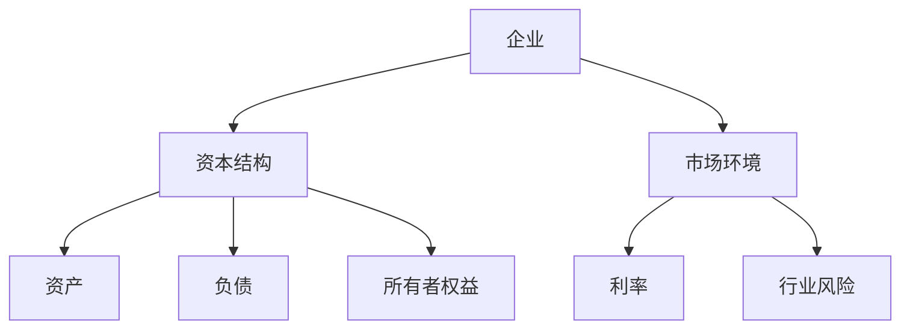
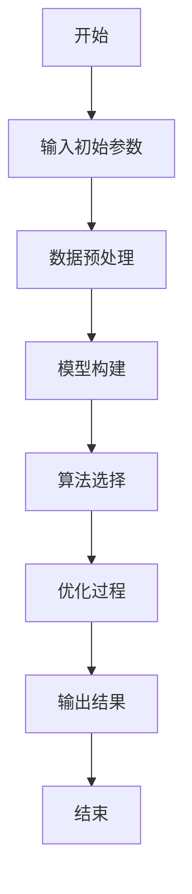
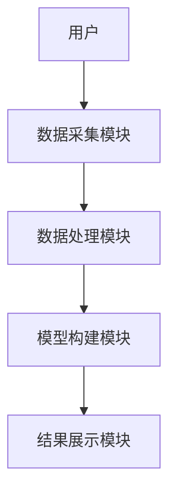
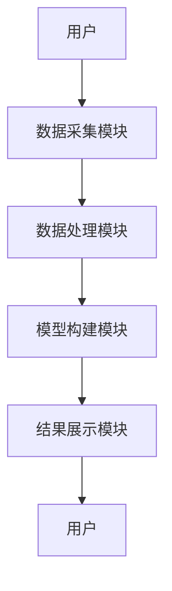

                 


# 智能化企业资本结构动态优化模型研究

## 关键词：智能化、资本结构、动态优化、模型研究、企业财务

## 摘要：  
本文系统地研究了智能化企业资本结构动态优化模型的构建与应用。通过分析传统资本结构优化方法的局限性，提出了基于人工智能和大数据技术的智能化优化策略。文章从理论基础、算法原理、系统架构到实际案例进行了全面探讨，重点阐述了动态优化模型的实现方法及其在企业财务管理中的应用价值。通过对模型的数学推导、算法设计和系统实现，展示了如何利用智能化技术提升企业资本结构优化的效率与精度。

---

# 第1章: 智能化企业资本结构动态优化模型的背景与意义

## 1.1 问题背景

### 1.1.1 企业资本结构优化的传统方法与局限性
传统资本结构优化方法主要依赖于静态分析，例如使用杠杆原理和资本成本最小化方法。然而，这些方法难以适应市场环境的动态变化，如利率波动、行业风险变化和企业经营状况的不确定性。

### 1.1.2 智能化技术在资本结构优化中的应用前景
随着人工智能和大数据技术的发展，智能化方法能够实时捕捉市场变化，结合企业内外部数据，动态调整资本结构，从而提高优化效率和准确性。

### 1.1.3 动态优化的必要性与现实需求
企业在经营过程中面临复杂多变的内外部环境，静态优化方法已无法满足实际需求。动态优化能够实时适应市场变化，帮助企业降低财务风险，提升资本运作效率。

## 1.2 问题描述

### 1.2.1 资本结构优化的核心问题
资本结构优化的核心问题在于如何在不同市场条件下选择最优的资本比例，以实现企业价值最大化。

### 1.2.2 动态优化的定义与内涵
动态优化是指在市场环境变化的情况下，实时调整资本结构，以适应新的市场条件和企业战略目标。

### 1.2.3 智能化优化的目标与关键要素
智能化优化的目标是通过数据驱动和智能算法，实现资本结构的动态调整。关键要素包括数据采集、模型构建、算法设计和系统实现。

## 1.3 问题解决思路

### 1.3.1 数据驱动的优化方法
通过收集和分析企业内外部数据，利用大数据技术提取有用信息，为优化提供数据支持。

### 1.3.2 智能算法的应用策略
采用机器学习、遗传算法等智能算法，构建动态优化模型，实现资本结构的实时调整。

### 1.3.3 多目标优化的实现路径
在优化过程中，需要考虑多个目标，例如资本成本最小化、企业价值最大化等，通过多目标优化算法找到最优解。

## 1.4 边界与外延

### 1.4.1 模型的适用范围
模型适用于具有动态市场环境和复杂资本结构的企业，尤其是那些需要实时调整资本结构的企业。

### 1.4.2 优化的边界条件
优化过程需要考虑企业的财务约束、市场风险、监管政策等因素。

### 1.4.3 模型的可扩展性与局限性
模型具有较强的可扩展性，但其效果依赖于数据质量和算法的准确性。

## 1.5 概念结构与核心要素

### 1.5.1 核心概念的层次结构
资本结构优化 → 动态优化 → 智能化优化

### 1.5.2 关键要素的特征分析
- 数据源：企业财务数据、市场数据、行业数据
- 模型：动态优化模型、多目标优化模型
- 算法：机器学习算法、遗传算法

### 1.5.3 模型的逻辑框架
通过数据采集、模型构建、算法设计和系统实现，构建智能化企业资本结构动态优化模型。

---

# 第2章: 智能化企业资本结构动态优化模型的核心概念与联系

## 2.1 核心概念原理

### 2.1.1 动态优化的基本原理
动态优化通过实时调整资本结构，以适应市场环境的变化。

### 2.1.2 智能化优化的数学模型
智能化优化模型结合了机器学习和数学优化方法，能够动态调整资本比例。

### 2.1.3 多目标优化的实现机制
多目标优化通过权衡多个目标，找到最优的资本结构。

## 2.2 核心概念属性特征对比

| 特征 | 传统优化 | 智能化优化 |
|------|----------|------------|
| 数据源 | 静态数据 | 动态数据 |
| 方法 | 线性优化 | 非线性优化 |
| 精度 | 低 | 高 |

## 2.3 ER实体关系图架构


---

# 第3章: 智能化企业资本结构动态优化模型的算法原理

## 3.1 算法原理概述

### 3.1.1 动态优化算法的选择
选择适合动态优化的算法，例如遗传算法和粒子群优化算法。

### 3.1.2 智能化优化的核心算法
采用机器学习算法，例如支持向量机和神经网络，构建动态优化模型。

### 3.1.3 多目标优化的实现路径
通过多目标优化算法，如NSGA-II，找到资本结构的最优解。

## 3.2 算法流程图


## 3.3 算法实现代码

```python
import numpy as np
from sklearn import svm

# 数据预处理
def preprocess_data(data):
    # 数据清洗和归一化处理
    pass

# 模型构建
def build_model(X, y):
    model = svm.SVC()
    model.fit(X, y)
    return model

# 优化过程
def optimize(model, X):
    y_pred = model.predict(X)
    return y_pred

# 主函数
def main():
    data = [...]  # 输入数据
    X = preprocess_data(data)
    y = [...]  # 标签
    model = build_model(X, y)
    results = optimize(model, X)
    print(results)

if __name__ == "__main__":
    main()
```

## 3.4 算法的数学模型和公式

### 3.4.1 动态优化的数学模型
$$ \text{目标函数：} \min f(x) $$
$$ \text{约束条件：} g(x) \leq 0 $$

### 3.4.2 机器学习算法的数学表达
$$ y = f(x) $$

---

# 第4章: 智能化企业资本结构动态优化模型的系统分析与架构设计

## 4.1 项目场景介绍

### 4.1.1 系统目标
构建智能化企业资本结构动态优化系统，帮助企业实时优化资本结构。

### 4.1.2 项目背景
随着市场环境的动态变化，企业需要实时调整资本结构以应对风险。

## 4.2 系统功能设计

### 4.2.1 数据采集模块
采集企业财务数据、市场数据和行业数据。

### 4.2.2 数据处理模块
对数据进行清洗、归一化处理和特征提取。

### 4.2.3 模型构建模块
构建动态优化模型，选择合适的算法进行优化。

### 4.2.4 结果展示模块
展示优化结果，提供可视化报告。

## 4.3 系统架构设计

### 4.3.1 系统架构图


### 4.3.2 系统接口设计
- 数据接口：与企业财务系统对接
- 模型接口：与机器学习框架对接

### 4.3.3 系统交互流程图


---

# 第5章: 智能化企业资本结构动态优化模型的项目实战

## 5.1 环境安装

### 5.1.1 安装Python
安装Python 3.x版本。

### 5.1.2 安装依赖库
安装numpy、pandas、scikit-learn等库。

## 5.2 核心代码实现

```python
import numpy as np
from sklearn import svm

# 数据预处理
def preprocess_data(data):
    # 数据清洗和归一化处理
    pass

# 模型构建
def build_model(X, y):
    model = svm.SVC()
    model.fit(X, y)
    return model

# 优化过程
def optimize(model, X):
    y_pred = model.predict(X)
    return y_pred

# 主函数
def main():
    data = [...]  # 输入数据
    X = preprocess_data(data)
    y = [...]  # 标签
    model = build_model(X, y)
    results = optimize(model, X)
    print(results)

if __name__ == "__main__":
    main()
```

## 5.3 代码解读与分析

### 5.3.1 数据预处理模块
对输入数据进行清洗和归一化处理，确保模型输入的数据质量。

### 5.3.2 模型构建模块
使用支持向量机构建分类模型，用于资本结构的分类和预测。

### 5.3.3 优化过程模块
通过模型预测结果，优化资本结构，输出最优解。

## 5.4 案例分析

### 5.4.1 案例背景
某制造企业面临市场利率上升的风险，需要优化资本结构。

### 5.4.2 数据分析
通过对企业的财务数据和市场数据进行分析，构建动态优化模型。

### 5.4.3 模型实现
通过Python代码实现模型，优化资本结构，降低企业财务风险。

## 5.5 项目小结

### 5.5.1 项目成果
成功构建智能化企业资本结构动态优化模型，实现资本结构的实时优化。

### 5.5.2 经验总结
数据质量和算法选择对模型性能有重要影响，需要根据实际情况进行调整。

---

# 第6章: 智能化企业资本结构动态优化模型的最佳实践与拓展

## 6.1 最佳实践 tips

### 6.1.1 数据质量管理
确保数据的准确性和完整性，避免数据偏差。

### 6.1.2 算法选择策略
根据实际问题选择合适的算法，避免盲目使用复杂算法。

### 6.1.3 模型评估方法
通过交叉验证等方法评估模型性能，确保模型的泛化能力。

## 6.2 小结

### 6.2.1 模型的优势
智能化企业资本结构动态优化模型能够实时适应市场变化，提高优化效率和精度。

### 6.2.2 模型的局限性
模型的效果依赖于数据质量和算法的准确性，存在一定的局限性。

## 6.3 注意事项

### 6.3.1 数据隐私
注意保护企业的数据隐私，避免数据泄露。

### 6.3.2 模型的可解释性
确保模型的可解释性，方便企业理解和应用。

## 6.4 拓展阅读

### 6.4.1 相关技术
深入学习机器学习和优化算法，了解其在资本结构优化中的应用。

### 6.4.2 行业动态
关注智能化技术在企业财务管理中的最新应用和发展趋势。

---

# 作者

作者：AI天才研究院/AI Genius Institute & 禅与计算机程序设计艺术 /Zen And The Art of Computer Programming

