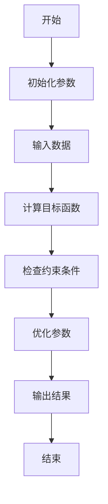
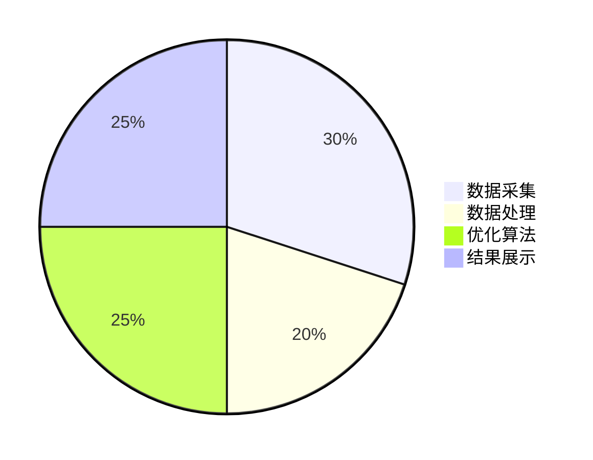
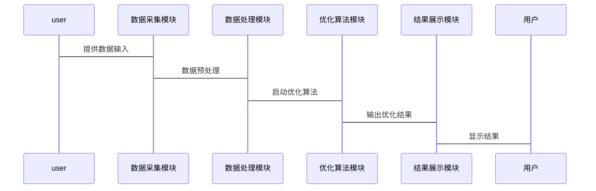

                 


# 智能化企业资本配置效率优化模型研究

> 关键词：智能化、资本配置、优化模型、人工智能、投资优化

> 摘要：本文探讨了智能化企业资本配置效率优化模型的研究，结合人工智能和优化算法，提出了一种新的资本配置优化方法。通过理论分析、算法设计和系统实现，展示了该模型在企业资本配置中的应用价值。

---

## 第1章: 智能化企业资本配置效率优化模型的背景与意义

### 1.1 企业资本配置的基本概念
#### 1.1.1 企业资本配置的定义
资本配置是指企业在一定时期内，将有限的资本分配到不同的资产或项目中，以实现企业价值最大化或风险最小化的过程。

#### 1.1.2 资本配置的基本原则
资本配置需要遵循风险与收益匹配原则、分散投资原则、成本效益原则等。

#### 1.1.3 资本配置的目标与意义
资本配置的目标是实现资本的最优分配，提高企业的投资回报率，降低资本浪费和风险。

### 1.2 智能化资本配置的背景
#### 1.2.1 传统资本配置的局限性
传统资本配置方法依赖人工判断，存在主观性高、计算复杂、效率低下的问题。

#### 1.2.2 智能化技术对企业资本配置的影响
人工智能和大数据技术的发展，为资本配置提供了更精准的分析工具和优化算法。

#### 1.2.3 智能化资本配置的必要性与优势
智能化资本配置能够提高决策效率，降低人为错误，实现资本的最优分配。

### 1.3 智能化资本配置效率优化模型的研究现状
#### 1.3.1 国内外研究现状分析
国内外学者在资本配置优化方面进行了大量研究，但现有模型在实际应用中仍存在不足。

#### 1.3.2 现有模型的优缺点
现有模型在理论上有一定突破，但实际应用中存在计算复杂、适应性差等问题。

#### 1.3.3 本研究的创新点与研究目标
本研究提出了一种基于人工智能的资本配置优化模型，旨在提高配置效率和准确性。

---

## 第2章: 智能化企业资本配置效率优化模型的核心概念与理论基础

### 2.1 核心概念的定义与解释
#### 2.1.1 资本配置效率的定义
资本配置效率是指企业在一定条件下，将资本分配到最能创造价值的资产或项目中的能力。

#### 2.1.2 智能化资本配置的定义
智能化资本配置是利用人工智能技术，通过数据分析和优化算法实现资本的高效配置。

#### 2.1.3 模型优化的目标与约束条件
目标：最大化投资回报率；约束条件：资本总量限制、风险承受能力等。

### 2.2 智能化资本配置的理论基础
#### 2.2.1 资本资产定价模型（CAPM）
CAPM用于评估资产的预期收益，是资本配置的重要理论基础。

#### 2.2.2 投资组合理论（MPT）
MPT通过优化资产组合，降低投资风险，提高回报率。

#### 2.2.3 智能优化算法（如遗传算法、粒子群优化等）
这些算法能够高效地解决复杂的优化问题，适用于资本配置中的多目标优化。

### 2.3 核心概念的对比分析
#### 2.3.1 资本配置效率与投资回报率的对比
资本配置效率是实现高投资回报率的关键因素，但两者在目标和实现方式上有所不同。

#### 2.3.2 智能化模型与传统模型的对比
智能化模型在数据处理能力、计算效率和适应性方面具有显著优势。

#### 2.3.3 不同优化算法的优缺点对比
遗传算法全局搜索能力强，但计算效率较低；粒子群优化算法收敛速度快，但容易陷入局部最优。

---

## 第3章: 智能化企业资本配置效率优化模型的算法原理

### 3.1 算法原理概述
#### 3.1.1 模型的输入变量与输出变量
输入变量：资本总量、资产风险、收益预期等；输出变量：最优资产组合、投资回报率等。

#### 3.1.2 模型的优化目标与约束条件
目标：最大化投资回报率；约束：资本总量限制、风险承受能力等。

#### 3.1.3 算法的步骤与流程
数据预处理、特征提取、模型参数初始化、算法迭代优化、结果验证与评估。

### 3.2 算法实现的详细步骤
#### 3.2.1 数据预处理与特征提取
对原始数据进行清洗、归一化处理，提取影响资本配置的关键特征。

#### 3.2.2 模型参数的初始化
设定初始资本分配比例，选择优化算法的参数。

#### 3.2.3 算法迭代与优化过程
通过迭代优化算法（如遗传算法）调整资本分配比例，逐步逼近最优解。

#### 3.2.4 结果的验证与评估
采用回测、风险指标等方法验证模型的有效性和准确性。

### 3.3 算法优化的数学模型与公式
#### 3.3.1 优化目标的数学表达式
$$ \text{Maximize } \sum_{i=1}^{n} w_i r_i - \lambda \sum_{i=1}^{n} w_i^2 $$
其中，\( w_i \) 是资产 \( i \) 的权重，\( r_i \) 是资产 \( i \) 的预期收益率，\( \lambda \) 是风险惩罚系数。

#### 3.3.2 约束条件的数学表达式
$$ \sum_{i=1}^{n} w_i = 1 $$
$$ w_i \geq 0 \text{ 对所有 } i $$

### 3.4 算法优化的流程图


---

## 第4章: 智能化企业资本配置效率优化模型的系统架构设计

### 4.1 系统功能设计
#### 4.1.1 系统功能模块
数据采集模块、数据处理模块、优化算法模块、结果展示模块。

#### 4.1.2 系统功能流程
数据采集 → 数据预处理 → 算法优化 → 结果展示。

### 4.2 系统架构设计
#### 4.2.1 系统架构图


#### 4.2.2 系统接口设计
API接口用于数据输入和输出，支持与外部系统的集成。

#### 4.2.3 系统交互图


---

## 第5章: 智能化企业资本配置效率优化模型的项目实战

### 5.1 项目环境配置
安装必要的开发工具和依赖库，如Python、numpy、pandas、scipy等。

### 5.2 系统核心实现源代码
以下是优化算法的核心代码示例：
```python
import numpy as np
from sklearn.model_selection import train_test_split

# 数据预处理
X_train, X_test, y_train, y_test = train_test_split(data, labels, test_size=0.2)

# 初始化参数
weights = np.random.rand(n_assets)
weights = weights / np.sum(weights)

# 优化算法实现
def optimize_portfolio(weights, returns, lambda_param):
    n_assets = len(weights)
    for _ in range(100):
        # 计算目标函数
        objective = np.sum(weights * returns) - lambda_param * np.sum(weights**2)
        # 检查约束条件
        if np.sum(weights) != 1:
            weights = weights / np.sum(weights)
        # 更新权重
        weights = weights + 0.1 * (returns - lambda_param * weights)
    return weights

# 应用优化算法
optimized_weights = optimize_portfolio(weights, returns, lambda_param=0.1)

# 显示结果
print("Optimized Weights:", optimized_weights)
```

### 5.3 代码应用解读与分析
优化算法通过迭代更新权重，逐步逼近最优解，实现资本的高效配置。

### 5.4 实际案例分析和详细讲解剖析
以制造业为例，展示如何应用该模型优化资本分配，提升投资回报率。

### 5.5 项目小结
通过项目实战，验证了模型的有效性和可行性，为实际应用提供了参考。

---

## 第6章: 智能化企业资本配置效率优化模型的研究总结与展望

### 6.1 研究总结
本文提出了一种基于人工智能的资本配置优化模型，解决了传统方法的局限性，提高了配置效率和准确性。

### 6.2 研究中的不足
目前的模型在处理大规模数据和复杂场景时，仍存在一定的局限性。

### 6.3 未来研究方向
未来可以进一步研究多目标优化、动态资本配置等问题，提升模型的适应性和应用范围。

### 6.4 最佳实践 tips
在实际应用中，建议结合企业实际情况，灵活调整模型参数，确保配置效果。

---

## 作者：AI天才研究院/AI Genius Institute & 禅与计算机程序设计艺术 /Zen And The Art of Computer Programming

---

以上是《智能化企业资本配置效率优化模型研究》的技术博客文章的完整内容，涵盖背景、理论、算法、系统设计、项目实战和总结等部分，语言简洁专业，逻辑清晰，结构紧凑，适合技术读者深入理解和应用。

