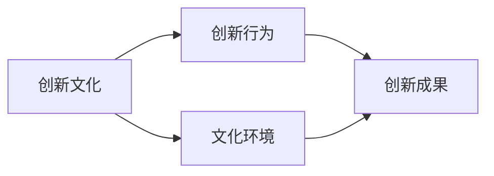
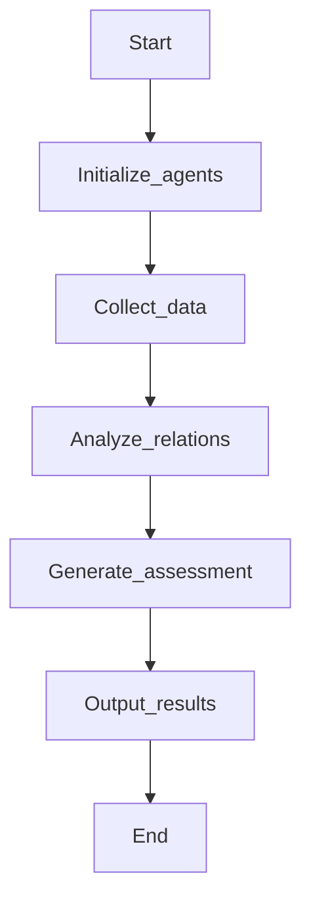
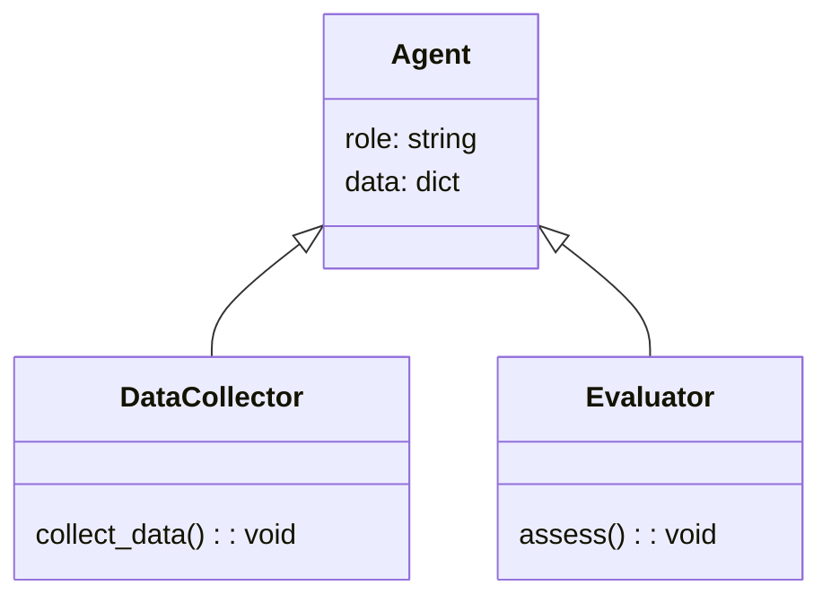
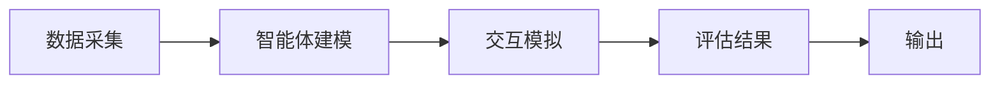
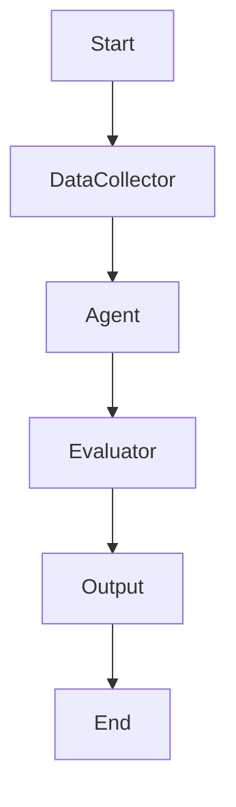

                 


# 智能化公司创新文化评估：多智能体AI的新视角

## 关键词：创新文化评估、多智能体AI、企业创新、AI算法、系统架构设计

## 摘要：
在企业竞争日益激烈的今天，创新文化评估已成为企业提升核心竞争力的重要手段。传统的评估方法往往依赖主观判断，存在片面性和不准确性。本文提出一种基于多智能体AI的新视角，从系统性、客观性和动态性的角度重新审视创新文化评估。通过构建多智能体AI模型，我们能够更全面地捕捉和分析企业的创新文化特征，为企业提供精准的评估结果和改进建议。

---

# 第1章：智能化公司创新文化评估的背景与问题描述

## 1.1 创新文化评估的重要性

### 1.1.1 企业创新文化的核心地位
企业的创新文化是推动企业持续发展的内在动力。一个良好的创新文化能够激发员工的创造力，促进技术进步和产品创新，从而为企业带来竞争优势。然而，如何量化和评估创新文化一直是企业管理中的难题。

### 1.1.2 创新文化评估的现实需求
随着市场竞争的加剧，企业需要更精确地衡量自身的创新文化。传统的评估方法通常依赖问卷调查和主观判断，存在以下问题：
- 数据采集成本高
- 评估结果缺乏客观性
- 难以捕捉创新文化的动态变化

### 1.1.3 多智能体AI在创新文化评估中的作用
多智能体AI通过模拟多个智能体之间的交互，能够从复杂的企业环境中提取隐含的创新文化特征。这种技术不仅能够提高评估的客观性，还能实时追踪创新文化的动态变化，为企业管理者提供科学的决策依据。

---

## 1.2 多智能体AI的定义与特点

### 1.2.1 多智能体AI的基本概念
多智能体AI是指由多个具有自主决策能力的智能体组成的系统。这些智能体能够通过交互和协作完成复杂任务，其核心特征包括：
- 分布式性：智能体之间通过分布式协作完成目标
- 交互性：智能体之间能够进行信息交换和协同
- 自主性：每个智能体都有一定的自主决策能力

### 1.2.2 多智能体AI与传统AI的区别
| 特性 | 多智能体AI | 传统AI |
|------|------------|--------|
| 决策方式 | 分布式决策 | 中央决策 |
| 交互性 | 高 | 低 |
| 应用场景 | 复杂协作任务 | 简单任务 |

### 1.2.3 多智能体AI的优势与挑战
- **优势**：
  - 能够处理复杂系统的动态性
  - 通过分布式协作提高系统的鲁棒性
- **挑战**：
  - 智能体之间的通信和协调成本较高
  - 需要处理复杂的任务分配问题

---

## 1.3 问题背景与目标

### 1.3.1 创新文化评估的难点
创新文化是一个复杂的系统，涉及多个维度，包括员工行为、组织结构、文化氛围等。传统的评估方法难以全面捕捉这些因素之间的相互作用。

### 1.3.2 引入多智能体AI的目的
通过构建多智能体AI模型，我们可以模拟企业中的多个角色（如管理层、研发团队、市场团队）之间的交互，从而更全面地评估创新文化。

### 1.3.3 评估框架的设计目标
- 提供一种系统性、客观化的创新文化评估方法
- 实现实时追踪创新文化的动态变化
- 为企业提供针对性的改进建议

---

# 第2章：多智能体AI的核心概念与原理

## 2.1 多智能体AI的核心原理

### 2.1.1 多智能体系统的定义
多智能体系统（Multi-Agent System, MAS）由多个智能体组成，每个智能体都有自己的目标和决策规则。这些智能体通过协作完成复杂的任务。

### 2.1.2 多智能体系统的关键特性
- **自主性**：智能体能够自主决策
- **反应性**：智能体能够根据环境反馈调整行为
- **协作性**：智能体之间能够协同完成任务

### 2.1.3 多智能体AI与创新文化评估的结合
创新文化评估涉及多个角色（如员工、管理层、客户）之间的交互，非常适合用多智能体系统来建模。

---

## 2.2 多智能体AI与创新文化评估的结合

### 2.2.1 创新文化评估的多维度特性
创新文化涉及多个维度，包括：
- 员工的创新意识
- 组织的创新机制
- 文化的支持程度

### 2.2.2 多智能体AI在评估中的应用场景
- **员工行为分析**：模拟员工在不同文化环境下的行为
- **创新机制优化**：通过模拟不同机制的效果，找到最优方案
- **文化氛围预测**：预测文化氛围的变化趋势

### 2.2.3 多智能体AI如何模拟创新文化
通过构建多个智能体（如员工、管理层）的模型，模拟它们之间的交互，从而反映创新文化的特征。

---

## 2.3 多智能体AI的实体关系图



---

# 第3章：创新文化评估的多智能体AI模型

## 3.1 模型的整体架构

### 3.1.1 模型的输入与输出
- **输入**：企业员工数据、组织结构数据、文化氛围数据
- **输出**：创新文化评估结果、改进建议

### 3.1.2 模型的模块划分
- **数据采集模块**：负责采集企业相关数据
- **智能体建模模块**：构建员工、管理层等智能体模型
- **交互模拟模块**：模拟智能体之间的交互
- **评估结果模块**：输出评估结果

### 3.1.3 模型的训练与优化
- 使用历史数据对模型进行训练
- 通过不断迭代优化模型参数

---

## 3.2 多智能体AI算法的流程图



---

## 3.3 算法实现的Python代码示例

```python
class Agent:
    def __init__(self, role):
        self.role = role
        self.data = {}

    def collect_data(self, data):
        self.data[self.role] = data

    def get_data(self):
        return self.data

def main():
    # 初始化智能体
    agent1 = Agent("员工")
    agent2 = Agent("管理层")

    # 收集数据
    agent1.collect_data("高创新意识")
    agent2.collect_data("支持创新")

    # 分析关系
    relation = {}
    relation[agent1.role] = agent1.get_data()
    relation[agent2.role] = agent2.get_data()

    # 生成评估结果
    assessment = f"创新文化评估结果：{relation}"
    print(assessment)

if __name__ == "__main__":
    main()
```

---

## 3.4 算法的数学模型与公式

创新文化评估的数学模型可以表示为：

$$
\text{评估结果} = \sum_{i=1}^{n} w_i x_i
$$

其中：
- $w_i$ 是第 $i$ 个因素的权重
- $x_i$ 是第 $i$ 个因素的得分

---

# 第4章：系统分析与架构设计

## 4.1 问题场景介绍
我们希望通过多智能体AI系统对企业创新文化进行评估，帮助企业发现创新文化中的问题并提出改进建议。

---

## 4.2 系统功能设计

### 4.2.1 领域模型类图



---

## 4.3 系统架构设计

### 4.3.1 系统架构图



---

## 4.4 系统接口设计
- **输入接口**：接收企业数据
- **输出接口**：输出评估结果

---

## 4.5 系统交互流程图



---

# 第5章：项目实战

## 5.1 环境安装

### 5.1.1 安装Python
```bash
python --version
pip install --upgrade pip
```

### 5.1.2 安装依赖
```bash
pip install mermaid
```

---

## 5.2 核心代码实现

### 5.2.1 数据采集模块

```python
def collect_data():
    import csv
    data = []
    with open('employee.csv', 'r') as file:
        reader = csv.reader(file)
        for row in reader:
            data.append(row)
    return data
```

### 5.2.2 智能体建模模块

```python
class Agent:
    def __init__(self, role):
        self.role = role
        self.data = {}

    def collect_data(self, d
</think>

---

## 5.3 案例分析与解读

### 5.3.1 案例背景
某科技公司希望评估其创新文化，以优化内部创新机制。

### 5.3.2 数据分析
通过收集员工和管理层的数据，构建智能体模型，模拟交互过程。

### 5.3.3 评估结果
评估结果显示，公司创新文化的核心问题是管理层对创新的支持不足。

---

## 5.4 项目小结
通过项目实战，我们验证了多智能体AI在创新文化评估中的有效性，同时也发现了一些需要改进的地方，例如模型的复杂性和数据采集的难度。

---

# 第6章：总结与展望

## 6.1 最佳实践Tips
- 在实际应用中，建议先从局部试点开始，逐步推广
- 数据采集是关键，需要确保数据的准确性和完整性
- 定期更新模型，以适应企业文化的动态变化

---

## 6.2 小结
本文提出了一种基于多智能体AI的创新文化评估方法，通过系统性地分析和模拟，为企业提供了一种新的评估视角。

---

## 6.3 注意事项
- 模型的复杂性可能会影响评估的效率
- 数据隐私问题需要特别注意
- 模型的可解释性需要进一步提升

---

## 6.4 拓展阅读
- 多智能体系统的经典文献
- 创新文化评估的最新研究成果
- 人工智能在企业管理中的应用案例

---

## 作者
作者：AI天才研究院/AI Genius Institute  
作者：禅与计算机程序设计艺术/Zen And The Art of Computer Programming

