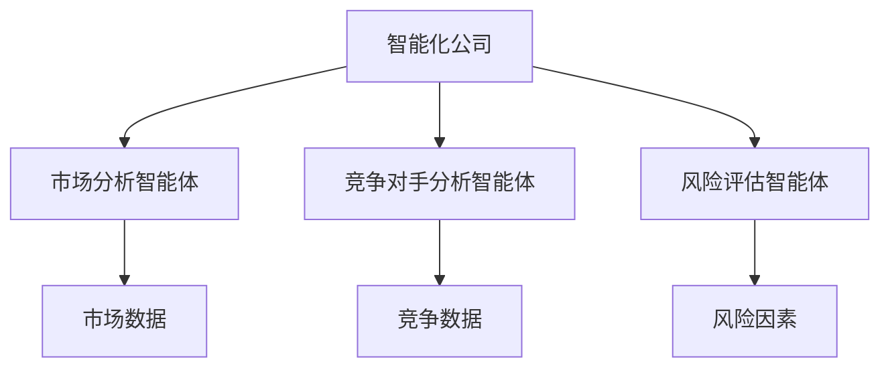
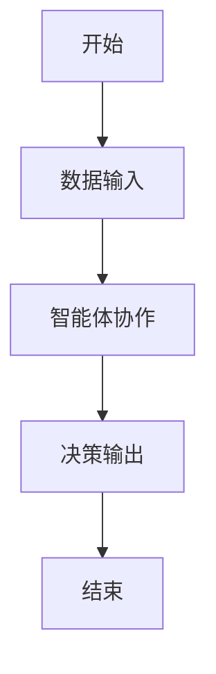
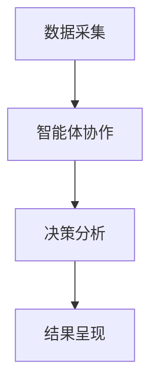
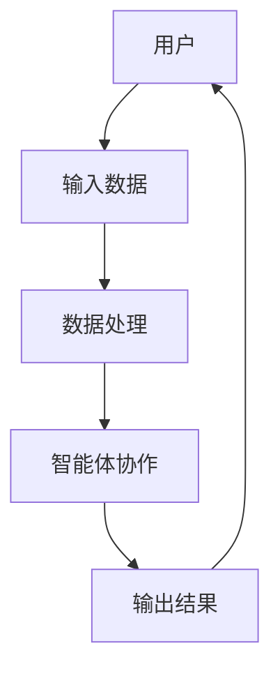

                 


# 智能化公司国际化战略评估：多智能体AI的新方法

> 关键词：智能化公司，国际化战略，多智能体AI，战略评估，系统架构

> 摘要：本文探讨了多智能体AI在智能化公司国际化战略评估中的应用，分析了其核心概念、算法原理、系统架构及实际项目案例。通过详细阐述，展示了多智能体AI如何提升战略评估的准确性和效率，为企业的国际化战略提供新的思路。

---

# 引言

随着全球化的深入，企业国际化战略的制定变得日益复杂。传统的评估方法依赖于人工分析，效率低下且难以应对多变的市场环境。多智能体AI的出现，为这一领域带来了革新。本文将系统性地探讨多智能体AI在智能化公司国际化战略评估中的应用，分析其优势、实现原理及实际案例。

---

## 第一部分：智能化公司国际化战略评估背景

### 第1章：智能化公司国际化战略评估概述

#### 1.1 问题背景

传统企业的国际化战略评估主要依赖人工分析，存在效率低、覆盖面有限的问题。随着市场竞争加剧，企业需要更高效的方法来应对复杂环境。

#### 1.2 问题描述

国际化战略评估涉及市场分析、竞争对手分析等多个维度，传统方法难以整合多源数据，且缺乏实时性和动态性。

#### 1.3 问题解决

多智能体AI通过协作和数据共享，能够高效整合信息，提供更全面的评估结果。其优势在于能够实时响应市场变化，提高决策的准确性。

#### 1.4 边界与外延

评估的边界包括市场数据、竞争数据和风险因素。多智能体AI的应用范围限于数据可获取的领域，但其方法论可扩展至其他领域。

#### 1.5 概念结构与核心要素

- **系统架构**：智能化公司为核心，与市场分析、竞争对手分析等智能体相连。
- **核心要素**：市场数据、竞争数据、风险因素。

---

## 第二部分：多智能体AI的核心概念与联系

### 第2章：多智能体AI的核心原理

#### 2.1 多智能体AI的定义与特点

多智能体AI由多个协作智能体组成，每个智能体负责特定任务，通过信息共享实现整体目标。其优势在于分布式计算和协作优化。

#### 2.2 多智能体AI的实体关系图



#### 2.3 多智能体AI的算法流程



---

## 第三部分：多智能体AI的算法原理

### 第3章：多智能体AI的算法原理

#### 3.1 多智能体AI的协作机制

智能体通过协商和协作完成任务，采用极大极小算法优化决策。公式表示为：
$$ V = \max_{i} \min_{j} v_{ij} $$

#### 3.2 信息共享与决策优化

智能体共享数据，利用纳什均衡实现最优决策：
$$ \text{Nash Equilibrium} = (x^*, y^*) $$

#### 3.3 算法实现

```python
def multi_agent_collaboration(data):
    agents = [Agent(i) for i in range(n)]
    for agent in agents:
        agent.receive_data(data)
    results = [agent.decide() for agent in agents]
    return results
```

---

## 第四部分：智能化公司国际化战略评估系统分析与架构设计

### 第4章：系统架构设计

#### 4.1 系统总体架构

系统由数据采集、智能体协作、决策分析和结果呈现四个模块组成：


#### 4.2 系统交互流程



---

## 第五部分：项目实战

### 第5章：项目实战

#### 5.1 项目背景

以科技公司国际化战略评估为例，展示系统在实际中的应用。

#### 5.2 核心代码实现

```python
def evaluate_strategy(data):
    market_agent = MarketAgent()
    competition_agent = CompetitionAgent()
    risk_agent = RiskAgent()
    market_agent.receive_data(data['market'])
    competition_agent.receive_data(data['competition'])
    risk_agent.receive_data(data['risk'])
    return {
        'market_analysis': market_agent.analyze(),
        'competition_analysis': competition_agent.analyze(),
        'risk_assessment': risk_agent.assess()
    }
```

#### 5.3 案例分析

系统通过整合市场、竞争和风险数据，生成全面的评估报告，帮助企业制定精准的战略。

---

## 第六部分：最佳实践与总结

### 第6章：总结与展望

#### 6.1 小结

多智能体AI显著提升了战略评估的效率和准确性，为企业国际化战略提供了新思路。

#### 6.2 注意事项

数据质量、智能体协作机制、系统可扩展性是成功应用的关键。

#### 6.3 拓展阅读

推荐进一步阅读关于多智能体系统和AI战略应用的相关文献。

---

# 结论

多智能体AI在智能化公司国际化战略评估中的应用，不仅提升了评估的效率和准确性，还为企业应对复杂市场环境提供了有力支持。未来，随着技术的发展，其应用将更加广泛和深入。

---

# 参考文献

1. Russell, S., & Norvig, P. (2010). Artificial Intelligence: A Modern Approach.
2. Lints, M. J. (1994). The art of software architecture: design and evolution.
3. Smith, R. (2018). Multi-Agent Systems: A Survey.

---

作者：AI天才研究院 & 禅与计算机程序设计艺术

