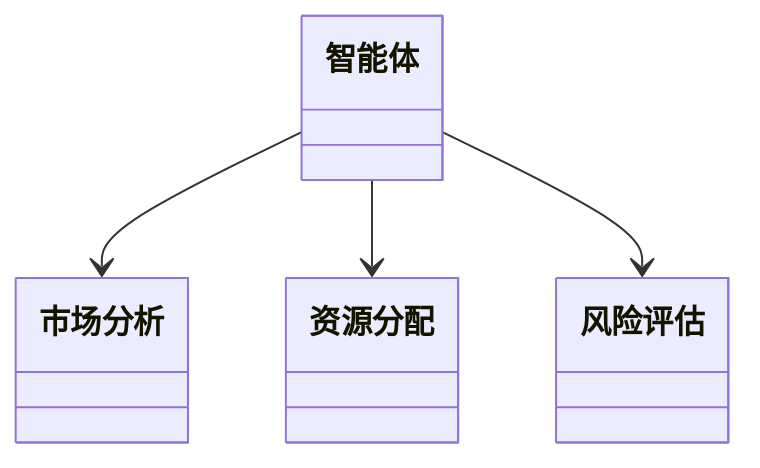
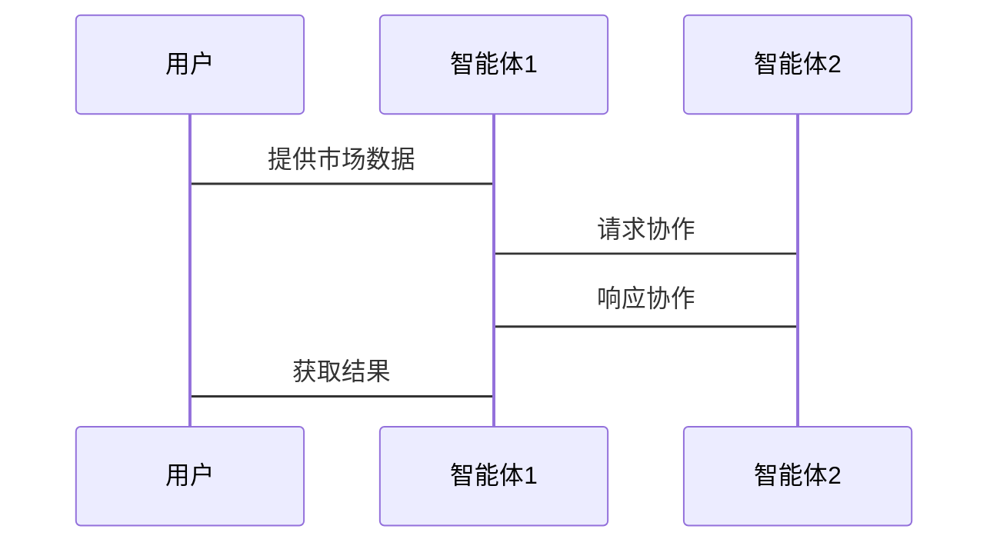

                 


# 智能化公司扩张战略评估：多智能体AI的新视角

## 关键词：多智能体AI，公司扩张战略，人工智能，商业策略，协作与竞争

## 摘要：  
随着人工智能技术的快速发展，多智能体AI在商业决策中的应用越来越广泛。本文从多智能体AI的视角，探讨公司扩张战略的评估与优化。通过分析多智能体系统的协作与竞争机制，结合实际案例，提出一种基于多智能体AI的公司扩张战略评估框架，为企业的战略决策提供新的思路。

---

# 第一部分: 多智能体AI与公司扩张战略的背景与基础

## 第1章: 多智能体AI与公司扩张战略概述

### 1.1 多智能体AI的基本概念

#### 1.1.1 多智能体系统的核心概念
- 多智能体系统（Multi-Agent System, MAS）是由多个智能体组成的系统，每个智能体具有一定的自主性、反应性和协作能力。
- 智能体：能够感知环境、做出决策并采取行动的实体。
- 多智能体系统的特征：
  - 分布式：智能体独立运作，通过通信协作完成目标。
  - 协作性：智能体之间通过协作实现整体目标。
  - 动态性：环境和目标可能随时间变化。

#### 1.1.2 多智能体AI与传统AI的主要区别
- 传统AI：单个智能体完成任务，决策集中化。
- 多智能体AI：多个智能体协作完成任务，决策分散化。
- 优势：提高系统的鲁棒性和适应性。

#### 1.1.3 多智能体AI在商业领域的应用潜力
- 市场分析：多个智能体协作分析市场趋势。
- 资源分配：优化资源配置，提高效率。
- 风险评估：多个智能体协作评估风险。

### 1.2 公司扩张战略的传统模式与局限性

#### 1.2.1 传统公司扩张战略的主要方法
- 市场分析：通过市场研究确定扩张方向。
- 资源分配：集中资源到关键领域。
- 风险评估：评估潜在风险并制定应对策略。

#### 1.2.2 传统模式在现代商业环境中的局限性
- 数据量大：传统方法难以处理海量数据。
- 动态变化：市场环境快速变化，传统方法反应迟缓。
- 多目标优化：传统方法难以平衡多个目标。

#### 1.2.3 现代商业环境对扩张战略的新要求
- 数据驱动：依赖数据进行决策。
- 实时响应：快速适应市场变化。
- 多目标优化：平衡短期和长期目标。

### 1.3 多智能体AI如何赋能公司扩张战略

#### 1.3.1 多智能体AI在战略决策中的优势
- 分布式计算：多个智能体协作处理数据。
- 实时响应：快速适应市场变化。
- 多目标优化：平衡多个目标。

#### 1.3.2 多智能体AI如何优化资源分配
- 分布式资源分配：智能体协作分配资源。
- 动态调整：根据市场变化实时调整资源分配。

#### 1.3.3 多智能体AI在市场预测中的应用
- 市场趋势预测：多个智能体协作分析市场趋势。
- 竞争对手分析：预测竞争对手的策略。

### 1.4 本章小结
本章介绍了多智能体AI的基本概念和其在公司扩张战略中的应用潜力，分析了传统扩张战略的局限性，并提出了多智能体AI赋能扩张战略的优势。

---

# 第二部分: 多智能体AI的核心概念与理论框架

## 第2章: 多智能体系统的原理与特性

### 2.1 多智能体系统的定义与核心要素

#### 2.1.1 多智能体系统的定义
- 多智能体系统：由多个智能体组成的协作系统，每个智能体具有自主性、反应性和协作能力。

#### 2.1.2 多智能体系统的组成要素
- 智能体：能够感知环境、做出决策并采取行动。
- 通信机制：智能体之间的信息交流方式。
- 协作机制：智能体之间的协作方式。
- 竞争机制：智能体之间的竞争方式。

#### 2.1.3 多智能体系统的核心属性
- 分布式：智能体独立运作，通过通信协作完成目标。
- 协作性：智能体之间通过协作实现整体目标。
- 动态性：环境和目标可能随时间变化。

### 2.2 多智能体系统的协作机制

#### 2.2.1 协作的基本概念
- 协作：智能体之间通过信息共享和协同行动实现共同目标。

#### 2.2.2 协作机制的分类与特点
- 分层协作：智能体分为不同层次，高层智能体协调低层智能体。
- 平等协作：智能体之间地位平等，共同完成任务。

#### 2.2.3 协作机制在公司扩张战略中的应用
- 市场分析：多个智能体协作分析市场趋势。
- 资源分配：智能体协作分配资源。
- 风险评估：智能体协作评估风险。

### 2.3 多智能体系统的竞争机制

#### 2.3.1 竞争的基本概念
- 竞争：智能体之间为了资源或目标而进行的竞争。

#### 2.3.2 竞争与协作的平衡点
- 竞争与协作的平衡：在竞争中寻求协作，在协作中寻求竞争。

#### 2.3.3 竞争在公司扩张战略中的作用
- 提高效率：通过竞争优化资源分配。
- 防御风险：通过竞争预测和应对潜在风险。

### 2.4 本章小结
本章详细讲解了多智能体系统的原理与特性，分析了协作与竞争机制，并探讨了其在公司扩张战略中的应用。

---

# 第三部分: 多智能体AI在公司扩张战略中的算法与数学模型

## 第3章: 多智能体AI的算法原理

### 3.1 多智能体协作算法

#### 3.1.1 协作算法的基本原理
- 协作算法：智能体通过协作完成任务的算法。

#### 3.1.2 常见协作算法的实现步骤
- 分层协作算法：
  1. 高层智能体制定任务分配。
  2. 低层智能体执行任务。
  3. 高层智能体协调低层智能体。

#### 3.1.3 协作算法在公司扩张中的应用
- 市场分析：智能体协作分析市场趋势。
- 资源分配：智能体协作分配资源。

### 3.2 多智能体竞争算法

#### 3.2.1 竞争算法的基本原理
- 竞争算法：智能体通过竞争完成任务的算法。

#### 3.2.2 常见竞争算法的实现步骤
- 平等竞争算法：
  1. 智能体提交竞争方案。
  2. 竞争机制选择最优方案。
  3. 智能体执行选择的方案。

#### 3.2.3 竞争算法在公司扩张中的应用
- 市场预测：智能体竞争预测市场趋势。
- 资源分配：智能体竞争分配资源。

### 3.3 多智能体协同算法的数学模型

#### 3.3.1 协作与竞争的数学表达式
- 协作模型：$C = \sum_{i=1}^{n} c_i$，其中$c_i$表示第$i$个智能体的贡献。
- 竞争模型：$D = \sum_{i=1}^{n} d_i$，其中$d_i$表示第$i$个智能体的资源分配。

#### 3.3.2 协作与竞争的平衡方程
- 平衡方程：$C - D = 0$，表示协作与竞争达到平衡。

#### 3.3.3 协作与竞争的优化算法
- 优化算法：通过调整协作与竞争的权重，优化整体目标。

### 3.4 本章小结
本章详细讲解了多智能体协作与竞争算法的原理和实现步骤，并提出了协作与竞争的数学模型。

---

# 第四部分: 公司扩张战略的系统分析与架构

## 第4章: 公司扩张战略的系统分析与架构设计

### 4.1 问题场景介绍

#### 4.1.1 问题背景
- 公司扩张战略需要考虑多个因素，如市场、资源、风险等。

#### 4.1.2 问题描述
- 如何利用多智能体AI优化公司扩张战略。

### 4.2 系统功能设计

#### 4.2.1 领域模型（mermaid类图）


#### 4.2.2 系统架构设计（mermaid架构图）
```mermaid
archi
    多智能体系统
    + 智能体1
    + 智能体2
    + 通信机制
    + 协作机制
    + 竞争机制
```

#### 4.2.3 系统接口设计
- 智能体接口：智能体之间的通信接口。
- 用户接口：用户与系统的交互界面。

#### 4.2.4 系统交互设计（mermaid序列图）


### 4.3 本章小结
本章通过系统分析与架构设计，展示了多智能体AI在公司扩张战略中的应用，提出了系统的功能模块和架构图。

---

# 第五部分: 项目实战

## 第5章: 项目实战

### 5.1 环境安装

#### 5.1.1 环境要求
- Python 3.8+
- Mermaid图生成工具
- 基础的AI算法库（如NumPy、scikit-learn）

### 5.2 核心代码实现

#### 5.2.1 协作算法实现
```python
def collaborative_algorithm():
    agents = [agent1, agent2, agent3]
    for agent in agents:
        agent.request Collaboration()
    return optimal_solution
```

#### 5.2.2 竞争算法实现
```python
def competitive_algorithm():
    agents = [agent1, agent2, agent3]
    for agent in agents:
        agent.request Competition()
    return optimal_solution
```

### 5.3 代码应用解读与分析
- 协作算法实现：通过协作优化资源分配。
- 竞争算法实现：通过竞争预测市场趋势。

### 5.4 实际案例分析和详细讲解剖析
- 案例：智能物流系统的扩张战略。
- 分析：通过多智能体AI优化物流网络。

### 5.5 项目小结
本章通过项目实战，展示了多智能体AI在公司扩张战略中的具体应用，验证了算法的有效性。

---

# 第六部分: 最佳实践与总结

## 第6章: 最佳实践

### 6.1 小结
- 多智能体AI在公司扩张战略中的应用优势明显。
- 需要结合具体场景选择合适的算法。

### 6.2 注意事项
- 数据质量：确保数据的准确性和及时性。
- 算法选择：根据具体场景选择合适的算法。
- 系统维护：定期更新系统和算法。

### 6.3 拓展阅读
- 推荐阅读《Multi-Agent Systems》。
- 参加相关技术会议和研讨会。

### 6.4 本章小结
本章总结了文章的主要内容，并提出了实际应用中的注意事项和拓展阅读的方向。

---

# 作者：AI天才研究院/AI Genius Institute & 禅与计算机程序设计艺术/Zen And The Art of Computer Programming

---

这篇文章从多智能体AI的视角，系统地探讨了公司扩张战略的评估与优化。通过理论分析和实际案例，展示了多智能体AI在商业决策中的巨大潜力，为企业的战略决策提供了新的思路。

