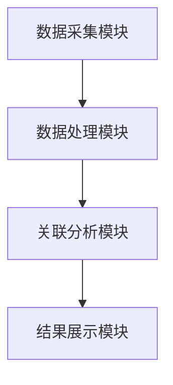
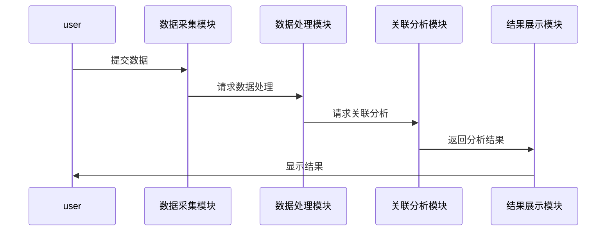
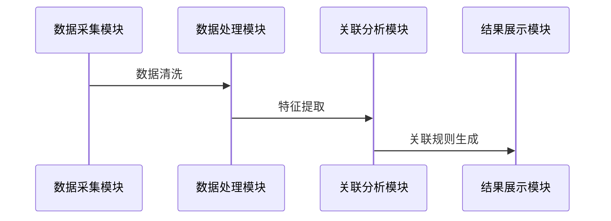

                 


# 智能化公司文化与绩效关联分析：多智能体AI的新视角

**关键词**：智能化公司文化，绩效管理，多智能体AI，关联分析，系统架构

**摘要**：随着人工智能技术的快速发展，公司文化和绩效管理的智能化转型成为企业关注的焦点。本文从多智能体AI的视角，深入分析智能化公司文化与绩效之间的关联性，探讨如何通过多智能体AI技术实现公司文化与绩效的智能化分析与优化。文章首先介绍了智能化公司文化与多智能体AI的基本概念，然后分析了公司文化与绩效的关系，接着详细阐述了多智能体AI在关联分析中的应用，最后提出了智能化公司文化与绩效关联分析的系统架构及实现方案。

---

## 第1章：智能化公司文化与多智能体AI的基本概念

### 1.1 智能化公司文化的定义与特征

#### 1.1.1 传统公司文化的演进
- 从“人治”到“制度”的转变
- 从“经验管理”到“数据驱动”的演进
- 从“单一维度”到“多维度”的文化构建

#### 1.1.2 智能化公司文化的内涵
- 数据驱动的决策文化
- 协作共享的文化氛围
- 智能化工具支持的文化实践

#### 1.1.3 智能化公司文化的特征
- **数据驱动性**：依赖数据和算法进行决策
- **实时性**：快速响应变化
- **个性化**：根据不同员工特点提供个性化支持
- **协作性**：多部门、多角色协同工作

### 1.2 多智能体AI的基本概念

#### 1.2.1 多智能体系统简介
- 多智能体系统的定义：由多个相互作用的智能体组成的系统
- 多智能体系统的特征：分布式、协作性、反应性

#### 1.2.2 多智能体AI的核心原理
- 分布式计算与协作
- 实时感知与响应
- 自适应优化

#### 1.2.3 多智能体AI与公司文化的关联
- 多智能体AI为公司文化分析提供技术支持
- 公司文化为多智能体AI的优化提供场景

### 1.3 智能化绩效管理的转型

#### 1.3.1 传统绩效管理的局限性
- 主观性高
- 静态性问题
- 单一维度评估

#### 1.3.2 智能化绩效管理的优势
- 数据驱动的精准评估
- 实时反馈与优化
- 多维度立体评估

#### 1.3.3 多智能体AI在绩效管理中的应用
- 绩效数据分析与预测
- 绩效优化建议
- 绩效反馈与改进

---

## 第2章：智能化公司文化与绩效关联的理论基础

### 2.1 公司文化与绩效的关系

#### 2.1.1 公司文化对绩效的影响机制
- 文化影响员工行为
- 文化影响组织氛围
- 文化影响组织目标

#### 2.1.2 绩效对公司文化的作用
- 高绩效推动文化优化
- 低绩效暴露文化问题
- 绩效反馈驱动文化调整

#### 2.1.3 两者关系的动态性
- 长期性与即时性并存
- 正向与反向关联并存
- 静态与动态调整并存

### 2.2 多智能体AI的理论基础

#### 2.2.1 多智能体系统的理论框架
- **智能体模型**：Rational Agent
- **多智能体系统架构**：BDI模型（Belief、Desire、Intention）
- **多智能体协作理论**：分布式问题求解、协同决策

#### 2.2.2 多智能体AI的核心算法
- **分布式计算**：基于消息传递的协作
- **实时感知**：基于传感器的数据处理
- **自适应优化**：基于反馈的调整

#### 2.2.3 多智能体AI的数学模型
- **智能体状态表示**：$s_i = (s_{i1}, s_{i2}, ..., s_{in})$
- **智能体动作表示**：$a_i = (a_{i1}, a_{i2}, ..., a_{im})$
- **多智能体协作模型**：$C = \{c_1, c_2, ..., c_k\}$，其中$c_k$表示第$k$个协作任务

### 2.3 关联分析的数学模型

#### 2.3.1 关联分析的基本概念
- 关联规则：$A \rightarrow B$，表示当A发生时，B也倾向于发生
- 支持度：$sup(A,B) = P(A \cap B)$
- 置信度：$conf(A,B) = P(B|A) = \frac{sup(A,B)}{sup(A)}$

#### 2.3.2 关联分析的数学公式
$$
\text{支持度} = \frac{\text{同时出现的次数}}{\text{总数据量}}
$$
$$
\text{置信度} = \frac{\text{支持度}}{\text{A的出现次数}}
$$

#### 2.3.3 关联分析的实现步骤
1. 数据预处理
2. 生成候件集
3. 计算关联规则
4. 筛选规则

---

## 第3章：多智能体AI在公司文化与绩效关联分析中的应用

### 3.1 多智能体AI在公司文化分析中的应用

#### 3.1.1 公司文化特征的提取
- 员工行为数据
- 组织氛围数据
- 企业文化数据

#### 3.1.2 多智能体AI在文化特征识别中的作用
- 分布式数据处理
- 实时行为分析
- 文化特征的自适应优化

#### 3.1.3 典型案例分析
- 某互联网公司文化分析案例

### 3.2 多智能体AI在绩效分析中的应用

#### 3.2.1 绩效数据的智能化处理
- 多维度数据整合
- 数据清洗与特征提取
- 绩效预测与评估

#### 3.2.2 多智能体AI在绩效预测中的应用
- 基于历史数据的预测
- 实时数据的动态调整
- 多维度的绩效评估

#### 3.2.3 绩效优化建议
- 基于关联分析的优化方案
- 多智能体协作的优化路径
- 实时反馈的优化策略

### 3.3 多智能体AI在关联分析中的应用

#### 3.3.1 关联分析的多智能体模型构建
- **智能体角色分配**：数据采集智能体、数据处理智能体、关联规则生成智能体
- **协作机制设计**：任务分配、信息共享、结果整合
- **模型优化**：基于反馈的模型调整

#### 3.3.2 多智能体AI在关联分析中的算法实现
- 分布式关联规则挖掘算法
- 多智能体协作的优化算法

#### 3.3.3 应用案例分析
- 某制造企业绩效与文化关联分析案例

---

## 第4章：智能化公司文化与绩效关联分析的系统架构

### 4.1 系统功能模块设计

#### 4.1.1 数据采集模块
- 数据来源：员工行为数据、绩效数据、文化数据
- 数据格式：结构化数据、非结构化数据
- 数据存储：数据库存储、分布式存储

#### 4.1.2 数据处理模块
- 数据清洗
- 数据整合
- 数据特征提取

#### 4.1.3 关联分析模块
- 关联规则挖掘
- 关联结果筛选
- 关联结果展示

#### 4.1.4 结果展示模块
- 可视化展示
- 关联结果解释
- 绩效优化建议

### 4.2 系统架构设计

#### 4.2.1 模块之间的关系
- 数据采集模块与数据处理模块的交互
- 数据处理模块与关联分析模块的交互
- 关联分析模块与结果展示模块的交互

#### 4.2.2 系统架构的流程图


#### 4.2.3 系统架构的优化建议
- 增加缓存机制
- 优化分布式计算
- 提高数据处理效率

### 4.3 系统接口设计

#### 4.3.1 数据接口
- 数据输入接口
- 数据输出接口
- 数据查询接口

#### 4.3.2 用户接口
- 界面设计
- 用户权限管理
- 用户操作指南

#### 4.3.3 输出接口
- 可视化结果输出
- 报告生成
- 提醒与通知

### 4.4 系统交互设计

#### 4.4.1 用户与系统的交互流程


#### 4.4.2 系统内部模块的交互


#### 4.4.3 交互设计的优化建议
- 简化用户操作流程
- 提供实时反馈
- 支持多端交互

---

## 第5章：项目实战——智能化公司文化与绩效关联分析系统开发

### 5.1 项目背景与目标

#### 5.1.1 项目背景
- 企业智能化转型的需求
- 多智能体AI技术的应用场景
- 绩效与文化关联分析的现实意义

#### 5.1.2 项目目标
- 实现智能化公司文化与绩效关联分析
- 提供实时反馈与优化建议
- 构建可扩展的系统架构

### 5.2 系统核心实现

#### 5.2.1 环境安装
- Python 3.8+
- PyTorch 1.9+
- Pandas 1.3+
- scikit-learn 0.24+

#### 5.2.2 核心代码实现

##### 数据采集与处理
```python
import pandas as pd
import requests

def collect_data(url):
    response = requests.get(url)
    data = response.json()
    return pd.DataFrame(data)

def preprocess_data(df):
    # 数据清洗
    df.dropna(inplace=True)
    # 特征提取
    df['文化特征'] = df['文化特征'].apply(lambda x: x.strip())
    return df
```

##### 关联分析实现
```python
from mlxtend.frequent_patterns import apriori

def association_rules(data, min_support=0.5):
    frequent_itemsets = apriori(data, min_support=min_support)
    return frequent_itemsets
```

##### 多智能体协作实现
```python
class MultiAgentSystem:
    def __init__(self, agents):
        self.agents = agents

    def run(self):
        for agent in self.agents:
            agent.receive_message("开始任务")
        return [agent.process() for agent in self.agents]
```

### 5.3 应用案例分析

#### 5.3.1 某互联网公司案例
- 数据采集与分析
- 关联规则生成
- 优化建议输出

#### 5.3.2 某制造企业案例
- 系统部署与测试
- 绩效与文化关联分析
- 优化方案实施

### 5.4 项目小结

#### 5.4.1 项目成果
- 成功实现智能化公司文化与绩效关联分析
- 提供实时反馈与优化建议
- 构建了可扩展的系统架构

#### 5.4.2 项目经验总结
- 数据质量的重要性
- 系统架构的优化建议
- 多智能体协作的实现要点

---

## 第6章：总结与展望

### 6.1 本章总结
- 智能化公司文化与绩效关联分析的重要意义
- 多智能体AI在关联分析中的核心作用
- 系统架构设计与实现的关键点

### 6.2 未来展望
- 多智能体AI技术的进一步发展
- 绩效与文化关联分析的深化应用
- 智能化公司文化管理的未来发展

---

## 附录

### 附录A：数据集说明

### 附录B：工具与库

### 附录C：参考文献

---

**作者**：AI天才研究院 & 禅与计算机程序设计艺术

