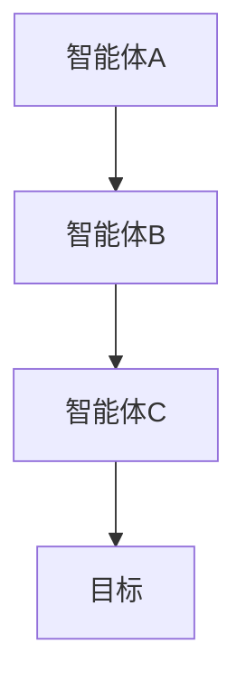
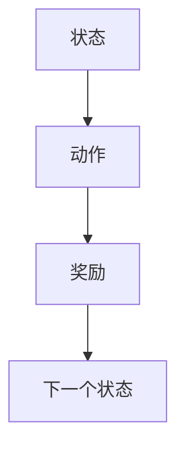
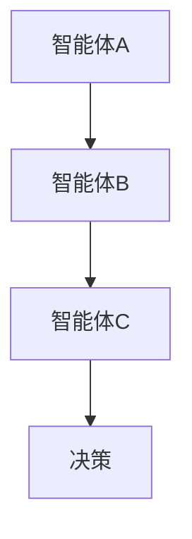
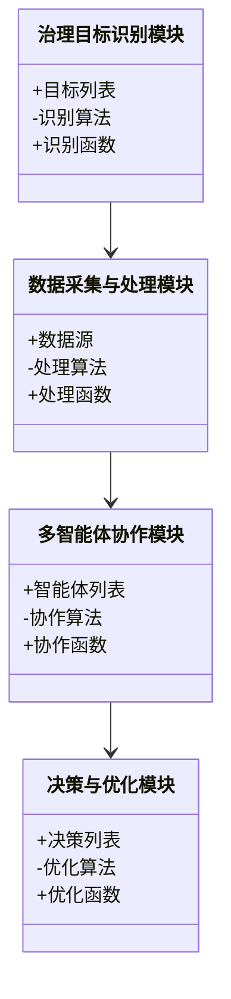
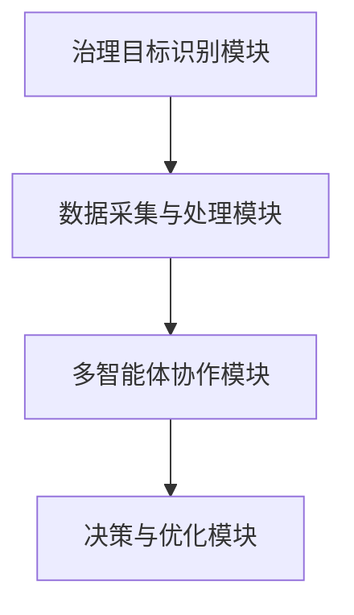
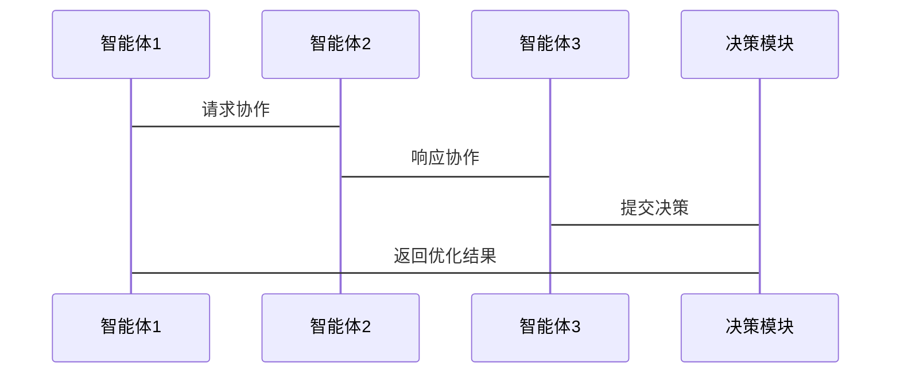

                 


# 智能化公司治理效率分析：多智能体AI的创新应用

> 关键词：智能化公司治理，多智能体AI，治理效率，协作机制，数学模型，系统架构

> 摘要：本文探讨了多智能体AI在公司治理效率分析中的创新应用，通过分析多智能体AI的核心原理、系统架构、数学模型以及实际案例，展示了如何利用多智能体AI提升公司治理的效率和决策能力。

---

# 第一部分: 智能化公司治理效率分析的背景与概念

# 第1章: 智能化公司治理效率分析概述

## 1.1 智能化公司治理的背景与意义

### 1.1.1 传统公司治理的局限性
传统的公司治理模式依赖于人工决策和经验判断，存在效率低下、信息不对称、决策延迟等问题。随着企业规模的扩大和业务复杂性的增加，传统方法难以应对日益复杂的治理挑战。

### 1.1.2 智能化技术对治理效率的提升作用
智能化技术，尤其是人工智能（AI）和大数据分析，能够通过自动化、实时分析和数据驱动的决策显著提升公司治理的效率。多智能体AI作为一类先进的AI技术，能够协调多个智能体之间的协作，进一步优化治理流程。

### 1.1.3 多智能体AI在公司治理中的应用前景
多智能体AI在公司治理中的应用前景广阔，包括风险评估、战略规划、资源分配、利益相关者协调等领域。通过多智能体协作，公司能够更高效地应对复杂问题。

## 1.2 多智能体AI的核心概念

### 1.2.1 多智能体系统的定义与特点
多智能体系统（Multi-Agent System, MAS）是由多个智能体组成的分布式系统，每个智能体能够独立感知环境、自主决策并与其他智能体协作。其特点包括分布式性、协作性、反应性和动态性。

### 1.2.2 多智能体AI与传统AI的区别
与传统AI不同，多智能体AI强调多个智能体之间的协作与通信，能够处理复杂环境中的动态问题。传统AI通常聚焦于单点任务，而多智能体AI注重群体协作。

### 1.2.3 多智能体AI在公司治理中的应用价值
多智能体AI能够通过智能体之间的协作，优化公司治理中的资源配置、决策制定和风险控制，提升整体治理效率。

## 1.3 本章小结

### 1.3.1 核心概念总结
多智能体AI通过分布式协作和自主决策，能够显著提升公司治理的效率和决策能力。

### 1.3.2 未来研究方向
未来研究可以进一步探索多智能体AI在复杂治理场景中的应用，优化智能体间的协作机制，并研究其在不同行业中的具体应用。

---

# 第二部分: 多智能体AI的核心原理与数学模型

# 第2章: 多智能体AI的核心原理

## 2.1 多智能体系统的组成与协作机制

### 2.1.1 多智能体系统的组成要素
多智能体系统由多个智能体、通信协议、协作规则和环境交互接口组成。每个智能体都有明确的目标和功能。

### 2.1.2 智能体之间的协作与通信
智能体之间的协作需要通过通信协议实现信息共享和任务分配。协作机制包括分布式任务分配和联合推理。

### 2.1.3 多智能体系统的动态性与复杂性
多智能体系统在动态环境中需要实时调整策略，应对不确定性。系统的复杂性来源于智能体之间的协作和环境的动态变化。

## 2.2 多智能体AI的算法原理

### 2.2.1 协作式搜索算法
协作式搜索算法通过多个智能体的协作，共同寻找最优解。以下是协作式搜索的流程：



协作式搜索的数学模型如下：

$$
\text{解} = \arg\min_{x} f(x) \quad \text{其中} \quad x \in X
$$

### 2.2.2 基于强化学习的多智能体协作
强化学习通过智能体与环境的交互，优化决策策略。以下是强化学习的流程：



强化学习的数学模型如下：

$$
Q(s, a) = r + \gamma \max_{a'} Q(s', a')
$$

### 2.2.3 联合推理与决策机制
联合推理通过多个智能体的协同推理，共同制定决策。以下是联合推理的流程：



联合推理的数学模型如下：

$$
P(x) = \prod_{i=1}^{n} P(x_i | x_{i-1})
$$

## 2.3 多智能体AI的数学模型与公式

### 2.3.1 协作式搜索的数学模型
协作式搜索的数学模型如下：

$$
\text{解} = \arg\min_{x} f(x) \quad \text{其中} \quad x \in X
$$

### 2.3.2 强化学习的数学公式
强化学习的数学公式如下：

$$
Q(s, a) = r + \gamma \max_{a'} Q(s', a')
$$

### 2.3.3 联合推理的数学模型
联合推理的数学模型如下：

$$
P(x) = \prod_{i=1}^{n} P(x_i | x_{i-1})
$$

## 2.4 本章小结

### 2.4.1 核心算法总结
多智能体AI的核心算法包括协作式搜索、强化学习和联合推理，这些算法通过智能体之间的协作实现高效的决策制定。

### 2.4.2 数学模型的应用场景
数学模型在多智能体AI中的应用广泛，能够帮助智能体更好地理解环境、优化决策并实现协作。

---

# 第三部分: 多智能体AI在公司治理中的系统架构

# 第3章: 公司治理效率分析的系统架构

## 3.1 系统功能设计

### 3.1.1 治理目标识别模块
治理目标识别模块负责识别公司治理的目标，例如风险控制、利益最大化等。

### 3.1.2 数据采集与处理模块
数据采集与处理模块负责收集与治理相关的数据，并进行清洗和预处理。

### 3.1.3 多智能体协作模块
多智能体协作模块通过智能体之间的协作，优化治理策略。

### 3.1.4 决策与优化模块
决策与优化模块根据协作结果，制定最优决策。

## 3.2 系统架构设计

### 3.2.1 领域模型类图
以下是领域模型类图：



### 3.2.2 系统架构图
以下是系统架构图：



### 3.2.3 系统接口设计
系统接口设计包括数据接口、协作接口和决策接口。

### 3.2.4 系统交互序列图
以下是系统交互序列图：



## 3.3 本章小结

### 3.3.1 系统架构总结
公司治理效率分析的系统架构包括治理目标识别、数据采集与处理、多智能体协作和决策与优化四个模块，通过协作实现高效的治理。

### 3.3.2 未来架构优化方向
未来可以进一步优化协作算法，提高系统的实时性和响应速度。

---

# 第四部分: 项目实战

# 第4章: 多智能体AI在公司治理中的项目实战

## 4.1 环境安装与配置

### 4.1.1 安装Python与相关库
安装Python 3.8以上版本，并安装以下库：
```bash
pip install numpy matplotlib scikit-learn
```

### 4.1.2 安装多智能体AI框架
安装以下框架：
```bash
pip install gym multiagent
```

## 4.2 系统核心实现源代码

### 4.2.1 协作式搜索算法实现
以下是协作式搜索算法的实现代码：

```python
def collaborative_search_agents(goals):
    agents = [Agent(i) for i in range(num_agents)]
    solution = None
    for agent in agents:
        solution = agent.search(goals)
    return solution
```

### 4.2.2 强化学习协作实现
以下是强化学习协作的实现代码：

```python
class MultiAgentReinforcementLearning:
    def __init__(self, num_agents):
        self.agents = [Agent(i) for i in range(num_agents)]
        self奖励机制 = RewardSystem()
    
    def train(self, episodes):
        for episode in range(episodes):
            state = get_initial_state()
            for agent in self.agents:
                action = agent.choose_action(state)
                reward = self奖励机制.get_reward(state, action)
                agent.update_policy(reward)
                state = get_next_state(state, action)
```

### 4.2.3 联合推理实现
以下是联合推理的实现代码：

```python
def joint_reasoning(agents, problem):
    solution = None
    for agent in agents:
        solution = agent.reason(problem)
    return solution
```

## 4.3 数据源与实际案例分析

### 4.3.1 数据源
使用公开的公司治理数据集，例如公司财务数据、市场数据和新闻数据。

### 4.3.2 实际案例分析
以下是一个实际案例分析：

```python
# 示例代码
data = load_data()
goals = define_goals(data)
solution = collaborative_search_agents(goals)
print(solution)
```

## 4.4 本章小结

### 4.4.1 项目实战总结
通过项目实战，我们展示了如何利用多智能体AI提升公司治理效率，特别是在协作式搜索和强化学习方面的应用。

### 4.4.2 代码实现的注意事项
代码实现需要注意多智能体之间的协作和通信，确保算法的高效性和准确性。

---

# 第五部分: 最佳实践与未来展望

# 第5章: 最佳实践与未来研究方向

## 5.1 最佳实践

### 5.1.1 数据隐私与安全
在实际应用中，需要特别注意数据隐私和安全问题。

### 5.1.2 模型可解释性
模型的可解释性对于公司治理决策至关重要，需要确保智能体的决策过程透明。

### 5.1.3 系统的实时性与稳定性
系统的实时性和稳定性是多智能体AI在公司治理中应用的关键因素。

## 5.2 未来研究方向

### 5.2.1 更复杂的协作机制
未来可以研究更复杂的协作机制，例如自适应协作和动态协作。

### 5.2.2 多智能体AI与区块链的结合
多智能体AI与区块链的结合可以进一步提升系统的安全性和去中心化。

### 5.2.3 多智能体AI在不同行业的应用
未来可以研究多智能体AI在不同行业的具体应用，例如金融、制造和医疗行业。

## 5.3 本章小结

### 5.3.1 最佳实践总结
在实际应用中，需要重视数据隐私、模型可解释性和系统的实时性。

### 5.3.2 未来研究方向总结
未来研究可以进一步探索多智能体AI在复杂协作机制、区块链结合和不同行业中的应用。

---

# 作者信息

作者：AI天才研究院/AI Genius Institute & 禅与计算机程序设计艺术/Zen And The Art of Computer Programming

---

这篇文章全面分析了多智能体AI在公司治理效率分析中的创新应用，从背景概念、核心原理、系统架构到项目实战和未来展望，为读者提供了丰富的知识和实用的指导。

