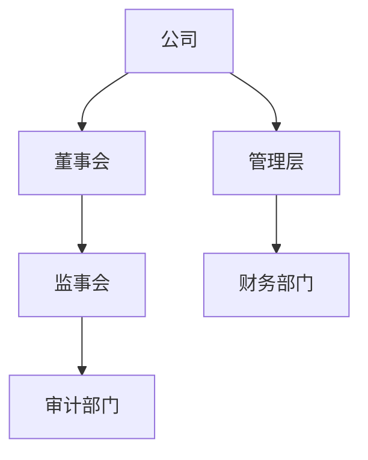

                 

# 智能化公司治理评估：多智能体AI在价值投资中的应用

---

## 关键词：
智能化公司治理，多智能体AI，价值投资，算法，系统架构，项目实战

---

## 摘要：
本文探讨了多智能体AI技术在公司治理评估和价值投资中的应用潜力。通过分析多智能体AI的基本原理、算法实现、系统架构以及实际案例，展示了如何利用多智能体协作机制来提升公司治理评估的智能化水平，并优化投资决策过程。文章结合理论与实践，为金融从业者、数据科学家和企业决策者提供了深入的技术洞察和实用的解决方案。

---

## 第1章：公司治理评估的背景与问题

### 1.1 公司治理评估的基本概念

#### 1.1.1 公司治理的定义与核心要素
公司治理是通过一系列制度、流程和机制来确保公司高效运作、合规经营和股东利益最大化。其核心要素包括：
- **治理结构**：董事会、监事会等组织架构。
- **决策机制**：重大决策的制定和执行。
- **风险管理**：识别、评估和应对风险的能力。
- **透明度**：信息的公开与披露。

#### 1.1.2 公司治理评估的目的与意义
公司治理评估旨在通过量化手段，衡量公司在治理结构、决策效率、风险管理等方面的优劣，为投资者、监管机构和管理层提供决策依据。

#### 1.1.3 传统公司治理评估的局限性
传统的公司治理评估方法依赖于财务指标和静态数据分析，难以捕捉动态市场环境下的复杂变化，且缺乏对非财务因素的综合考量。

---

### 1.2 价值投资的核心理念

#### 1.2.1 价值投资的定义与特点
价值投资是一种以公司基本面分析为基础的投资策略，强调以低于内在价值的价格买入优质资产。

#### 1.2.2 价值投资与公司治理的关系
良好的公司治理是公司长期价值的基石。价值投资者通过评估公司治理的优劣，识别具有持续竞争优势和稳定增长潜力的企业。

#### 1.2.3 价值投资中的关键决策因素
- **财务状况**：盈利能力、资产负债情况。
- **管理团队**：高管的经验与能力。
- **行业地位**：市场竞争力与行业前景。
- **风险控制**：企业对风险的识别和应对能力。

---

## 第2章：多智能体AI的基本原理

### 2.1 多智能体系统概述

#### 2.1.1 多智能体系统的定义与特点
多智能体系统是由多个相互作用的智能体组成的分布式系统，每个智能体具有自主性、反应性和协作性。

#### 2.1.2 多智能体系统与单智能体系统的区别
- **自主性**：智能体能够独立决策。
- **协作性**：智能体之间通过通信和协作完成共同目标。
- **分布性**：系统由多个分散的智能体组成，而非集中控制。

#### 2.1.3 多智能体系统在复杂问题中的优势
- **分布式计算**：适用于大规模、复杂问题的求解。
- **协作能力**：多个智能体协同工作，提升整体效率。
- **适应性**：能够应对动态变化的环境。

---

### 2.2 多智能体AI的核心技术

#### 2.2.1 分布式计算与协作机制
多智能体系统依赖于分布式计算技术，通过通信协议实现智能体之间的协作。

#### 2.2.2 多智能体决策模型
基于强化学习和博弈论的决策模型，使智能体能够在复杂环境中做出最优决策。

#### 2.2.3 多智能体通信与协调
通过消息传递和状态共享，实现智能体之间的信息同步和任务分配。

---

## 第3章：多智能体AI在价值投资中的应用潜力

### 3.1 价值投资中的信息处理需求

#### 3.1.1 数据来源的多样性
- 企业财务数据。
- 市场动态数据。
- 宏观经济指标。
- 管理层信息。

#### 3.1.2 数据分析的复杂性
- 多维度数据的整合与分析。
- 动态市场环境下的实时决策。

#### 3.1.3 决策的动态性与不确定性
市场环境的快速变化要求投资决策具有高度的灵活性和适应性。

---

### 3.2 多智能体AI在投资决策中的优势

#### 3.2.1 多维度信息的整合能力
多智能体系统能够同时处理来自不同来源的信息，提供全面的分析结果。

#### 3.2.2 多智能体协作的高效性
通过智能体之间的协作，快速完成复杂的投资决策任务。

#### 3.2.3 动态市场环境下的适应性
多智能体系统能够实时调整决策策略，应对市场的变化。

---

## 第4章：公司治理评估的多智能体建模

### 4.1 公司治理评估的领域模型

#### 4.1.1 公司治理评估的实体关系图

#### 4.1.2 多智能体在公司治理评估中的角色分配
- **智能体1**：负责收集和分析企业财务数据。
- **智能体2**：评估公司管理团队的能力。
- **智能体3**：分析企业的市场竞争力。

#### 4.1.3 多智能体协作的规则与机制
- 信息共享：智能体之间通过消息传递共享数据。
- 协作决策：基于协商机制，共同制定评估结果。

---

### 4.2 多智能体AI的算法实现

#### 4.2.1 分布式计算框架的选择
常用分布式计算框架包括：
- **Spark**：适用于大规模数据处理。
- **Flink**：适用于实时流数据处理。

#### 4.2.2 多智能体通信协议的设计
- 使用**RPC（远程过程调用）**协议实现智能体之间的通信。
- 通过**gRPC**或**WebSocket**实现高效通信。

#### 4.2.3 多智能体决策模型的实现
基于强化学习的决策模型，使用**Q-learning**算法实现智能体的决策优化。

---

## 第5章：价值投资中的多智能体协作算法

### 5.1 价值投资中的多智能体协作场景

#### 5.1.1 数据采集与预处理
- 数据来源：企业财务报表、市场新闻、社交媒体等。
- 数据清洗：去除噪声数据，提取有用信息。

#### 5.1.2 多智能体协

---

**注**：由于篇幅限制，上述内容为文章的部分章节，完整文章将涵盖更多细节和具体实现。

