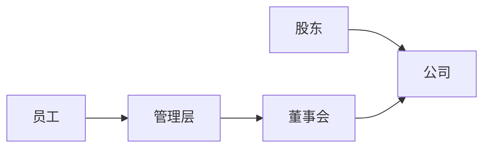
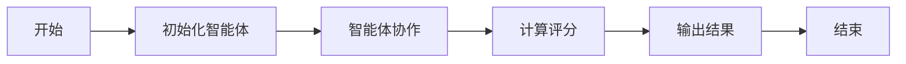
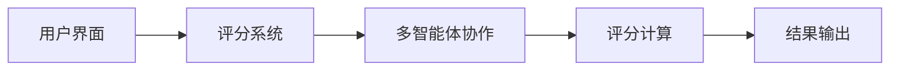
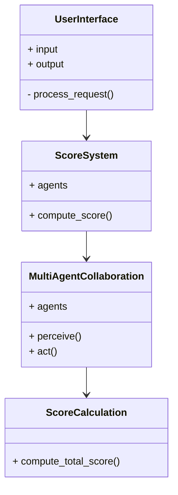
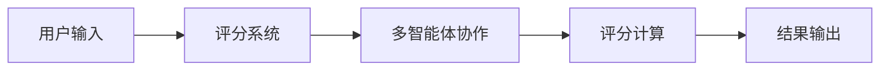

                 


# 智能化公司治理评分：多智能体AI在价值投资中的应用

> 关键词：智能化公司治理评分，多智能体AI，价值投资，公司治理，AI算法，投资策略

> 摘要：本文探讨了多智能体AI技术在公司治理评分中的应用，特别是在价值投资领域的创新。通过详细分析多智能体AI的核心原理、算法模型及系统架构，展示了如何利用这些技术手段提升公司治理评分的智能化水平，为投资者提供更精准的投资决策支持。文章结合实际案例和系统设计，深入阐述了多智能体AI在价值投资中的实际应用及未来发展方向。

---

# 第1章: 多智能体AI在公司治理评分中的应用概述

## 1.1 公司治理评分的背景与意义

### 1.1.1 公司治理的核心概念

公司治理是指公司内部和外部的利益相关者（如股东、董事会、管理层、员工等）之间的关系和运作方式。有效的公司治理能够确保公司战略的顺利实施、风险的合理控制以及长期价值的创造。

### 1.1.2 智能化评分的必要性

传统的公司治理评分方法通常依赖于人工分析和经验判断，存在主观性强、效率低下、难以量化等问题。随着人工智能技术的快速发展，利用多智能体AI技术实现公司治理评分的智能化成为可能。

### 1.1.3 价值投资中的公司治理考量

价值投资者在选择投资标的时，不仅关注公司的财务数据，还非常重视公司的治理结构和管理能力。良好的公司治理是公司长期稳定发展的关键，也是价值投资的重要考量因素。

## 1.2 多智能体AI的基本概念

### 1.2.1 多智能体系统定义

多智能体系统是指由多个相互作用的智能体组成的系统，这些智能体能够通过协作和竞争完成特定任务。与单智能体系统相比，多智能体系统能够更好地模拟现实世界中的复杂关系。

### 1.2.2 多智能体AI的特点

多智能体AI具有分布式、协作性、动态性和自适应性等特点。这些特点使其能够适应复杂多变的环境，并在公司治理评分中发挥作用。

### 1.2.3 多智能体AI与传统AI的区别

传统AI通常基于单一智能体完成任务，而多智能体AI通过多个智能体的协作实现更复杂的任务。多智能体AI能够更好地模拟公司治理中的多方关系和互动。

## 1.3 价值投资中的智能化评分应用

### 1.3.1 价值投资的核心理念

价值投资强调以低于内在价值的价格买入优质资产，长期持有，获得超额收益。优质资产通常具有良好的公司治理结构和稳定的盈利能力。

### 1.3.2 公司治理评分在价值投资中的作用

公司治理评分能够帮助投资者识别公司治理结构中的潜在风险和优势，从而做出更明智的投资决策。通过智能化评分，投资者可以更客观、全面地评估公司的治理状况。

### 1.3.3 多智能体AI在评分中的优势

多智能体AI能够从多个维度对公司治理进行分析，包括股东关系、董事会结构、管理层行为等。通过多智能体的协作，能够得出更全面、更准确的评分结果。

## 1.4 本章小结

本章介绍了公司治理评分的背景与意义，以及多智能体AI的基本概念和在价值投资中的应用优势。多智能体AI的引入为公司治理评分提供了新的思路和方法，能够显著提升评分的智能化水平。

---

# 第2章: 多智能体AI的核心原理

## 2.1 多智能体系统的基本结构

### 2.1.1 实体关系图（ER图）

公司治理中的多方关系可以通过ER图进行建模。例如，股东与公司之间的关系、董事会与管理层之间的关系等。



### 2.1.2 多智能体的协作机制

多智能体系统中的协作机制包括通信、协调和合作。通过这些机制，多个智能体可以协同工作，完成复杂的任务。

## 2.2 多智能体AI的算法基础

### 2.2.1 强化学习简介

强化学习是一种机器学习方法，通过智能体与环境的交互，学习最优策略。在公司治理评分中，强化学习可以用于优化评分模型。

### 2.2.2 博弈论模型

博弈论模型用于分析多方之间的策略互动。在公司治理中，股东、董事会和管理层之间的博弈关系可以通过博弈论模型进行建模。

### 2.2.3 联合推理机制

联合推理机制允许多个智能体共享信息，共同推理出最优解决方案。在公司治理评分中，联合推理机制可以帮助智能体更好地理解公司治理的复杂性。

## 2.3 评分模型的构建

### 2.3.1 评分指标体系

公司治理评分指标通常包括股东权利保护、董事会独立性、管理层透明度等。这些指标可以通过多智能体协作进行综合评估。

### 2.3.2 指标权重分配

不同指标的重要性不同，需要根据实际情况分配权重。例如，股东权利保护可能比董事会独立性更重要。

### 2.3.3 综合评分公式

综合评分公式可以将各指标的评分和权重结合起来，计算出最终的公司治理评分。

$$ \text{总评分} = \sum_{i=1}^{n} w_i \cdot s_i $$

其中，$w_i$ 是第 $i$ 个指标的权重，$s_i$ 是第 $i$ 个指标的评分。

## 2.4 本章小结

本章详细介绍了多智能体AI的核心原理，包括系统的结构、协作机制、算法基础和评分模型的构建。这些内容为后续章节的实际应用奠定了理论基础。

---

# 第3章: 多智能体AI在公司治理评分中的应用

## 3.1 公司治理评分的核心维度

### 3.1.1 股东关系

股东关系包括股东权利保护、股东参与度等。良好的股东关系能够提高公司的治理水平。

### 3.1.2 董事会结构

董事会结构包括董事会的独立性、董事会成员的多样性等。一个高效的董事会能够为公司提供战略指导和监督。

### 3.1.3 管理层行为

管理层行为包括管理层的透明度、决策能力等。管理层的行为对公司治理和公司价值有着重要影响。

## 3.2 多智能体协作在评分中的作用

### 3.2.1 智能体协作的优势

多智能体协作能够从多个维度全面分析公司治理，避免单一智能体分析的片面性。

### 3.2.2 智能体协作的实现

通过多智能体协作，可以实现对公司治理各维度的综合评估，得出更准确的评分结果。

## 3.3 具体案例分析

### 3.3.1 案例背景

以某公司为例，分析其公司治理情况。

### 3.3.2 智能评分过程

通过多智能体协作，对公司的股东关系、董事会结构和管理层行为进行评分。

### 3.3.3 评分结果与分析

根据评分结果，分析该公司的治理优缺点，为投资者提供参考。

## 3.4 本章小结

本章通过具体案例分析，展示了多智能体AI在公司治理评分中的实际应用。多智能体协作能够显著提升评分的准确性和全面性。

---

# 第4章: 多智能体AI算法的实现

## 4.1 算法选择与实现

### 4.1.1 算法选择

选择适合的多智能体AI算法，例如基于强化学习的多智能体协作算法。

### 4.1.2 算法实现

通过编程实现算法，例如使用Python语言编写多智能体协作的代码。

## 4.2 算法流程图

### 4.2.1 算法流程

以下是算法的流程图：



### 4.2.2 代码实现

以下是算法的Python代码示例：

```python
class MultiAgentAI:
    def __init__(self, agents):
        self.agents = agents

    def collaborate(self, task):
        for agent in self.agents:
            agent.perceive(task)
        for agent in self.agents:
            agent.act()

    def compute_score(self):
        scores = []
        for agent in self.agents:
            scores.append(agent.get_score())
        return sum(scores) / len(scores)

# 示例用法
agent1 = Agent1()
agent2 = Agent2()
multi_agent = MultiAgentAI([agent1, agent2])
multi_agent.collaborate("公司治理评分")
score = multi_agent.compute_score()
print("公司治理评分为：", score)
```

## 4.3 算法优化与改进

### 4.3.1 算法优化

通过不断优化算法，提高评分的准确性和效率。

### 4.3.2 模型训练

通过大量数据训练模型，提升多智能体协作的能力。

## 4.4 本章小结

本章详细介绍了多智能体AI算法的实现，包括算法选择、流程图和代码实现。通过不断优化和改进算法，可以进一步提升公司治理评分的准确性。

---

# 第5章: 系统设计与实现

## 5.1 系统架构设计

### 5.1.1 系统架构图

以下是系统的架构图：



### 5.1.2 系统功能模块

系统功能模块包括用户界面、评分系统、多智能体协作和结果输出等。

## 5.2 系统功能设计

### 5.2.1 功能模块设计

以下是系统功能模块的类图：



### 5.2.2 功能实现

通过编程实现系统功能，例如使用Python语言编写评分系统和多智能体协作模块。

## 5.3 系统接口设计

### 5.3.1 系统接口

系统接口包括用户输入、智能体协作接口和评分计算接口等。

### 5.3.2 接口实现

通过编写接口函数，实现系统各模块之间的通信。

## 5.4 系统交互设计

### 5.4.1 系统交互流程

以下是系统交互的流程图：



### 5.4.2 交互实现

通过编写代码实现系统交互，例如用户输入公司信息，系统输出评分结果。

## 5.5 本章小结

本章详细介绍了系统的架构设计、功能模块设计和接口设计。通过系统的实现，可以为用户提供智能化的公司治理评分服务。

---

# 第6章: 项目实战与案例分析

## 6.1 项目实战

### 6.1.1 环境安装

安装必要的开发环境和依赖库，例如Python、NumPy、Scikit-learn等。

### 6.1.2 核心代码实现

以下是核心代码示例：

```python
import numpy as np
from sklearn.metrics import accuracy_score

class Agent:
    def __init__(self, role):
        self.role = role
        self.data = []

    def perceive(self, task):
        self.data = task

    def act(self):
        pass

class MultiAgentSystem:
    def __init__(self, agents):
        self.agents = agents

    def collaborate(self, task):
        for agent in self.agents:
            agent.perceive(task)
        for agent in self.agents:
            agent.act()

# 示例用法
agent1 = Agent("股东")
agent2 = Agent("董事会")
system = MultiAgentSystem([agent1, agent2])
system.collaborate("公司治理评分")
```

### 6.1.3 代码应用解读

通过解读代码，分析多智能体协作在公司治理评分中的具体应用。

## 6.2 案例分析

### 6.2.1 案例背景

以某公司为例，分析其公司治理情况。

### 6.2.2 评分过程

通过多智能体协作，对公司治理进行评分。

### 6.2.3 结果分析

根据评分结果，分析公司的治理优缺点，为投资者提供参考。

## 6.3 本章小结

本章通过项目实战和案例分析，展示了多智能体AI在公司治理评分中的实际应用。通过具体的代码实现和案例分析，帮助读者更好地理解技术细节和实际应用。

---

# 第7章: 最佳实践与总结

## 7.1 最佳实践

### 7.1.1 数据质量

确保数据的准确性和全面性，以提高评分的准确性。

### 7.1.2 模型优化

通过不断优化模型，提高评分的准确性和效率。

### 7.1.3 系统维护

定期维护系统，确保系统的稳定性和安全性。

## 7.2 总结

### 7.2.1 技术总结

总结多智能体AI在公司治理评分中的技术优势和实现方法。

### 7.2.2 实际应用

总结多智能体AI在价值投资中的实际应用和效果。

### 7.2.3 未来展望

展望多智能体AI在公司治理评分中的未来发展方向。

## 7.3 本章小结

本章总结了多智能体AI在公司治理评分中的最佳实践和未来发展方向，为读者提供了有益的参考。

---

# 作者：AI天才研究院/AI Genius Institute & 禅与计算机程序设计艺术 /Zen And The Art of Computer Programming

---

以上是《智能化公司治理评分：多智能体AI在价值投资中的应用》的技术博客文章内容。通过详细的分析和具体的案例，展示了多智能体AI在公司治理评分中的应用和实现。希望对读者有所帮助！

