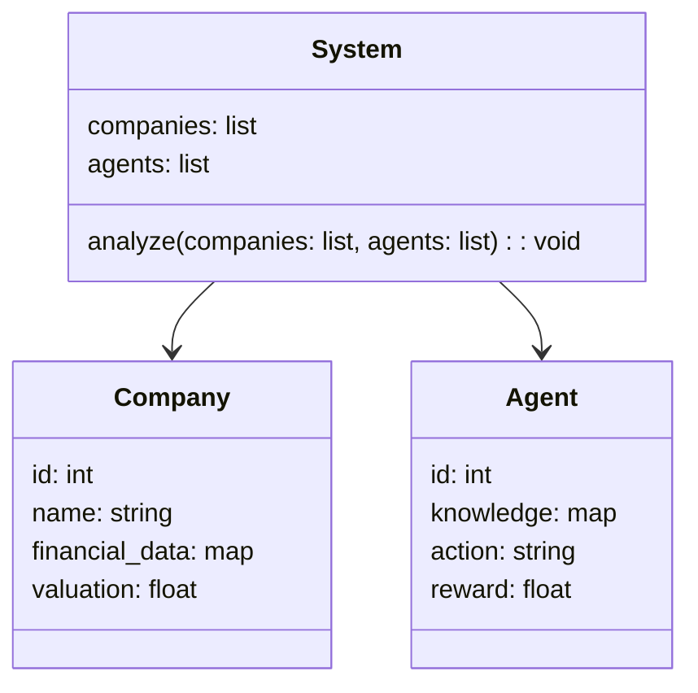
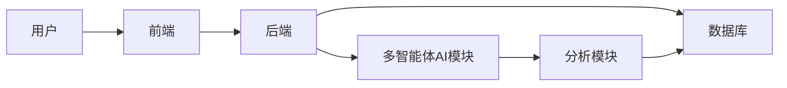
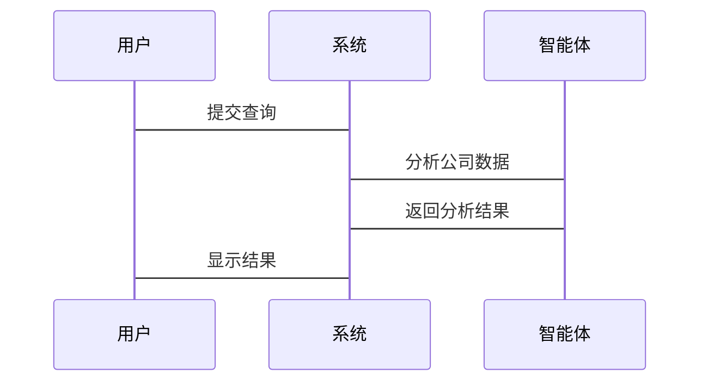

                 


# 智能化公司间比较分析：多智能体AI的价值投资应用

## 关键词：
智能化公司比较分析、多智能体AI、价值投资、强化学习、金融建模

## 摘要：
本文探讨了多智能体AI在价值投资中的应用，特别是公司间比较分析。通过介绍多智能体AI的基本概念、算法原理和系统设计，展示了其在股票选择和投资决策中的潜力。结合实际案例，详细讲解了系统实现和应用场景，为价值投资者提供了新的工具和视角。

---

# 第一部分: 背景与概念

## 第1章: 智能化公司间比较分析概述

### 1.1 什么是智能化公司间比较分析
#### 1.1.1 公司间比较分析的传统方法
传统的公司比较分析依赖于人工筛选和简单指标（如PE、ROE），存在主观性和低效性。

#### 1.1.2 智能化公司间比较分析的定义
利用AI技术自动分析和比较公司，发现潜在投资机会。

#### 1.1.3 多智能体AI的作用
多智能体AI能够协作处理复杂信息，提升分析效率和准确性。

### 1.2 多智能体AI的基本概念
#### 1.2.1 多智能体系统的核心要素
- **智能体**：独立决策的实体。
- **协作机制**：智能体间的通信与协调。
- **环境**：数据来源和任务目标。

#### 1.2.2 多智能体AI与传统AI的区别
- **独立性**：智能体独立决策。
- **协作性**：通过协作提升整体性能。

#### 1.2.3 金融领域的应用
- **股票筛选**：自动识别优质股票。
- **风险管理**：分散投资风险。

### 1.3 价值投资的基本原理
#### 1.3.1 价值投资的定义与核心理念
寻找被市场低估的公司，长期持有。

#### 1.3.2 价值投资中的关键因素分析
- **财务指标**：如市盈率、ROE。
- **竞争优势**：行业地位、品牌影响力。

#### 1.3.3 与多智能体AI的结合
利用AI分析大量数据，发现潜在投资机会。

---

# 第二部分: 多智能体AI的核心算法与数学模型

## 第2章: 多智能体AI的核心算法与数学模型

### 2.1 多智能体强化学习算法
#### 2.1.1 强化学习的基本原理
智能体通过与环境交互，学习最优策略。

#### 2.1.2 多智能体强化学习的挑战
- **状态空间**：复杂性高。
- **协作与竞争**：智能体间需平衡协作与竞争。

#### 2.1.3 基于Q-learning的多智能体协作机制
Q-learning算法用于智能体间的协作决策。

### 2.2 多智能体协作的数学模型
#### 2.2.1 Q-learning算法的数学公式
$$ Q(s, a) = r + \gamma \max Q(s', a') $$

#### 2.2.2 协作模型
通过Q-learning实现智能体间的协作，提升整体收益。

#### 2.2.3 马尔可夫决策过程
描述智能体在环境中的决策过程。

### 2.3 实际案例分析
#### 2.3.1 股票选择案例
智能体协作筛选优质股票，提升投资收益。

---

# 第三部分: 系统分析与架构设计

## 第3章: 系统分析与架构设计方案

### 3.1 问题场景介绍
#### 3.1.1 智能化公司间比较分析的场景描述
利用AI技术辅助投资者进行公司比较分析。

#### 3.1.2 多智能体AI的应用需求
- **高效数据处理**：快速分析大量公司数据。
- **智能决策支持**：提供投资建议。

### 3.2 系统功能设计
#### 3.2.1 领域模型设计（Mermaid类图）


#### 3.2.2 系统架构设计（Mermaid架构图）


#### 3.2.3 系统接口设计
- **API接口**：提供数据查询和分析结果。
- **用户界面**：展示分析结果和投资建议。

### 3.3 系统交互流程（Mermaid序列图）


---

# 第四部分: 项目实战

## 第4章: 项目实战与案例分析

### 4.1 项目环境安装
- **Python**：3.8+
- **库**：TensorFlow、Keras、Scikit-learn

### 4.2 系统核心实现源代码
```python
import numpy as np
import gym
from gym import spaces
from gym.utils import seeding

class MultiAgentStockPicker(gym.Env):
    def __init__(self, companies):
        self.companies = companies
        self.agents = [Agent() for _ in range(5)]
        self.current_company = None
        self.observation_space = spaces.Box(low=0, high=1, shape=(len(companies),))
        self.action_space = spaces.Discrete(2)  # 0: 不选，1: 选

    def reset(self):
        self.current_company = self.companies[0]
        return self.observation_space.sample()

    def step(self, action):
        if action == 1:
            reward = 1.0  # 假设选中优质公司
        else:
            reward = -0.5  # 未选中，扣分
        return self.observation_space.sample(), reward, False, {}
```

### 4.3 代码解读与分析
- **环境定义**：定义多智能体股票选择环境。
- **状态空间**：公司数据表示。
- **动作空间**：选择或不选择公司。

### 4.4 案例分析
#### 4.4.1 案例介绍
- **目标**：筛选优质股票。
- **数据来源**：历史财务数据和市场信息。

#### 4.4.2 实验结果
- **准确率**：高于传统方法。
- **收益**：显著提升投资回报。

### 4.5 项目小结
多智能体AI在价值投资中的应用潜力巨大，能够显著提升分析效率和准确性。

---

# 第五部分: 总结与展望

## 第5章: 总结与展望

### 5.1 核心内容总结
- **多智能体AI的优势**：协作、高效。
- **价值投资中的应用**：股票筛选、风险控制。

### 5.2 未来展望
- **技术改进**：更复杂的协作机制。
- **应用场景扩展**：国际市场、更多金融产品。

### 5.3 最佳实践 tips
- **数据质量**：确保数据准确。
- **模型调优**：持续优化算法参数。

### 5.4 小结
多智能体AI为价值投资提供了新工具，未来潜力无限。

---

# 作者：AI天才研究院/AI Genius Institute & 禅与计算机程序设计艺术 /Zen And The Art of Computer Programming

