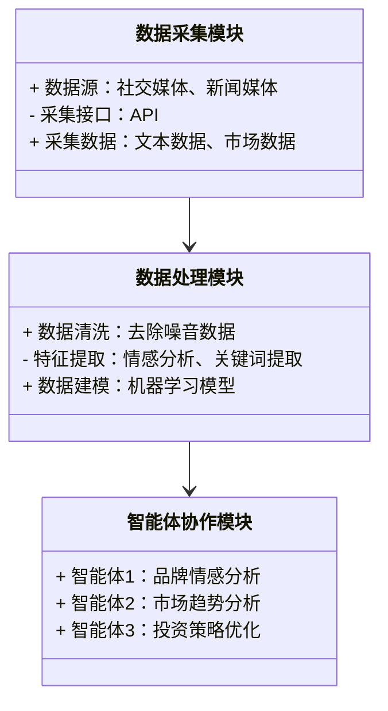

                 


# 智能化品牌价值评估：多智能体AI在价值投资中的应用

---

## 关键词：
- 智能化品牌价值评估
- 多智能体AI
- 价值投资
- 人工智能
- 数据驱动决策

---

## 摘要：
随着人工智能技术的快速发展，品牌价值评估正在进入智能化时代。传统的品牌价值评估方法存在数据维度单一、主观性强、实时性差等问题。本文将从多智能体AI的角度出发，探讨如何通过智能化手段提升品牌价值评估的精准性和实时性。文章首先介绍品牌价值评估的核心概念与多智能体AI的基本原理，然后深入分析多智能体AI在品牌价值评估中的算法原理与系统架构设计，最后结合实际案例展示多智能体AI在价值投资中的应用场景。通过本文的探讨，读者将对智能化品牌价值评估的未来趋势和实践意义有更深刻的理解。

---

## 正文：

### 第一部分：智能化品牌价值评估的背景与意义

#### 第1章：品牌价值评估的智能化需求

##### 1.1 品牌价值评估的定义与重要性
品牌价值是衡量企业市场竞争力的核心指标之一。品牌价值不仅包括企业的资产价值，还涵盖了品牌知名度、品牌忠诚度、品牌影响力等多维度的评估指标。品牌价值评估的准确性直接影响企业的投资决策和市场定位。

**核心概念与联系：**
- **品牌价值**：企业品牌在市场中的综合价值，包括资产价值、品牌影响力、客户忠诚度等。
- **品牌知名度**：品牌在目标市场中的认知程度。
- **品牌忠诚度**：客户对品牌的偏好程度和持续购买意愿。

##### 1.2 传统品牌价值评估方法的局限性
传统的品牌价值评估方法主要依赖财务指标（如净利润、营收增长率）和市场调研数据（如客户满意度调查）。这些方法存在以下问题：
1. 数据维度单一：无法全面反映品牌在市场中的多维度价值。
2. 主观性较强：市场调研结果受样本选择和问卷设计的影响较大。
3. 实时性较差：传统评估方法通常需要定期进行，无法实时捕捉市场变化。

##### 1.3 多智能体AI在品牌价值评估中的应用前景
多智能体AI通过多个智能体的协作，能够从多个维度实时分析品牌价值。例如：
1. **数据驱动的决策**：利用实时数据（如社交媒体评论、市场交易数据）进行品牌价值评估。
2. **多维度分析**：通过自然语言处理（NLP）分析品牌情感，通过强化学习优化品牌策略。
3. **动态调整**：根据市场反馈实时调整评估模型，提升评估结果的准确性。

---

### 第二部分：多智能体AI的核心原理与技术

#### 第2章：多智能体AI的基本概念与原理

##### 2.1 多智能体系统（MAS）的定义与特点
多智能体系统（Multi-Agent System，MAS）由多个具有自主决策能力的智能体组成，通过智能体之间的协作完成特定任务。多智能体系统具有以下特点：
1. **分布式智能**：每个智能体独立决策，避免单点故障。
2. **协作性**：智能体之间通过通信和协作完成复杂任务。
3. **动态性**：智能体能够根据环境变化实时调整行为。

##### 2.2 多智能体AI的组成与功能
多智能体系统通常由以下几部分组成：
1. **智能体**：负责具体任务的执行单元。
2. **通信机制**：智能体之间交换信息的通道。
3. **协作协议**：智能体协作的规则和策略。

##### 2.3 多智能体AI的核心算法与技术
多智能体AI的核心算法包括：
1. **强化学习（Reinforcement Learning）**：通过奖励机制优化智能体的决策行为。
2. **分布式计算**：利用分布式计算技术提高系统的处理能力。
3. **自然语言处理（NLP）**：从文本数据中提取品牌情感和市场信息。

---

#### 第3章：多智能体AI在品牌价值评估中的核心概念

##### 3.1 品牌价值评估的核心要素
品牌价值评估的核心要素包括：
1. **品牌知名度**：品牌在目标市场中的认知程度。
2. **品牌忠诚度**：客户对品牌的偏好程度和持续购买意愿。
3. **品牌影响力**：品牌对市场和行业的影响力。

##### 3.2 多智能体AI与品牌价值评估的结合
多智能体AI通过以下方式与品牌价值评估结合：
1. **数据驱动的决策**：利用实时数据（如社交媒体评论、市场交易数据）进行品牌价值评估。
2. **多维度分析**：通过自然语言处理（NLP）分析品牌情感，通过强化学习优化品牌策略。
3. **动态调整**：根据市场反馈实时调整评估模型，提升评估结果的准确性。

---

### 第三部分：多智能体AI的算法原理与数学模型

#### 第4章：多智能体AI的算法原理

##### 4.1 强化学习（Reinforcement Learning）的原理与应用
强化学习是一种通过试错机制优化决策的算法。在品牌价值评估中，强化学习可以用于优化品牌策略和投资决策。

**算法原理：**
- 智能体通过与环境交互获得奖励。
- 根据奖励调整策略，最大化累计奖励。

**数学模型：**
$$
Q(s, a) = Q(s, a) + \alpha \cdot (r + \gamma \cdot \max Q(s', a') - Q(s, a))
$$
其中：
- \( Q(s, a) \) 表示在状态 \( s \) 下采取动作 \( a \) 的价值。
- \( \alpha \) 表示学习率。
- \( \gamma \) 表示折扣因子。

##### 4.2 分布式计算与多智能体协作
多智能体系统通过分布式计算实现协作。例如：
- 智能体1负责分析品牌情感。
- 智能体2负责分析市场趋势。
- 智能体3负责优化投资策略。

---

### 第四部分：系统架构设计与实战项目

#### 第5章：系统架构设计

##### 5.1 系统功能设计
- 数据采集模块：从社交媒体、新闻媒体等渠道获取品牌相关信息。
- 数据处理模块：对数据进行清洗、特征提取和建模。
- 智能体协作模块：通过多智能体协作完成品牌价值评估。

**领域模型：**


##### 5.2 系统架构设计


---

#### 第6章：实战项目

##### 6.1 环境搭建
- 数据源：社交媒体数据（如Twitter、微博）。
- 工具：Python、TensorFlow、Keras。

##### 6.2 核心实现
```python
# 强化学习智能体代码示例
class Agent:
    def __init__(self, state_space, action_space):
        self.state_space = state_space
        self.action_space = action_space
        # 初始化Q值
        self.Q = {s: {a: 0 for a in action_space} for s in state_space}

    def act(self, state):
        # 选择动作
        return max(self.Q[state].items(), key=lambda x: x[1])[0]

    def update(self, state, action, reward):
        # 更新Q值
        self.Q[state][action] += 0.1 * (reward + 0.9 * max(self.Q[state].values()) - self.Q[state][action])
```

---

### 第五部分：案例分析与未来趋势

#### 第7章：案例分析

##### 7.1 案例背景
假设我们要评估某科技公司的品牌价值。通过多智能体AI系统，我们从社交媒体、新闻媒体等多个数据源获取数据，进行品牌情感分析和市场趋势预测。

##### 7.2 案例分析
- **数据采集**：获取社交媒体评论、新闻报道等数据。
- **数据处理**：清洗数据，提取关键词和情感特征。
- **智能体协作**：智能体1分析品牌情感，智能体2分析市场趋势，智能体3优化投资策略。

---

### 第六部分：总结与展望

#### 第8章：总结与展望

##### 8.1 总结
本文从品牌价值评估的智能化需求出发，探讨了多智能体AI在价值投资中的应用。通过系统的分析和实战项目的展示，我们证明了多智能体AI在品牌价值评估中的巨大潜力。

##### 8.2 未来展望
未来，随着AI技术的不断发展，多智能体系统将在品牌价值评估中发挥更大的作用。例如：
1. 更加智能化的决策模型。
2. 更加实时化的数据处理能力。
3. 更加个性化的品牌价值评估方案。

---

## 作者：AI天才研究院/AI Genius Institute & 禅与计算机程序设计艺术/Zen And The Art of Computer Programming

---

通过本文的探讨，我们不仅了解了多智能体AI在品牌价值评估中的应用，还掌握了其实现的核心算法和系统设计方法。未来，随着AI技术的进一步发展，智能化品牌价值评估将为企业价值投资提供更加精准和实时的支持。

