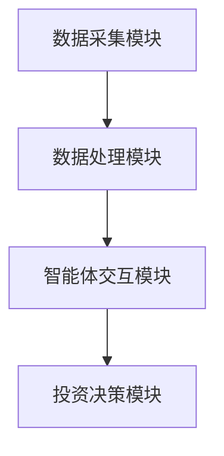
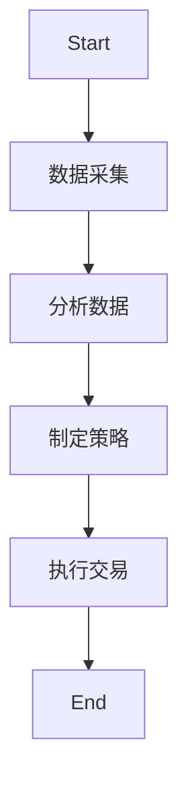

                 

# 智能化商业模式分析：多智能体AI在价值投资中的角色

## 关键词
多智能体AI，价值投资，人工智能，金融建模，投资策略优化

## 摘要
随着人工智能技术的快速发展，多智能体AI在金融领域的应用越来越广泛。本文将深入探讨多智能体AI在价值投资中的角色，分析其在市场分析、风险评估和投资决策中的应用，并结合实际案例展示其优势与挑战。

---

## 第一部分: 多智能体AI与价值投资的背景

### 第1章: 多智能体AI的定义与特点

#### 1.1 多智能体AI的定义
多智能体AI是指由多个相互作用的智能体组成的系统，每个智能体能够独立决策并协同工作，共同完成复杂任务。

#### 1.2 多智能体AI的核心特点
- **分布性**：智能体分布在不同节点，独立决策。
- **协作性**：通过通信和协作实现共同目标。
- **动态性**：适应环境变化，实时调整策略。

#### 1.3 多智能体AI在价值投资中的应用背景
价值投资强调长期收益，多智能体AI能够通过分析海量数据，优化投资组合，提升收益。

---

### 第2章: 多智能体AI的核心原理

#### 2.1 多智能体系统的算法流程
1. 数据采集：收集市场数据。
2. 智能体分析：各智能体独立分析数据。
3. 信息共享：智能体间共享分析结果。
4. 协作决策：基于共享信息制定投资策略。

#### 2.2 多智能体AI的数学模型
- **状态表示**：$S = (S_1, S_2, ..., S_n)$，表示各智能体的状态。
- **决策模型**：$D_i = f(S_i, S_{-i})$，智能体i的决策基于自身状态和其他智能体的状态。
- **优化目标**：最大化整体收益，$\max \sum_{i=1}^n R_i$，其中$R_i$为智能体i的收益。

---

## 第二部分: 多智能体AI在价值投资中的应用场景

### 第3章: 价值投资中的市场分析

#### 3.1 多智能体AI在市场分析中的应用
- **数据采集**：实时采集股票价格、市场趋势等数据。
- **情绪分析**：分析社交媒体情绪，预测市场走势。
- **预测模型**：构建ARIMA模型，预测股票价格。

#### 3.2 多智能体AI在风险评估中的作用
- **风险分散**：通过多智能体分析，分散投资风险。
- **实时监控**：智能体实时监控市场变化，及时调整策略。

### 第4章: 投资决策中的多智能体AI

#### 4.1 多智能体协作决策机制
- **信息共享**：智能体间共享数据和分析结果。
- **集体决策**：基于共享信息，制定最优投资策略。

#### 4.2 投资策略的动态调整
- **反馈机制**：根据市场反馈，动态调整投资组合。
- **自适应优化**：智能体不断学习，优化决策模型。

---

## 第三部分: 系统设计与实现

### 第5章: 系统设计

#### 5.1 系统功能设计
- **数据采集模块**：实时采集市场数据。
- **智能体交互模块**：实现智能体间的通信与协作。
- **投资决策模块**：基于分析结果制定投资策略。

#### 5.2 系统架构设计
- **分层架构**：分为数据层、逻辑层和决策层。
- **模块接口**：定义模块间接口，确保高效协作。
- **可扩展性设计**：支持新增智能体和功能扩展。

### 第6章: 项目实战

#### 6.1 环境搭建
- **工具安装**：安装Python、TensorFlow、Keras等工具。
- **数据准备**：收集历史股票数据、市场新闻等。
- **系统配置**：配置服务器、数据库等环境。

#### 6.2 核心代码实现
- **数据预处理**：使用Pandas清洗数据。
- **模型训练**：训练LSTM模型预测股票价格。
- **智能体协作**：实现智能体间的通信与协作。

---

## 第四部分: 最佳实践与总结

### 第7章: 最佳实践

#### 7.1 实践中的注意事项
- **数据质量**：确保数据准确性和完整性。
- **模型优化**：定期优化模型，提升预测精度。
- **系统维护**：及时修复漏洞，确保系统稳定运行。

#### 7.2 项目总结与展望
- **项目成果**：成功实现多智能体AI在价值投资中的应用。
- **未来展望**：探索更高效的合作机制，提升系统的智能化水平。

---

## 附录: 多智能体AI算法流程图

### 附录1: 多智能体系统架构图

### 附录2: 投资决策流程图

---

## 作者
作者：AI天才研究院/AI Genius Institute  
联合作者：禅与计算机程序设计艺术/Zen And The Art of Computer Programming

