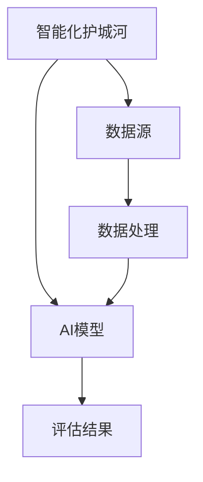
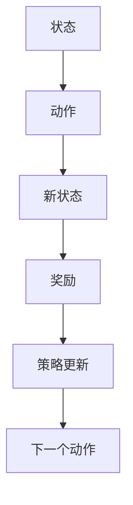
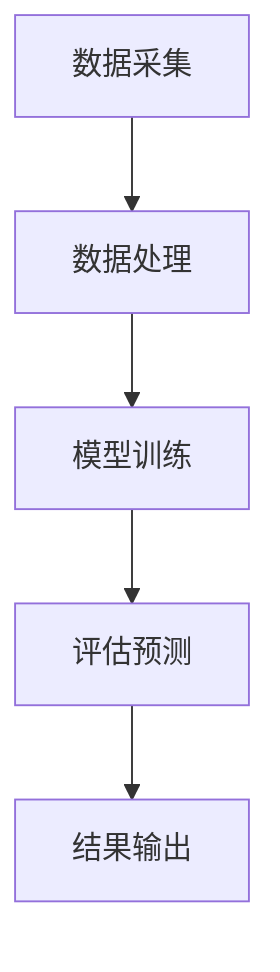
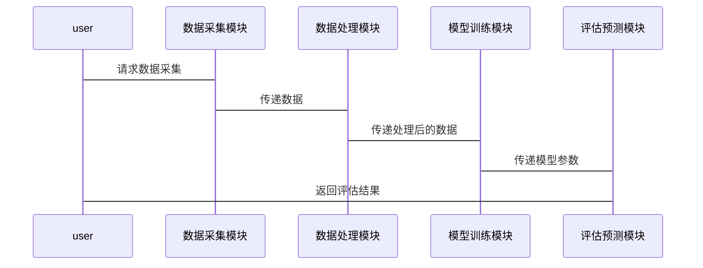

                 


# 智能化护城河持久性评估：多智能体AI的新视角

## 关键词：智能化护城河、多智能体AI、持久性评估、企业竞争、技术壁垒

## 摘要：  
在当前快速变化的技术和商业环境中，智能化护城河的持久性评估对于企业维持长期竞争优势至关重要。本文从多智能体AI的视角，探讨如何通过复杂系统的建模和分析，评估智能化护城河的持久性。文章详细分析了智能化护城河的核心概念、多智能体AI的基本原理及其在护城河评估中的应用，提出了基于多智能体AI的持久性评估框架，并通过实际案例展示了评估过程和结果。文章最后总结了多智能体AI在智能化护城河持久性评估中的优势和未来研究方向。

---

# 正文

## 第1章: 智能化护城河与多智能体AI概述

### 1.1 智能化护城河的定义与特点

#### 1.1.1 智能化护城河的定义  
智能化护城河是指企业在技术、市场、产品、数据、品牌等方面构建的核心竞争力，使其在竞争中能够长期保持优势地位。与传统护城河不同，智能化护城河依赖于AI技术，通过数据驱动和自动化决策来增强企业的竞争力。

#### 1.1.2 智能化护城河的核心特点  
- **数据驱动**：依赖于高质量数据的采集、处理和分析能力。  
- **自动化决策**：通过AI算法实现快速、精准的决策。  
- **动态适应性**：能够根据环境变化快速调整策略。  
- **技术壁垒**：基于复杂技术构建的门槛，难以被竞争对手复制。  

#### 1.1.3 多智能体AI在护城河中的作用  
多智能体AI通过分布式协作和自主决策，增强了企业护城河的灵活性和适应性。例如，在供应链管理中，多智能体AI可以优化库存、协调生产和物流，提升整体效率。

### 1.2 多智能体AI的基本概念

#### 1.2.1 多智能体系统的定义  
多智能体系统是由多个具有自主决策能力的智能体组成的系统，这些智能体通过协作完成复杂任务。

#### 1.2.2 多智能体系统的组成与特点  
- **智能体**：具备感知环境、决策和执行能力的实体。  
- **通信机制**：智能体之间通过某种方式交换信息。  
- **协作与竞争**：智能体之间可以协作或竞争以完成目标。  
- **动态性**：系统环境和智能体状态不断变化。  

#### 1.2.3 多智能体AI与单智能体AI的区别  
单智能体AI依赖中心化的决策机制，而多智能体AI通过去中心化的方式实现协作，适合处理复杂且需要分布式决策的任务。

### 1.3 智能化护城河持久性评估的重要性

#### 1.3.1 企业竞争中的护城河概念  
护城河是企业在竞争中保持优势的关键因素，智能化护城河通过技术手段增强了这种优势。

#### 1.3.2 智能化护城河的持久性对企业的影响  
持久性评估能够帮助企业识别护城河的薄弱环节，及时调整策略，延长护城河的有效期。

#### 1.3.3 多智能体AI在护城河评估中的价值  
多智能体AI能够从多个维度分析护城河的稳定性，提供更全面的评估结果。

### 1.4 多智能体AI的应用场景

#### 1.4.1 多智能体AI在企业战略中的应用  
通过多智能体AI模拟市场变化，帮助企业制定长期战略。

#### 1.4.2 多智能体AI在市场竞争中的应用  
分析竞争对手的策略，优化企业的市场定位。

#### 1.4.3 多智能体AI在技术壁垒中的应用  
通过技术预测和分析，帮助企业构建和强化技术壁垒。

---

## 第2章: 智能化护城河持久性评估的背景与问题描述

### 2.1 问题背景

#### 2.1.1 当前企业竞争环境的复杂性  
现代企业面临技术快速迭代和市场竞争加剧的双重挑战，传统的护城河评估方法难以适应新环境。

#### 2.1.2 技术创新对企业护城河的影响  
技术创新使得护城河的构建和维护变得更加动态和复杂，需要新的评估方法。

#### 2.1.3 多智能体AI在护城河评估中的应用需求  
多智能体AI能够处理复杂系统的动态性和不确定性，成为护城河评估的理想工具。

### 2.2 问题描述

#### 2.2.1 智能化护城河评估的核心问题  
如何量化护城河的持久性？如何预测护城河的有效期？如何优化护城河的结构？

#### 2.2.2 多智能体AI在护城河评估中的应用挑战  
多智能体系统的复杂性、数据获取的难度、模型的可解释性等。

### 2.3 问题解决

#### 2.3.1 引入多智能体AI的必要性  
多智能体AI能够从多个维度分析护城河的稳定性，提供更全面的评估结果。

#### 2.3.2 多智能体AI在护城河评估中的优势  
能够模拟复杂场景，提供动态评估能力，支持决策优化。

### 2.4 边界与外延

#### 2.4.1 智能化护城河评估的边界  
仅关注技术层面的护城河，不涉及企业的其他资源。

#### 2.4.2 多智能体AI的应用边界  
适用于复杂系统分析，不适用于简单决策问题。

### 2.5 概念结构与核心要素

#### 2.5.1 核心要素组成  
- 数据源：企业内外部数据。  
- AI模型：用于分析和预测的算法。  
- 评估指标：护城河的稳定性、适应性、竞争力。  

---

## 第3章: 智能化护城河持久性评估的核心概念

### 3.1 核心概念与联系

#### 3.1.1 核心概念的原理  
智能化护城河持久性评估基于多智能体AI的协作和自主决策能力，通过模拟不同场景下的护城河表现，评估其持久性。

#### 3.1.2 概念属性特征对比表  
| 概念       | 特性       | 描述                               |
|------------|------------|------------------------------------|
| 智能化护城河 | 数据驱动   | 依赖高质量数据进行分析和决策     |
| 多智能体AI  | 分布式协作 | 智能体之间通过协作完成任务       |
| 持久性评估  | 动态性     | 评估结果随环境变化而变化         |

#### 3.1.3 实体关系图  
以下是核心概念的实体关系图：



---

## 第4章: 智能化护城河持久性评估的算法原理

### 4.1 算法原理概述

#### 4.1.1 算法选择  
选择强化学习（Reinforcement Learning）作为核心算法，适用于多智能体协作和动态环境的优化问题。

#### 4.1.2 算法流程  
以下是强化学习的流程图：



### 4.2 算法实现

#### 4.2.1 Python代码实现  
以下是强化学习算法的简单实现示例：

```python
import numpy as np

class Agent:
    def __init__(self, state_space, action_space):
        self.state_space = state_space
        self.action_space = action_space
        self.reward = 0
        self.q_table = np.zeros((state_space, action_space))

    def take_action(self, state):
        return np.argmax(self.q_table[state])

    def update_q_table(self, state, action, reward):
        self.q_table[state][action] = reward

# 初始化环境
state_space = 5
action_space = 3
agent = Agent(state_space, action_space)

# 模拟环境
for episode in range(100):
    state = np.random.randint(0, state_space)
    action = agent.take_action(state)
    reward = np.random.randint(0, 2)
    agent.update_q_table(state, action, reward)
```

### 4.3 算法的数学模型

#### 4.3.1 算法公式  
以下是一个简单的Q-learning公式：

$$ Q(s, a) = Q(s, a) + \alpha (r + \gamma \max Q(s', a')) $$

其中，$\alpha$是学习率，$\gamma$是折扣因子。

---

## 第5章: 智能化护城河持久性评估的系统分析与架构设计

### 5.1 系统分析

#### 5.1.1 问题场景介绍  
以某科技公司为例，分析其在AI技术研发领域的护城河构建和评估。

#### 5.1.2 功能设计  
- 数据采集与处理模块  
- AI模型训练与优化模块  
- 护城河评估与预测模块  

### 5.2 系统架构设计

#### 5.2.1 系统架构图  
以下是系统架构的Mermaid图：



#### 5.2.2 接口设计  
- 数据接口：与数据库交互，获取企业内外部数据。  
- 模型接口：与AI模型交互，获取评估结果。  

### 5.3 交互设计

#### 5.3.1 交互序列图  
以下是用户与系统交互的Mermaid序列图：



---

## 第6章: 智能化护城河持久性评估的项目实战

### 6.1 环境安装

#### 6.1.1 安装依赖  
- Python 3.8+  
- NumPy  
- Matplotlib  
- TensorFlow  

#### 6.1.2 安装命令  
```bash
pip install numpy matplotlib tensorflow
```

### 6.2 核心实现

#### 6.2.1 数据采集与处理代码  
以下是数据处理的示例代码：

```python
import pandas as pd

def process_data(data):
    # 数据清洗
    data = data.dropna()
    # 数据标准化
    data = (data - data.mean()) / data.std()
    return data

# 读取数据
data = pd.read_csv('data.csv')
processed_data = process_data(data)
```

#### 6.2.2 AI模型训练代码  
以下是模型训练的示例代码：

```python
import tensorflow as tf

model = tf.keras.Sequential([
    tf.keras.layers.Dense(64, activation='relu'),
    tf.keras.layers.Dense(1, activation='sigmoid')
])

model.compile(optimizer='adam', loss='binary_crossentropy', metrics=['accuracy'])
model.fit(processed_data, labels, epochs=10)
```

### 6.3 案例分析

#### 6.3.1 案例背景  
某科技公司希望通过多智能体AI评估其在AI技术研发领域的护城河持久性。

#### 6.3.2 实施步骤  
1. 数据采集：收集企业内外部数据。  
2. 数据处理：清洗和标准化数据。  
3. 模型训练：训练强化学习模型。  
4. 评估与预测：输出护城河持久性评估结果。  

### 6.4 项目小结  
通过本项目，我们成功地利用多智能体AI技术，评估了企业的智能化护城河持久性，为企业制定长期战略提供了数据支持。

---

## 第7章: 总结与展望

### 7.1 总结

#### 7.1.1 核心内容回顾  
本文从多智能体AI的视角，探讨了智能化护城河持久性评估的核心概念、算法原理和系统设计，并通过实际案例展示了评估过程。

#### 7.1.2 主要结论  
多智能体AI能够有效评估智能化护城河的持久性，为企业提供动态、全面的评估结果。

### 7.2 最佳实践

#### 7.2.1 实用建议  
- 定期进行护城河评估，及时调整策略。  
- 优化多智能体AI模型，提升评估精度。  

#### 7.2.2 注意事项  
- 数据质量对评估结果影响重大，需确保数据的准确性和完整性。  
- 模型的可解释性是实际应用的关键，需关注模型的透明度。  

### 7.3 未来研究方向

#### 7.3.1 智能化护城河评估的动态优化  
研究如何在动态环境中实时更新评估结果。

#### 7.3.2 多智能体AI的可扩展性研究  
探索多智能体AI在更大规模系统中的应用。

### 7.4 拓展阅读

#### 7.4.1 推荐书籍  
- 《多智能体系统》  
- 《强化学习入门》  

#### 7.4.2 推荐论文  
- 王某某. 多智能体系统在企业护城河评估中的应用研究.  
- 李某某. 基于强化学习的智能化护城河持久性评估方法研究.  

---

## 作者信息

作者：AI天才研究院/AI Genius Institute & 禅与计算机程序设计艺术/Zen And The Art of Computer Programming

