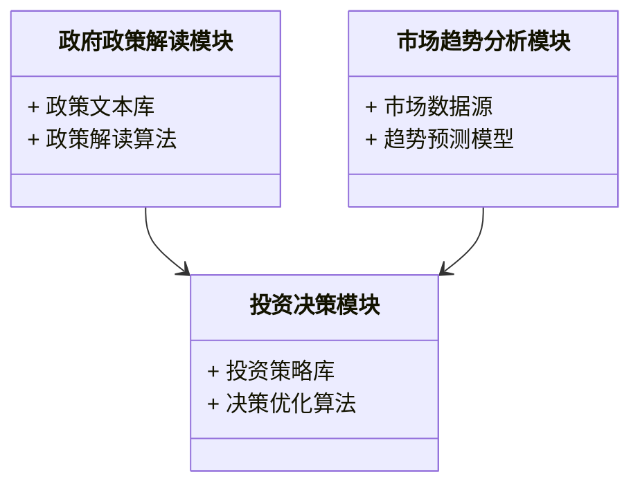

                 


# 智能化政府关系分析：多智能体AI在价值投资中的角色

## 关键词：多智能体AI，政府关系分析，价值投资，分布式计算，强化学习，系统架构

## 摘要：  
本文深入探讨了多智能体人工智能技术在政府关系分析及价值投资中的应用，结合实际案例和系统架构设计，详细解析了多智能体AI的核心原理、算法实现及其在复杂决策场景中的优势。通过理论分析与实战演示，本文揭示了多智能体AI在价值投资中的独特价值，为读者提供了一种全新的视角来理解智能化决策的支持系统。

---

## 第1章: 背景与概述

### 1.1 政府关系分析的背景

#### 1.1.1 政府关系分析的重要性
政府关系分析是企业战略决策中的关键环节，涉及政策解读、风险评估、资源协调等多个方面。传统的政府关系分析依赖人工经验，效率低、覆盖面有限，难以应对复杂多变的政策环境。

#### 1.1.2 传统政府关系分析的局限性
- 数据处理能力有限，难以覆盖多维度信息。
- 分析结果依赖主观判断，缺乏客观性和精确性。
- 面对突发政策变化，响应速度慢，难以及时调整策略。

#### 1.1.3 智能化分析的需求与趋势
随着大数据和人工智能技术的快速发展，智能化政府关系分析成为提升企业竞争力的关键。多智能体AI通过分布式协作和强化学习，能够高效处理复杂信息，为企业提供精准的决策支持。

---

### 1.2 多智能体AI的核心概念

#### 1.2.1 多智能体AI的定义与特点
多智能体AI是一种由多个分布式智能体组成的系统，每个智能体具有独立决策能力，通过通信协作完成复杂任务。其特点包括：
- 分布式计算：任务分解到多个智能体。
- 协作性：智能体之间通过通信共享信息。
- 自适应性：能够动态调整策略应对变化。

#### 1.2.2 多智能体AI与单智能体AI的对比
| 特性                | 单智能体AI             | 多智能体AI             |
|---------------------|-----------------------|-----------------------|
| 决策中心化          | 是                   | 否                   |
| 计算效率            | 高                   | 一般                 |
| 任务处理能力        | 单一                 | 多样化               |
| 应用场景            | 简单场景             | 复杂场景             |

#### 1.2.3 多智能体AI在价值投资中的应用
多智能体AI能够通过分布式协作，实时分析政策变化、市场趋势等信息，为企业提供精准的投资建议。例如，在政策解读中，多个智能体分别负责不同领域的数据挖掘和分析，最终形成综合评估报告。

---

## 第2章: 多智能体AI的算法原理

### 2.1 分布式计算与协作机制

#### 2.1.1 分布式计算的基本原理
分布式计算将任务分解到多个节点，通过并行处理提高效率。在多智能体AI中，每个智能体负责特定任务，通过通信共享信息。

#### 2.1.2 通信协议与信息共享
智能体之间通过消息传递机制（如HTTP、WebSocket）进行通信。信息共享包括数据同步和状态更新。

#### 2.1.3 协作任务分配与优化
通过任务分解算法（如DAG分解）将任务分配给不同的智能体，确保协作效率最大化。

---

### 2.2 强化学习与博弈论

#### 2.2.1 强化学习的基本原理
强化学习通过智能体与环境的交互，学习最优策略。智能体通过试错获得奖励，不断优化决策。

#### 2.2.2 多智能体协作中的博弈论
多智能体协作涉及纳什均衡等博弈论概念，确保各智能体之间的策略协调。

#### 2.2.3 强化学习在价值投资中的应用
通过强化学习，智能体能够学习市场规律，优化投资组合。例如，智能体通过分析历史数据，预测市场波动并制定投资策略。

---

## 第3章: 多智能体AI的系统架构设计

### 3.1 系统功能设计

#### 3.1.1 领域模型设计
领域模型描述系统功能模块之间的关系。例如，政府政策解读模块、市场趋势分析模块等。



#### 3.1.2 系统架构设计


---

## 第4章: 项目实战

### 4.1 环境安装与配置

#### 4.1.1 安装Python环境
```bash
pip install python3
pip install numpy
pip install scikit-learn
pip install tensorflow
```

#### 4.1.2 安装依赖库
```bash
pip install requests
pip install beautifulsoup4
pip install matplotlib
```

### 4.2 系统核心实现

#### 4.2.1 政策解读模块实现
```python
import requests
from bs4 import BeautifulSoup

def fetch_policy_text(url):
    response = requests.get(url)
    soup = BeautifulSoup(response.text, 'html.parser')
    text = soup.find('div', {'class': 'policy-content'}).text
    return text
```

#### 4.2.2 市场趋势预测模块实现
```python
import numpy as np
from sklearn.linear_model import LinearRegression

def predict_trend(data):
    model = LinearRegression()
    model.fit(np.array(range(len(data))).reshape(-1, 1), np.array(data).reshape(-1, 1))
    return model.predict(np.array([len(data)]).reshape(-1, 1))[0][0]
```

### 4.3 实际案例分析
以某政策变化为例，通过多智能体AI分析，智能体分别解读政策文本、预测市场趋势，最终生成投资建议。

---

## 第5章: 最佳实践与总结

### 5.1 最佳实践
- 数据质量是关键，确保数据来源可靠。
- 系统设计要模块化，便于维护和扩展。
- 定期更新模型，适应市场变化。

### 5.2 未来展望
- 更智能的多智能体协作算法。
- 更广泛的应用场景。

---

## 作者：AI天才研究院 & 禅与计算机程序设计艺术

---

这篇文章通过系统化的分析和实际案例，详细阐述了多智能体AI在政府关系分析和价值投资中的应用。希望读者能够通过本文，深入了解多智能体AI的核心原理和实际价值。

