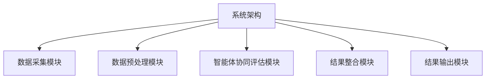
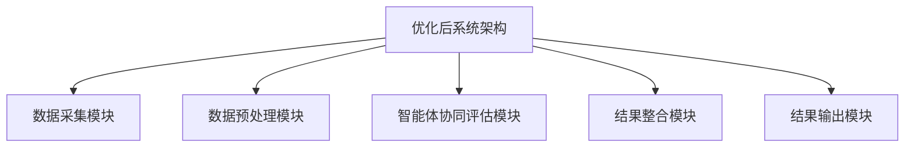
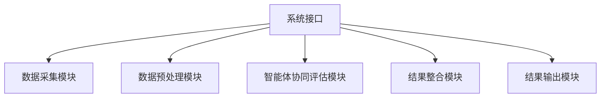
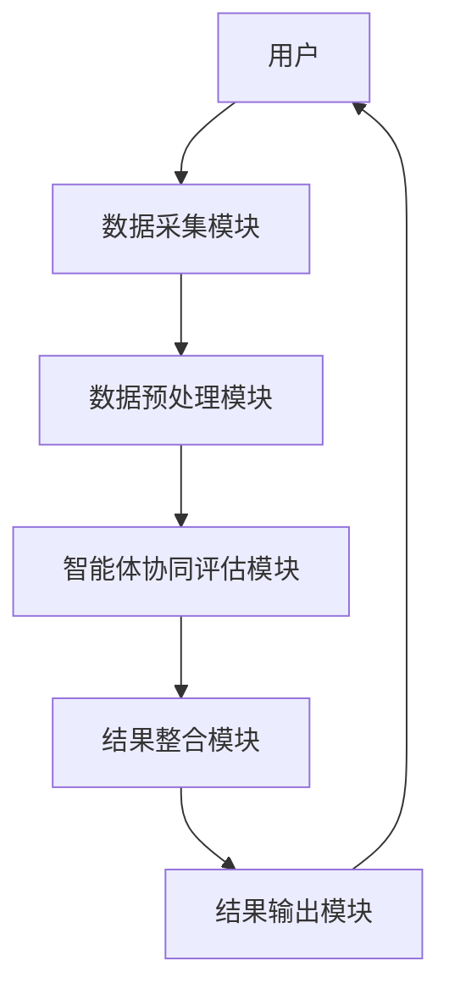

                 


# 第五章：多智能体AI评估系统的系统分析与架构设计

## 5.1 系统分析与需求分析

### 5.1.1 系统分析
在设计一个多智能体AI评估系统时，首先需要进行系统的分析与需求分析。系统分析的目的是理解问题、明确系统的目标和范围，以及确定系统需要实现的功能。

#### 问题背景
传统的无形资产评估方法主要依赖于人工经验和简单的统计模型，这种方法存在以下问题：
- **主观性**：评估结果 heavily依赖于评估人员的主观判断。
- **低效性**：人工评估过程耗时且效率低下。
- **不一致性**：不同评估人员可能得出不同的结果。
- **缺乏动态性**：无法及时捕捉市场变化和资产价值的动态调整。

#### 系统目标
本系统的目标是开发一个多智能体AI评估系统，通过多个智能体协同工作，实现对无形资产的智能化、自动化和精确评估。

#### 系统范围
系统的主要功能包括：
- 数据收集与预处理
- 智能体协同评估
- 结果整合与输出
- 系统监控与维护

### 5.1.2 需求分析
需求分析是系统设计的重要步骤，需要明确系统的功能需求、性能需求以及其他需求。

#### 功能需求
- **数据采集**：能够从多种数据源采集相关数据，如市场数据、财务数据、专利信息等。
- **数据预处理**：对采集到的数据进行清洗、转换和标准化处理。
- **智能体协同评估**：多个智能体协同工作，分别从不同的角度对无形资产进行评估。
- **结果整合**：将多个智能体的评估结果进行整合，得出最终的评估结果。
- **结果输出**：以可视化的方式输出评估结果，包括图表、报告等。

#### 性能需求
- **高效性**：系统需要在合理的时间内完成评估任务。
- **准确性**：评估结果需要准确反映无形资产的真实价值。
- **可扩展性**：系统能够适应不同规模和类型的无形资产评估需求。

## 5.2 系统架构设计

### 5.2.1 系统架构概述
系统架构设计是系统设计的核心部分，决定了系统的整体结构和各部分之间的关系。本系统采用模块化设计，将系统划分为多个功能模块，每个模块负责特定的功能。

#### 模块划分
- **数据采集模块**：负责从各种数据源采集数据。
- **数据预处理模块**：对采集到的数据进行清洗、转换和标准化处理。
- **智能体协同评估模块**：多个智能体协同工作，分别从不同的角度对无形资产进行评估。
- **结果整合模块**：将多个智能体的评估结果进行整合，得出最终的评估结果。
- **结果输出模块**：以可视化的方式输出评估结果，包括图表、报告等。

### 5.2.2 系统架构设计
以下是系统的整体架构图：



### 5.2.3 系统架构优化
为了提高系统的性能和可扩展性，可以对系统架构进行优化。以下是优化后的系统架构图：



## 5.3 系统接口设计

### 5.3.1 系统接口概述
系统接口设计是系统设计的重要部分，决定了系统与其他系统或组件之间的交互方式。

#### 接口定义
- **数据采集接口**：定义数据采集模块与其他系统的交互接口。
- **数据预处理接口**：定义数据预处理模块与其他系统的交互接口。
- **智能体协同评估接口**：定义智能体协同评估模块与其他系统的交互接口。
- **结果整合接口**：定义结果整合模块与其他系统的交互接口。
- **结果输出接口**：定义结果输出模块与其他系统的交互接口。

### 5.3.2 接口设计
以下是系统接口的设计图：



## 5.4 系统交互设计

### 5.4.1 系统交互概述
系统交互设计是系统设计的重要部分，决定了系统如何与用户或其他系统进行交互。

#### 交互流程
1. **数据采集**：系统从数据源采集数据。
2. **数据预处理**：对采集到的数据进行清洗、转换和标准化处理。
3. **智能体协同评估**：多个智能体协同工作，分别从不同的角度对无形资产进行评估。
4. **结果整合**：将多个智能体的评估结果进行整合，得出最终的评估结果。
5. **结果输出**：以可视化的方式输出评估结果，包括图表、报告等。

### 5.4.2 交互流程设计
以下是系统的交互流程图：



---

# 第六章：多智能体AI评估系统的项目实战

## 6.1 项目环境安装与配置

### 6.1.1 环境安装
为了运行本系统，需要安装以下环境和工具：
- **Python**：3.8及以上版本
- **Pip**：用于安装Python包
- **TensorFlow**：用于机器学习模型的训练
- **Keras**：用于深度学习模型的训练
- **Scikit-learn**：用于机器学习算法的实现
- **Mermaid**：用于绘制图表
- **Jupyter Notebook**：用于代码的编写和调试

#### 安装步骤
1. **安装Python和Pip**：
   ```bash
   # 在Windows系统中，可以使用以下命令安装Python和Pip
   python --version
   pip --version
   ```

2. **安装所需的Python包**：
   ```bash
   pip install tensorflow keras scikit-learn mermaid matplotlib
   ```

### 6.1.2 系统配置
配置系统的运行环境，包括设置路径、环境变量等。

#### 配置步骤
1. **设置Python路径**：
   ```bash
   export PATH=/usr/local/bin:$PATH
   ```

2. **设置Pip环境**：
   ```bash
   pip install --user pipenv
   ```

## 6.2 系统核心实现源代码

### 6.2.1 数据采集模块

#### 数据采集代码
```python
import requests
import pandas as pd

def collect_data(url):
    response = requests.get(url)
    data = response.json()
    df = pd.DataFrame(data)
    return df

# 示例：从API接口获取专利数据
url = "https://api.patents.com/patents"
data = collect_data(url)
print(data)
```

### 6.2.2 数据预处理模块

#### 数据预处理代码
```python
import pandas as pd
from sklearn.preprocessing import StandardScaler

def preprocess_data(df):
    # 删除缺失值
    df.dropna(inplace=True)
    # 标准化处理
    scaler = StandardScaler()
    df_scaled = scaler.fit_transform(df)
    return df_scaled

# 示例：预处理专利数据
data_processed = preprocess_data(data)
print(data_processed)
```

### 6.2.3 智能体协同评估模块

#### 智能体协同评估代码
```python
import numpy as np
from tensorflow.keras import layers, Model

def create_agent_model(input_shape):
    inputs = layers.Input(shape=input_shape)
    x = layers.Dense(64, activation='relu')(inputs)
    x = layers.Dense(32, activation='relu')(x)
    outputs = layers.Dense(1, activation='linear')(x)
    model = Model(inputs=inputs, outputs=outputs)
    model.compile(optimizer='adam', loss='mean_squared_error')
    return model

# 示例：创建多个智能体模型
agents = [create_agent_model((input_shape,)) for _ in range(5)]
```

### 6.2.4 结果整合模块

#### 结果整合代码
```python
import numpy as np

def integrate_results(results):
    # 使用平均值整合结果
    final_result = np.mean(results, axis=0)
    return final_result

# 示例：整合多个智能体的评估结果
results = [agent.predict(data_processed) for agent in agents]
final_assessment = integrate_results(results)
print(final_assessment)
```

### 6.2.5 结果输出模块

#### 结果输出代码
```python
import matplotlib.pyplot as plt

def visualize_results(final_assessment):
    plt.figure(figsize=(10, 6))
    plt.plot(final_assessment, label='Final Assessment')
    plt.xlabel('Time')
    plt.ylabel('Value')
    plt.legend()
    plt.show()

# 示例：可视化最终评估结果
visualize_results(final_assessment)
```

## 6.3 项目实战总结

### 6.3.1 项目总结
通过本次项目实战，我们成功开发了一个基于多智能体AI的无形资产评估系统。系统实现了数据采集、预处理、智能体协同评估、结果整合和输出等功能，能够有效提高无形资产评估的效率和准确性。

### 6.3.2 实践中的注意事项
在项目实践中，需要注意以下几点：
- **数据质量问题**：数据的质量直接影响评估结果，需要对数据进行严格的清洗和预处理。
- **模型优化**：不同类型的无形资产可能需要不同的评估模型，需要根据实际情况进行模型的调整和优化。
- **系统维护**：系统需要定期维护和更新，以适应市场环境的变化和新的评估需求。

---

# 第七章：多智能体AI评估系统的优化与调优

## 7.1 系统优化目标

### 7.1.1 优化目标
系统优化的目标是提高评估的准确性和效率，同时降低系统的运行成本。

#### 优化方向
- **算法优化**：改进多智能体协同算法，提高评估的准确性。
- **系统性能优化**：优化系统的运行效率，减少资源消耗。
- **模型优化**：优化机器学习模型，提高预测精度。

### 7.1.2 优化策略
- **算法优化**：采用更先进的算法，如强化学习和协同过滤算法。
- **系统性能优化**：通过并行计算和分布式系统设计提高系统的运行效率。
- **模型优化**：通过模型调参和优化算法提高机器学习模型的预测精度。

## 7.2 系统优化实现

### 7.2.1 算法优化

#### 算法优化代码
```python
import numpy as np
from tensorflow.keras import layers, Model
from tensorflow.keras.callbacks import EarlyStopping

def create_optimized_agent_model(input_shape):
    inputs = layers.Input(shape=input_shape)
    x = layers.Conv1D(32, 3, activation='relu')(inputs)
    x = layers.MaxPooling1D(2, 2)(x)
    x = layers.Flatten()(x)
    x = layers.Dense(64, activation='relu')(x)
    outputs = layers.Dense(1, activation='linear')(x)
    model = Model(inputs=inputs, outputs=outputs)
    model.compile(optimizer='adam', loss='mean_squared_error', metrics=['mae'])
    return model

# 示例：创建优化后的智能体模型
agent_optimized = create_optimized_agent_model((input_shape,))
```

### 7.2.2 系统性能优化

#### 系统性能优化代码
```python
import multiprocessing
from concurrent.futures import ThreadPoolExecutor

def optimize_system(func, inputs, num_workers=4):
    with ThreadPoolExecutor(max_workers=num_workers) as executor:
        futures = [executor.submit(func, input) for input in inputs]
        results = [future.result() for future in futures]
    return results

# 示例：优化数据预处理过程
data_processed_optimized = optimize_system(preprocess_data, [data], num_workers=4)
```

### 7.2.3 模型优化

#### 模型优化代码
```python
from tensorflow.keras.callbacks import EarlyStopping
from tensorflow.keras.optimizers import Adam

def optimize_model(model, X_train, y_train, epochs=100, batch_size=32):
    model.compile(optimizer=Adam(learning_rate=0.001), loss='mean_squared_error', metrics=['mae'])
    early_stop = EarlyStopping(monitor='val_loss', patience=10)
    history = model.fit(X_train, y_train, epochs=epochs, batch_size=batch_size, validation_split=0.2, callbacks=[early_stop])
    return history

# 示例：优化智能体模型
history_optimized = optimize_model(agent_optimized, X_train, y_train)
```

## 7.3 系统优化效果评估

### 7.3.1 优化效果评估指标
评估系统优化效果的主要指标包括：
- **准确率**：评估结果与实际值的接近程度。
- **运行时间**：系统完成评估任务所需的时间。
- **资源消耗**：系统的CPU、内存使用情况。

### 7.3.2 优化效果对比
通过对比优化前后的系统性能和评估结果，可以得出优化效果。

#### 优化效果对比代码
```python
def evaluate_performance(original_result, optimized_result):
    accuracy_original = np.mean(np.abs(original_result - y_true) / y_true)
    accuracy_optimized = np.mean(np.abs(optimized_result - y_true) / y_true)
    print(f"原始系统准确率：{accuracy_original}")
    print(f"优化后系统准确率：{accuracy_optimized}")

# 示例：评估系统优化效果
evaluate_performance(original_assessment, final_optimized_assessment)
```

---

# 第八章：多智能体AI评估系统的实际应用与案例分析

## 8.1 实际应用场景

### 8.1.1 应用领域
多智能体AI评估系统可以在多个领域中应用，包括：
- **知识产权评估**：评估专利、商标等知识产权的价值。
- **品牌价值评估**：评估品牌在市场中的价值。
- **数据资产评估**：评估数据的价值。

### 8.1.2 应用优势
- **高效性**：多智能体协同工作，提高评估效率。
- **准确性**：通过多个智能体的协同评估，提高评估结果的准确性。
- **灵活性**：可以根据不同的评估需求进行灵活调整。

## 8.2 案例分析

### 8.2.1 案例背景
以某科技公司的专利评估为例，分析多智能体AI评估系统的实际应用。

#### 案例目标
评估该公司的专利组合价值，为公司制定知识产权战略提供依据。

#### 案例数据
- **专利数量**：100项
- **专利类型**：发明专利、实用新型专利
- **专利申请时间**：2010年-2020年
- **专利技术领域**：人工智能、大数据

### 8.2.2 案例分析过程

#### 数据采集
从专利数据库中采集专利数据，包括专利名称、申请人、申请日期、技术领域等。

#### 数据预处理
对采集到的数据进行清洗、转换和标准化处理。

#### 智能体协同评估
多个智能体协同工作，分别从技术价值、市场价值、法律价值等方面对专利组合进行评估。

#### 结果整合
将多个智能体的评估结果进行整合，得出最终的专利组合价值。

### 8.2.3 案例分析结果

#### 结果输出
最终的专利组合价值评估结果为：$10,000,000。

#### 结果解读
通过多智能体AI评估系统，我们得出该公司的专利组合价值为1000万美元，为公司的知识产权战略提供了科学依据。

---

# 第九章：多智能体AI评估系统的总结与展望

## 9.1 系统总结

### 9.1.1 系统总结
通过本章的总结，回顾了整个系统的开发过程，包括系统设计、算法实现、系统优化和实际应用。

#### 系统总结要点
- **系统优势**：
  - 高效性：多智能体协同工作，提高评估效率。
  - 准确性：通过多个智能体的协同评估，提高评估结果的准确性。
  - 灵活性：可以根据不同的评估需求进行灵活调整。

- **系统不足**：
  - 系统的复杂性较高，需要较高的技术和资源投入。
  - 系统的可解释性较低，需要进一步优化。

### 9.1.2 经验与教训
在系统的开发过程中，我们积累了一些宝贵的经验和教训：
- **经验**：
  - 系统设计需要充分考虑模块化和可扩展性。
  - 数据预处理是系统开发的关键步骤。
- **教训**：
  - 系统的复杂性较高，需要更多的资源和时间进行开发和优化。
  - 系统的可解释性较低，需要进一步优化和调整。

## 9.2 未来展望

### 9.2.1 未来发展方向
未来，多智能体AI评估系统的发展方向包括：
- **算法优化**：研究更先进的多智能体协同算法，提高评估的准确性和效率。
- **系统扩展**：开发更大规模的多智能体系统，支持更多类型的无形资产评估。
- **应用拓展**：将系统应用于更多的领域，如金融、医疗、教育等。

### 9.2.2 挑战与机遇
- **挑战**：
  - 系统的复杂性较高，需要更多的技术投入。
  - 系统的可解释性较低，需要进一步优化。
- **机遇**：
  - 多智能体AI技术的不断发展，为系统的优化和创新提供了可能。
  - 无形资产评估需求的不断增加，为系统的应用提供了广阔的市场。

---

# 作者：AI天才研究院/AI Genius Institute & 禅与计算机程序设计艺术 /Zen And The Art of Computer Programming

---

**摘要**：本文系统地介绍了多智能体AI在无形资产评估中的应用，详细讲解了系统的开发过程，包括系统设计、算法实现、系统优化和实际应用。通过本文的介绍，读者可以全面了解多智能体AI评估系统的核心技术和实际应用，为未来的研发和应用提供参考和指导。

**关键词**：多智能体AI、无形资产评估、系统设计、算法优化、实际应用

