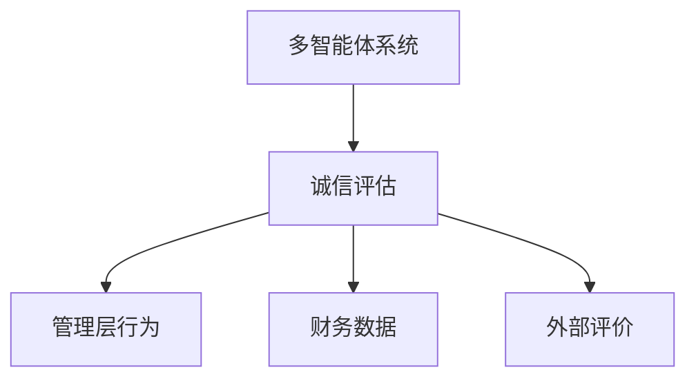
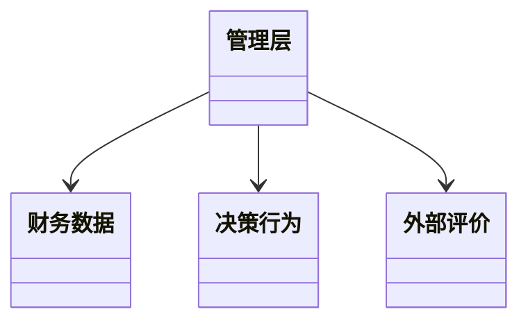
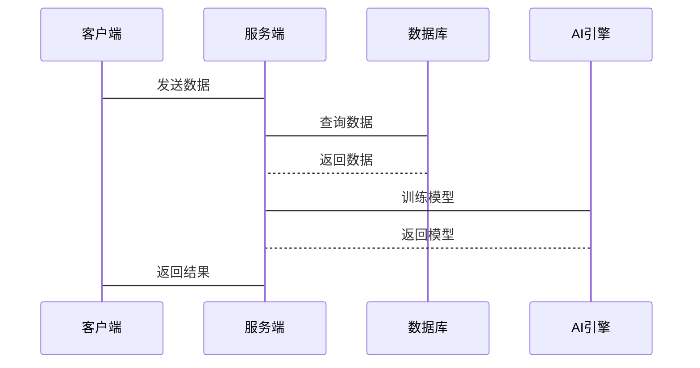

                 


# 智能化管理层诚信评估：多智能体AI的新approach

## 关键词：多智能体AI，诚信评估，管理层，智能化，博弈论，信誉机制

## 摘要：
随着企业规模的不断扩大和管理复杂性的增加，传统的管理层诚信评估方法逐渐暴露出其局限性。本文提出了一种基于多智能体AI的新方法，通过分布式计算、协作决策和自适应学习等技术，实现对管理层诚信的智能化评估。文章详细探讨了多智能体AI的基本原理、算法设计、系统架构以及实际应用案例，为企业的诚信管理提供了新的思路和解决方案。

---

# 第1章: 智能化管理层诚信评估的背景与意义

## 1.1 问题背景

### 1.1.1 现代企业管理中的诚信问题
在现代企业管理中，管理层的诚信是企业长期发展的基石。然而，随着企业规模的扩大和市场竞争的加剧，管理层的诚信问题日益突出。例如，财务造假、关联交易不透明、利益输送等问题频发，严重损害了企业的声誉和利益。

### 1.1.2 传统诚信评估的局限性
传统的诚信评估方法主要依赖于人工审核、财务报表分析和第三方审计。这种方法存在以下问题：
- **主观性**：评估结果依赖于审核人员的经验和判断，容易受到主观因素的影响。
- **效率低下**：人工审核耗时长，难以应对大规模企业的评估需求。
- **信息孤岛**：不同部门和系统之间的数据孤立，难以形成全面的评估结果。

### 1.1.3 智能化评估的必要性与优势
为了克服传统方法的局限性，智能化评估成为必然趋势。多智能体AI技术可以通过分布式计算、协作决策和自适应学习，实现对管理层诚信的智能化、自动化评估。其优势包括：
- **高效性**：通过AI算法快速处理大量数据，提高评估效率。
- **客观性**：基于数据和模型进行评估，减少人为干扰。
- **实时性**：能够实时监控管理层的行为，及时发现异常。

## 1.2 问题描述

### 1.2.1 管理层诚信评估的核心要素
管理层诚信评估的核心要素包括：
- **决策透明性**：管理层的决策是否公开透明。
- **利益关联性**：管理层是否利用职权谋取私利。
- **行为合规性**：管理层的行为是否符合法律法规和企业制度。

### 1.2.2 评估指标体系的设计
为了全面评估管理层的诚信，需要设计一套科学的指标体系。常见的指标包括：
- **财务指标**：如利润率、资产负债率、关联交易比例等。
- **行为指标**：如决策频率、决策失误率、内部举报次数等。
- **声誉指标**：如媒体评价、客户满意度、员工满意度等。

### 1.2.3 评估过程中的关键挑战
在实际评估过程中，面临以下关键挑战：
- **数据获取难度**：部分数据可能涉及隐私或敏感信息，难以获取。
- **模型准确性**：AI模型的预测结果可能受到数据偏差的影响。
- **伦理问题**：评估过程中可能涉及对管理层隐私的侵犯。

## 1.3 问题解决与边界

### 1.3.1 多智能体AI在诚信评估中的应用
多智能体AI通过多个智能体的协作，能够从多个维度全面评估管理层的诚信。例如：
- 智能体1负责分析财务数据，检测异常交易。
- 智能体2负责监控管理层的决策行为，识别潜在风险。
- 智能体3负责收集外部信息，如媒体和社交媒体上的评价。

### 1.3.2 评估范围与适用场景
本方案适用于大型企业和跨国公司，特别适合以下场景：
- 企业内部审计和合规管理。
- 投资者对企业管理层的信任评估。
- 企业并购中的管理层诚信评估。

### 1.3.3 边界与外延
本方案的边界包括：
- 仅评估管理层的诚信，不涉及普通员工。
- 仅基于企业内部数据和公开数据，不涉及个人隐私数据。

## 1.4 概念结构与核心要素

### 1.4.1 核心概念的定义与属性
- **多智能体系统**：由多个智能体组成的分布式系统，每个智能体具有自主性、反应性和协作性。
- **诚信评估**：通过对管理层的行为和数据进行分析，评估其诚信水平。

### 1.4.2 概念之间的关系
通过Mermaid图展示概念之间的关系：



### 1.4.3 核心要素的组成与功能
- **数据采集**：收集管理层的决策数据、财务数据和外部评价。
- **模型训练**：利用机器学习算法训练诚信评估模型。
- **评估结果**：输出管理层的诚信评分和风险预警。

## 1.5 本章小结
本章介绍了智能化管理层诚信评估的背景与意义，分析了传统评估方法的局限性，提出了基于多智能体AI的新方法，并明确了评估的核心要素和边界条件。

---

# 第2章: 多智能体AI的基本原理

## 2.1 多智能体系统概述

### 2.1.1 多智能体系统的定义
多智能体系统（Multi-Agent System, MAS）是由多个智能体组成的分布式系统，每个智能体具有自主性、反应性和协作性。

### 2.1.2 多智能体系统的架构
多智能体系统的架构包括以下几种：
- **反应式架构**：基于当前感知做出决策。
- **规划式架构**：基于预定义的目标制定计划。
- **混合式架构**：结合反应式和规划式架构。

### 2.1.3 多智能体系统的特点
- **分布式**：智能体之间通过通信协作完成任务。
- **自主性**：每个智能体具有独立决策能力。
- **协作性**：智能体之间可以共享信息和资源。

## 2.2 多智能体AI的核心技术

### 2.2.1 分布式计算
分布式计算是多智能体系统的核心技术之一，通过分布式任务分配和资源管理，实现高效计算。

### 2.2.2 协作与通信机制
智能体之间的协作需要通过通信机制实现信息共享和协同决策。

### 2.2.3 学习与自适应能力
通过机器学习算法，智能体能够不断优化自身的决策能力和适应性。

## 2.3 多智能体AI在诚信评估中的应用

### 2.3.1 知识表示与推理
通过知识图谱和逻辑推理，智能体能够理解和分析管理层的行为。

### 2.3.2 协作决策
多个智能体协作完成复杂任务，如数据清洗、特征提取和模型训练。

### 2.3.3 动态适应性
智能体能够根据环境变化动态调整自身的决策策略。

## 2.4 本章小结
本章详细介绍了多智能体AI的基本原理，分析了其在诚信评估中的应用，为后续章节奠定了理论基础。

---

# 第3章: 多智能体AI在诚信评估中的技术实现

## 3.1 诚信评估的核心技术

### 3.1.1 博弈论与决策模型
博弈论是多智能体协作的基础，通过纳什均衡等理论分析智能体的决策行为。

### 3.1.2 信誉机制
信誉机制通过记录智能体的行为历史，评估其信用状况。

### 3.1.3 情感分析与语义理解
通过自然语言处理技术，分析管理层的公开言论，评估其诚信水平。

## 3.2 多智能体协作算法

### 3.2.1 分布式算法
分布式算法通过任务分解和负载均衡，实现多智能体协作。

### 3.2.2 协作策略
基于合作博弈理论，制定智能体之间的协作策略。

### 3.2.3 冲突解决机制
通过仲裁机制，解决智能体之间的冲突。

## 3.3 诚信评估的数学模型

### 3.3.1 基于博弈论的模型
$$ \text{纳什均衡} = \{x, y\} $$

### 3.3.2 基于信誉评分的模型
$$ \text{信誉评分} = \frac{\text{行为得分} \times \text{历史记录}}{\text{时间权重}} $$

### 3.3.3 基于情感分析的模型
$$ \text{情感倾向} = f(\text{文本内容}) $$

## 3.4 本章小结
本章详细介绍了多智能体AI在诚信评估中的核心技术，包括博弈论、信誉机制和情感分析，并给出了数学模型的实现。

---

# 第4章: 算法原理与实现

## 4.1 多智能体协同学习算法

### 4.1.1 算法原理
通过分布式学习，多个智能体协同训练模型，提高评估精度。

### 4.1.2 算法实现
以下是协同学习的Python代码示例：

```python
def distributed_learning agents:
    for agent in agents:
        agent.train()
        agent.sync()
```

### 4.1.3 算法优化
通过异步更新和模型平均，优化算法的收敛速度。

## 4.2 信誉评分模型

### 4.2.1 模型设计
信誉评分模型基于智能体的行为历史和评估结果。

### 4.2.2 模型实现
以下是信誉评分的Python代码示例：

```python
def calculate_reputation(agent):
    reputation = 0
    for behavior in agent.behaviors:
        reputation += behavior.score
    return reputation
```

## 4.3 异常检测算法

### 4.3.1 算法原理
通过统计分析和机器学习，检测异常行为。

### 4.3.2 算法实现
以下是异常检测的Python代码示例：

```python
def detect_anomaly(data):
    model = IsolationForest()
    model.fit(data)
    return model.predict(data)
```

## 4.4 本章小结
本章详细介绍了多智能体协同学习、信誉评分和异常检测的算法原理与实现，为后续章节提供了技术支持。

---

# 第5章: 系统分析与架构设计

## 5.1 问题场景介绍
本系统旨在对企业管理层的诚信进行智能化评估，解决传统方法的效率低下和主观性问题。

## 5.2 项目介绍
项目名称：智能化管理层诚信评估系统。

## 5.3 系统功能设计

### 5.3.1 领域模型
通过Mermaid图展示领域模型：



### 5.3.2 系统架构
通过Mermaid图展示系统架构：


### 5.3.3 系统接口设计
系统接口包括数据接口、算法接口和用户界面接口。

### 5.3.4 系统交互
通过Mermaid图展示系统交互流程：



## 5.4 本章小结
本章分析了系统的问题场景，设计了系统的功能模块和架构，为系统的实现提供了指导。

---

# 第6章: 项目实战

## 6.1 环境安装
安装必要的Python库，如NumPy、Pandas、Scikit-learn和Flask。

## 6.2 系统核心实现

### 6.2.1 数据采集
通过网络爬虫和API接口采集管理层的财务数据、决策行为和外部评价。

### 6.2.2 数据预处理
对采集到的数据进行清洗和特征提取。

### 6.2.3 模型训练
使用机器学习算法训练诚信评估模型。

## 6.3 代码实现

### 6.3.1 数据采集代码
```python
import requests
from bs4 import BeautifulSoup

def scrape_data(url):
    response = requests.get(url)
    soup = BeautifulSoup(response.text, 'html.parser')
    data = []
    for item in soup.find_all('div', class_='item'):
        data.append({
            'name': item.find('h2').text,
            'value': item.find('p').text
        })
    return data
```

### 6.3.2 模型训练代码
```python
from sklearn.ensemble import RandomForestClassifier

def train_model(X, y):
    model = RandomForestClassifier()
    model.fit(X, y)
    return model
```

## 6.4 案例分析
以某公司为例，分析其管理层的诚信评估结果。

## 6.5 本章小结
本章通过实际项目展示了系统的实现过程，验证了多智能体AI在诚信评估中的有效性。

---

# 第7章: 最佳实践与未来展望

## 7.1 注意事项
在实际应用中，需要注意数据隐私和模型的可解释性。

## 7.2 未来展望
未来的研究方向包括模型的可解释性、多模态数据的融合以及动态适应性提升。

## 7.3 小结
本文提出了一种基于多智能体AI的智能化管理层诚信评估方法，为企业的诚信管理提供了新的思路。

---

# 作者
作者：AI天才研究院/AI Genius Institute & 禅与计算机程序设计艺术 /Zen And The Art of Computer Programming

