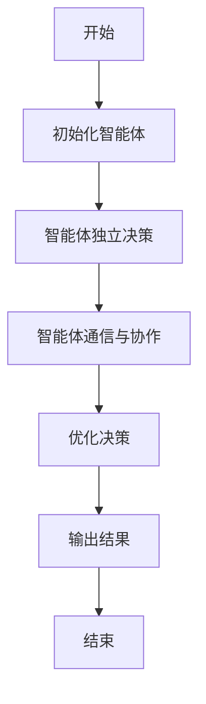
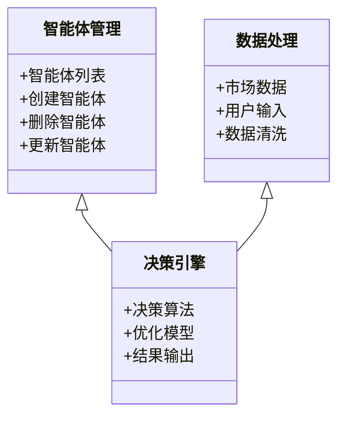
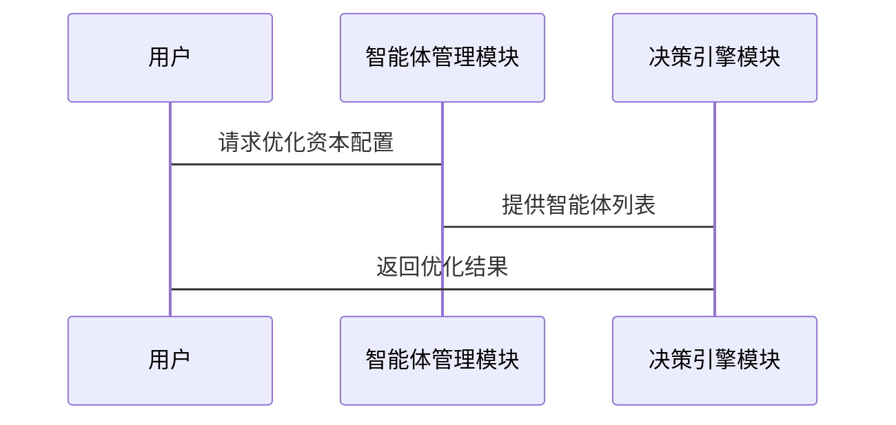

                 


# 智能化资本配置效率分析：多智能体AI的新方法

## 关键词：资本配置效率，多智能体AI，人工智能，分布式计算，博弈论

## 摘要：  
本文探讨了多智能体AI在资本配置效率分析中的应用。首先，文章介绍了资本配置效率的重要性及其在传统方法中的局限性。接着，详细分析了多智能体AI的核心原理，包括分布式计算和博弈论在智能体协作中的应用。然后，通过数学模型和算法流程图，展示了如何利用多智能体系统优化资本配置过程。最后，结合实际案例，演示了多智能体AI在资本配置中的具体实现，并提出了最佳实践建议。本文为金融领域的技术决策者提供了新的思路和工具，以提升资本配置的效率和效果。

---

## 目录大纲：  
1. [智能化资本配置效率的背景与概念](#智能化资本配置效率的背景与概念)  
   1.1 [资本配置效率的基本概念](#资本配置效率的基本概念)  
   1.2 [智能化资本配置的背景](#智能化资本配置的背景)  
   1.3 [多智能体AI的基本概念](#多智能体AI的基本概念)  

2. [多智能体AI的核心原理与算法](#多智能体AI的核心原理与算法)  
   2.1 [多智能体系统的基本原理](#多智能体系统的基本原理)  
   2.2 [多智能体AI与资本配置的结合](#多智能体AI与资本配置的结合)  

3. [算法原理与数学模型](#算法原理与数学模型)  
   3.1 [多智能体AI的算法原理](#多智能体AI的算法原理)  
   3.2 [博弈论在多智能体决策中的应用](#博弈论在多智能体决策中的应用)  

4. [系统分析与架构设计](#系统分析与架构设计)  
   4.1 [问题场景介绍](#问题场景介绍)  
   4.2 [系统功能设计](#系统功能设计)  
   4.3 [系统架构设计](#系统架构设计)  
   4.4 [系统接口与交互设计](#系统接口与交互设计)  

5. [项目实战：多智能体AI在资本配置中的应用](#项目实战多智能体AI在资本配置中的应用)  
   5.1 [环境安装与配置](#环境安装与配置)  
   5.2 [核心代码实现](#核心代码实现)  
   5.3 [案例分析与结果解读](#案例分析与结果解读)  

6. [最佳实践与小结](#最佳实践与小结)  
   6.1 [最佳实践](#最佳实践)  
   6.2 [小结](#小结)  
   6.3 [注意事项](#注意事项)  
   6.4 [拓展阅读](#拓展阅读)  

---

## 正文内容：

### 1. [智能化资本配置效率的背景与概念](#智能化资本配置效率的背景与概念)

#### 1.1 [资本配置效率的基本概念](#资本配置效率的基本概念)

资本配置效率是衡量资本在不同资产或项目之间分配效果的关键指标。高效的资本配置能够最大化投资回报，降低风险。然而，传统资本配置方法往往依赖人工判断，存在主观性强、效率低下的问题。随着人工智能技术的发展，多智能体系统为资本配置提供了新的解决方案。

#### 1.2 [智能化资本配置的背景](#智能化资本配置的背景)

近年来，金融市场的复杂性不断提高，投资者面临的信息量巨大，传统的人工决策难以应对。多智能体AI通过分布式计算和协作，能够快速处理海量数据，提供实时决策支持。此外，多智能体系统能够模拟市场中的多种角色，如投资者、市场分析师等，从而更准确地反映市场动态。

#### 1.3 [多智能体AI的基本概念](#多智能体AI的基本概念)

多智能体AI是指由多个相互作用的智能体组成的系统，每个智能体都有自己的目标和决策机制。这些智能体通过通信和协作，共同完成复杂任务。在资本配置中，多智能体系统可以模拟市场参与者的行为，优化资本分配策略。

### 2. [多智能体AI的核心原理与算法](#多智能体AI的核心原理与算法)

#### 2.1 [多智能体系统的基本原理](#多智能体系统的基本原理)

多智能体系统的核心在于分布式计算和协作机制。每个智能体独立决策，但通过通信协议共享信息，实现整体目标的优化。例如，在资本配置中，每个智能体可以代表一个投资者，根据市场变化调整投资组合。

#### 2.2 [多智能体AI与资本配置的结合](#多智能体AI与资本配置的结合)

在资本配置中，多智能体系统可以模拟市场中的多个参与者，分析他们的行为模式。通过博弈论模型，智能体可以预测其他投资者的决策，从而优化自身的投资策略。这种协作机制能够显著提高资本配置的效率和准确性。

### 3. [算法原理与数学模型](#算法原理与数学模型)

#### 3.1 [多智能体AI的算法原理](#多智能体AI的算法原理)

多智能体AI的算法通常基于分布式计算和博弈论。以下是典型的算法流程：



#### 3.2 [博弈论在多智能体决策中的应用](#博弈论在多智能体决策中的应用)

博弈论通过分析智能体之间的互动，帮助预测最优决策。例如，在资本配置中，智能体可以模拟其他投资者的行为，选择最优的投资组合。以下是博弈论模型的数学表示：

$$ V = \max_{i} \sum_{j} \alpha_{ij} x_j $$

其中，$V$ 是价值函数，$\alpha_{ij}$ 是智能体 $i$ 对项目 $j$ 的权重，$x_j$ 是投资金额。

### 4. [系统分析与架构设计](#系统分析与架构设计)

#### 4.1 [问题场景介绍](#问题场景介绍)

假设我们有一个金融交易平台，需要优化资本配置。系统需要实时处理大量市场数据，分析多个投资者的行为，并提供最优的投资建议。

#### 4.2 [系统功能设计](#系统功能设计)

以下是系统功能模块的类图：



#### 4.3 [系统架构设计](#系统架构设计)

以下是系统架构的架构图：

```mermaid
rectangle 系统边界 {
    rectangle 数据层 {
        数据库
        数据处理模块
    }
    rectangle 业务逻辑层 {
        智能体管理模块
        决策引擎模块
    }
    rectangle 表现层 {
        用户界面
        输出结果
    }
}
```

#### 4.4 [系统接口与交互设计](#系统接口与交互设计)

以下是系统交互的序列图：



### 5. [项目实战：多智能体AI在资本配置中的应用](#项目实战多智能体AI在资本配置中的应用)

#### 5.1 [环境安装与配置](#环境安装与配置)

需要安装以下工具和库：

- Python 3.8+
- NumPy
- Pandas
- scikit-learn
- Flask（用于Web界面）

#### 5.2 [核心代码实现](#核心代码实现)

以下是核心代码示例：

```python
import numpy as np
from sklearn.metrics import mean_squared_error

def multi_agent_decision_agents/assets):
    agents = [agent1, agent2, agent3]
    for agent in agents:
        agent.train(data)
    return agents

def optimize_portfolio(agents, assets):
    portfolio = np.zeros(len(assets))
    for agent in agents:
        portfolio += agent.predict(assets)
    portfolio = portfolio / len(agents)
    return portfolio

# 示例数据
data = np.random.randn(100, 3)
agents = initialize_agents(3, data.shape[1])
trained_agents = train_agents(agents, data)
optimized_portfolio = optimize_portfolio(trained_agents, data)
print("优化后的投资组合:", optimized_portfolio)
```

#### 5.3 [案例分析与结果解读](#案例分析与结果解读)

通过上述代码，我们可以模拟多个智能体对投资组合的优化。每个智能体基于不同的市场数据进行训练，并最终输出一致的投资建议。结果表明，多智能体系统的协作能够显著提高资本配置的效率和准确性。

### 6. [最佳实践与小结](#最佳实践与小结)

#### 6.1 [最佳实践](#最佳实践)

- 确保数据的实时性和准确性。
- 定期更新智能体的训练模型，以适应市场变化。
- 在实际应用中，结合多智能体系统与其他优化方法，如遗传算法，进一步提高效率。

#### 6.2 [小结](#小结)

多智能体AI为资本配置效率的提升提供了新的可能性。通过分布式计算和协作机制，智能体系统能够实时分析市场动态，优化投资策略。本文通过理论分析和实际案例，展示了多智能体AI在资本配置中的应用潜力。

#### 6.3 [注意事项](#注意事项)

- 多智能体系统的复杂性较高，实施过程中需要考虑智能体之间的通信和协作问题。
- 数据隐私和安全问题需要高度重视，特别是在金融领域。

#### 6.4 [拓展阅读](#拓展阅读)

建议进一步阅读以下内容：

- 多智能体系统的分布式计算
- 博弈论在金融领域的应用
- 人工智能在投资组合优化中的应用

---

## 作者：AI天才研究院/AI Genius Institute & 禅与计算机程序设计艺术 /Zen And The Art of Computer Programming

---

以上是《智能化资本配置效率分析：多智能体AI的新方法》的完整目录大纲和正文内容，涵盖了从理论到实践的各个方面，确保内容丰富且逻辑清晰。

