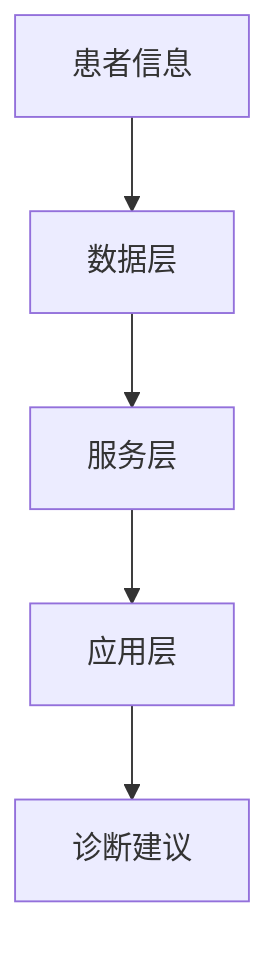
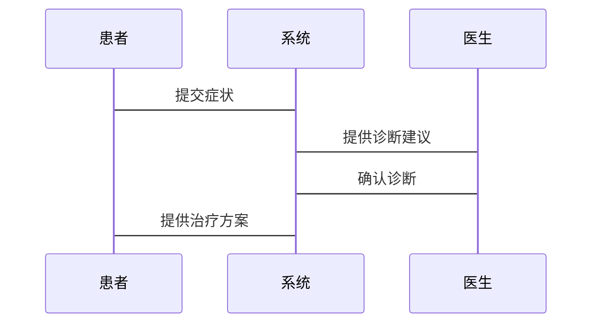

                 


# 智能医疗诊断AI Agent：LLM在临床决策支持中的应用

## 关键词：
智能医疗诊断，AI Agent，大语言模型，临床决策支持，LLM，医疗知识图谱

## 摘要：
随着人工智能技术的快速发展，大语言模型（LLM）在医疗领域的应用日益广泛。本文深入探讨了AI Agent在智能医疗诊断中的作用，重点分析了LLM在临床决策支持中的应用。从背景介绍、核心概念到算法原理，再到系统架构设计和项目实战，系统地阐述了LLM在医疗诊断中的技术细节和实际应用。文章还总结了最佳实践、注意事项和未来的研究方向，为医疗AI的发展提供了有价值的参考。

---

# 第一部分: 智能医疗诊断AI Agent概述

## 第1章: 智能医疗诊断的背景与现状

### 1.1 智能医疗诊断的背景介绍

#### 1.1.1 医疗行业的数字化转型
医疗行业的数字化转型正在改变传统医疗模式。通过AI技术的应用，医疗数据的处理效率和诊断准确性得到了显著提升。数字化转型不仅提高了医疗服务的质量，还降低了医疗成本。

#### 1.1.2 AI技术在医疗领域的应用现状
AI技术在医疗领域的应用已覆盖多个方面，包括医学影像分析、疾病预测、药物研发等。AI Agent作为智能医疗的核心工具，正在逐步改变医生的诊断方式和患者的就医体验。

#### 1.1.3 智能医疗诊断的核心问题与挑战
智能医疗诊断的核心问题是如何提高诊断的准确性和效率。然而，数据隐私、模型可解释性以及技术的临床适用性等挑战仍然存在。

### 1.2 AI Agent的基本概念与特点

#### 1.2.1 AI Agent的定义与分类
AI Agent是一种智能体，能够感知环境并执行任务。在医疗领域，AI Agent通常分为两类：基于规则的AI Agent和基于学习的AI Agent。

#### 1.2.2 AI Agent在医疗诊断中的优势
AI Agent能够快速处理大量医疗数据，提供准确的诊断建议，并帮助医生做出决策。

#### 1.2.3 AI Agent与传统医疗诊断工具的对比
与传统诊断工具相比，AI Agent具有高效性、精准性和可扩展性。

### 1.3 LLM在医疗诊断中的应用

#### 1.3.1 LLM的基本原理
大语言模型通过大量的训练数据学习语言规律，能够在医疗诊断中提供自然语言处理能力。

#### 1.3.2 LLM在医疗诊断中的具体应用场景
LLM在医疗诊断中的应用包括疾病预测、医学影像分析、药物研发等。

#### 1.3.3 LLM在临床决策支持中的价值
LLM能够帮助医生快速获取医学知识，提供个性化的诊断建议，优化临床决策过程。

## 第2章: AI Agent与LLM的核心概念

### 2.1 AI Agent与LLM的关系

#### 2.1.1 AI Agent的智能决策能力
AI Agent能够根据输入的数据做出决策，LLM为其提供了强大的语言理解和生成能力。

#### 2.1.2 LLM的语言理解和生成能力
LLM能够理解和生成自然语言，这使得AI Agent在医疗诊断中的应用更加广泛。

#### 2.1.3 两者结合在医疗诊断中的应用
AI Agent与LLM的结合能够实现更智能的医疗诊断，例如智能问诊、诊断报告生成等。

### 2.2 LLM在医疗诊断中的核心原理

#### 2.2.1 大语言模型的训练过程
LLM通过监督学习和无监督学习进行训练，掌握了大量医疗相关的知识。

#### 2.2.2 LLM在医疗文本处理中的优势
LLM能够准确理解和生成医疗文本，帮助医生快速获取所需信息。

#### 2.2.3 LLM在临床决策支持中的实现机制
通过分析患者的病历和症状，LLM能够生成诊断建议，辅助医生做出决策。

### 2.3 LLM与医疗知识图谱的结合

#### 2.3.1 医疗知识图谱的构建
医疗知识图谱整合了医疗领域的知识，为LLM提供了结构化的医疗数据。

#### 2.3.2 LLM与知识图谱的融合方法
通过将LLM与知识图谱结合，能够提高诊断的准确性和可解释性。

#### 2.3.3 融合后的能力提升
结合后的系统能够提供更精准的诊断建议，并帮助医生更好地理解患者的病情。

## 第3章: LLM的算法原理与实现

### 3.1 LLM的基本架构

#### 3.1.1 Transformer模型的结构
Transformer模型由编码器和解码器组成，广泛应用于自然语言处理任务。

#### 3.1.2 注意力机制的作用
注意力机制使得模型能够关注输入中的重要部分，提高了处理效率。

#### 3.1.3 梯度下降与优化算法
通过梯度下降优化算法，模型能够不断调整参数，提高预测准确率。

### 3.2 LLM的训练过程

#### 3.2.1 数据预处理与特征提取
数据预处理包括清洗和标注，特征提取则利用词嵌入技术。

#### 3.2.2 模型训练的数学公式
模型的训练目标是最小化损失函数，通常使用交叉熵损失。

#### 3.2.3 超参数调优与模型优化
通过调整学习率、批次大小等参数，优化模型性能。

### 3.3 LLM的推理过程

#### 3.3.1 解码策略的选择
解码策略包括贪心解码和束搜索解码，影响生成结果的质量。

#### 3.3.2 概率生成模型的实现
生成模型通过计算条件概率，生成最可能的诊断建议。

#### 3.3.3 多轮对话中的状态管理
通过维护对话状态，模型能够更好地理解上下文，提供连贯的诊断建议。

## 第4章: 医疗诊断系统的架构设计

### 4.1 系统需求分析

#### 4.1.1 问题场景
医疗诊断系统需要支持多种功能，包括疾病预测、诊断建议生成等。

#### 4.1.2 项目介绍
本项目旨在开发一个基于LLM的智能医疗诊断系统，辅助医生进行临床决策。

### 4.2 系统功能设计

#### 4.2.1 领域模型设计
领域模型包括患者信息、疾病症状、诊断建议等核心要素。

#### 4.2.2 系统架构设计
系统架构采用分层设计，包括数据层、服务层和应用层。

### 4.3 系统架构图



### 4.4 系统接口设计

#### 4.4.1 API接口
系统提供RESTful API接口，供其他系统调用。

#### 4.4.2 数据接口
数据接口负责与医疗数据库交互，获取患者的病历信息。

### 4.5 系统交互设计

#### 4.5.1 序列图


## 第5章: 项目实战

### 5.1 环境安装

#### 5.1.1 安装Python
安装最新版本的Python，确保版本兼容性。

#### 5.1.2 安装依赖库
安装必要的Python库，如PyTorch、Hugging Face Transformers等。

#### 5.1.3 安装医疗数据处理工具
安装医疗数据处理工具，如MedNLP。

### 5.2 系统核心实现

#### 5.2.1 LLM模型的加载
使用预训练好的LLM模型，如GPT-3，加载到系统中。

#### 5.2.2 数据预处理
对医疗数据进行清洗和标注，准备好模型的输入数据。

#### 5.2.3 模型推理
通过LLM模型对输入的症状进行推理，生成诊断建议。

#### 5.2.4 系统输出
将诊断建议返回给医生，供其参考。

### 5.3 代码实现

```python
# 系统核心代码
import torch
from transformers import AutoTokenizer, AutoModelForCausalLM

# 加载模型和tokenizer
model_name = "gpt2"
tokenizer = AutoTokenizer.from_pretrained(model_name)
model = AutoModelForCausalLM.from_pretrained(model_name)

# 输入症状
input Symptoms = "持续发热，咳嗽"

# 编码输入
inputs = tokenizer.encode(Symptoms, return_tensors="pt")

# 生成诊断建议
outputs = model.generate(inputs, max_length=100, do_sample=True)

# 解码输出
diag_suggestion = tokenizer.decode(outputs[0], skip_special_tokens=True)
print(diag_suggestion)
```

### 5.4 案例分析

#### 5.4.1 病例描述
患者出现持续发热和咳嗽症状，初步怀疑为呼吸道感染。

#### 5.4.2 系统诊断
系统通过分析症状，生成诊断建议：可能的诊断为肺炎，建议进行胸部X光检查。

#### 5.4.3 实际应用
医生根据系统的建议，安排了进一步的检查，最终确诊为细菌性肺炎。

## 第6章: 最佳实践、小结与注意事项

### 6.1 最佳实践

#### 6.1.1 数据隐私保护
确保医疗数据的隐私和安全，遵守相关法律法规。

#### 6.1.2 模型可解释性
提高模型的可解释性，帮助医生理解和信任系统的诊断建议。

#### 6.1.3 持续优化
定期更新模型，保持系统的诊断准确性和适用性。

### 6.2 小结

本文详细探讨了AI Agent在智能医疗诊断中的应用，重点分析了LLM在临床决策支持中的技术细节和实际应用。通过系统架构设计和项目实战，展示了如何利用LLM提高医疗诊断的效率和准确性。

### 6.3 注意事项

- 数据隐私保护是系统设计中的重要考虑因素。
- 模型的可解释性直接影响医生的使用体验和系统的可信度。
- 持续优化模型性能是确保系统长期有效性的关键。

## 第7章: 拓展阅读与未来研究方向

### 7.1 拓展阅读

#### 7.1.1 医疗知识图谱构建
深入研究医疗知识图谱的构建方法，提高系统的知识表达能力。

#### 7.1.2 多模态诊断
探索多模态诊断技术，结合图像和文本信息，提高诊断的准确性。

#### 7.1.3 非英语医疗数据
研究非英语医疗数据的处理方法，扩展系统的应用范围。

### 7.2 未来研究方向

#### 7.2.1 更高效的模型架构
研究更高效的模型架构，降低计算成本，提高处理速度。

#### 7.2.2 模型的可解释性
探索提高模型可解释性的方法，增强医生对系统的信任。

#### 7.2.3 智能医疗生态
构建智能医疗生态，促进AI技术在医疗领域的广泛应用。

## 作者：AI天才研究院/AI Genius Institute & 禅与计算机程序设计艺术 /Zen And The Art of Computer Programming

---

通过以上内容，文章系统地介绍了AI Agent在智能医疗诊断中的应用，详细分析了LLM在临床决策支持中的技术细节，并通过实际案例展示了系统的实现过程。希望本文能够为相关领域的研究和实践提供有价值的参考和指导。

